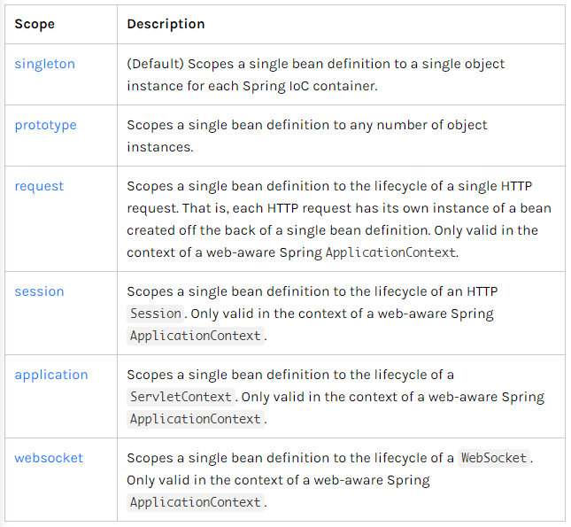
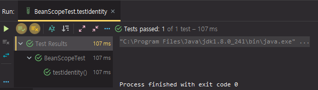
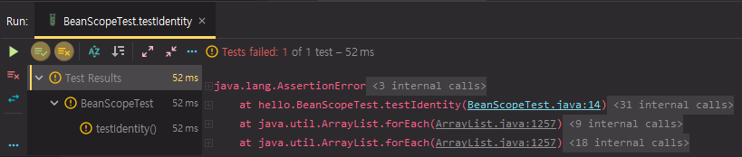
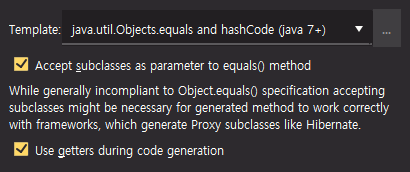
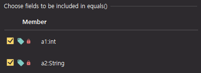
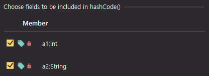
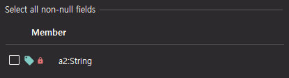
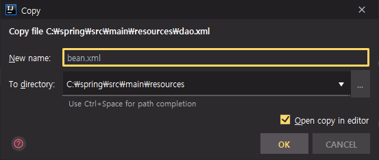
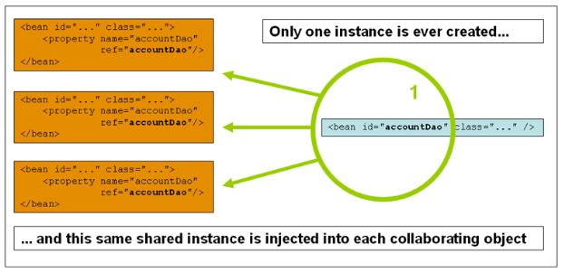
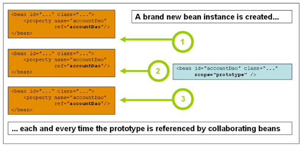

# 11. 스프링 프레임워크 코어 - The IoC Container - Bean Scopes

https://docs.spring.io/spring/docs/5.2.0.M3/spring-framework-reference/core.html#beans-factory-scopes

## Bean Scopes

Bean의 범위에 대한 내용

객체를 만들 때 Container가 이 객체를 한 번 만들어질 때 한 번만 호출하는지, 아니면 호출마다 객체를 여러번 만드는지에 대한 내용


* Bean scopes



여러가지 scope가 있다.

실무에서 사용할 때에는 singleton과 prototype이 99% 이상

나머지는 웹 프로그래밍을 할 때 가끔 사용


singleton : IoC container에서 호출될 때 딱 하나의 객체만 만들어서 그것을 재사용하는 것

prototype : IoC container의 객체를 호출할 때 매번 객체를 생성해서 만든다. class 이름에 new를 붙여서 객체를 계속 만드는 것과 동일하다고 보면 된다.


### 객체의 동일성과 동등성

객체의 동일성과 동등성(Identity와 Equality)에 대해서 이해해야한다.


src\main 폴더 하위가 아닌 src\test 폴더에서 간단하게 테스트 코드를 만들면서 동일성과 동등성에 대해 살펴보기


src\test\java 폴더에 hello 패키지 생성

hello 패키지 아래에 BeanScopeTest 클래스 생성


test에 대한 dependency가 설정되어있지 않다. => pom.xml에 의존성 추가

구글에 junit 검색

[JUnit 5](https://junit.org/junit5/)

User Guide => maven 검색

Additional Maven Dependencies => pom.xml에 추가

```xml
<dependency>
    <groupId>org.junit.platform</groupId>
    <artifactId>junit-platform-launcher</artifactId>
    <version>1.6.0</version>
    <scope>test</scope>
</dependency>
<dependency>
    <groupId>org.junit.jupiter</groupId>
    <artifactId>junit-jupiter-engine</artifactId>
    <version>5.6.0</version>
    <scope>test</scope>
</dependency>
<dependency>
    <groupId>org.junit.vintage</groupId>
    <artifactId>junit-vintage-engine</artifactId>
    <version>5.6.0</version>
    <scope>test</scope>
</dependency>
<dependency>
    <groupId>org.junit.jupiter</groupId>
    <artifactId>junit-jupiter-api</artifactId>
    <version>5.6.0</version>
    <scope>test</scope>
</dependency>
```

maven dependency의 scope는 test로 되어있다.


test에 대한 플러그인 추가

`<build>` element 밑에 `<plugins>`가 있다. 그 안에 `<plugin>` 추가

```xml
        <plugin>
            <artifactId>maven-surefire-plugin</artifactId>
            <version>2.22.2</version>
        </plugin>
        <plugin>
            <artifactId>maven-failsafe-plugin</artifactId>
            <version>2.22.2</version>
        </plugin>
```


Maven Surefire and Maven Failsafe can run JUnit 4 based tests


BeanScopeTest.java

```java
package hello;

import org.junit.Assert;
import org.junit.jupiter.api.Test;

public class BeanScopeTest {

    @Test
    public void testIdentity() {
        // 동일성(identity): 객체 주소 같다. - (obj1 == obj2 == obj3) == true
        // 동등성(equals): 객체의 값이 같다. - (obj1.equals(obj2)) == true
        A a1 = new A();
        A a2 = new A();
        Assert.assertFalse(a1 == a2);
    }
}

class A {

}
```

test 코드는 함수에 @Test 어노테이션을 붙여서 만든다. org.junit.jupiter.api에 있는 Test 어노테이션 import

Identity에 대한 test

동일성(identity) : 객체의 주소가 같다. 객체들은 메모리상에 주소를 가지고 있는데 그 주소가 같은 것. 변수에 객체의 주소값을 할당할 수 있다. 객체의 주소값을 받은 변수들이 여러개라고 하더라도 실제로 heap 메모리상에 있는 객체의 주소는 단 하나이다.

동일성 비교는 == 를 통해서 한다.

예를 들어 obj1 == obj2 == obj3를 하는데 동일한 주소값을 가지고 있으면 true를 반환한다.

동등성(Equality) : 객체의 값이 같다. 주소값이 다른 객체지만 객체가 가지고 있는 값이 같은 경우에는 java sdk의 object class의 equals 메서드를 통해서 동등성을 체크할 수 있다. obj1.equals(obj2))


구글에 java object api 검색

[Object (Java Platform SE 7 ) - Oracle Help Center](https://docs.oracle.com/javase/7/docs/api/java/lang/Object.html)

JDK 1.0부터 있던 class

equals라는 메서드가 있다.

Object 클래스는 모든 클래스가 받는 최상위 클래스이다. 모든 객체들은 equals라는 메서드를 가지고 있다.

동등성을 체크하기 위해서 hashCode도 보통 override 해준다.


A class 정의, a1, a2 객체 생성

Assert문 추가. `Assert.assertFalse(a1 == a2)`

동일성 비교의 결과가 false가 나와야 그 단정문은 성공한다는 뜻이다.




`Assert.assertTrue(a1 == a2)` 와 비교해보기




BeanScopeTest.java

```java
        A a1 = new A();
        A a2 = a1;
        Assert.assertTrue(a1 == a2);
```

자바에는 기본형과 참조형이 있다. 기본형을 제외한 모든 참조형들은 그 변수명들이 객체의 주소값을 가지고 있다고 생각하면 된다.

a1과 a2라는 객체가 동일하게 되기 위해서는 a1이 가지고 있는 객체의 주소값을 a2에 assign 한다.

a2는 a1이 가리키고 있는 객체의 메모리상의 위치를 똑같이 가리키고 있기 때문에 동일성이 보장된다.

test 코드 실행 시 성공


동등성 확인

BeanScopeTest.java

```java
package hello;

import org.junit.Assert;
import org.junit.jupiter.api.Test;

public class BeanScopeTest {

//    @Test
//    public void testIdentity() {
//        // 동일성(identity): 객체 주소 같다. - (obj1 == obj2 == obj3) == true
//        // 동등성(equals): 객체의 값이 같다. - (obj1.equals(obj2)) == true
//        A a1 = new A();
//        A a2 = a1;
//        Assert.assertTrue(a1 == a2);
//    }

    @Test
    public void testEquals() {
        A a1 = new A(10, "Hello world");
        A a2 = new A(10, "Hello world");
        A a3 = new A(5, "Hello");

        Assert.assertTrue(a1.equals(a2));
        Assert.assertFalse(a2.equals(a3));
    }
}

class A {
    private int a1;
    private String a2;

    public A(int a1, String a2) {
        this.a1 = a1;
        this.a2 = a2;
    }
}
```

testIdentity는 주석 처리

A class에 필드 추가, 생성자 정의

3개의 객체 생성.

동일성으로 보자면 a1, a2, a3는 각각 다른 객체를 가지고 있기 때문에 동일성은 전부 false이다.

동등성으로 보자면 a1과 a2가 가지고 있는 값은 int 값으로 10, 문자열로 "Hello world" 으로 동일하므로, 동등하다고 볼 수 있다. 안에 있는 값이 같다.

a3는 int 값과 문자열이 a1, a2와는 다르기 때문에 a2와 a3는 동등하지 않다.


이대로 실행하면 우리가 기대한대로 동작하지 않는다.

`a1.equals(a2)`를 실행할 때 false를 반환하는데, object의 equals는 단순하게 동일성 비교이다. 정의로 이동해서 확인 (Ctrl + b)

```java
public boolean equals(Object obj) {
    return (this == obj);
}
```


새로운 type을 만들고 동등성을 체크하고 싶으면 override를 해야한다.

Ctrl + Shift + a => generate => equals() and hashCode()





equals 할 때 포함할 field에 대해서 체크




hashCode를 만들 때 포함할 field에 대해서 체크




non-null field 체크




BeanScopeTest.java

```java
...
class A {
    private int a1;
    private String a2;

    public A(int a1, String a2) {
        this.a1 = a1;
        this.a2 = a2;
    }

    @Override
    public boolean equals(Object o) {
        if (this == o) return true;
        if (!(o instanceof A)) return false;
        A a = (A) o;
        return a1 == a.a1 &&
                Objects.equals(a2, a.a2);
    }

    @Override
    public int hashCode() {
        return Objects.hash(a1, a2);
    }
}
```

equals 와 hashCode 메서드가 override 된 것을 확인할 수 있다.

equals 에서 두 객체가 동일성이 된다면 무조건 true를 던진다.

해당 객체가 A type인지 체크해보고 type이 다르면 동일하지 않다. false를 return.

객체를 Object로 받아왔기 때문에 Object를 A라는 type으로 type casting 해준다.

a의 a1(int)값이 같은지, a2(문자열)값이 같은지 확인하고 거기에 대한 결과를 return한다.


equals를 override 했기 때문에 원하는대로 동작한다.


lombok을 사용하면 @EqualsAndHashCode 와 @AllArgsConstructor 라는 것으로 줄일 수 있다.

BeanScopeTest.java

```java
@EqualsAndHashCode
@AllArgsConstructor
class A {
    private int a1;
    private String a2;
}
```

lombok 적극적으로 활용


### singleton과 prototype 선언 후 동일성, 동등성 체크

기존에 있던 dao.xml 복사, 붙여넣기 해서 bean.xml 생성




bean.xml

```xml
<?xml version="1.0" encoding="UTF-8"?>
<beans xmlns="http://www.springframework.org/schema/beans"
       xmlns:xsi="http://www.w3.org/2001/XMLSchema-instance"
       xsi:schemaLocation="http://www.springframework.org/schema/beans
        https://www.springframework.org/schema/beans/spring-beans.xsd">
    <bean id="A" class="kr.co.hello.cli.A"/>
</beans>
```


Ctrl + E : 최근 파일


cli 디렉터리에 A class 생성

A.java

```java
package kr.co.hello.cli;

public class A {
}
```


cli 디렉터리에 있는 Main class 이용

Main.java

```java
package kr.co.hello.cli;
import lombok.extern.slf4j.Slf4j;
import org.slf4j.Logger;
import org.slf4j.LoggerFactory;
import org.springframework.context.ApplicationContext;
import org.springframework.context.support.ClassPathXmlApplicationContext;

import java.sql.*;

@Slf4j
class Main {
	public static void main(String[] args) throws SQLException {
		log.info("Hello world!!");

		try {
			Class.forName("org.h2.Driver");
		} catch (ClassNotFoundException e) {
			e.printStackTrace();
		}

		ApplicationContext context = new ClassPathXmlApplicationContext("dao.xml", "bean.xml");

		A a1 = context.getBean("A", A.class);
		A a2 = context.getBean("A", A.class);

		log.info("result: " + (a1 == a2));
//		Dao2 dao2 = context.getBean("dao2", Dao2.class);
//		dao2.run();
	}
}
```

bean.xml 추가. dao.xml은 사용하지 않을 것이다.

bean scope 부분은 Container에 있는 bean을 가져올 때 동작한다.

실제로 가져올 때에는 getBean을 통해서 가져온다. new 대신 Container에 있는 bean을 가져온다.

동일성 체크


실행해보기

```
INFO  kr.co.hello.cli.Main - Hello world!!
INFO  kr.co.hello.cli.Main - result: true
```

result가 true로 나오는 것을 확인할 수 있다.


Container에서 가져왔던 A type의 bean a1과 a2는 서로 동일한 것을 확인할 수 있다.

주소값이 같은 메모리 상에 있는 객체이다.

Spring은 기본값이 singleton이다. 그러므로 특별히 scope를 명시하지 않더라도 동일성을 보장해준다.


만약 Spring에서 객체를 가져올 때 각각 다른 객체가 생성되고 싶은 경우에는 prototype을 사용하면 된다.

대부분 singleton을 사용한다.


bean.xml

```xml
    <bean id="A" class="kr.co.hello.cli.A" scope="prototype"/>
```

옵션 추가

Ctrl + space : 자동 완성 목록 확인


Main 클래스 실행

prototype으로 옵션이 바뀐 두 개의 bean은 false가 나와야한다.

```
INFO  kr.co.hello.cli.Main - Hello world!!
INFO  kr.co.hello.cli.Main - result: false
```


bean.xml, A.java 삭제, Main.java 주석 해제 (원래대로 코드 복원)


### 코드 수정

Main.java 에 있는 "org.h2.Driver" 부분도 설정으로 뺄 수 있다.


dao.xml

```xml
<?xml version="1.0" encoding="UTF-8"?>
<beans xmlns="http://www.springframework.org/schema/beans"
       xmlns:xsi="http://www.w3.org/2001/XMLSchema-instance"
       xsi:schemaLocation="http://www.springframework.org/schema/beans
        https://www.springframework.org/schema/beans/spring-beans.xsd">

    <bean id="connectionFactory" class="kr.co.hello.cli.ConnectionFactory">
        <constructor-arg name="driverClass" value="org.h2.Driver" />
        <constructor-arg name="url" value="jdbc:h2:mem:test;MODE=MySQL;"/>
        <constructor-arg name="user" value="sa" />
        <constructor-arg name="password" value="" />
    </bean>

    <bean id="connection" class="java.sql.Connection"
          factory-bean="connectionFactory"
          factory-method="createConnection" />

    <bean id="dao" class="kr.co.hello.cli.Dao">
        <constructor-arg ref="connection" />
    </bean>

    <bean id="dao2" class="kr.co.hello.cli.Dao2">
        <constructor-arg ref="connection" />
    </bean>
</beans>
```

driverClass 추가


ConnectionFactory.java

```java
package kr.co.hello.cli;

import java.sql.Connection;
import java.sql.DriverManager;
import java.sql.SQLException;

public class ConnectionFactory {
    private String driverClass;
    private String url;
    private String user;
    private String password;

    public ConnectionFactory(String driverClass, String url, String user, String password) {
        this.driverClass = driverClass;
        this.url = url;
        this.user = user;
        this.password = password;
    }

    public Connection createConnection() throws SQLException {
        try {
            Class.forName(this.driverClass);
        } catch (ClassNotFoundException e) {
            e.printStackTrace();
        }
        return DriverManager.getConnection(this.url, this.user, this.password);
    }
}
```

Main.java에 있던 try/catch문 옮기기. driver 만드는 부분을 connection 만드는 부분 앞쪽에 넣는다.


Main.java

```java
package kr.co.hello.cli;
import lombok.extern.slf4j.Slf4j;
import org.springframework.context.ApplicationContext;
import org.springframework.context.support.ClassPathXmlApplicationContext;

import java.sql.*;

@Slf4j
class Main {
	public static void main(String[] args) throws SQLException {
		log.info("Hello world!!");
		ApplicationContext context = new ClassPathXmlApplicationContext("dao.xml");
		Dao2 dao2 = context.getBean("dao2", Dao2.class);
		dao2.run();
	}
}
```


잘 동작하는 것을 확인

```
INFO  kr.co.hello.cli.Main - Hello world!!
INFO  kr.co.hello.cli.Dao2 - Member(id=1, username=MyName, password=1234)
```


### The Singleton Scope



bean id를 만들고 같은 객체를 설정마다 주입할 수 있다.

bean 설정을 총 3개를 했는데, 같은 bean을 사용한다.


### The Prototype Scope



scope에 prototype이라고 명시해주면, 그 다음부터는 개별적인 bean이 만들어져서 각각 bean들에게 사용된다.


### Singleton Beans with Prototype-bean Dependencies

bean들이 의존성을 가지고 있을 때 prototype으로 만든 bean을 가지고 의존성을 주입시키면 관리가 힘들어지는 부분이 있다.

보통 설정할 때에는 Singleton 으로 bean을 많이 사용한다.

