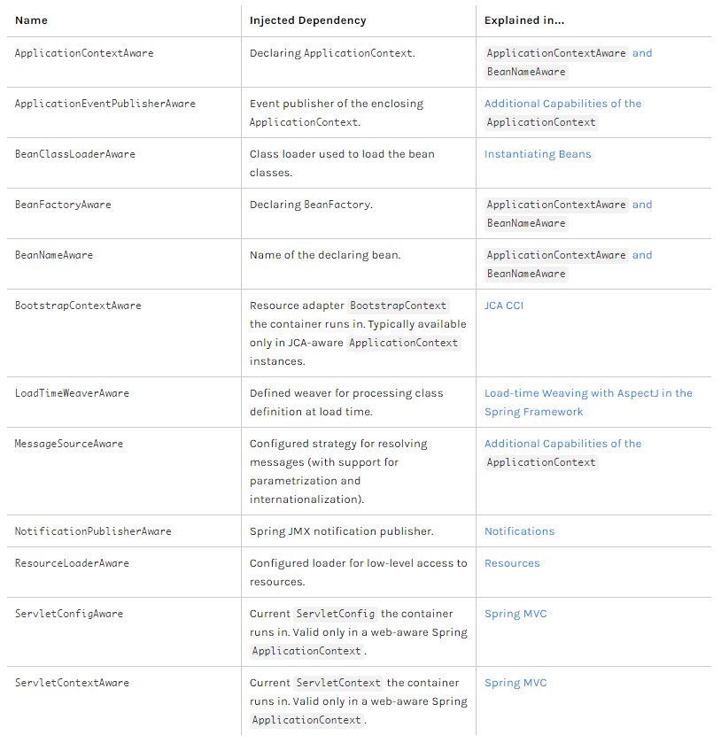

# 12. 스프링 프레임워크 코어 - The IoC Container - Customizing the Nature of a Bean

https://docs.spring.io/spring/docs/5.2.0.M3/spring-framework-reference/core.html#beans-factory-nature

## Customizing the Nature of a Bean

bean에 대한 lifecycle

bean에 대해 IoC Container가 만들어내는 과정 중에서 우리가 설정할 수 있는 것들에 대한 내용

* Lifecycle Callbacks
* `ApplicationContextAware` and `BeanNameAware`
* Other `Aware` Interfaces


### Lifecycle Callbacks

Spring에서는 객체들을 다루기 때문에, 객체를 managing하는 framework이기 때문에 객체를 만들거나 없애는 두 가지 행위를 할 수 있다.

객체를 만들 때에는 기존에 명시적으로 new라고 하는 키워드를 통해서 객체를 만드는 것을 Spring이 하기 때문에 new 라는 것을 통해 객체를 만들기 전에 특정 callback을 호출할 수 있다.

jdbc 프로그래밍 할 때 connection close 하는 것처럼 특정 bean을 close 할 때, 특정 bean에 대해서 명시적으로 자원을 없앨 때에는 close에 대한 callback을 할 수 있다.

callback은 특정 함수가 된다.

bean에 대해서 lifecycle을 관리할 수 있게 된다.


크게 `InitializingBean` 이라는 인터페이스를 구현하는 방법, JSR-250 `@PostConstruct` 또는 `@PreDestroy`라는 어노테이션을 사용하는 방법, xml 설정을 통해 `init-method` 또는 `destroy-method` 이용하는 방법이 있다.


인터페이스를 사용하는 방법과 xml을 사용하는 방법 진행


#### Initialization Callbacks

bean이 만들어질 때 특정 callback, 특정 함수가 실행되라는 부분


##### `InitializingBean` 인터페이스 이용하는 방법

구글에 org.springframework.beans.factory.InitializingBean api 검색

InitializingBean에 대한 인터페이스 살펴보기

[InitializingBean (Spring Framework 5.2.4.RELEASE API)](https://docs.spring.io/spring-framework/docs/current/javadoc-api/org/springframework/beans/factory/InitializingBean.html)

하나의 메서드만 가지고 있는 인터페이스이다. afterPropertiesSet() 이라는 메서드

Invoked by the containing `BeanFactory` after it has set all bean properties and satisfied `BeanFactoryAware`, `ApplicationContextAware` etc.

특정 bean이 만들어지고 이 메서드가 호출이 된다.


ConnectionFactory를 살펴보면 

먼저 bean 설정(dao.xml)에서 jdbc connect를 만들기 위한 정보들을 받아오고, 받아온 후에 createConnection이라고 하는 것을 특정 누군가가 호출을 하고, connection이 만들어진다.

ConnectionFactory.java

```java
package kr.co.hello.cli;

import lombok.Getter;
import org.springframework.beans.factory.InitializingBean;

import java.sql.Connection;
import java.sql.DriverManager;
import java.sql.SQLException;

public class ConnectionFactory implements InitializingBean {
    private String driverClass;
    private String url;
    private String user;
    private String password;
    @Getter private Connection connection = null;

    public ConnectionFactory(String driverClass, String url, String user, String password) {
        this.driverClass = driverClass;
        this.url = url;
        this.user = user;
        this.password = password;
    }

    public Connection createConnection() throws SQLException {
        try {
            Class.forName(this.driverClass);
        } catch (ClassNotFoundException e) {
            e.printStackTrace();
        }
        return DriverManager.getConnection(this.url, this.user, this.password);
    }

    @Override
    public void afterPropertiesSet() throws Exception {
        this.connection = createConnection();
    }
}
```

connection을 미리 만들어놓을 수도 있다.

Connection 필드를 추가하고, InitializingBean 이라는 인터페이스를 통해서 만들어놓은 것을 주입할 수 있다.

afterPropertiesSet 메서드 override => 여기에 bean이 만들어지고 난 이후 작업을 추가해주면 된다. createConnection을 호출

connection이 null인지 아닌지를 체크하기 위해서는 getter 메서드가 필요하다.


Main.java

```java
package kr.co.hello.cli;
import lombok.extern.slf4j.Slf4j;
import org.springframework.context.ApplicationContext;
import org.springframework.context.support.ClassPathXmlApplicationContext;

import java.sql.*;

@Slf4j
class Main {
	public static void main(String[] args) throws SQLException {
		log.info("Hello world!!");
		ApplicationContext context = new ClassPathXmlApplicationContext("dao.xml");
		ConnectionFactory factory = context.getBean(ConnectionFactory.class);
		Connection connection = factory.getConnection();
		log.info("" + (connection != null));
	}
}
```

ConnectionFactory에서 Initialize 행위를 통해서 connection 객체가 만들어졌는지 확인

객체가 만들어지면서 처음에는 connection을 null로 assign을 했는데, InitializingBean을 implement하고 해당 callback을 override 해주면서 원하는 business logic을 넣어줬다. createConnection이라는 메서드를 넣어주면서 connection을 assign 함으로써 null이 아닌 것을 확인할 수 있다.


##### `init-method`라는 xml 설정을 이용한 방법

ConnectionFactory.java

```java
package kr.co.hello.cli;

import lombok.Getter;
import lombok.extern.slf4j.Slf4j;
import org.springframework.beans.factory.InitializingBean;

import java.sql.Connection;
import java.sql.DriverManager;
import java.sql.SQLException;

@Slf4j
public class ConnectionFactory {
    private String driverClass;
    private String url;
    private String user;
    private String password;
    @Getter private Connection connection = null;

    public ConnectionFactory(String driverClass, String url, String user, String password) {
        this.driverClass = driverClass;
        this.url = url;
        this.user = user;
        this.password = password;
    }

    public Connection createConnection() throws SQLException {
        try {
            Class.forName(this.driverClass);
        } catch (ClassNotFoundException e) {
            e.printStackTrace();
        }
        return DriverManager.getConnection(this.url, this.user, this.password);
    }

    public void init() throws Exception {
        log.info("init");
        this.connection = createConnection();
    }
}
```

ConnectionFactory의 implements 부분 지우기, @Override 지우기

afterPropertiesSet메서드 이름을 init으로 변경, log 찍어보기


dao.xml

```xml
...
    <bean id="connectionFactory" class="kr.co.hello.cli.ConnectionFactory" init-method="init">
        <constructor-arg name="driverClass" value="org.h2.Driver" />
        <constructor-arg name="url" value="jdbc:h2:mem:test;MODE=MySQL;"/>
        <constructor-arg name="user" value="sa" />
        <constructor-arg name="password" value="" />
    </bean>
...
```

ConnectionFactory부분의 init-method에 메서드 명을 넣어주면 된다.

connectionFactory 타입의 bean을 만들고, 그 bean은 ConnectionFactory 클래스의 init 메서드를 실행시킨다.


main 메서드 실행

```
INFO  kr.co.hello.cli.Main - Hello world!!
INFO  kr.co.hello.cli.ConnectionFactory - init
INFO  kr.co.hello.cli.Main - true
```

init 메서드가 동작해서 log를 찍고 마지막으로 null이 아니므로 true를 찍는다.


#### Destruction Callbacks

bean이 없어질 때, 종료될 때 동작한 callback들에 대한 정의


##### `DisposableBean` 인터페이스를 이용하는 방법

`org.springframework.beans.factory.DisposableBean` 이라는 인터페이스

InitializingBean과 반대되는 개념

bean이 없어질 때 이 메서드가 동작한다. 여기에서 실행되는 callback이 동작한다.


ConnectionFactory.java

```java
package kr.co.hello.cli;

import lombok.Getter;
import lombok.extern.slf4j.Slf4j;
import org.springframework.beans.factory.DisposableBean;
import org.springframework.beans.factory.InitializingBean;

import java.sql.Connection;
import java.sql.DriverManager;
import java.sql.SQLException;

@Slf4j
public class ConnectionFactory implements DisposableBean {
    private String driverClass;
    private String url;
    private String user;
    private String password;
    @Getter private Connection connection = null;

    public ConnectionFactory(String driverClass, String url, String user, String password) {
        this.driverClass = driverClass;
        this.url = url;
        this.user = user;
        this.password = password;
    }

    public Connection createConnection() throws SQLException {
        try {
            Class.forName(this.driverClass);
        } catch (ClassNotFoundException e) {
            e.printStackTrace();
        }
        return DriverManager.getConnection(this.url, this.user, this.password);
    }

    public void init() throws Exception {
        log.info("init");
        this.connection = createConnection();
    }

    @Override
    public void destroy() throws Exception {
        log.info("destroy");
        if(this.connection != null) {
            this.connection.close();
        }
    }
}
```

DisposableBean을 implements 한다. DisposableBean이라는 interface는 destroy라는 메서드를 가지고 있다.

destroy를 override한다. 그 안에서 원하는 동작을 하면 된다.

connection 객체를 close 해줘야 한다.

log를 찍어보기


main 메서드를 실행해보면 원하는대로 동작하지 않는다.


Main.java

```java
package kr.co.hello.cli;
import lombok.extern.slf4j.Slf4j;
import org.springframework.context.ConfigurableApplicationContext;
import org.springframework.context.support.ClassPathXmlApplicationContext;

import java.sql.*;

@Slf4j
class Main {
	public static void main(String[] args) throws SQLException {
		log.info("Hello world!!");
		ConfigurableApplicationContext context = new ClassPathXmlApplicationContext("dao.xml");
		ConnectionFactory factory = context.getBean(ConnectionFactory.class);
		Connection connection = factory.getConnection();
		log.info("" + (connection != null));
		context.close();
	}
}
```

ClassPathXmlApplicationContext는 정말 많은것들의 인터페이스를 상속받고 있다.

그런데 우리가 assign한 타입은 ApplicationContext이다.

jdbc 프로그래밍을 할 때 close라는 메서드를 호출한 것처럼, spring도 Spring Container가 자원을 정리해주기 위해서 close 메서드를 호출해줘야 한다.

그런데 context.close() 라고 하면 context에 close 메서드가 없어서 컴파일 에러가 난다.

실제로 close 메서드는 ClassPathXmlApplicationContext에 정의된 것들을 따라가보면 

AbstractXmlApplicationContext

AbstractRefreshableConfigApplicationContext

AbstractRefreshableApplicationContext

AbstractApplicationContext

implements에 ConfigurableApplicationContext라는 것을 구현한 것을 확인할 수 있다.

다시 따라가보면 여기서 상속된 것이 ApplicationContext, Lifecycle, Closeable 나오는 것을 확인할 수 있다.

여기에서 Closeable을 통해서 close 메서드를 호출할 수 있다.

뒤에 나올 Lifecycle도 여기에서 extend 된 것을 확인할 수 있다.


그러므로 우리는 단순히 ApplicationContext 타입으로 하는 것이 아니고, ConfigurableApplicationContext 타입으로 변경한다.

ConfigurableApplicationContext 은 ApplicationContext 타입 보다 더 많은 메서드를 포함하고 있기 때문에 기존과 동일하게 코드를 동작시킬 수 있다.

close 메서드를 호출함으로써 IoC Container가 자신들이 가지고 있는 bean들에 대해서 destroy 메서드가 있는지 확인해보고, 있으면 destroy 메서드를 진행하고, 점점 bean들에 대해서 destruction을 진행한다.


```
INFO  kr.co.hello.cli.Main - Hello world!!
INFO  kr.co.hello.cli.ConnectionFactory - init
INFO  kr.co.hello.cli.Main - true
INFO  kr.co.hello.cli.ConnectionFactory - destroy
```

ConnectionFactory라는 bean의 destroy 메서드가 동작되는 것을 확인할 수 있다.


##### `destroy-method`라는 xml 설정을 이용한 방법

ConnectionFactory.java 에서 implement한 부분 지우기, @Override 지우기


dao.xml

```xml
...
    <bean id="connectionFactory" class="kr.co.hello.cli.ConnectionFactory" init-method="init" destroy-method="destroy">
        <constructor-arg name="driverClass" value="org.h2.Driver" />
        <constructor-arg name="url" value="jdbc:h2:mem:test;MODE=MySQL;"/>
        <constructor-arg name="user" value="sa" />
        <constructor-arg name="password" value="" />
    </bean>
...
```

destroy-method 를 이용해 destroy 때 호출 될 destroy 메서드 이름을 넣어준다.


기존과 동일하게 원하는대로 동작하는 것을 확인할 수 있다.


보통은 DB connection에 대한 부분일 때 init 메서드가 실행되고, bean이 종료될 때 실제로 connection에 대한 close 반환 작업을 해줌으로써 내부적으로 동작한다.


#### Default Initialization and Destroy Methods

default-init-method가 있다.

dao.xml

```xml
<?xml version="1.0" encoding="UTF-8"?>
<beans default-init-method="init" default-destroy-method="destroy"
       xmlns="http://www.springframework.org/schema/beans"
       xmlns:xsi="http://www.w3.org/2001/XMLSchema-instance"
       xsi:schemaLocation="http://www.springframework.org/schema/beans
       https://www.springframework.org/schema/beans/spring-beans.xsd">

    <bean id="connectionFactory" class="kr.co.hello.cli.ConnectionFactory">
        <constructor-arg name="driverClass" value="org.h2.Driver" />
        <constructor-arg name="url" value="jdbc:h2:mem:test;MODE=MySQL;"/>
        <constructor-arg name="user" value="sa" />
        <constructor-arg name="password" value="" />
    </bean>

    <bean id="connection" class="java.sql.Connection"
          factory-bean="connectionFactory"
          factory-method="createConnection" />

    <bean id="dao" class="kr.co.hello.cli.Dao">
        <constructor-arg ref="connection" />
    </bean>

    <bean id="dao2" class="kr.co.hello.cli.Dao2">
        <constructor-arg ref="connection" />
    </bean>
</beans>
```

bean에다가 매번 init 또는 destroy 메서드를 정해주기 귀찮을 때에는 beans 설정에 default-init-method라고 해서 init이라고 넣어주고, default-destroy-method라고 해서 destroy라고 이름을 지어주면, bean에 init 또는 destroy가 있으면 자동으로 동작시켜준다.

main 메서드 동작 확인


이제는 다른 bean들에 대해서도 init과 destroy를 추가해주면 된다.


Dao.java

```java
package kr.co.hello.cli;

import lombok.extern.slf4j.Slf4j;

import java.sql.*;

@Slf4j
public class Dao {
    private Connection connection;

    public Dao(Connection connection) {
        this.connection = connection;
    }

    void init() {
        log.info("dao init");
    }

    void destroy() {
        log.info("dao destroy");
    }

    public void run() throws SQLException {
        Statement statement = connection.createStatement();
        connection.setAutoCommit(false);
        statement.execute("create table member(id int auto_increment, username varchar(255) not null, password varchar(255) not null, primary key(id));");
        try {
            statement.executeUpdate("insert into member(username, password) values('MyName', '1234')");
            connection.commit();
        } catch (SQLException e) {
            connection.rollback();
        }

        ResultSet resultSet = statement.executeQuery("select id, username, password from member");
        while(resultSet.next()){
            Member member = new Member(resultSet);
            log.info(member.toString());
        }
    }
}
```

init, destroy 메서드 추가


main 메서드 동작

```
INFO  kr.co.hello.cli.Main - Hello world!!
INFO  kr.co.hello.cli.ConnectionFactory - init
INFO  kr.co.hello.cli.Dao - dao init
INFO  kr.co.hello.cli.Main - true
INFO  kr.co.hello.cli.Dao - dao destroy
INFO  kr.co.hello.cli.ConnectionFactory - destroy
```

init, destroy 메서드가 동작하는 것을 확인할 수 있다.


나중에 배울 것 중에 bean과 bean 사이의 의존성 설정과 bean의 만들어지는 순서(order)를 설정하는 부분이 있다.

이 부분도 bean의 생성과 관련해서, init과 destroy에 관련해서 영향을 미친다.


#### Startup and Shutdown Callbacks

`Lifecycle` interface

Startup과 Shutdown할 때 동작할 수 있는 callback

```java
public interface Lifecycle {

    void start();

    void stop();

    boolean isRunning();
}
```

Lifecycle은 ApplicationContext bean을 만들 때 spring이 자동으로 만들어준다. 우리는 사용만 하면 된다.


Main.java

```java
package kr.co.hello.cli;
import lombok.extern.slf4j.Slf4j;
import org.springframework.context.ConfigurableApplicationContext;
import org.springframework.context.Lifecycle;
import org.springframework.context.support.ClassPathXmlApplicationContext;

import java.sql.*;

@Slf4j
class Main {
	public static void main(String[] args) throws SQLException {
		log.info("Hello world!!");
		ConfigurableApplicationContext context = new ClassPathXmlApplicationContext("dao.xml");
		Lifecycle lifecycle = context.getBean(Lifecycle.class);
		log.info(">> 1: " + lifecycle.isRunning());
		context.close();
		log.info(">> 2: " + lifecycle.isRunning());
	}
}
```

org.springframework.context.Lifecycle 을 import 해준다.

start, stop, isRunning 중 isRunning 부분 살펴보기

isRunning은 ApplicationContext 가 만들어지면서 bean container가 잘 동작하면 isRunning은 true가 되고, context.close() 메서드를 통해서 close가 되면 shutdown이 되면서 isRunning은 false가 된다.


```
INFO  kr.co.hello.cli.Main - Hello world!!
INFO  kr.co.hello.cli.ConnectionFactory - init
INFO  kr.co.hello.cli.Dao - dao init
INFO  kr.co.hello.cli.Main - >> 1: true
INFO  kr.co.hello.cli.Dao - dao destroy
INFO  kr.co.hello.cli.ConnectionFactory - destroy
INFO  kr.co.hello.cli.Main - >> 2: false
```


코딩할 때 spring container가 살아있는지 죽어있는지에 따라 조건적으로 설정을 하고 싶을 경우 Lifecycle interface를 사용하면 편하다.


### `ApplicationContextAware` and `BeanNameAware`

ClassPathXmlApplicationContext 라는 bean container를 다른 bean에서도 사용하고 싶을 경우 사용한다.


cil 디렉터리에 A class 생성

A.java

```java
package kr.co.hello.cli;

import lombok.extern.slf4j.Slf4j;
import org.springframework.beans.BeansException;
import org.springframework.context.ApplicationContext;
import org.springframework.context.ApplicationContextAware;

@Slf4j
public class A implements ApplicationContextAware {
    private ApplicationContext applicationContext;

    void init() {
        log.error(">> " + applicationContext);
    }

    @Override
    public void setApplicationContext(ApplicationContext applicationContext) throws BeansException {
        this.applicationContext = applicationContext;
    }
}
```

ApplicationContextAware를 implement 한다.

setApplicationContext 라는 setter 메서드를 override 한다.

applicationContext를 assign하는 코드 추가, 필드 추가

이렇게 만들어두면 applicationContext를 언제든지 사용할 수 있다.

init 할 때 log를 찍는다. applicationContext가 null이 아닌지만 check

log를 찍는 곳에 디버깅 모드로 breakpoint 걸기


dao.xml

```xml
    <bean class="kr.co.hello.cli.A" />
```

A class를 bean으로 등록한다. init은 beans에서 default-init-method를 설정했기 때문에 자동적으로 실행될 것이다.


```
Connected to the target VM, address: '127.0.0.1:56883', transport: 'socket'
INFO  kr.co.hello.cli.Main - Hello world!!
INFO  kr.co.hello.cli.ConnectionFactory - init
INFO  kr.co.hello.cli.Dao - dao init
ERROR kr.co.hello.cli.A - >> org.springframework.context.support.ClassPathXmlApplicationContext@1b083826, started on Tue Mar 17 23:15:27 KST 2020
INFO  kr.co.hello.cli.Main - >> 1: true
INFO  kr.co.hello.cli.Dao - dao destroy
INFO  kr.co.hello.cli.ConnectionFactory - destroy
INFO  kr.co.hello.cli.Main - >> 2: false
Disconnected from the target VM, address: '127.0.0.1:56883', transport: 'socket'
```

spring bean container가 bean들에 대해서 작업을 하고, bean이 만들어진 이후에 init 메서드를 호출한다. 호출할 때 applicationContext를 이전에 set을 했기 때문에 applicationContext 객체가 만들어진 것을 확인할 수 있다.

null이 아니므로 ERROR라고 찍었던 log를 보면 객체가 있는 것을 확인할 수 있다.


특정 bean에서 applicationContext 를 사용하고 싶을 경우 ApplicationContextAware 인터페이스를 implement 하고, set 메서드만 만들어주면 된다.


### Other `Aware` Interfaces

`Aware` Interfaces들은 spring container의 기능들을 `Aware` Interfaces라는 이름이 붙은 것들을 통해서 사용할 수 있는 것이다.

그 중에서 ApplicationContext가 가장 대표적으로 많이 사용하는 것이기 때문에 ApplicationContextAware 인터페이스를 사용하는 방법을 기준으로 나머지 것들을 학습해나가면 된다.




