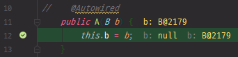

# 13. 스프링 프레임워크 코어 - The IoC Container - Annotation-based Container Configuration

https://docs.spring.io/spring/docs/5.2.0.M3/spring-framework-reference/core.html#beans-annotation-config

## Annotation-based Container Configuration

기존 xml 설정과 더불어 java 파일에서 annotation을 추가함으로써 spring container 설정을 추가하는 방법

annotation이라는 방식이 xml 방식보다 spring configuration 할 때 더 좋은가?

=> 상황에 따라 다르다.

xml 방식으로 하면 소스코드 외에 xml만 보고 spring의 설정을 볼 수 있다. 설정과 소스코드의 분리가 가능해진다. 단점으로는 xml에 모든 설정을 넣다보니, 나중에 spring 설정들을 보면 xml hell이라고 할 정도로 xml의 덩어리가 너무 커진다. xml 관리에 대한 부담감도 커진다.


annotation이라는 방식을 통해서 spring 설정을 하는 것이 많이 추가되었다.

@Required 나 @Autowired 같은 것들에 대해서 이런 annotation이 붙은 java annotation feature가 있다.

java의 annotation을 통해서 설정을 하는 것들에 대해서 기술을 제공한다.

문제는 xml인 경우는 소스코드를 건들지 않는데, annotation 같은 경우에 소스 코드 안에 java 코드가 들어감으로써 코드와 설정의 분리가 애매해지는 상황이 된다.


어떤 방법이 좋다 나쁘다 말하기는 어렵고, 그때 그때 자신이 더 나은 방식을 선택하는 것이 중요하다.


xml 설정 방식에 이어 annotation 방식을 통해서 설정하는 방법 진행


```xml
<?xml version="1.0" encoding="UTF-8"?>
<beans xmlns="http://www.springframework.org/schema/beans"
    xmlns:xsi="http://www.w3.org/2001/XMLSchema-instance"
    xmlns:context="http://www.springframework.org/schema/context"
    xsi:schemaLocation="http://www.springframework.org/schema/beans
        https://www.springframework.org/schema/beans/spring-beans.xsd
        http://www.springframework.org/schema/context
        https://www.springframework.org/schema/context/spring-context.xsd">

    <context:annotation-config/>

</beans>
```

beans 설정에 보면 `context` namespace에 대해 이야기가 나온다.


기존의 beans 설정(dao.xml 파일)을 보면 context라는 namespace가 추가되어있지 않다.

위에 있는 설정을 dao.xml에 붙여넣기. (`<context:annotation-config/>` 부분 제외)

=> 사용하지 않는 부분은 회색으로 뜬다.

context가 추가되었으므로 context에 관련되어 있는 java xml을 사용할 수 있다.

`<context:annotation-config/>` 부분 추가 => 사용이 되었으므로 회색에서 색깔이 변경된다.

이제부터는 annotation base로 spring 설정을 할 수 있게 되었다.


### Using `@Autowired`

`@Autowired`는 JSR 330의 `@Inject`과 비슷하다.

`@Autowired`는 bean과 bean 간의 관계에서 spring container가 자동으로 관계를 연결시켜주는 것이다.

관계를 연결시켜주는 방법은 bean의 이름이나 타입 등 기타 여러가지 정보를 이용해서 자동으로 연결해준다.


```java
public class MovieRecommender {

    private final CustomerPreferenceDao customerPreferenceDao;

    @Autowired
    public MovieRecommender(CustomerPreferenceDao customerPreferenceDao) {
        this.customerPreferenceDao = customerPreferenceDao;
    }

    // ...
}
```

MovieRecommender의 생성자를 통해서 CustomerPreferenceDao 라는 것을 Autowired 한다.


```xml
    <bean id="dao" class="kr.co.hello.cli.Dao">
        <constructor-arg ref="connection" />
    </bean>
```

원래 xml 설정으로는 Dao라는 타입 안에 생성자로 connection이라고 하는 bean을 연결해줬었다. 이 부분이 없어지고 자동으로 연결해준다.


cli 패키지 하위에 A와 B를 만들어서 관계 설정 진행

B class 생성

B.java

```java
package kr.co.hello.cli;

public class B {
}
```


dao.xml

```xml
<?xml version="1.0" encoding="UTF-8"?>
<beans xmlns="http://www.springframework.org/schema/beans"
       xmlns:xsi="http://www.w3.org/2001/XMLSchema-instance"
       xmlns:context="http://www.springframework.org/schema/context"
       xsi:schemaLocation="http://www.springframework.org/schema/beans
       https://www.springframework.org/schema/beans/spring-beans.xsd
       http://www.springframework.org/schema/context
       https://www.springframework.org/schema/context/spring-context.xsd">

    <context:annotation-config/>

    <bean id="connectionFactory" class="kr.co.hello.cli.ConnectionFactory">
        <constructor-arg name="driverClass" value="org.h2.Driver" />
        <constructor-arg name="url" value="jdbc:h2:mem:test;MODE=MySQL;"/>
        <constructor-arg name="user" value="sa" />
        <constructor-arg name="password" value="" />
    </bean>

    <bean id="connection" class="java.sql.Connection"
          factory-bean="connectionFactory"
          factory-method="createConnection" />

    <bean id="dao" class="kr.co.hello.cli.Dao">
        <constructor-arg ref="connection" />
    </bean>

    <bean id="dao2" class="kr.co.hello.cli.Dao2">
        <constructor-arg ref="connection" />
    </bean>

    <bean class="kr.co.hello.cli.B" />
    
    <bean class="kr.co.hello.cli.A" />
</beans>
```

autowire 할 bean을 정의.

spring container 안에 bean으로 등록되어 있어야 자동으로 연결해준다.

xml 설정에서는 A와 B의 관계에 대해서 정의해주지 않았다.


A.java

```java
package kr.co.hello.cli;

import lombok.extern.slf4j.Slf4j;
import org.springframework.beans.factory.annotation.Autowired;

@Slf4j
public class A  {
    private B b;

    @Autowired
    public A(B b) {
        this.b = b;
    }
}
```

기존 A 클래스에 대해서는 Lifecycle에 관련된 코드들은 다 지운다.

A는 주입을 받아야하는데, 주입을 받을 수 있는 방법으로는 setter와 constructor가 있다.

생성자 만들기, `@Autowired` 추가

`this.b = b;` 부분에 breakpoint 걸기


Main.java

```java
package kr.co.hello.cli;
import lombok.extern.slf4j.Slf4j;
import org.springframework.context.ConfigurableApplicationContext;
import org.springframework.context.support.ClassPathXmlApplicationContext;

import java.sql.*;

@Slf4j
class Main {
	public static void main(String[] args) throws SQLException {
		log.info("Hello world!!");
		ConfigurableApplicationContext context = new ClassPathXmlApplicationContext("dao.xml");
	}
}
```

기존 Lifecycle 관련 코드 지우기

bean 관계 설정에 대해서는 spring container가 로딩 될 때 이므로, 특별히 main 메서드에서는 더이상 코드를 수정하지 않고, spring container를 실행시켜보기

디버깅

생성자를 만드는 시점에 spring container가 @Autowired 어노테이션이 걸려있는 b를 보고 b 객체를 만들어 놓은 것을 주입하는 것을 확인할 수 있다.


b를 b에 assign 해서 동작을 한다.


@Autowired를 주석처리 => 디버깅



이번에도 b 객체가 주입된다.

spring이 버전업을 하면서 생성자 주입인 경우에 @Autowired가 자동으로 되는 것으로 기능이 추가되었다.


@Autowired를 setter field로 할 수 있다.

A.java

```java
package kr.co.hello.cli;

import lombok.extern.slf4j.Slf4j;
import org.springframework.beans.factory.annotation.Autowired;

@Slf4j
public class A  {
    private B b;

    @Autowired
    public void setB(B b) {
        this.b = b;
    }
}
```

생성자 지우기

generate로 setter 만들기, @Autowired 어노테이션 붙이기

`this.b = b;` 부분에 breakpoint 걸기 => 디버깅

b에 객체가 있으므로 hash 값이 나오는 것을 확인할 수 있다.


A.java

```java
package kr.co.hello.cli;

import lombok.extern.slf4j.Slf4j;
import org.springframework.beans.factory.annotation.Autowired;

import javax.annotation.PostConstruct;

@Slf4j
public class A  {
    @Autowired private B b;

    @PostConstruct
    void init() {
        log.info("" + b);
    }
}
```

field에도 @Autowired를 넣을 수 있다.

field 값이 할당되었는지 @PostConstruct를 사용해서 확인

@PostConstruct는 init lifecycle 관련되어 있는 annotation이다.


@Autowired는 많이 사용되는 annotation이다.


앞에서 말한 `@Inject`도 사용법은 `@Autowired`와 거의 비슷하다.

`@Autowired` 대신 `@Inject`를 넣어주면 된다.

JSR 330의 feature이므로 이와 관련되어 있는 의존성을 추가해줘야한다.


```java
public class SimpleMovieLister {

    private MovieFinder movieFinder;

    @Autowired(required = false)
    public void setMovieFinder(MovieFinder movieFinder) {
        this.movieFinder = movieFinder;
    }

    // ...
}
```


실제로 해당 bean이 없는 경우에는 @Autowired 하다가 에러가 난다.


dao.xml

```xml
<!--    <bean class="kr.co.hello.cli.B" />-->

    <bean class="kr.co.hello.cli.A" />
```

B bean에 대한 설정을 하지 않는다.


A.java

```java
package kr.co.hello.cli;

import lombok.extern.slf4j.Slf4j;
import org.springframework.beans.factory.annotation.Autowired;

@Slf4j
public class A  {
    @Autowired private B b;
}
```

@Autowired 설정을 걸어놓는다.


bean container가 로딩하다가 해당 bean이 없으므로 객체를 만들 수 없다고 container가 에러를 내고 프로그램이 종료된다.

```
INFO  kr.co.hello.cli.Main - Hello world!!
Exception in thread "main" org.springframework.beans.factory.UnsatisfiedDependencyException: Error creating bean with name 'kr.co.hello.cli.A#0': Unsatisfied dependency expressed through field 'b'; nested exception is org.springframework.beans.factory.NoSuchBeanDefinitionException: No qualifying bean of type 'kr.co.hello.cli.B' available: expected at least 1 bean which qualifies as autowire candidate. Dependency annotations: {@org.springframework.beans.factory.annotation.Autowired(required=true)}
...
```


이런 경우에는 프로그램이 종료되지 않도록 하고싶으면 required = false 라고 명시해주면 container가 종료되지 않고 동작한다.


A.java

```java
package kr.co.hello.cli;

import lombok.extern.slf4j.Slf4j;
import org.springframework.beans.factory.annotation.Autowired;

@Slf4j
public class A  {
    @Autowired(required = false) private B b;
}
```


```
INFO  kr.co.hello.cli.Main - Hello world!!
```

잘 사용되지는 않지만 가끔 의도에 의해 사용되기도 한다.


```java
public class SimpleMovieLister {

    @Autowired
    public void setMovieFinder(Optional<MovieFinder> movieFinder) {
        ...
    }
}
```

Java 8에서 Optional을 이용해 의존성을 주입할 수 있다.


```java
public class SimpleMovieLister {

    @Autowired
    public void setMovieFinder(@Nullable MovieFinder movieFinder) {
        ...
    }
}
```

@Nullable 어노테이션을 붙일 수 있다.


```java
public class MovieRecommender {

    @Autowired
    private ApplicationContext context;

    public MovieRecommender() {
    }

    // ...
}
```

Customizing the Nature of a Bean 에서 Aware에 대해서 배웠었다.

Aware에서 ApplicationContext를 setter로 넣어줬었는데, 그렇게 불편하게 하지 않고 @Autowired를 통해서 간단하게 넣을 수 있다.


A.java

```java
package kr.co.hello.cli;

import lombok.extern.slf4j.Slf4j;
import org.springframework.beans.factory.annotation.Autowired;
import org.springframework.context.ApplicationContext;

import javax.annotation.PostConstruct;

@Slf4j
public class A  {
    @Autowired private B b;
    @Autowired private ApplicationContext context;

    @PostConstruct
    void init() {
        log.info("" + context);
    }
}
```

ApplicationContext를 넣어준다.


dao.xml에서 B bean에 대한 주석을 해제한다.


ApplicationContext가 잘 주입되어 있는 것을 확인할 수 있다.


Aware 인터페이스를 구현하지 않고 @Autowired를 사용해 주입할 수 있다.


### Fine-tuning Annotation-based Autowiring with `@Primary`

```java
@Configuration
public class MovieConfiguration {

    @Bean
    @Primary
    public MovieCatalog firstMovieCatalog() { ... }

    @Bean
    public MovieCatalog secondMovieCatalog() { ... }

    // ...
}
```

@Autowired 를 할 때 이름 또는 타입을 통해서 하는데, 이름이 정해져 있지 않은데 같은 타입이 있는 경우에는 어떤 것을 @Autowired할지를 모르겠다고 spring이 에러를 낸다.

그런 경우에는 @Primary 라는 annotation을 붙여놓고 진행하면 @Primary가 붙은 bean을 먼저 선택하게 된다.


cli 디렉터리에 AppConfig 클래스 생성

AppConfig.java

```java
package kr.co.hello.cli;

import org.springframework.context.annotation.Bean;
import org.springframework.context.annotation.Configuration;

@Configuration
public class AppConfig {
    @Bean
    public B b1() {
        return new B();
    }

    @Bean
    public B b2() {
        return new B();
    }
}
```

@Configuration 어노테이션을 붙인다. bean 설정으로 등록이 되는 동시에 spring 설정에 대해서 관련 있는 bean이라는 것을 알려주는 어노테이션이다.

@Bean이라는 어노테이션 추가. @Bean 어노테이션은 xml에서 bean을 설정하는 것 대신 java 어노테이션을 통해서 bean을 설정할 수 있도록 도와주는 어노테이션이다.

B라는 타입의 bean이 추가된다. b1, b2 bean 추가


dao.xml

```xml
    <bean class="kr.co.hello.cli.AppConfig" />

    <bean class="kr.co.hello.cli.A" />
```

bean을 만들었던 xml 설정 제거

@Configuration 어노테이션이 붙은 클래스를 bean으로 등록해준다.

AppConfig 클래스의 bean을 읽을 때 @Configuration 어노테이션을 읽고 bean들을 다시 만들어낸다.


main 메서드를 실행시키면 에러가 발생한다. NoUniqueBeanDefinitionException

같은 타입의 bean이 2개가 등록되어 있어서 에러가 난다.


AppConfig.java

```java
package kr.co.hello.cli;

import org.springframework.context.annotation.Bean;
import org.springframework.context.annotation.Configuration;

@Configuration
public class AppConfig {
    @Bean
    public B b1() {
        return new B();
    }

//    @Bean
//    public B b2() {
//        return new B();
//    }
}
```

b2 부분 주석 처리 후 동작 확인


AppConfig.java


@Bean을 통해서 bean 등록하는 것을 확인할 수 있다.


A.java


A 타입의 bean을 만들 때 b가 만들어진 것을 확인할 수 있다.


AppConfig.java

```java
...
    @Bean
    @Primary
    public B b1() {
        return new B();
    }

    @Bean
    public B b2() {
        return new B();
    }
...
```

b1에 @Primary 어노테이션 추가

에러없이 실행된다. 두 개의 bean이 container에 등록된다.


@Primary 어노테이션은 같은 타입의 @Autowired 상황일 때 어떤것을 먼저 주입해야할지 모를 때 spring에게 알려주는 유용한 어노테이션이다.


AppConfig.java

```java
package kr.co.hello.cli;

import org.springframework.context.annotation.Bean;
import org.springframework.context.annotation.Configuration;

@Configuration
public class AppConfig {
    @Bean
    public B b1() {
        return new B();
    }
}
```

@Primary 어노테이션을 지우고 b1만 남겨두기


```xml
<?xml version="1.0" encoding="UTF-8"?>
<beans xmlns="http://www.springframework.org/schema/beans"
    xmlns:xsi="http://www.w3.org/2001/XMLSchema-instance"
    xmlns:context="http://www.springframework.org/schema/context"
    xsi:schemaLocation="http://www.springframework.org/schema/beans
        https://www.springframework.org/schema/beans/spring-beans.xsd
        http://www.springframework.org/schema/context
        https://www.springframework.org/schema/context/spring-context.xsd">

    <context:annotation-config/>

    <bean class="example.SimpleMovieCatalog" primary="true">
        <!-- inject any dependencies required by this bean -->
    </bean>

    <bean class="example.SimpleMovieCatalog">
        <!-- inject any dependencies required by this bean -->
    </bean>

    <bean id="movieRecommender" class="example.MovieRecommender"/>

</beans>
```

xml 설정에서는 primary="true" 라고 하면 된다.


### Fine-tuning Annotation-based Autowiring with Qualifiers

@Qualifiers 라는 어노테이션이 있다.

```java
public class MovieRecommender {

    @Autowired
    @Qualifier("main")
    private MovieCatalog movieCatalog;

    // ...
}
```


```xml
<?xml version="1.0" encoding="UTF-8"?>
<beans xmlns="http://www.springframework.org/schema/beans"
    xmlns:xsi="http://www.w3.org/2001/XMLSchema-instance"
    xmlns:context="http://www.springframework.org/schema/context"
    xsi:schemaLocation="http://www.springframework.org/schema/beans
        https://www.springframework.org/schema/beans/spring-beans.xsd
        http://www.springframework.org/schema/context
        https://www.springframework.org/schema/context/spring-context.xsd">

    <context:annotation-config/>

    <bean class="example.SimpleMovieCatalog">
        <qualifier value="main"/> 

        <!-- inject any dependencies required by this bean -->
    </bean>

    <bean class="example.SimpleMovieCatalog">
        <qualifier value="action"/> 

        <!-- inject any dependencies required by this bean -->
    </bean>

    <bean id="movieRecommender" class="example.MovieRecommender"/>

</beans>
```

여기서는 xml로 설정되어 있다.

같은 타입의 bean을 만들 때 qualifier 라는 값을 줄 수 있다. 이것을 통해서 qualifier 어노테이션의 어떤 bean을 선택할지에 대해서 primary처럼 사용할 수 있다.


dao.xml

```xml
    <bean class="kr.co.hello.cli.B">
        <qualifier value="b1"/>
    </bean>

    <bean class="kr.co.hello.cli.B">
        <qualifier value="b2"/>
    </bean>
<!--    <bean class="kr.co.hello.cli.AppConfig" />-->
    <bean class="kr.co.hello.cli.A" />
```

B 타입의 bean 2개를 만드는데 qualifier 를 준다. 이름이 겹치면 안된다.


A.java

```java
package kr.co.hello.cli;

import lombok.extern.slf4j.Slf4j;
import org.springframework.beans.factory.annotation.Autowired;
import org.springframework.beans.factory.annotation.Qualifier;
import org.springframework.context.ApplicationContext;

import javax.annotation.PostConstruct;

@Slf4j
public class A  {
    @Autowired @Qualifier("b1") private B b;
    @Autowired private ApplicationContext context;

    @PostConstruct
    void init() {
        log.info("" + context);
    }
}
```

A 타입의 객체에서 @Autowired를 할 때 @Qualifier라는 어노테이션을 붙이고, 내가 원하는 bean의 value값을 추가한다.

앞에서 @Primary 한것과 같이 특정 bean을 사용하고 싶을 경우 @Qualifier를 사용하면 유용하다.

b1 대신 b2로 바꿔보기


xml 설정이 아니라 어노테이션을 사용한 방법

dao.xml

```xml
    <bean class="kr.co.hello.cli.AppConfig" />
    <bean class="kr.co.hello.cli.A" />
```


AppConfig.java

```java
package kr.co.hello.cli;

import org.springframework.beans.factory.annotation.Qualifier;
import org.springframework.context.annotation.Bean;
import org.springframework.context.annotation.Configuration;

@Configuration
public class AppConfig {
    @Bean
    @Qualifier("b1")
    public B b1() {
        return new B();
    }

    @Bean
    @Qualifier("b2")
    public B b2() {
        return new B();
    }
}
```


A.java

```java
package kr.co.hello.cli;

import lombok.extern.slf4j.Slf4j;
import org.springframework.beans.factory.annotation.Autowired;
import org.springframework.beans.factory.annotation.Qualifier;
import org.springframework.context.ApplicationContext;

import javax.annotation.PostConstruct;

@Slf4j
public class A  {
    @Autowired @Qualifier("b2") private B b;
    @Autowired private ApplicationContext context;

    @PostConstruct
    void init() {
        log.info("" + context);
    }
}
```

log.info 부분에 breakpoint로 확인


이런 방식으로 내가 원하는 bean을 선택할 수 있다.


### Injection with `@Resource`

JSR-250에 있는 어노테이선

`javax.annotation.Resource`

이것을 통해서도 @Autowired와 똑같은 효과를 볼 수 있다.


AppConfig.java

```java
package kr.co.hello.cli;

import org.springframework.beans.factory.annotation.Qualifier;
import org.springframework.context.annotation.Bean;
import org.springframework.context.annotation.Configuration;

@Configuration
public class AppConfig {
    @Bean
    @Qualifier("b1")
    public B appBeanB1() {
        return new B();
    }

    @Bean
    @Qualifier("b2")
    public B appBeanB2() {
        return new B();
    }
}
```

@Bean이라는 어노테이션은 @Qualifier 라는 값을 통해서도 이름처럼 사용이 가능하지만, 실제로는 function 명이 bean의 이름으로 등록된다. xml 설정으로 보면 id 또는 name에 유니크한 값들이 적용된다. 그것처럼 function 명이 이름으로 사용된다.

@Qualifier 이름과 다르게 function 명 변경. appBeanB1과 appBeanB2


A.java

```java
package kr.co.hello.cli;

import lombok.extern.slf4j.Slf4j;
import org.springframework.beans.factory.annotation.Autowired;
import org.springframework.context.ApplicationContext;

import javax.annotation.PostConstruct;
import javax.annotation.Resource;

@Slf4j
public class A  {
    @Resource(name="appBeanB1") private B b;
    @Autowired private ApplicationContext context;

    @PostConstruct
    void init() {
        log.info("" + context);
    }
}
```

@Resource 에는 bean의 name 속성을 넣어주면 된다.

실제로 그 name에 있는 bean이 주입되는지 확인


b가 null이 아니고 hash 값이 나온다. => b가 주입되었다.


appBeanB2도 동일하게 넣으면 된다.


없는 이름인 경우에는 container가 주입을 하지 못한다. 에러 발생


setter, 생성자, 필드 레벨에서 Resource 를 사용할 수 있다.


### Using `@Value`

`@Value`는 보통 애플리케이션에서 xml 말고도 `application.properties`라는 파일을 만들어서 그 안에 있는 properties 파일을 읽어들인다.

```java
@Component
public class MovieRecommender {

    private final String catalog;

    public MovieRecommender(@Value("${catalog.name}") String catalog) {
        this.catalog = catalog;
    }
}
```


```java
catalog.name=MovieCatalog
```

properties는 왼쪽에 key, 오른쪽에 value가 있다.

key와 value의 쌍으로 properties의 값들을 넣고, spring 프로그래밍에서 사용하고 있다.


보통 여기서 많이 사용되는 값들이 jdbc driverClass의 value, url, user 이런 것들을 properties로 값을 빼놓고, xml 설정에 value 어노테이션 사용하는 것처럼 사용한다.


```java
@Configuration
@PropertySource("classpath:application.properties")
public class AppConfig { }
```

properties를 읽기 위해서는 @PropertySource라고 하는 어노테이션을 붙여주고, 뒤에 resource 파트에서 배울 classpath prefix를 붙이고, 파일 명을 넣어줘야 한다.


AppConfig.java

```java
package kr.co.hello.cli;

import org.springframework.beans.factory.annotation.Qualifier;
import org.springframework.context.annotation.Bean;
import org.springframework.context.annotation.Configuration;
import org.springframework.context.annotation.PropertySource;

@Configuration
@PropertySource("classpath:application.properties")
public class AppConfig {
    @Bean
    @Qualifier("b1")
    public B appBeanB1() {
        return new B();
    }

    @Bean
    @Qualifier("b2")
    public B appBeanB2() {
        return new B();
    }
}
```

@PropertySource 어노테이션 추가

classpath에 application.properties라는 파일이 만들어져야 한다.

classpath는 main인 경우에는 java와 resources에 classpath가 잡힌다.

보통 설정들은 resources에 넣어두기 때문에 resources에 application.properties 파일을 만든다.


application.properties

```
catalog.name=MovieCatalog
```


A.java

```java
package kr.co.hello.cli;

import lombok.extern.slf4j.Slf4j;
import org.springframework.beans.factory.annotation.Autowired;
import org.springframework.beans.factory.annotation.Value;
import org.springframework.context.ApplicationContext;

import javax.annotation.PostConstruct;
import javax.annotation.Resource;

@Slf4j
public class A  {
    @Resource(name="appBeanB1") private B b;
    @Autowired private ApplicationContext context;
    @Value("${catalog.name}") String catalogName;

    @PostConstruct
    void init() {
        log.info("" + context);
    }
}
```

@Value 에서 properties의 값을 가져오는지 확인

application.properties에 있는 catalog.name 이라는 값을 @Value 어노테이션을 통해서 key를 이용해서 catalogName에 주입하는지 확인


catalogName 이라는 필드에 MovieCatalog라고 값이 들어가있는 것을 확인할 수 있다.


A.java

```java
...
    @Resource(name="appBeanB1") private B b;
    @Autowired private ApplicationContext context;
    @Value("${catalog.name.unknown}") String catalogName;
...
```

catalog.name이 아닌 없는 key를 만들어보기


null이 주입되는것이 아니라 문자열이 주입된다.

이것때문에 많이 실수하는 경우가 있으므로 @Value를 사용할 때에는 key에 대해서 잘 setting 해주는 것이 좋다.


```java
@Component
public class MovieRecommender {

    private final String catalog;

    public MovieRecommender(@Value("#{systemProperties['user.catalog'] + 'Catalog' }") String catalog) {
        this.catalog = catalog;
    }
}
```

@Value를 통해서 SpEL이라고 하는 표현식을 쓸 수 있다.

많이 헷갈리는 것이 ${} 표현과 #{} 표현이다.

SpEL을 쓸 때에는 #{} 표현식을 쓴다.


A.java

```java
package kr.co.hello.cli;

import lombok.extern.slf4j.Slf4j;
import org.springframework.beans.factory.annotation.Autowired;
import org.springframework.beans.factory.annotation.Value;
import org.springframework.context.ApplicationContext;

import javax.annotation.PostConstruct;
import javax.annotation.Resource;
import java.util.Map;

@Slf4j
public class A  {
    @Resource(name="appBeanB1") private B b;
    @Autowired private ApplicationContext context;
    @Value("#{systemProperties}") Map properties;

    @PostConstruct
    void init() {
        log.info("" + context);
    }
}
```

systemProperties 값 살펴보기

어떤 systemProperties 의 값이 있는지 알 수 없다. => systemProperties 전체 값을 살펴본다.

log.info 에 breakpoint


this 안에 properties 안에 systemProperties 가 있는 것을 확인할 수 있다.

IntelliJ가 자동으로 넣어준 setting 값들이 있다고 볼 수 있다.

기본적인 JDK의 설정도 있다.


A.java

```java
...
    @Value("#{systemProperties['java.home']}") String property;
...
```

systemProperties 중에서 java.home이라고 하는 부분만 사용


자동으로 setting 되어있는 것 말고 내가 직접 systemProperty 값을 변경하고 싶을 경우에는 java를 실행시킬 때 `java -Dhello=world Hello`와 같은 방법으로 설정할 수 있다.


이것과 동일한 방법


지금은 Main을 실행하고 있는데, 실행하는 환경에 대해서 VM options에 `-Dhello=world` 와 같이 hello 라는 key와 world라는 value를 넣을 수 있다.


A.java

```java
    @Value("#{systemProperties['hello']}") String property;
```

hello라는 key를 넣어주고 동작시켜보기


property에 world라는 값이 주입되었다.


이런식으로 spring으로 만들어진 애플리케이션을 실행할 때 실행 레벨에서 값을 동적으로 줄 수도 있다.

배포 환경 같은 곳에서 많이 사용된다.


### Using `@PostConstruct` and `@PreDestroy`

JSR-250 lifecycle annotations


`@PostConstruct`는 bean이 만들어지고, 그 이후에 동작하는 것이다.

`@PreDestroy`는 bean이 destroy된 이후에 동작한다.


A.java

```java
package kr.co.hello.cli;

import lombok.extern.slf4j.Slf4j;
import org.springframework.beans.factory.annotation.Autowired;
import org.springframework.beans.factory.annotation.Value;
import org.springframework.context.ApplicationContext;

import javax.annotation.PostConstruct;
import javax.annotation.PreDestroy;
import javax.annotation.Resource;

@Slf4j
public class A  {
    @Resource(name="appBeanB1") private B b;
    @Autowired private ApplicationContext context;
    @Value("#{systemProperties['hello']}") String property;

    @PostConstruct
    void init() {
        log.error("A post construct");
    }

    @PreDestroy
    void destroy() {
        log.error("A pre destroy");
    }
}
```


dao.xml 상단 beans 설정에 default-init-method, default-destroy-method가 없으므로 destroy를 해도 xml 설정으로써의 destroy가 아니다.


Main.java

```java
package kr.co.hello.cli;
import lombok.extern.slf4j.Slf4j;
import org.springframework.context.ConfigurableApplicationContext;
import org.springframework.context.support.ClassPathXmlApplicationContext;

import java.sql.*;

@Slf4j
class Main {
	public static void main(String[] args) throws SQLException {
		log.info("Hello world!!");
		ConfigurableApplicationContext context = new ClassPathXmlApplicationContext("dao.xml");
		context.close();
	}
}
```

@PreDestroy가 실행되기 위해서는 close를 명시적으로 해줘야한다.


```
INFO  kr.co.hello.cli.Main - Hello world!!
ERROR kr.co.hello.cli.A - A post construct
ERROR kr.co.hello.cli.A - A pre destroy
```

