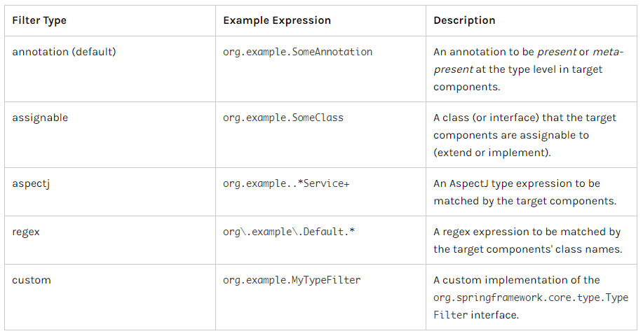
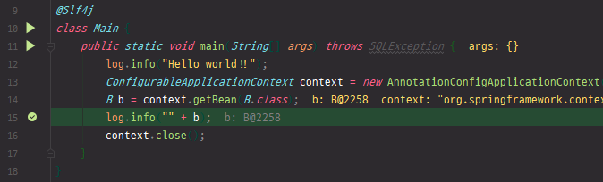
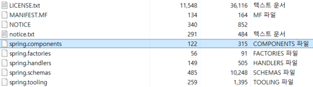
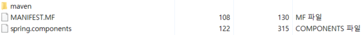

# 14. 스프링 프레임워크 코어 - The IoC Container - Classpath Scanning and Managed Components

https://docs.spring.io/spring/docs/5.2.0.M3/spring-framework-reference/core.html#beans-classpath-scanning

## Classpath Scanning and Managed Components

java는 classpath 이후로부터 클래스 파일이나 각종 리소스 파일들을 읽을 수 있다.

특정 classpath 이후로 관리를 할 컴포넌트에 대해 scanning을 한다.

컴포넌트라는 것들은 우리가 xml에 bean을 정의를 해주거나 어노테이션 @Bean을 통해 명시적으로 bean으로 등록해주는데, 그게 아닌 class level에 @Component라고 하는 어노테이션을 붙여줌으로써 이 클래스는 이제 bean으로 등록시켜야 할 것이라고 알려줄것이다.

명시적으로 패키지 명과 클래스 명으로 해서 bean으로 등록시켜주는 것이 아닌 특정 classpath 이하에 있는 @Component 어노테이션이 붙은 클래스들은 bean으로 등록될 것이라고 자동으로 scanning을 해준다.

자동으로 scanning을 해주기 때문에 우리쪽에서는 xml 설정과 같은 것들이 많이 줄어든다는 장점이 있다.


### `@Component` and Further Stereotype Annotations

구글에 java api component 검색

[Component (Spring Framework 5.2.4.RELEASE API)](https://docs.spring.io/spring-framework/docs/current/javadoc-api/org/springframework/stereotype/Component.html)

Annotation Type Component


component라고 하는 것은 class에 annotated 된다. 주석된다.

자동적으로 detection 된다.

classpath scanning

자동적으로 detection 되는 것들은 @Component 어노테이션들이다.

@Component 어노테이션에서 marker interface라고 해서 이 어노테이션들이 붙은 컴포넌트들은 이런 역할을 한다고 해서 조금 더 특징적인 것을 알려주는 것들이 있다.

[`Repository`](https://docs.spring.io/spring-framework/docs/current/javadoc-api/org/springframework/stereotype/Repository.html), [`Service`](https://docs.spring.io/spring-framework/docs/current/javadoc-api/org/springframework/stereotype/Service.html), [`Controller`](https://docs.spring.io/spring-framework/docs/current/javadoc-api/org/springframework/stereotype/Controller.html) 등을 알 수 있다.


Repository 는 자동으로 등록될 컴포넌트인데 특징으로는 Dao처럼 데이터베이스 access 할 때 필요한 bean이라면 Repository 를 사용한다.

Service도 컴포넌트인데 데이터베이스 access 하는 것이 아닌 business logic 같은 것을 할 때, service layer를 담당할 bean이라고 할 때에는 @Service 어노테이션을 붙이지만 실제로는 컴포넌트로 등록이 된다.

컴포넌트는 다시 bean으로 등록이 된다.


`@Component`, `@Service`, `@Controller`, `@Repository`


@Controller 같은 경우에는 Spring MVC에서 배운다.


### Automatically Detecting Classes and Registering Bean Definitions

자동적으로 찾는 것에 대해서 절차가 나와있다.

```java
@Service
public class SimpleMovieLister {

    private MovieFinder movieFinder;

    @Autowired
    public SimpleMovieLister(MovieFinder movieFinder) {
        this.movieFinder = movieFinder;
    }
}
```


```java
@Repository
public class JpaMovieFinder implements MovieFinder {
    // implementation elided for clarity
}
```

class level에서 @Service나 @Repository라는 컴포넌트를 붙이고 기존과 같이 bean으로 등록할 때 @Autowired 같은 것들을 사용할 수 있다.


```java
@Configuration
@ComponentScan(basePackages = "org.example")
public class AppConfig  {
    ...
}
```

추가로 @ComponentScan 이라는 어노테이션을 붙여줘야 한다.


여기서 어노테이션들은 기존의 bean 설정중에 `<context:annotation-config/>` 라고 하는 설정을 통해서 해당 클래스에 있는 어노테이션을 인식할 수 있다.


AppConfig.java

```java
package kr.co.hello.cli;

import org.springframework.context.annotation.ComponentScan;
import org.springframework.context.annotation.Configuration;

@Configuration
@ComponentScan(basePackages = "kr.co.hello.cli")
public class AppConfig {
}
```

기존에 만들었던 AppConfig에 @ComponentScan 부분을 추가

kr.co.hello.cli 라고 하는 패키지 명을 basePackages로 값을 넣는다.

cli 패키지 하위로 어노테이션 @Component, @Configuration 같은 것들이 붙은 annotation-config 들을 가지고 spring 설정을 사용한다.

@Configuration 라는 어노테이션도 실제로는 @Component라는 어노테이션을 붙여놓고 있다. 그러므로 Component Scan 할 대상이 된다.

기존에 B 타입의 클래스를 bean으로 등록했던 설정 정보들을 지운다.


dao.xml

```xml
...
    <bean class="kr.co.hello.cli.AppConfig" />
...
```

B와 A는 기존에 bean 설정으로 추가했던 것에 대해서 제거를 한다.

@ComponentScan 어노테이션이 붙은 AppConfig는 처음에는 Component Scan을 하기 전에 @ComponentScan 이라고 붙은 클래스는 bean으로 등록되고, bean으로 등록된 것 중에 @ComponentScan 이라는 어노테이션이 있구나, 그 다음부터는 basePackages 이하로 컴포넌트를 스캔해봐야겠다고 spring이 알고 있어야 하기 때문에 최소한 AppConfig는 bean으로 xml 설정에 추가해줘야 한다.


A.java

```java
package kr.co.hello.cli;

import lombok.extern.slf4j.Slf4j;
import org.springframework.beans.factory.annotation.Autowired;
import org.springframework.beans.factory.annotation.Value;
import org.springframework.context.ApplicationContext;
import org.springframework.stereotype.Component;

import javax.annotation.PostConstruct;
import javax.annotation.PreDestroy;
import javax.annotation.Resource;

@Slf4j
@Component
public class A  {
    @Resource private B b;
    @Autowired private ApplicationContext context;
    @Value("#{systemProperties['hello']}") String property;

    @PostConstruct
    void init() {
        log.error("A post construct");
    }

    @PreDestroy
    void destroy() {
        log.error("A pre destroy");
    }
}
```

Scanning 할 대상으로 보여야하기 때문에 @Component 라는 어노테이션을 추가해준다.

그러면 이제 Component Scan 할 때 bean들로 등록된다.

@Resource 의 이름 부분 제거


B.java

```java
package kr.co.hello.cli;

import org.springframework.stereotype.Component;

@Component
public class B {
}
```


자동으로 bean으로 등록되는지 확인

A.java에서 @PostConstruct 가 만들어질 때 breakpoint 걸기

디버깅 모드로 확인


실행해보기

```
INFO  kr.co.hello.cli.Main - Hello world!!
ERROR kr.co.hello.cli.A - A post construct
ERROR kr.co.hello.cli.A - A pre destroy
```


Component Scan을 통해서 bean으로 등록되는 것들을 확인할 수 있다.


```xml
<?xml version="1.0" encoding="UTF-8"?>
<beans xmlns="http://www.springframework.org/schema/beans"
    xmlns:xsi="http://www.w3.org/2001/XMLSchema-instance"
    xmlns:context="http://www.springframework.org/schema/context"
    xsi:schemaLocation="http://www.springframework.org/schema/beans
        https://www.springframework.org/schema/beans/spring-beans.xsd
        http://www.springframework.org/schema/context
        https://www.springframework.org/schema/context/spring-context.xsd">

    <context:component-scan base-package="org.example"/>

</beans>
```

@ComponentScan 어노테이션이 아닌 xml로 하고싶은 경우 

context:component-scan 이후 base-package를 동일하게 해주면 된다.


AppConfig.java

```java
package kr.co.hello.cli;

import org.springframework.context.annotation.ComponentScan;
import org.springframework.context.annotation.Configuration;

@Configuration
//@ComponentScan(basePackages = "kr.co.hello.cli")
public class AppConfig {
}
```

@ComponentScan 주석처리


dao.xml

```xml
    <context:annotation-config/>

    <context:component-scan base-package="kr.co.hello.cli"/>
```


실행하면 동일하게 bean이 만들어지고 Lifecycle이 동작하는 것을 확인할 수 있다.


xml을 사용하지 않고 어노테이션으로도 동작이 가능하다.

다만 dao, connection, connectionFactory 같은 것들에 대해서는 따로 정의를 해줘야한다.


bean을 사용하지 않고 어떻게 어노테이션만으로 spring을 올릴 수 있나?


Main.java 에 ClassPathXmlApplicationContext 라는 것이 있는데, 이것의 API 살펴보기

구글에 ClassPathXmlApplicationContext 검색

[ClassPathXmlApplicationContext (Spring Framework 5.2.4 ...](https://docs.spring.io/spring-framework/docs/current/javadoc-api/org/springframework/context/support/ClassPathXmlApplicationContext.html)

상단의 All Implemented Interfaces 중에 [ApplicationContext](https://docs.spring.io/spring-framework/docs/current/javadoc-api/org/springframework/context/ApplicationContext.html)가 있다.

ApplicationContext를 구현한 것들 중에 [AnnotationConfigApplicationContext](https://docs.spring.io/spring-framework/docs/current/javadoc-api/org/springframework/context/annotation/AnnotationConfigApplicationContext.html)라는 클래스가 있다.

AnnotationConfigApplicationContext

AnnotationConfig 기반의 ApplicationContext를 사용하면 기존 xml 기반 설정을 쓰지 않고 어노테이션만으로도 spring container를 동작시킬 수 있다.

API를 보면 constructor가 class를 넣을 수 있고, string으로 basePackages를 넣을 수 있다.


Main.java

```java
package kr.co.hello.cli;
import lombok.extern.slf4j.Slf4j;
import org.springframework.context.ConfigurableApplicationContext;
import org.springframework.context.annotation.AnnotationConfigApplicationContext;
import org.springframework.context.support.ClassPathXmlApplicationContext;

import java.sql.*;

@Slf4j
class Main {
	public static void main(String[] args) throws SQLException {
		log.info("Hello world!!");
		ConfigurableApplicationContext context = new AnnotationConfigApplicationContext("kr.co.hello.cli");
		context.close();
	}
}
```

AnnotationConfigApplicationContext 이용

"kr.co.hello.cli"

dao.xml 파일은 읽히지 않고 어노테이션으로만 동작


xml 없이 어노테이션만으로도 spring container를 사용할 수 있는 환경이 되었다.


### Using Filters to Customize Scanning

Component Scan을 할 때 filter를 둘 수 있다. filter는 두 가지가 있다.

포함시킬 `includeFilters`

제외시킬 `excludeFilters`


* Filter Types




annotation (default)

assignable : 특정 class를 명시해준다.

aspectj

regex : 정규 표현식을 이용한 필터

custom


```java
@Configuration
@ComponentScan(basePackages = "org.example",
        includeFilters = @Filter(type = FilterType.REGEX, pattern = ".*Stub.*Repository"),
        excludeFilters = @Filter(Repository.class))
public class AppConfig {
    ...
}
```


A 컴포넌트와 B 컴포넌트가 있는데, Scanning 할 대상으로 B를 제외시키기

Main.java

```java
package kr.co.hello.cli;
import lombok.extern.slf4j.Slf4j;
import org.springframework.context.ConfigurableApplicationContext;
import org.springframework.context.annotation.AnnotationConfigApplicationContext;
import org.springframework.context.support.ClassPathXmlApplicationContext;

import java.sql.*;

@Slf4j
class Main {
	public static void main(String[] args) throws SQLException {
		log.info("Hello world!!");
		ConfigurableApplicationContext context = new AnnotationConfigApplicationContext("kr.co.hello.cli");
		B b = context.getBean(B.class);
		log.info("" + b);
		context.close();
	}
}
```

B가 있는지 확인




B에 필터를 걸기

AppConfig.java 삭제


Main.java

```java
package kr.co.hello.cli;
import lombok.extern.slf4j.Slf4j;
import org.springframework.context.ConfigurableApplicationContext;
import org.springframework.context.annotation.AnnotationConfigApplicationContext;
import org.springframework.context.annotation.ComponentScan;
import org.springframework.context.annotation.ComponentScan.Filter;
import org.springframework.context.annotation.Configuration;
import org.springframework.context.annotation.FilterType;
import org.springframework.context.support.ClassPathXmlApplicationContext;

import java.sql.*;

@Slf4j
@Configuration
@ComponentScan(basePackageClasses = Main.class, excludeFilters = @Filter(type = FilterType.ASSIGNABLE_TYPE, classes = B.class))
class Main {
	public static void main(String[] args) throws SQLException {
		log.info("Hello world!!");
		ConfigurableApplicationContext context = new AnnotationConfigApplicationContext(Main.class);
		B b = context.getBean(B.class);
		log.info("" + b);
		context.close();
	}
}
```

@ComponentScan, @Configuration 추가

basePackages 부분을 문자열로 넣을 수도 있지만, Main.class 같은 식으로 설정값을 넣을 수도 있다.

실제로 String 보다 type 값으로 넣어주는 것이 코딩할 때 실수를 줄여준다.

basePackageClasses로 넣어줄 수 있다.

Main 클래스가 있는 패키지 하위로 컴포넌트 스캔이 진행된다.

excludeFilters를 하는 방식은 @Filter 하고 특정 class name을 넣으면 된다.

@ComponentScan.Filter 에서 Alt + Enter => add import for...

A는 component scan을 할 것이고 B는 컴포넌트 스캔을 하지 않을 것이다.


앞에서는 info 할 때 b에서 값을 받을 수 있었는데, 지금은 Filter 해서 exclude 되었기 때문에 에러가 난다.

```
Exception in thread "main" org.springframework.beans.factory.BeanCreationException: Error creating bean with name 'a': Injection of resource dependencies failed; nested exception is org.springframework.beans.factory.NoSuchBeanDefinitionException: No qualifying bean of type 'kr.co.hello.cli.B' available: expected at least 1 bean which qualifies as autowire candidate. Dependency annotations: {@javax.annotation.Resource(shareable=true, lookup=, name=, description=, authenticationType=CONTAINER, type=class java.lang.Object, mappedName=)}
```

a라는 bean을 만들 때 B라고 하는 bean이 없어서 에러가 난다.


A.java

```java
...
//    @Resource private B b;
    @Autowired private ApplicationContext context;
    @Value("#{systemProperties['hello']}") String property;
...
```

container가 정상적으로 동작하는지 확인하기 위해 주석처리


Main.java의 context.getBean 부분에 breakpoint

디버깅

```
Connected to the target VM, address: '127.0.0.1:60566', transport: 'socket'
INFO  kr.co.hello.cli.Main - Hello world!!
ERROR kr.co.hello.cli.A - A post construct
```

container가 잘 동작하는 것을 확인

F8로 한 step 옮기기

```
Exception in thread "main" org.springframework.beans.factory.NoSuchBeanDefinitionException: No qualifying bean of type 'kr.co.hello.cli.B' available
```

bean이 없기 때문에 에러가 난다.

Filter가 되는 것을 확인하였다.


@Filter 쓰는 방법은 includeFilters 와 excludeFilters 는 동일하다.


Main.java

```java
@ComponentScan(basePackageClasses = Main.class, excludeFilters = @Filter(type = FilterType.REGEX, pattern = "kr.co.hello.cli.B"))
```

또 다른 filter type으로 REGEX가 있다. pattern에 원하는 문자열을 넣어준다.


디버깅으로 동작 확인, F8로 한 step 옮겨서 에러가 나는 것을 확인


Main.java

```java
@ComponentScan(basePackageClasses = Main.class)
```

filter를 제거하고 디버깅, F8로 한 step 옮기면 프로그래밍 종료되지 않고 잘 동작한다.


A.java

```java
package kr.co.hello.cli;

import lombok.extern.slf4j.Slf4j;
import org.springframework.beans.factory.annotation.Autowired;
import org.springframework.beans.factory.annotation.Value;
import org.springframework.context.ApplicationContext;
import org.springframework.stereotype.Component;

import javax.annotation.PostConstruct;
import javax.annotation.PreDestroy;
import javax.annotation.Resource;

@Slf4j
@Component
public class A  {
    @Autowired private B b;
    @Autowired private ApplicationContext context;
    @Value("#{systemProperties['hello']}") String property;

    @PostConstruct
    void init() {
        log.error("A post construct");
    }

    @PreDestroy
    void destroy() {
        log.error("A pre destroy");
    }
}
```

`@Autowired private B b;` 로 되돌려놓기


```xml
<beans>
    <context:component-scan base-package="org.example">
        <context:include-filter type="regex"
                expression=".*Stub.*Repository"/>
        <context:exclude-filter type="annotation"
                expression="org.springframework.stereotype.Repository"/>
    </context:component-scan>
</beans>
```

xml로도 component scan 할 때 include-filter, exclude-filter를 넣을 수 있다.


### Defining Bean Metadata within Components

bean을 정의할 때 metadata를 포함해서 할 수 있다.

```java
@Component
public class FactoryMethodComponent {

    @Bean
    @Qualifier("public")
    public TestBean publicInstance() {
        return new TestBean("publicInstance");
    }

    public void doWork() {
        // Component method implementation omitted
    }
}
```


```java
@Component
public class FactoryMethodComponent {

    @Bean @Scope("prototype")
    public TestBean prototypeInstance(InjectionPoint injectionPoint) {
        return new TestBean("prototypeInstance for " + injectionPoint.getMember());
    }
}
```

@Bean @Scope에 대해서도 어노테이션을 추가해서 singleton, prototype 등을 추가할 수 있다.


### Naming Autodetected Components

```java
@Service("myMovieLister")
public class SimpleMovieLister {
    // ...
}
```

component 뒤에 기본적으로 값을 넣어주면, bean이 만들어질 id, name을 xml로 설정했던 것처럼 name 값을 추가할 수 있다.

뒤에 Resource 같은 것들로 name 속성으로 가져올 수 있게된다.

기본적으로 SimpleMovieLister 라고 하면 camelcase로 맨 첫번째는 소문자로 바뀌고 그 다음에는 camelcase 그대로 bean name으로 등록된다.


### Generating an Index of Candidate Components

`@ComponentScan` 이라는 것은 실제로는 Generic 이라는 Java의 기술을 사용한다.

Generic은 classpath에 있는 모든 class들을 java가 jvm에서 가져와서 해당 어노테이션이 있는지 하나하나 살펴보고 있으면 그 다음에 원하는 동작을 하게 된다.

그런 과정을 하면서 문제점은 프로젝트 하나를 만들 때 java 파일이 1000 ~ 2000개가 넘어갈 수도 있다. 그런데 그 중에서 컴포넌트들이 2 ~ 3개밖에 없는 경우에는 불필요하게 1000 ~ 2000개를 scan하게 된다.

그러므로 spring에서는 @ComponentScan을 할 때 조금 더 속도를 빠르게 하기 위해서 indexer를 만들었다.

```xml
<dependency>
    <groupId>org.springframework</groupId>
    <artifactId>spring-context-indexer</artifactId>
    <version>5.2.4.RELEASE</version>
    <optional>true</optional>
</dependency>
```

indexer를 사용하는 방법은 dependency에 spring-context-indexer 의존성을 추가해주면 된다.

pom.xml에 의존성 추가

version을 spring-context의 버전과 같게 설정한다.

pom.xml

```xml
...
<groupId>kr.co.hello</groupId>
<artifactId>springbasic</artifactId>
<version>1.0-SNAPSHOT</version>
<packaging>jar</packaging>
...
<transformer
             implementation="org.apache.maven.plugins.shade.resource.ManifestResourceTransformer">
    <mainClass>kr.co.hello.cli.Main</mainClass>
</transformer>
...
```

packaging 을 jar로 변경

shade 부분에서 mainClass 를 kr.co.hello.cli.Main로 변경한다.


`META-INF/spring.components`

jar나 war로 만들 때 META-INF 폴더 하위에 spring.components 라는 폴더가 만들어지고, 이 파일에는 ComponentScan 할 class 정보들이 들어간다.


maven build를 한다.

clean(target 폴더가 없어지는 것을 확인) => package(target 폴더 생성, BUILD SUCCESS 메시지 확인)


target 폴더 마우스 오른쪽 클릭 => Show in Explorer

target 폴더 안에 spring에 관련되어있는 jar 파일이 만들어 진것을 확인할 수 있다.

springbasic.jar 마우스 오른쪽 클릭 => 압축 파일 미리 보기 => META-INF



spring.components 파일 존재 확인

shade 플러그인 때문에 다른 정보들이 추가되어서 파일이 많다.


original-springbasic.jar 마우스 오른쪽 클릭 => 압축 파일 미리 보기 => META-INF




압축 풀기 이후 spring.components 파일 열기

```
kr.co.hello.cli.A=org.springframework.stereotype.Component
kr.co.hello.cli.B=org.springframework.stereotype.Component
kr.co.hello.cli.Main=org.springframework.stereotype.Component
kr.co.hello.web.SimpleFilter=javax.servlet.annotation.WebFilter
kr.co.hello.web.SimpleServlet=javax.servlet.annotation.WebServlet
```

이렇게 필요한 컴포넌트들만, Scanning 할 컴포넌트들만 미리 spring.components라는 파일에 저장하기 때문에 나중에는 이 파일만을 읽어서 불러들이므로 시간을 절약할 수 있다.

spring loading 할 때의 최적화에 대한 spring에서 제공하는 기능이다.

