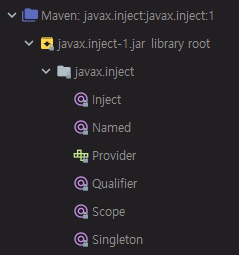
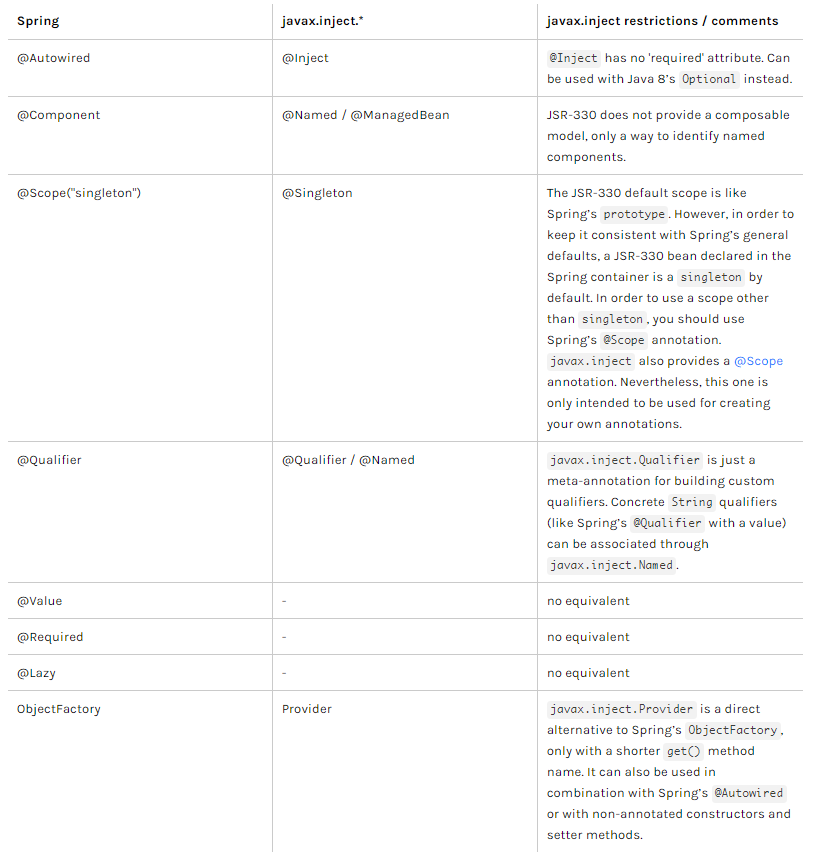

# 15. 스프링 프레임워크 코어 - The IoC Container - Using JSR 330 Standard Annotations

https://docs.spring.io/spring/docs/5.2.0.M3/spring-framework-reference/core.html#beans-standard-annotations

## Using JSR 330 Standard Annotations

JSR 330 표준 어노테이션

Spring에서는 EE 표준을 일부분 따르고 있다.

EE 표준들 중에 JSR 330이라는 것이 있다. 

이것은 javax.inject라는 groupId를 가지고 있는 특별한 스펙이다. 스펙이므로 인터페이스만 있다.

dependency 추가

```xml
<dependency>
    <groupId>javax.inject</groupId>
    <artifactId>javax.inject</artifactId>
    <version>1</version>
</dependency>
```

javax.servlet 처럼 javax.inject도 스펙이다.

maven에서 dependency를 받아왔는지 확인


External Libraries 중에 javax.inject 부분을 보면 6개 정도의 어노테이션들이 있다.



이것들은 spring에서 기존에 사용하고 있는 것들을 Java 표준 기술로 인터페이스만 추가한 것이다.


### Dependency Injection with `@Inject` and `@Named`

```java
import javax.inject.Inject;

public class SimpleMovieLister {

    private MovieFinder movieFinder;

    @Inject
    public void setMovieFinder(MovieFinder movieFinder) {
        this.movieFinder = movieFinder;
    }

    public void listMovies() {
        this.movieFinder.findMovies(...);
        ...
    }
}
```

기존에 @Autowired 했던 것들을 @Inject 어노테이션을 통해서 대체를 할 수 있다.


A.java

```java
package kr.co.hello.cli;

import lombok.extern.slf4j.Slf4j;
import org.springframework.beans.factory.annotation.Autowired;
import org.springframework.beans.factory.annotation.Value;
import org.springframework.context.ApplicationContext;
import org.springframework.stereotype.Component;

import javax.annotation.PostConstruct;
import javax.annotation.PreDestroy;
import javax.annotation.Resource;
import javax.inject.Inject;

@Slf4j
@Component
public class A  {
    @Inject private B b;
    @Inject private ApplicationContext context;
    @Value("#{systemProperties['hello']}") String property;

    @PostConstruct
    void init() {
        log.error("A post construct");
    }

    @PreDestroy
    void destroy() {
        log.error("A pre destroy");
    }
}
```

@Autowired 를 @Inject로 변경

main 메서드 실행

```
INFO  kr.co.hello.cli.Main - Hello world!!
ERROR kr.co.hello.cli.A - A post construct
INFO  kr.co.hello.cli.Main - kr.co.hello.cli.B@75db5df9
ERROR kr.co.hello.cli.A - A pre destroy
```

특별히 에러 없이 inject가 된 것을 확인할 수 있다.


이것도 field, setter, constructor level에서 사용 가능하다.


### `@Named` and `@ManagedBean`: Standard Equivalents to the `@Component` Annotation

@Named 라는 부분이 있다.

```java
import javax.inject.Inject;
import javax.inject.Named;

@Named("movieListener")  // @ManagedBean("movieListener") could be used as well
public class SimpleMovieLister {

    private MovieFinder movieFinder;

    @Inject
    public void setMovieFinder(MovieFinder movieFinder) {
        this.movieFinder = movieFinder;
    }

    // ...
}
```

@Named는 @Component 라는 것을 대신하는 것이다.


A.java

```java
package kr.co.hello.cli;

import lombok.extern.slf4j.Slf4j;
import org.springframework.beans.factory.annotation.Autowired;
import org.springframework.beans.factory.annotation.Value;
import org.springframework.context.ApplicationContext;
import org.springframework.stereotype.Component;

import javax.annotation.PostConstruct;
import javax.annotation.PreDestroy;
import javax.annotation.Resource;
import javax.inject.Inject;
import javax.inject.Named;

@Slf4j
@Named("a")
public class A  {
    @Inject private B b;
    @Inject private ApplicationContext context;
    @Value("#{systemProperties['hello']}") String property;

    @PostConstruct
    void init() {
        log.error("A post construct");
    }

    @PreDestroy
    void destroy() {
        log.error("A pre destroy");
    }
}
```

@Component 대신 @Named("a") 를 붙인다.


B.java

```java
package kr.co.hello.cli;

import org.springframework.stereotype.Component;

import javax.inject.Named;

@Named("b")
public class B {
}
```


동작시키기

ComponentScan 대신 JSR-330 스펙에 맞춰도 동일하게 동작하는 것을 확인할 수 있다.


### Limitations of JSR-330 Standard Annotations

JSR-330의 제한

Spring에서 제공하는 어노테이션과 javax.inject 패키지 하위에 있는(JSR-330) 어노테이션을 비교


* Spring component model elements versus JSR-330 variants




Spring을 사용할 때 Java EE 표준에 맞춰서 개발한다는 느낌보다는 Spring 에서 제공하는 기술들을 온전히 쓰는 것을 선호

JSR-330을 지원한다는 정도만 이해. JSR-330 표준을 따른다.

