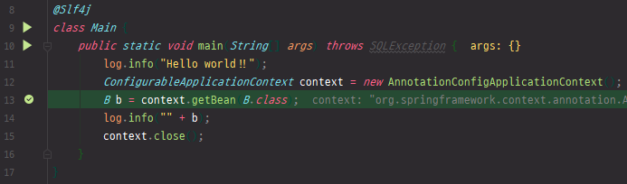

# 16. 스프링 프레임워크 코어 - The IoC Container - Java-based Container Configuration

https://docs.spring.io/spring/docs/5.2.0.M3/spring-framework-reference/core.html#beans-java

## Java-based Container Configuration

* Basic Concepts: `@Bean` and `@Configuration`
* Instantiating the Spring Container by Using `AnnotationConfigApplicationContext`
* Using the `@Bean` Annotation
* Using the `@Configuration` annotation
* Composing Java-based Configurations
* Bean Definition Profiles
* `PropertySource` Abstraction
* Using `@PropertySource`
* Placeholder Resolution in Statements


### Basic Concepts: `@Bean` and `@Configuration`

기존에 우리가 xml 설정 대신 @Configuration 어노테이션을 class level에 붙이고, 함수 level에 @Bean 어노테이션을 붙여서 bean 설정을 만들었었다.

그에 대한 설명

```java
@Configuration
public class AppConfig {

    @Bean
    public MyService myService() {
        return new MyServiceImpl();
    }
}
```


### Instantiating the Spring Container by Using `AnnotationConfigApplicationContext`

우리는 AnnotationConfigApplicationContext을 Main.java 에서 사용하고 있다.

AnnotationConfigApplicationContext 사용법 설명


#### Simple Construction

```java
public static void main(String[] args) {
    ApplicationContext ctx = new AnnotationConfigApplicationContext(AppConfig.class);
    MyService myService = ctx.getBean(MyService.class);
    myService.doStuff();
}
```


#### Building the Container Programmatically by Using `register(Class…)`

```java
public static void main(String[] args) {
    AnnotationConfigApplicationContext ctx = new AnnotationConfigApplicationContext();
    ctx.register(AppConfig.class, OtherConfig.class);
    ctx.register(AdditionalConfig.class);
    ctx.refresh();
    MyService myService = ctx.getBean(MyService.class);
    myService.doStuff();
}
```

단순하게 AnnotationConfigApplicationContext를 생성자에 아무런 값도 넣어주지 않고, 그 이외에 AppConfig 처럼 Configuration이 들어가있는 클래스들을 넣어주고 register 한 다음 refresh 해주면 그 때 bean들이 만들어지는 것을 할 수 있다.


Main.java

```java
package kr.co.hello.cli;
import lombok.extern.slf4j.Slf4j;
import org.springframework.context.ConfigurableApplicationContext;
import org.springframework.context.annotation.AnnotationConfigApplicationContext;

import java.sql.*;

@Slf4j
class Main {
	public static void main(String[] args) throws SQLException {
		log.info("Hello world!!");
		ConfigurableApplicationContext context = new AnnotationConfigApplicationContext();
		B b = context.getBean(B.class);
		log.info("" + b);
		context.close();
	}
}
```

Main.class 부분 지우기

AnnotationConfigApplicationContext 자체만 만들어진다.

getBean 부분에 breakpoint


cli 디렉터리에 AppConfig 클래스 추가

AppConfig.java

```java
package kr.co.hello.cli;

import org.springframework.context.annotation.ComponentScan;
import org.springframework.context.annotation.Configuration;

@Configuration
@ComponentScan(basePackageClasses = AppConfig.class)
public class AppConfig {
}
```

@Configuration와 @ComponentScan 추가

basePackageClasses를 AppConfig로 설정. 어차피 basePackage는 kr.co.hello.cli 이다.


디버깅



F8로 다음 step으로 넘어가면 에러가 발생한다.

B라고 하는 type의 bean이 들어있지 않기 때문이다.

AppConfig에 bean 설정을 해주면 된다.


AppConfig.java

```java
package kr.co.hello.cli;

import org.springframework.context.annotation.Bean;
import org.springframework.context.annotation.ComponentScan;
import org.springframework.context.annotation.Configuration;

@Configuration
@ComponentScan(basePackageClasses = AppConfig.class)
public class AppConfig {
    @Bean("b")
    public B b() {
        return new B();
    }
}
```


B.java

```java
package kr.co.hello.cli;

public class B {
}
```

불필요한 JSR 330 어노테이션들 삭제


A.java

```java
package kr.co.hello.cli;

import lombok.extern.slf4j.Slf4j;
import org.springframework.beans.factory.annotation.Autowired;
import org.springframework.beans.factory.annotation.Value;
import org.springframework.context.ApplicationContext;

import javax.annotation.PostConstruct;
import javax.annotation.PreDestroy;

@Slf4j
public class A  {
    @Autowired private B b;
    @Autowired private ApplicationContext context;
    @Value("#{systemProperties['hello']}") String property;

    @PostConstruct
    void init() {
        log.error("A post construct");
    }

    @PreDestroy
    void destroy() {
        log.error("A pre destroy");
    }
}
```


A와 B는 @ComponentScan이 없기 때문에 AppConfig를 통해서 설정을 해줘야한다.


Main.java

```java
package kr.co.hello.cli;
import lombok.extern.slf4j.Slf4j;
import org.springframework.context.annotation.AnnotationConfigApplicationContext;

import java.sql.*;

@Slf4j
class Main {
	public static void main(String[] args) throws SQLException {
		log.info("Hello world!!");
		AnnotationConfigApplicationContext context = new AnnotationConfigApplicationContext();
		context.register(AppConfig.class);
		context.refresh();
		B b = context.getBean(B.class);
		log.info("" + b);
		context.close();
	}
}
```

ConfigurableApplicationContext 타입을 AnnotationConfigApplicationContext 으로 변경

register를 한다. bean config 설정이 들어가있는 AppConfig 클래스를 등록한다.

context를 refresh 해준다.


```
INFO  kr.co.hello.cli.Main - Hello world!!
INFO  kr.co.hello.cli.Main - kr.co.hello.cli.B@4d5d943d
```

동작시켜보면 B가 추가된 것을 확인할 수 있다.


#### Enabling Component Scanning with `scan(String…)`

Component Scan도 마찬가지로 추가해주면 된다.

```java
@Configuration
@ComponentScan(basePackages = "com.acme") 
public class AppConfig  {
    ...
}
```


```java
public static void main(String[] args) {
    AnnotationConfigApplicationContext ctx = new AnnotationConfigApplicationContext();
    ctx.scan("com.acme");
    ctx.refresh();
    MyService myService = ctx.getBean(MyService.class);
}
```

어노테이션이 아닌 code level에서도 가능


Main.java

```java
package kr.co.hello.cli;
import lombok.extern.slf4j.Slf4j;
import org.springframework.context.annotation.AnnotationConfigApplicationContext;

import java.sql.*;

@Slf4j
class Main {
	public static void main(String[] args) throws SQLException {
		log.info("Hello world!!");
		AnnotationConfigApplicationContext context = new AnnotationConfigApplicationContext();
		context.scan("kr.co.hello.cli");
//		context.register(AppConfig.class);
		context.refresh();
		B b = context.getBean(B.class);
		log.info("" + b);
		context.close();
	}
}
```

`context.scan("kr.co.hello.cli");` 와 같은 식으로 ComponentScan이 들어가면 AppConfig에 Configuration이 걸리고 그렇게 해서 bean이 만들어진다.

중복 설정이 들어간 것이기는 한데 실행해보면 spring container가 잘 동작하는 것을 확인할 수 있다.


### Using the `@Bean` Annotation

`@Bean` Annotation을 사용할 때에는 특징이 있다.


#### Declaring a Bean

```java
@Configuration
public class AppConfig {

    @Bean
    public TransferServiceImpl transferService() {
        return new TransferServiceImpl();
    }
}
```

TransferServiceImpl이 return type이고, transferService 라고 함수명이 있다.


```xml
<beans>
    <bean id="transferService" class="com.acme.TransferServiceImpl"/>
</beans>
```

기존의 xml 설정과 비교해보면 함수명이 id 값으로 들어간다.

그리고 return type이 class로 들어간다.


```java
@Configuration
public class AppConfig {

    @Bean
    public TransferService transferService() {
        return new TransferServiceImpl();
    }
}
```

spring에서는 보통 구현 클래스보다 인터페이스를 이용해서 사용하는 편이기 때문에 여기에서는 구현 클래스(TransferServiceImpl)로 return을 하지만 실제로 타입은 인터페이스(TransferService)로 하면 인터페이스로 타입이 등록되기 때문에 조금더 유연한 설계가 가능하다.


#### Bean Dependencies

```java
@Configuration
public class AppConfig {

    @Bean
    public TransferService transferService(AccountRepository accountRepository) {
        return new TransferServiceImpl(accountRepository);
    }
}
```

@Bean 어노테이션에 있는 함수에서는 Autowired를 굳이 @Autowired라는 어노테이션을 붙이지 않고 argument로 넣어주면 필요한 의존성이 자동으로 주입된다.


A는 B에 의존이 있다. A의 필드에 `@Autowired private B b;` 가 있다.

의존성을 직접 명시

AppConfig.java

```java
package kr.co.hello.cli;

import org.springframework.context.annotation.Bean;
import org.springframework.context.annotation.ComponentScan;
import org.springframework.context.annotation.Configuration;

@Configuration
@ComponentScan(basePackageClasses = AppConfig.class)
public class AppConfig {
    @Bean("b")
    public B b() {
        return new B();
    }

    @Bean
    public A a(B b) {
        return new A(b);
    }
}
```

B라는 타입의 bean이 만들어지고, 만들어진 bean이 b에 주입이 된다.

주입받은 b를 A의 생성자로 넣어주면 의존성 관계가 맺어진다.


A.java

```java
package kr.co.hello.cli;

import lombok.extern.slf4j.Slf4j;

import javax.annotation.PostConstruct;
import javax.annotation.PreDestroy;

@Slf4j
public class A  {
    private B b;

    public A(B b) {
        this.b = b;
    }

    @PostConstruct
    void init() {
        log.error("A post construct : " + b);
    }

    @PreDestroy
    void destroy() {
        log.error("A pre destroy");
    }
}
```

A 에서는 생성자를 통한 설정이 없다.

불필요한 ApplicationContext에 대한 설정, Value에 대한 설정은 지운다.

@Autowired 부분 제거

type B를 받는 생성자 추가

주입할 때 실제로 b가 null인지 아닌지 확인


main 메서드 실행

```
INFO  kr.co.hello.cli.Main - Hello world!!
ERROR kr.co.hello.cli.A - A post construct : kr.co.hello.cli.B@59662a0b
INFO  kr.co.hello.cli.Main - kr.co.hello.cli.B@59662a0b
ERROR kr.co.hello.cli.A - A pre destroy
```

init 할 때 B라는 객체가 만들어진 것을 확인할 수 있다.

AppConfig 할 때 B라는 타입을 자동으로 주입하는 것을 확인할 수 있다.


#### Receiving Lifecycle Callbacks

```java
public class BeanOne {

    public void init() {
        // initialization logic
    }
}

public class BeanTwo {

    public void cleanup() {
        // destruction logic
    }
}

@Configuration
public class AppConfig {

    @Bean(initMethod = "init")
    public BeanOne beanOne() {
        return new BeanOne();
    }

    @Bean(destroyMethod = "cleanup")
    public BeanTwo beanTwo() {
        return new BeanTwo();
    }
}
```

@Bean 이라는 어노테이션에는 initMethod, destroyMethod 를 넣어줄 수 있다.


A.java

```java
package kr.co.hello.cli;

import lombok.extern.slf4j.Slf4j;

@Slf4j
public class A  {
    private B b;

    public A(B b) {
        this.b = b;
    }
    
    void init() {
        log.error("A post construct : " + b);
    }
    
    void destroy() {
        log.error("A pre destroy");
    }
}
```

initMethod와 destroyMethod가 필요했던 것은 A 에서 @PostConstruct와 @PreDestroy 이다.


AppConfig.java

```java
package kr.co.hello.cli;

import org.springframework.context.annotation.Bean;
import org.springframework.context.annotation.ComponentScan;
import org.springframework.context.annotation.Configuration;

@Configuration
@ComponentScan(basePackageClasses = AppConfig.class)
public class AppConfig {
    @Bean("b")
    public B b() {
        return new B();
    }

    @Bean(initMethod = "init", destroyMethod = "destroy")
    public A a(B b) {
        return new A(b);
    }
}
```

A 클래스 안에서 어노테이션을 붙여서 사용하는 것이 아닌 AppConfig의 bean 설정에 initMethod와 destroyMethod를 추가


main 메서드 실행

```
INFO  kr.co.hello.cli.Main - Hello world!!
ERROR kr.co.hello.cli.A - A post construct : kr.co.hello.cli.B@9597028
INFO  kr.co.hello.cli.Main - kr.co.hello.cli.B@9597028
ERROR kr.co.hello.cli.A - A pre destroy
```


@Bean 어노테이션을 이용해서 initMethod와 destroyMethod로 정의를 해주고, bean 설정을 해준다.

destroy 할 메서드 위에 어노테이션을 붙이면 A라는 클래스에 설정값이 들어가게 된다.

가능하면 특정 클래스에는 그 클래스에서 필요한 정보만 넣고, 설정값들은 외부에서 관리하는 것이 좋다.

A라는 클래스는 A 클래스에서 필요한 정보만 넣고 설정이 필요한 것들은 외부로 빼기

xml보다 @Configuration, @Bean 설정을 이용해서 개발에 많이 사용 => 구분이 된다.

Java class 이지만 한쪽에서는 설정에 필요한 Java class, 한쪽에서는 Business logic에 필요한 Java class로 구분해서 사용


#### Specifying Bean Scope

##### Using the `@Scope` Annotation

```java
@Configuration
public class MyConfiguration {

    @Bean
    @Scope("prototype")
    public Encryptor encryptor() {
        // ...
    }
}
```

@Scope 관련해서 어노테이션 붙이기


#### Customizing Bean Naming

```java
@Configuration
public class AppConfig {

    @Bean(name = "myThing")
    public Thing thing() {
        return new Thing();
    }
}
```

bean의 name을 name이라는 속성값에 다르게 넣을 수 있다.

기존에 메서드 명은 bean의 name, id 값으로 들어가는데 여기에서 커스터마이징이 가능하다.


#### Bean Aliasing

```java
@Configuration
public class AppConfig {

    @Bean({"dataSource", "subsystemA-dataSource", "subsystemB-dataSource"})
    public DataSource dataSource() {
        // instantiate, configure and return DataSource bean...
    }
}
```

여러개의 이름을 넣을 수 있다.

배열로 넣어서 사용 가능


#### Bean Description

```java
@Configuration
public class AppConfig {

    @Bean
    @Description("Provides a basic example of a bean")
    public Thing thing() {
        return new Thing();
    }
}
```

설명 추가 가능

사람이 보기 위해서 추가하는 영역


### Composing Java-based Configurations

Java-based Configuration을 조합하는 것

#### Using the `@Import` Annotation

```java
@Configuration
public class ConfigA {

    @Bean
    public A a() {
        return new A();
    }
}

@Configuration
@Import(ConfigA.class)
public class ConfigB {

    @Bean
    public B b() {
        return new B();
    }
}
```

ConfigA(Configuration) 클래스를 만들고, 거기에 있던 설정을 @Import로 받아올 수 있다.

ComponentScan을 한다고 하면 굳이 @Import가 필요없기는 한데, ConfigB 만 가져오고싶고 ComponentScan을 사용하지 않을 때에는 이렇게 @Import로 다른 Configuration 설정을 가져오는 경우가 있다.

테스트 코드를 만들 때 보통 @Import를 이용해서 외부 설정들을 가져오는 편이다.

테스트 코드를 만들 때 bean에 대한 설정이 필요한 경우가 있다. 그 때 복잡한 설정들이 있는데 그 중에서 테스트코드화 할 수 있는것과 없는것을 모아두고, 기존에서 가지고 올 수 있는 것은 @Import로 가져오고 나머지 것들에 대해서는 직접 설정을 해서 코드를 만든다.


```java
public static void main(String[] args) {
    ApplicationContext ctx = new AnnotationConfigApplicationContext(ConfigB.class);

    // now both beans A and B will be available...
    A a = ctx.getBean(A.class);
    B b = ctx.getBean(B.class);
}
```

ConfigB 클래스로 A 클래스를 불러오지 않았지만 @Import를 통해서 A 클래스에 있는 bean A를 가져올 수 있다.


```java
@Configuration
public class ServiceConfig {

    @Autowired
    private RepositoryConfig repositoryConfig;

    @Bean
    public TransferService transferService() {
        return new TransferServiceImpl(repositoryConfig.accountRepository());
    }
}

@Configuration
public interface RepositoryConfig {

    @Bean
    AccountRepository accountRepository();
}

@Configuration
public class DefaultRepositoryConfig implements RepositoryConfig {

    @Bean
    public AccountRepository accountRepository() {
        return new JdbcAccountRepository(...);
    }
}

@Configuration
@Import({ServiceConfig.class, DefaultRepositoryConfig.class})  // import the concrete config!
public class SystemTestConfig {

    @Bean
    public DataSource dataSource() {
        // return DataSource
    }

}

public static void main(String[] args) {
    ApplicationContext ctx = new AnnotationConfigApplicationContext(SystemTestConfig.class);
    TransferService transferService = ctx.getBean(TransferService.class);
    transferService.transfer(100.00, "A123", "C456");
}
```

@Configuration 을 여러 개 하고 @Import로 받아오고 설정들이 점점 다양해질 수 있다.


#### Conditionally Include `@Configuration` Classes or `@Bean` Methods

```java
@Override
public boolean matches(ConditionContext context, AnnotatedTypeMetadata metadata) {
    if (context.getEnvironment() != null) {
        // Read the @Profile annotation attributes
        MultiValueMap<String, Object> attrs = metadata.getAllAnnotationAttributes(Profile.class.getName());
        if (attrs != null) {
            for (Object value : attrs.get("value")) {
                if (context.getEnvironment().acceptsProfiles(((String[]) value))) {
                    return true;
                }
            }
            return false;
        }
    }
    return true;
}
```

조건절을 통해서 가져올수도 있다.


Spring-boot 라는 기술에서는 `@Conditional` 어노테이션을 통해서 많은 설정을 하고있다.


#### Combining Java and XML Configuration

Java와 xml을 같이 조합해서 설정할 수 있다.

혼용할 수 있다.

```xml
<beans>
    <!-- enable processing of annotations such as @Autowired and @Configuration -->
    <context:annotation-config/>
    <context:property-placeholder location="classpath:/com/acme/jdbc.properties"/>

    <bean class="com.acme.AppConfig"/>

    <bean class="org.springframework.jdbc.datasource.DriverManagerDataSource">
        <property name="url" value="${jdbc.url}"/>
        <property name="username" value="${jdbc.username}"/>
        <property name="password" value="${jdbc.password}"/>
    </bean>
</beans>
```

xml에서 context:property-placeholder 해서 특정 classpath의 값을 이용해서 properties 값을 가져올 수 있다.


dao.xml

```xml
...
    <context:annotation-config/>
    <context:component-scan base-package="kr.co.hello.cli"/>
    <context:property-placeholder location="classpath:/application.properties"/>

    <bean id="connectionFactory" class="kr.co.hello.cli.ConnectionFactory">
        <constructor-arg name="driverClass" value="${jdbc.driver-class}" />
        <constructor-arg name="url" value="${jdbc.url}"/>
        <constructor-arg name="user" value="${jdbc.username}" />
        <constructor-arg name="password" value="${jdbc.password}" />
    </bean>
...
```


application.properties

```
catalog.name=MovieCatalog

jdbc.driver-class=org.h2.Driver
jdbc.url=jdbc:h2:mem:test;MODE=MySQL;
jdbc.username=sa
jdbc.password=
```


보통은 이렇게 properties 파일로 설정값들을 많이 빼주고 있다. 현업에서도 사용


Main.java

```java
package kr.co.hello.cli;
import lombok.extern.slf4j.Slf4j;
import org.springframework.context.ConfigurableApplicationContext;
import org.springframework.context.annotation.AnnotationConfigApplicationContext;
import org.springframework.context.support.ClassPathXmlApplicationContext;

import java.sql.*;

@Slf4j
class Main {
	public static void main(String[] args) throws SQLException {
		log.info("Hello world!!");
		ConfigurableApplicationContext context = new ClassPathXmlApplicationContext("dao.xml");
		Dao dao = context.getBean(Dao.class);
		dao.run();
		context.close();
	}
}
```

구글에 spring applicationcontext api 검색

[ApplicationContext (Spring Framework 5.2.4.RELEASE API)](https://docs.spring.io/spring-framework/docs/current/javadoc-api/org/springframework/context/ApplicationContext.html)

applicationcontext 구현체 중에 [ClassPathXmlApplicationContext](https://docs.spring.io/spring-framework/docs/current/javadoc-api/org/springframework/context/support/ClassPathXmlApplicationContext.html)

ClassPathXmlApplicationContext

dao.xml을 읽고 작업을 할 것이다.


main 메서드 실행

```
INFO  kr.co.hello.cli.Main - Hello world!!
ERROR kr.co.hello.cli.A - A post construct : kr.co.hello.cli.B@5a59ca5e
INFO  kr.co.hello.cli.Dao - Member(id=1, username=MyName, password=1234)
ERROR kr.co.hello.cli.A - A pre destroy
```


application.properties 에서 properties 정보를 context:property-placeholder 를 통해서 읽어들이고, xml 설정에서 property 값을 치환해서 사용

