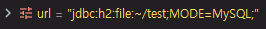
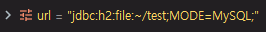

# 17. 스프링 프레임워크 코어 - The IoC Container - Environment Abstraction

https://docs.spring.io/spring/docs/5.2.0.M3/spring-framework-reference/core.html#beans-environment

## Environment Abstraction

환경에 대한 추상

[`Environment`](https://docs.spring.io/spring-framework/docs/5.2.0.M3/javadoc-api/org/springframework/core/env/Environment.html) interface는 profile과 property 처럼 시스템 환경 변수, 애플리케이션의 profile 정보를 관리할 때 주로 사용한다.


**Interface Environment**

All Superinterfaces 로는 [PropertyResolver](https://docs.spring.io/spring-framework/docs/5.2.0.M3/javadoc-api/org/springframework/core/env/PropertyResolver.html) 라는 것이 있다.

getActiveProfiles(), getDefaultProfiles() 를 통해 프로필에 대한 정보를 받을 수 있다.


**Interface PropertyResolver**

property 에 대한 정보들로 getProperty(String key) 해서 환경 변수들을 받을 수 있다.

기존에 SpEL을 통해서 systemProperties 값을 가져온 적이 있었다. java.home

그런 값들을 getProperty 를 통해서 가져올 수 있다.


### Bean Definition Profiles

**Profile이 왜 필요한가?**

개발할 때에는 보통 default profile을 사용한다. 아무것도 안 준다.

단순 개발 서버에 들어갈 때에는 dev profile을 주고, 운영 전에 운영 DB를 바라보고 외부 사용자한테 노출이 되지 않을 때에는 stage profile을 준다.

실제로 운영 단계에서는 production 이라는 profile을 준다.

그럼으로써 특정 profile을 받은 애플리케이션은 각각의 profile에 맞는 환경을 setting 하고 거기에 맞게끔 동작을 한다.


**환경이 왜 필요한가?**

개발 서버에 있을 때에는 개발 DB를 바라봐야 하고, 실제 운영(production) 서버에서는 운영에 관련되어 있는 real DB를 바라봐야 한다.

DB만 하더라도 개발 서버와 운영 서버가 달라야하는데, 그런 것들을 Spring framework를 사용하면 profile을 통해서 쉽게 관리가 가능하다.


```java
@Bean
public DataSource dataSource() {
    return new EmbeddedDatabaseBuilder()
        .setType(EmbeddedDatabaseType.HSQL)
        .addScript("my-schema.sql")
        .addScript("my-test-data.sql")
        .build();
}
```

구글에 javax DataSource 검색

[DataSource (Java Platform SE 7 ) - Oracle Help Center](https://docs.oracle.com/javase/7/docs/api/javax/sql/DataSource.html)

javax.sql에 DataSource 라는 인터페이스가 있다.

jdbc에서 connection 해서 open 하면 하나의 connection만 연결이 되는데, web server에서는 여러명의 request가 동시에 들어오고 여러명의 request에 맞게끔 적절히 DB 자원을 사용해야 한다.

하나의 connection만 가지고 여러명의 사용자를 관리할 수 없기 때문에 DataSource라는 인터페이스를 만들고, DataSource는 여러개의 connection을 관리하는 기능을 하고 있다.

여러 connection들을 DataSource에서 사용하고 자원을 반납하는 식으로 DB connection 자원에 대해 관리를 해준다.

DataSource 는 jdbc connection과 비슷하다고 보면 된다. 그것을 관리해준다.

DataSource 가 관리하는 connection이 개발일 때에는 EmbeddedDatabase 이다.

production application server의 JNDI를 통해서 DataSource가 필요한 경우가 있다.

애플리케이션을 배포할 때 상황에 맞춰 DB를 붙여야한다. 이럴 때 profile을 사용한다.


```java
@Bean(destroyMethod="")
public DataSource dataSource() throws Exception {
    Context ctx = new InitialContext();
    return (DataSource) ctx.lookup("java:comp/env/jdbc/datasource");
}
```


#### Using `@Profile`

@Profile 사용 방법

```java
@Configuration
@Profile("development")
public class StandaloneDataConfig {

    @Bean
    public DataSource dataSource() {
        return new EmbeddedDatabaseBuilder()
            .setType(EmbeddedDatabaseType.HSQL)
            .addScript("classpath:com/bank/config/sql/schema.sql")
            .addScript("classpath:com/bank/config/sql/test-data.sql")
            .build();
    }
}
```


```java
@Configuration
@Profile("production")
public class JndiDataConfig {

    @Bean(destroyMethod="")
    public DataSource dataSource() throws Exception {
        Context ctx = new InitialContext();
        return (DataSource) ctx.lookup("java:comp/env/jdbc/datasource");
    }
}
```

class level에 붙이는 @Configuration 어노테이션에 @Profile 어노테이션을 붙이면 이 클래스에 있는 설정을 읽을 때에는 해당 Profile이 적용된다.

development profile, production profile에 대해서 설정이 들어가있다.

그 안에 EmbeddedDatabaseBuilder, JNDI DataSource 관련해서 설정이 따로 적용된다.


* `!`: A logical “not” of the profile
* `&`: A logical “and” of the profiles
* `|`: A logical “or” of the profiles


!production 하면 production 이 아닌 나머지의 경우에 대해서 이 profile을 적용해라

development & production 하면 두 개의 profile이 and 인 경우에 적용해라

development | production 둘 중 각각 하나만이라도 들어오면 적용해라


```java
@Target(ElementType.TYPE)
@Retention(RetentionPolicy.RUNTIME)
@Profile("production")
public @interface Production {
}
```

production 이라는 어노테이션을 붙여서 interface를 만들어 사용할 수 있다.


#### XML Bean Definition Profiles

xml bean으로 프로필 설정을 할 수 있다.

```xml
<beans xmlns="http://www.springframework.org/schema/beans"
    xmlns:xsi="http://www.w3.org/2001/XMLSchema-instance"
    xmlns:jdbc="http://www.springframework.org/schema/jdbc"
    xmlns:jee="http://www.springframework.org/schema/jee"
    xsi:schemaLocation="...">

    <!-- other bean definitions -->

    <beans profile="development">
        <jdbc:embedded-database id="dataSource">
            <jdbc:script location="classpath:com/bank/config/sql/schema.sql"/>
            <jdbc:script location="classpath:com/bank/config/sql/test-data.sql"/>
        </jdbc:embedded-database>
    </beans>

    <beans profile="production">
        <jee:jndi-lookup id="dataSource" jndi-name="java:comp/env/jdbc/datasource"/>
    </beans>
</beans>
```

beans element 하위에 beans를 또 정의할 수 있다. 그 때 beans 하위에 profile로 특정 profile에 맞춰서 동작시킬 수 있도록 할 수 있다.


#### Activating a Profile

```java
AnnotationConfigApplicationContext ctx = new AnnotationConfigApplicationContext();
ctx.getEnvironment().setActiveProfiles("development");
ctx.register(SomeConfig.class, StandaloneDataConfig.class, JndiDataConfig.class);
ctx.refresh();
```

ApplicationContext가 동작을 시킬 때 getEnvironment를 가져오고 setActiveProfiles를 development, production 이렇게 바꿀 수 있다.


`spring.profiles.active` property를 넣어줘서 동작을 시킬 수 있다.

보통은 `spring.profiles.active` property로 동작 제어를 많이 한다.

shell script로 JVM을 띄울 때 이 값을 넣어주기 편하기 때문이다.


@ActiveProfiles 라는 어노테이션도 많이 사용한다.


```java
ctx.getEnvironment().setActiveProfiles("profile1", "profile2");
```

profile은 배열로 받는다. 여러개를 넣을 수 있다.


```java
-Dspring.profiles.active="profile1,profile2"
```

java command로 profile을 넣어주고, 특정 jar 명을 넣어주면 동작이 된다.


#### Default Profile

Default Profile 추가 가능

```java
@Configuration
@Profile("default")
public class DefaultDataConfig {

    @Bean
    public DataSource dataSource() {
        return new EmbeddedDatabaseBuilder()
            .setType(EmbeddedDatabaseType.HSQL)
            .addScript("classpath:com/bank/config/sql/schema.sql")
            .build();
    }
}
```


#### default profile, dev profile 설정

h2 database는 메모리 DB, 파일 DB가 가능하다.

default profile일 경우에는 메모리 DB, 개발 profile일 때에는 파일 DB로 변경

dao.xml

```xml
<?xml version="1.0" encoding="UTF-8"?>
<beans xmlns="http://www.springframework.org/schema/beans"
       xmlns:xsi="http://www.w3.org/2001/XMLSchema-instance"
       xmlns:context="http://www.springframework.org/schema/context"
       xsi:schemaLocation="http://www.springframework.org/schema/beans
       https://www.springframework.org/schema/beans/spring-beans.xsd
       http://www.springframework.org/schema/context
       https://www.springframework.org/schema/context/spring-context.xsd">

    <context:annotation-config/>
    <context:component-scan base-package="kr.co.hello.cli"/>
    <context:property-placeholder location="classpath:/application.properties"/>

    <beans profile="default">
        <bean id="connectionFactory" class="kr.co.hello.cli.ConnectionFactory">
            <constructor-arg name="driverClass" value="org.h2.Driver" />
            <constructor-arg name="url" value="jdbc:h2:mem:test;MODE=MySQL;"/>
            <constructor-arg name="user" value="sa" />
            <constructor-arg name="password" value="" />
        </bean>

        <bean id="connection" class="java.sql.Connection"
              factory-bean="connectionFactory"
              factory-method="createConnection" />

        <bean id="dao" class="kr.co.hello.cli.Dao">
            <constructor-arg ref="connection" />
        </bean>

        <bean class="kr.co.hello.cli.AppConfig" />
    </beans>

    <beans profile="dev">
        <bean id="connectionFactory" class="kr.co.hello.cli.ConnectionFactory">
            <constructor-arg name="driverClass" value="org.h2.Driver" />
            <constructor-arg name="url" value="jdbc:h2:file:~/test;MODE=MySQL;"/>
            <constructor-arg name="user" value="sa" />
            <constructor-arg name="password" value="" />
        </bean>

        <bean id="connection" class="java.sql.Connection"
              factory-bean="connectionFactory"
              factory-method="createConnection" />

        <bean id="dao" class="kr.co.hello.cli.Dao">
            <constructor-arg ref="connection" />
        </bean>

        <bean class="kr.co.hello.cli.AppConfig" />
    </beans>
</beans>
```

beans 추가. profile="default"

기존에 설정한 것들을 안으로 옮기기

application.properties 값을 현재는 프로필에 맞춰 설정하는 것을 배우지 않았으므로 직접 값을 넣기

dev 에서는 url만 메모리가 아닌 파일로 변경

홈 디렉터리에 있는 기존에 만들어둔 test.mv.db 파일 삭제

프로필에 맞춰서 connectionFactory가 만들어진다.


```bash
java -jar -Dspring.profiles.active=dev a.jar
```

java command로는 이런식으로 동작시킨다. (우리는 command로 동작시킬 것은 아니다.)


IntelliJ로 실행


Main class가 kr.co.hello.cli.Main 인 것을 확인

VM options 에 -Dspring.profiles.active=default 추가


ConnectionFactory 에서 DriverManager.getConnection 부분 breakpoint

값을 제대로 가지고 오는지 확인

디버그


VM options를 -Dspring.profiles.active=dev 로 변경


이런 식으로 profile을 JVM을 실행시키기 전에 넣어줌으로써 동적으로 처리가 가능하다.


active profile을 직접 코드에서도 추가할 수 있다.

Main.java

```java
package kr.co.hello.cli;
import lombok.extern.slf4j.Slf4j;
import org.springframework.context.ConfigurableApplicationContext;
import org.springframework.context.annotation.AnnotationConfigApplicationContext;
import org.springframework.context.support.ClassPathXmlApplicationContext;

import java.sql.*;

@Slf4j
class Main {
	public static void main(String[] args) throws SQLException {
		log.info("Hello world!!");
		ConfigurableApplicationContext context = new ClassPathXmlApplicationContext("dao.xml");
		context.getEnvironment().setActiveProfiles("dev");
		Dao dao = context.getBean(Dao.class);
		dao.run();
		context.close();
	}
}
```

`context.getEnvironment().setActiveProfiles("dev");` 문장 추가


VM options 제거

문제는 Spring bean container가 로딩된 이후에 프로필이 바뀌는 것이므로 별로 의미가 없다. => setActiveProfiles 내용 다시 제거


#### Anntation을 이용한 profile 설정

기존에 dao.xml에서 설정을 걸었던 것들을 어노테이션 기반으로 변경


AppConfig.java

```java
package kr.co.hello.cli;

import org.springframework.context.annotation.Bean;
import org.springframework.context.annotation.ComponentScan;
import org.springframework.context.annotation.Configuration;

@Configuration
@ComponentScan(basePackageClasses = AppConfig.class)
public class AppConfig {
    @Bean("b")
    public B b() {
        return new B();
    }

    @Bean(initMethod = "init", destroyMethod = "destroy")
    public A a(B b) {
        return new A(b);
    }

    @Bean
    public ConnectionFactory connectionFactory() {
        return new ConnectionFactory("org.h2.Driver", "jdbc:h2:mem:test;MODE=MySQL;", "sa", "");
    }
}
```

ConnectionFactory 클래스를 bean에 등록

driverClass, url, user, password 값을 넣어준다.


connection에 대해서 만드는데, 기존에는 createConnection 라고 해서 factory-method를 정의해줬다. (dao.xml)

실제로는 ConnectionFactory 에서 init 할 때 createConnection 을 실행하기 때문에 connection이 this에 assign이 된다.

그런데 ConnectionFactory.java 에서는 init 메서드에 대해서 Lifecycle을 걸지 않았다.

=> AppConfig.java 에서 initMethod, destroyMethod 설정

AppConfig.java

```java
package kr.co.hello.cli;

import org.springframework.context.annotation.Bean;
import org.springframework.context.annotation.ComponentScan;
import org.springframework.context.annotation.Configuration;

import java.sql.Connection;

@Configuration
public class AppConfig {
    @Bean("b")
    public B b() {
        return new B();
    }

    @Bean(initMethod = "init", destroyMethod = "destroy")
    public A a(B b) {
        return new A(b);
    }

    @Bean(initMethod = "init", destroyMethod = "destroy")
    public ConnectionFactory connectionFactory() {
        return new ConnectionFactory("org.h2.Driver", "jdbc:h2:mem:test;MODE=MySQL;", "sa", "");
    }

    @Bean
    public Connection connection(ConnectionFactory connectionFactory) {
        return connectionFactory.getConnection();
    }

    @Bean
    public Dao dao(Connection connection) {
        return new Dao(connection);
    }
}
```

전부 @Bean으로 설정했기 때문에 @ComponentScan은 필요 없다.

Lifecycle 정의

Connection 정의

Dao는 Connection을 가져와야한다. => Dao를 bean으로 등록

의존성 관리


불필요한 dao.xml은 전부 주석처리 해서 실제로 안읽히도록 한다.


AppConfig 복사 => 붙여넣기 => AppDefaultConfig

기존에 있던 AppConfig 이름 변경(Shift + F6) => AppDevConfig


AppDefaultConfig.java

```java
package kr.co.hello.cli;

import org.springframework.context.annotation.Bean;
import org.springframework.context.annotation.Configuration;
import org.springframework.context.annotation.Profile;

import java.sql.Connection;

@Configuration
@Profile("default")
public class AppDefaultConfig {
    @Bean("b")
    public B b() {
        return new B();
    }

    @Bean(initMethod = "init", destroyMethod = "destroy")
    public A a(B b) {
        return new A(b);
    }

    @Bean(initMethod = "init", destroyMethod = "destroy")
    public ConnectionFactory connectionFactory() {
        return new ConnectionFactory("org.h2.Driver", "jdbc:h2:mem:test;MODE=MySQL;", "sa", "");
    }

    @Bean
    public Connection connection(ConnectionFactory connectionFactory) {
        return connectionFactory.getConnection();
    }

    @Bean
    public Dao dao(Connection connection) {
        return new Dao(connection);
    }
}
```

@Profile 추가


AppDevConfig.java

```java
package kr.co.hello.cli;

import org.springframework.context.annotation.Bean;
import org.springframework.context.annotation.Configuration;
import org.springframework.context.annotation.Profile;

import java.sql.Connection;

@Configuration
@Profile("dev")
public class AppDevConfig {
    @Bean("b")
    public B b() {
        return new B();
    }

    @Bean(initMethod = "init", destroyMethod = "destroy")
    public A a(B b) {
        return new A(b);
    }

    @Bean(initMethod = "init", destroyMethod = "destroy")
    public ConnectionFactory connectionFactory() {
        return new ConnectionFactory("org.h2.Driver", "jdbc:h2:file:~/test;MODE=MySQL;", "sa", "");
    }

    @Bean
    public Connection connection(ConnectionFactory connectionFactory) {
        return connectionFactory.getConnection();
    }

    @Bean
    public Dao dao(Connection connection) {
        return new Dao(connection);
    }
}
```

@Profile 추가

url을 "jdbc:h2:file:~/test;MODE=MySQL;"로 변경


Main.java

```java
package kr.co.hello.cli;
import lombok.extern.slf4j.Slf4j;
import org.springframework.context.ConfigurableApplicationContext;
import org.springframework.context.annotation.AnnotationConfigApplicationContext;
import org.springframework.context.support.ClassPathXmlApplicationContext;

import java.sql.*;

@Slf4j
class Main {
	public static void main(String[] args) throws SQLException {
		log.info("Hello world!!");
		AnnotationConfigApplicationContext context = new AnnotationConfigApplicationContext();
		context.register(AppDefaultConfig.class, AppDevConfig.class);
		context.refresh();
		Dao dao = context.getBean(Dao.class);
		dao.run();
		context.close();
	}
}
```

AnnotationConfigApplicationContext 로 변경

context.register를 통해 AppDefaultConfig.class, AppDevConfig.class를 넣어준다.

Configuration annotation이 있는 class 두 개를 넣어주면서 설정 정보 추가


VM options에 프로필 정보를 넣지 않고 동작시키기

```
INFO  kr.co.hello.cli.Main - Hello world!!
ERROR kr.co.hello.cli.A - A post construct : kr.co.hello.cli.B@3febb011
INFO  kr.co.hello.cli.ConnectionFactory - init
INFO  kr.co.hello.cli.Dao - Member(id=1, username=MyName, password=1234)
INFO  kr.co.hello.cli.ConnectionFactory - destroy
ERROR kr.co.hello.cli.A - A pre destroy
```

특별히 에러 없이 동작한다. => @Profile("default") 때문이다.


default가 아닌 다른 이름으로 변경해서 실행 => @Profile("_default")

```
Exception in thread "main" org.springframework.beans.factory.NoSuchBeanDefinitionException: No qualifying bean of type 'kr.co.hello.cli.Dao' available
```

에러가 발생


spring은 기본적으로는 default 프로필을 설정하고 있다.

default로 이름 다시 되돌리기


VM options를 -Dspring.profiles.active=dev 로 변경

ConnectionFactory.java 에서 DriverManager.getConnection 부분 breakpoint

디버깅


file로 값이 들어온 것을 확인할 수 있다.


VM options에 값을 넣지 않거나 -Dspring.profiles.active=default로 설정


메모리에서 동작하는 것을 확인할 수 있다.


프로필은 class level에 넣을수도 있지만, 함수 level에도 넣을 수 있다.

=> 공통되는 것들에 대해서는 AppConfig로 따로 빼기

cli 디렉터리에 AppConfig 클래스 생성

AppConfig.java

```java
package kr.co.hello.cli;

import org.springframework.context.annotation.Bean;
import org.springframework.context.annotation.Configuration;
import org.springframework.context.annotation.Profile;

import java.sql.Connection;

@Configuration
@Profile("default | dev")
public class AppConfig {
    @Bean("b")
    public B b() {
        return new B();
    }

    @Bean(initMethod = "init", destroyMethod = "destroy")
    public A a(B b) {
        return new A(b);
    }

    @Bean
    public Connection connection(ConnectionFactory connectionFactory) {
        return connectionFactory.getConnection();
    }

    @Bean
    public Dao dao(Connection connection) {
        return new Dao(connection);
    }
}
```

@Configuration 추가

@Profile("default | dev") => default나 dev 일 때 동작하도록 or 절을 넣는다.

공통적으로 동작해야 할 것 옮기기

A bean과 B bean, Connection, Dao는 특별히 프로필과 관련이 없으므로 AppConfig로 옮기기


AppDefaultConfig.java

```java
package kr.co.hello.cli;

import org.springframework.context.annotation.Bean;
import org.springframework.context.annotation.Configuration;
import org.springframework.context.annotation.Profile;

@Configuration
@Profile("default")
public class AppDefaultConfig {
    @Bean(initMethod = "init", destroyMethod = "destroy")
    public ConnectionFactory connectionFactory() {
        return new ConnectionFactory("org.h2.Driver", "jdbc:h2:mem:test;MODE=MySQL;", "sa", "");
    }
}
```

프로필과 관련된 ConnectionFactory만 남겨놓는다.

공통되는 부분 삭제


AppDevConfig.java

```java
package kr.co.hello.cli;

import org.springframework.context.annotation.Bean;
import org.springframework.context.annotation.Configuration;
import org.springframework.context.annotation.Profile;

@Configuration
@Profile("dev")
public class AppDevConfig {
    @Bean(initMethod = "init", destroyMethod = "destroy")
    public ConnectionFactory connectionFactory() {
        return new ConnectionFactory("org.h2.Driver", "jdbc:h2:file:~/test;MODE=MySQL;", "sa", "");
    }
}
```

프로필과 관련된 ConnectionFactory만 남겨놓는다.

공통되는 부분 삭제


Main.java

```java
package kr.co.hello.cli;
import lombok.extern.slf4j.Slf4j;
import org.springframework.context.ConfigurableApplicationContext;
import org.springframework.context.annotation.AnnotationConfigApplicationContext;
import org.springframework.context.support.ClassPathXmlApplicationContext;

import java.sql.*;

@Slf4j
class Main {
	public static void main(String[] args) throws SQLException {
		log.info("Hello world!!");
		AnnotationConfigApplicationContext context = new AnnotationConfigApplicationContext();
		context.register(AppConfig.class, AppDefaultConfig.class, AppDevConfig.class);
		context.refresh();
		Dao dao = context.getBean(Dao.class);
		dao.run();
		context.close();
	}
}
```

AppConfig.class를 넣어준다.


main 메서드 실행시키기

```
INFO  kr.co.hello.cli.Main - Hello world!!
ERROR kr.co.hello.cli.A - A post construct : kr.co.hello.cli.B@1b7cc17c
INFO  kr.co.hello.cli.ConnectionFactory - init
INFO  kr.co.hello.cli.Dao - Member(id=1, username=MyName, password=1234)
INFO  kr.co.hello.cli.ConnectionFactory - destroy
ERROR kr.co.hello.cli.A - A pre destroy
```

잘 동작하는 것을 확인할 수 있다.


AppConfig.java

```java
...
@Configuration
@Profile({"default", "dev"})
....
```

프로필을 배열로 넣어줘도 기존과 동일하게 작동한다.


만약 dev로 설정하고 실행했을 때 `Table "MEMBER" already exists;` 에러가 발생하면 test.mv.db가 이미 만들어져 있기 때문이다.


지금은 단순하게 bean들의 관계에 대해서 profile을 적용한것이다.


### `PropertySource` Abstraction

```java
ApplicationContext ctx = new GenericApplicationContext();
Environment env = ctx.getEnvironment();
boolean containsMyProperty = env.containsProperty("my-property");
System.out.println("Does my environment contain the 'my-property' property? " + containsMyProperty);
```

getEnvironment를 통해서 Property들을 가져올 수 있었다.

[`Environment`](https://docs.spring.io/spring-framework/docs/5.2.0.M3/javadoc-api/org/springframework/core/env/Environment.html)

Property 정보를 가져올 수 있기 때문에 Property 정보를 통해서 확인할 수 있다.

java.home 같은 system path을 가져올 수 있었던 것처럼


1. ServletConfig parameters (if applicable — for example, in case of a `DispatcherServlet` context)
2. ServletContext parameters (web.xml context-param entries)
3. JNDI environment variables (`java:comp/env/` entries)
4. JVM system properties (`-D` command-line arguments)
5. JVM system environment (operating system environment variables)


### Using `@PropertySource`

```java
@Configuration
@PropertySource("classpath:/com/myco/app.properties")
public class AppConfig {

    @Autowired
    Environment env;

    @Bean
    public TestBean testBean() {
        TestBean testBean = new TestBean();
        testBean.setName(env.getProperty("testbean.name"));
        return testBean;
    }
}
```

@PropertySource 라는 어노테이션을 통해서 특정 property를 읽을 수 있다.


application.properties 파일 복사 => 붙여넣기 => application-dev.properties

application.properties

```
jdbc.driver-class=org.h2.Driver
jdbc.url=jdbc:h2:mem:test;MODE=MySQL;
jdbc.username=sa
jdbc.password=
```

메모리에서 동작시키는 것


application-dev.properties

```
jdbc.driver-class=org.h2.Driver
jdbc.url=jdbc:h2:file:~/test;MODE=MySQL;
jdbc.username=sa
jdbc.password=
```

파일에서 동작시키는 것


AppDefaultConfig.java

```java
package kr.co.hello.cli;

import org.springframework.beans.factory.annotation.Value;
import org.springframework.context.annotation.Bean;
import org.springframework.context.annotation.Configuration;
import org.springframework.context.annotation.Profile;
import org.springframework.context.annotation.PropertySource;

@Configuration
@Profile("default")
@PropertySource("classpath:application.properties")
public class AppDefaultConfig {
    @Bean(initMethod = "init", destroyMethod = "destroy")
    public ConnectionFactory connectionFactory(
            @Value("${jdbc.driver-class}") String driverClass,
            @Value("${jdbc.url}") String url,
            @Value("${jdbc.username}") String username,
            @Value("${jdbc.password}") String password
    ) {
        return new ConnectionFactory(driverClass, url, username, password);
    }
}
```

@PropertySource 어노테이션을 이용해서 application.properties 파일을 읽도록 한다.

connectionFactory에 @Value 어노테이션 사용

properties에 있는 값을 읽어서 값을 주입한다.

return new ConnectionFactory 부분에 breakpoint


AppDevConfig.java

```java
package kr.co.hello.cli;

import org.springframework.beans.factory.annotation.Value;
import org.springframework.context.annotation.Bean;
import org.springframework.context.annotation.Configuration;
import org.springframework.context.annotation.Profile;
import org.springframework.context.annotation.PropertySource;

@Configuration
@Profile("dev")
@PropertySource("classpath:application-dev.properties")
public class AppDevConfig {
    @Bean(initMethod = "init", destroyMethod = "destroy")
    public ConnectionFactory connectionFactory(
            @Value("${jdbc.driver-class}") String driverClass,
            @Value("${jdbc.url}") String url,
            @Value("${jdbc.username}") String username,
            @Value("${jdbc.password}") String password
    ) {
        return new ConnectionFactory(driverClass, url, username, password);
    }
}
```

return new ConnectionFactory 부분에 breakpoint


break point로 어떤 클래스가 동작하는지 확인

디버깅



VM options이 -Dspring.profiles.active=dev 로 되어있으므로 dev profile에 있는 configuration이 동작하고, 내가 원하는 application-dev.properties 값을 읽어서 값을 주입한 것을 확인할 수 있다.


VM options 지우기


AppDefaultConfig.java가 읽히고, application.properties 에 있는 값을 읽어서 값을 주입한다.


```java
@Configuration
@PropertySource("classpath:/com/${my.placeholder:default/path}/app.properties")
public class AppConfig {

    @Autowired
    Environment env;

    @Bean
    public TestBean testBean() {
        TestBean testBean = new TestBean();
        testBean.setName(env.getProperty("testbean.name"));
        return testBean;
    }
}
```

@PropertySource를 변수화 할 수 있다.


AppDefaultConfig와 AppDevConfig는 둘 다 똑같은 정보들이 있고, 그냥 connectionFactory를 넣는 것이다. 그러므로 property만 동적으로 받아오기만 하면 되는 상황이다.


AppConfig.java

```java
package kr.co.hello.cli;

import org.springframework.beans.factory.annotation.Value;
import org.springframework.context.annotation.Bean;
import org.springframework.context.annotation.Configuration;
import org.springframework.context.annotation.Profile;
import org.springframework.context.annotation.PropertySource;

import java.sql.Connection;

@Configuration
@Profile({"default", "dev"})
@PropertySource("classpath:application-${spring.profiles.active}.properties")
public class AppConfig {
    @Bean("b")
    public B b() {
        return new B();
    }

    @Bean(initMethod = "init", destroyMethod = "destroy")
    public A a(B b) {
        return new A(b);
    }

    @Bean
    public Connection connection(ConnectionFactory connectionFactory) {
        return connectionFactory.getConnection();
    }

    @Bean
    public Dao dao(Connection connection) {
        return new Dao(connection);
    }

    @Bean(initMethod = "init", destroyMethod = "destroy")
    public ConnectionFactory connectionFactory(
            @Value("${jdbc.driver-class}") String driverClass,
            @Value("${jdbc.url}") String url,
            @Value("${jdbc.username}") String username,
            @Value("${jdbc.password}") String password
    ) {
        return new ConnectionFactory(driverClass, url, username, password);
    }
}
```

@PropertySource 추가

AppDefaultConfig에 있는 Bean 정보를 AppConfig에 옮기기

return new ConnectionFactory 부분에 breakpoint


AppDefaultConfig와 AppDevConfig 파일 삭제

application.properties 파일 이름을 application-default.properties 로 변경


Main.java

```java
package kr.co.hello.cli;
import lombok.extern.slf4j.Slf4j;
import org.springframework.context.ConfigurableApplicationContext;
import org.springframework.context.annotation.AnnotationConfigApplicationContext;
import org.springframework.context.support.ClassPathXmlApplicationContext;

import java.sql.*;

@Slf4j
class Main {
	public static void main(String[] args) throws SQLException {
		log.info("Hello world!!");
		AnnotationConfigApplicationContext context = new AnnotationConfigApplicationContext();
		context.register(AppConfig.class);
		context.refresh();
		Dao dao = context.getBean(Dao.class);
		dao.run();
		context.close();
	}
}
```


VM options를 -Dspring.profiles.active=dev 로 변경

디버그



dev에 있는 값이 제대로 들어와서 file로 설정되었다.


VM options를 -Dspring.profiles.active=default 로 변경

디버그


메모리로 변경된 것을 확인할 수 있다.


profiles 값을 변경해서 동적으로 처리가 가능하다.


### Placeholder Resolution in Statements

```xml
<beans>
    <import resource="com/bank/service/${customer}-config.xml"/>
</beans>
```

import 받을 때에도 xml에서 이런 식으로 받아올 수 있다.

