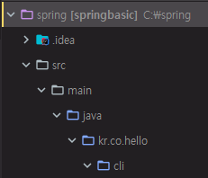
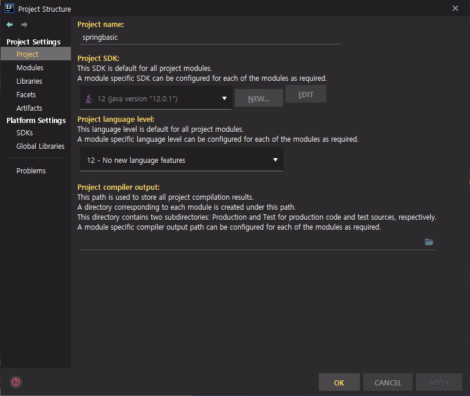
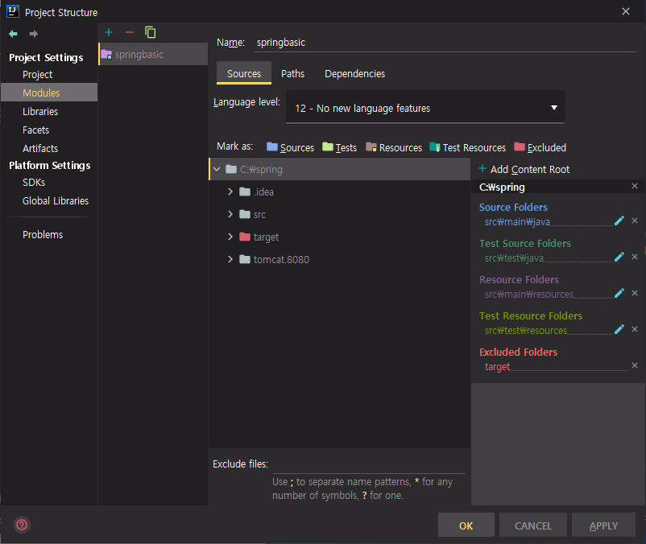
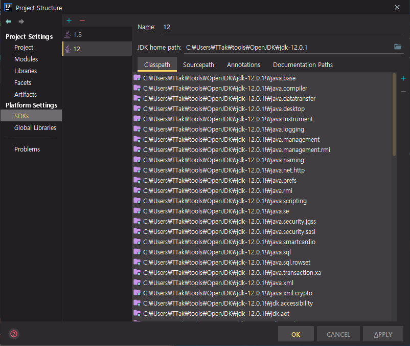
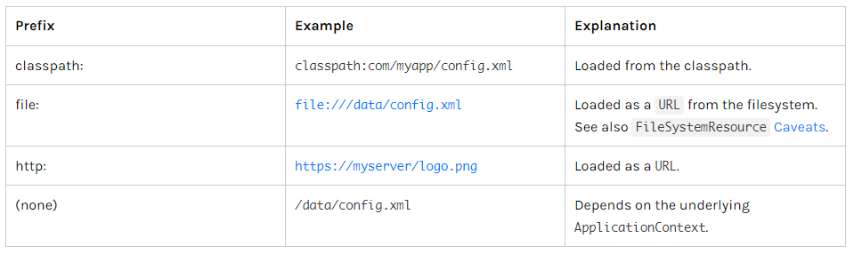
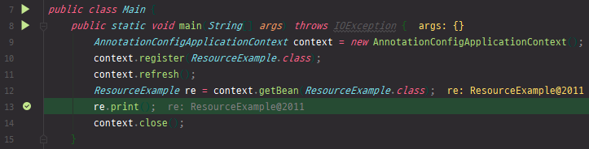
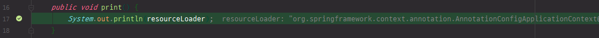

# 18. 스프링 프레임워크 코어 - Resources

https://docs.spring.io/spring/docs/5.2.0.M3/spring-framework-reference/core.html#resources

## Resources

* Introduction
* The Resource Interface
* Built-in Resource Implementations
* The `ResourceLoader`
* The `ResourceLoaderAware` interface
* Resources as Dependencies
* Application Contexts and Resource Paths


소개글, Resource Interface에 대한 설명, 내장 Resource 구현체, ResourceLoader, 

ResourceLoaderAware 인터페이스에 대한 설명 등


### OpenJDK 12.0.1 설정

OpenJDK 12.0.1 이용 => JAVA_HOME 시스템 환경 변수 변경

C:\Users\TTak\tools\OpenJDK\jdk-12.0.1


pom.xml

```xml
...
    <properties>
        <maven.compiler.source>12</maven.compiler.source>
        <maven.compiler.target>12</maven.compiler.target>
        <tomcat.version>9.0.31</tomcat.version>
    </properties>
...
```

12로 변경




spring 프로젝트 마우스 오른쪽 클릭 => Open Module Settings

Project Settings => Project



Project SDK를 12로 설정

만약 Project SDK 목록에 12가 없으면 NEW => JDK

C:\Users\TTak\tools\OpenJDK\jdk-12.0.1 입력 후 OK

Project language level을 12로 설정


Project Settings => Modules



Language level을 12로 설정


Platfrom Settings => SDKs




### Introduction

Resource란 무엇인가?

src\main 하위에 보면 classpath들이 있다. java, resources, wepapp

resources 폴더를 열어보면 여러가지의 파일들이 있다.

spring에서 java 뿐만 아니라 외부에 있는 파일들을 읽어야하거나 URL을 통해서 어떤 데이터를 가져와야 한다.

파일을 byte 배열로 읽어들이거나 URL에서 데이터를 byte 배열로 가져와서 그것을 프로그래밍에 활용을 해야한다.

그런 것들을 하기 위해서 Spring에서는 Resource라는 인터페이스를 통해서 추상화를 해주었다.

Spring을 사용하기 전에는 어떤 식으로 프로그래밍을 해왔고 Spring을 사용해서는 어떤 식으로 프로그래밍을 할 수 있는지 비교


#### Spring을 사용하기 전 파일 읽기

cil 디렉터리에 res라는 패키지를 만든다.

res 디렉터리에 Main 클래스 생성, psvm 입력

Main.java

```java
package kr.co.hello.cli.res;

import java.io.*;

public class Main {
    public static void main(String[] args) throws IOException {
        String path = "C:\\spring\\src\\main\\resources\\dao.xml";
        File file = new File(path);
        InputStream is = new FileInputStream(file);
        byte[] bytes = is.readAllBytes();
        String daoStr = new String(bytes);
        System.out.println(daoStr);
    }
}
```

Main 클래스에서 resources에 있는 dao.xml 파일을 읽으려고 한다.

먼저 dao.xml의 절대경로값을 붙여넣는다. dao.xml 마우스 오른쪽 클릭 => Copy Path => Absolute Path

File을 만들고 path를 넣어준다.

File을 InputStream으로 만들어줘야 한다. Add exception to...

byte 배열로 모든 파일의 내용을 읽는다. Add exception to...

문자열을 가지고 있는 xml이므로 String으로 변환해준다.

출력

```
<!--<?xml version="1.0" encoding="UTF-8"?>-->
<!--<beans xmlns="http://www.springframework.org/schema/beans"-->
<!--       xmlns:xsi="http://www.w3.org/2001/XMLSchema-instance"-->
<!--       xmlns:context="http://www.springframework.org/schema/context"-->
<!--       xsi:schemaLocation="http://www.springframework.org/schema/beans-->
<!--       https://www.springframework.org/schema/beans/spring-beans.xsd-->
<!--       http://www.springframework.org/schema/context-->
<!--       https://www.springframework.org/schema/context/spring-context.xsd">-->
...
```

dao.xml에 있는 내용을 Console에 찍을 수 있다.


특정 파일같은 것들을 읽어오고 싶을 때 java를 이용해 이와 같은 방법으로 읽어온다.


우리가 모든 파일들의 절대적인 경로를 알 수 없다.

보통 classpath, jar파일, war파일로 묶던지 해서 특정 classpath에 포함시켜서 파일들을 관리한다.


#### classpath에 포함시키기

Main.java

```java
package kr.co.hello.cli.res;

import java.io.*;

public class Main {
    public static void main(String[] args) throws IOException {
        InputStream is = Main.class.getClassLoader().getResourceAsStream("dao.xml");
        byte[] bytes = is.readAllBytes();
        String daoStr = new String(bytes);
        System.out.println(daoStr);
    }
}
```

Main.class에서 getClassLoader를 불러오고, getClassLoader부터 classpath를 인식할 수 있으므로 여기서부터 getResourceAsStream 이라고 해서 InputStream을 받아올 수 있는 메서드가 있다. 여기서 dao.xml을 불러온다.


실행해보면 마찬가지로 classpath에 있는 dao.xml을 읽어들이는것을 확인할 수 있다.

dao.xml과 같은 폴더내에 있는 다른 파일들을 읽을 때에도 마찬가지로 하면 된다. 파일명 넣어주기


Main.java

```java
package kr.co.hello.cli.res;

import java.io.*;

public class Main {
    public static void main(String[] args) throws IOException {
        InputStream is = Main.class.getClassLoader().getResourceAsStream("logback.xml");
        byte[] bytes = is.readAllBytes();
        String daoStr = new String(bytes);
        System.out.println(daoStr);
    }
}
```

logback.xml 파일 읽어오기


### The Resource Interface

Spring에서 Resource 인터페이스를 통해서 어떻게 변경이 되는지 확인

```java
public interface Resource extends InputStreamSource {
    boolean exists();
    boolean isOpen();
    URL getURL() throws IOException;
    File getFile() throws IOException;
    Resource createRelative(String relativePath) throws IOException;
    String getFilename();
    String getDescription();
}
```

InputStreamSource 라고 하는 인터페이스를 상속받는다.

총 7개의 메서드를 가지고 있다.

* exists : Resource가 있는지 없는지
* isOpen : Stream이 열렸는지에 대한 체크
* getURL : 해당 Resource의 URL을 가져온다.
* getFile : 해당 Resource의 파일을 가져온다.
* createRelative : 상대 경로를 통해서 다른 Resource를 가져온다.
* getFilename : 파일의 name을 가져온다.
* getDescription : 설명을 가져온다.


주로 사용하는 것은 exists, getFile, createRelative 이다.


```java
public interface InputStreamSource {
    InputStream getInputStream() throws IOException;
}
```

상속을 받은 InputStreamSource는 InputStream을 가져올 수 있다.

InputStream을 가져올 수 있으므로 byte 배열을 편하게 가져올 수 있다.


### Built-in Resource Implementations

우리가 인터페이스를 그냥 사용하는 것이 아니고 보통은 구현체를 사용한다.

Resource 라고 하는 인터페이스를 구현한 구현체를 사용한다.

**Spring에서 제공하는 Resource 구현체**

* `UrlResource`
* `ClassPathResource`
* `FileSystemResource`
* `ServletContextResource`
* `InputStreamResource`
* `ByteArrayResource`


보통 Resource 인터페이스를 사용할 때에는 FileSystem 내에 있는 절대 경로나 ClassPath에 있는 파일을 읽어들일 때 사용한다.

Resource 인터페이스를 통해서 직접 프로그래밍 하는 것 보다는 Spring-boot에서 사용하는 특정 관례, 이 관례가 ResourceLoader에서 사용하는 관례이다. 거기에 따라서 특정 파일을 읽어들일 때 주로 Resource 인터페이스를 관련돼서 사용하게 된다.

파일에 관련된 것이기 때문에 ClassPathResource를 가장 많이 사용하게 된다.


#### `UrlResource`

`file:` 또는 `http:` 같은 식으로 프로토콜을 명시해주고, URL 방식을 통해서 해당 Resource의 위치를 알려주는 방식이다.


#### `ClassPathResource`

앞에서 ClassLoader를 통해서 프로젝트에 있는 dao.xml 파일을 읽었다.

마찬가지로 ClassLoader 기준으로 그 이후에, classpath에서 Resource를 찾는것이다.


#### `FileSystemResource`

절대경로라든지 FileSystem에서 Resource를 찾는다.

`java.io.File` 과 `java.nio.file.Path` handle을 구현했다.

`File` 과 `URL`에 대해서 support 해줄 수 있다.


#### `ServletContextResource`

웹 프로젝트인 경우에 쓰인다.


#### `InputStreamResource`

InputStream을 넣어주고 사용할 수 있는 Resource

보통 파일에 쓸 때, writing 할 때 쓰면 편하다.


#### `ByteArrayResource`

ByteArray를 넣어주고 사용하는 Resource

보통 파일에 쓸 때, writing 할 때 쓰면 편하다.


파일을 writing 할 때에는 byte 배열을 Java SDK를 써서 바로 writing 해도 되기 때문에 Resource를 쓸지 안 쓸지는 프로그래머의 선택


#### `ClassPathResource` 사용하기

res\Main.java

```java
package kr.co.hello.cli.res;

import org.springframework.core.io.ClassPathResource;

public class Main {
    public static void main(String[] args) {
        ClassPathResource resource = new ClassPathResource("dao.xml");
        System.out.println(resource.exists());
    }
}
```

ClassPathResource 선언, dao.xml

해당 파일이 있는지 출력 => sout 입력 후 Enter


main 메서드 실행

```
true
```

파일이 있다고 나온다.


Main.java

```java
package kr.co.hello.cli.res;

import org.springframework.core.io.ClassPathResource;

import java.io.IOException;

public class Main {
    public static void main(String[] args) throws IOException {
        ClassPathResource resource = new ClassPathResource("dao.xml");
        byte[] bytes = resource.getInputStream().readAllBytes();
        String daoStr = new String(bytes);
        System.out.println(daoStr);
    }
}
```

InputStream을 받아와서 모든 byte 배열을 읽어들인다.

파일 내용 출력

ClassPathResource를 통해서 dao.xml을 읽는 것을 확인


#### `UrlResource` 사용하기

Main.java

```java
package kr.co.hello.cli.res;

import org.springframework.core.io.ClassPathResource;
import org.springframework.core.io.Resource;
import org.springframework.core.io.UrlResource;

import java.io.IOException;

public class Main {
    public static void main(String[] args) throws IOException {
        Resource resource = new UrlResource("dao.xml");
//        byte[] bytes = resource.getInputStream().readAllBytes();
//        String daoStr = new String(bytes);
        System.out.println(resource.exists());
    }
}
```

UrlResource 사용

여기에서는 classpath로부터 읽는 것이 아니기때문에 해당 파일이 있는지 exists로 확인해보면 에러가 난다.

```
Exception in thread "main" java.net.MalformedURLException: no protocol: dao.xml
```

no protocol


Main.java

```java
...
        Resource resource = new UrlResource("file:dao.xml");
...
```

file이라고 protocol을 명시

```
false
```

false가 나온다. URL은 절대경로를 명시해줘야 한다.


Main.java

```java
...
        Resource resource = new UrlResource("file:C:\\spring\\src\\main\\resources\\dao.xml");
...
```

dao.xml 마우스 오른쪽 클릭 => Copy Path

절대 경로를 넣어준다.

```
true
```


#### `FileSystemResource` 사용하기

Main.java

```java
package kr.co.hello.cli.res;

import org.springframework.core.io.ClassPathResource;
import org.springframework.core.io.FileSystemResource;
import org.springframework.core.io.Resource;
import org.springframework.core.io.UrlResource;

import java.io.IOException;

public class Main {
    public static void main(String[] args) throws IOException {
        Resource resource = new FileSystemResource("C:\\spring\\src\\main\\resources\\dao.xml");
//        byte[] bytes = resource.getInputStream().readAllBytes();
//        String daoStr = new String(bytes);
        System.out.println(resource.exists());
    }
}
```

FileSystemResource 사용

절대경로를 넣어주고, 파일 존재 여부 판단

```
true
```

UrlResource 와는 다르게 절대경로만 넣어주고 protocol을 앞에 명시하지 않았다.


#### Resource를 사용하는 이유

ClassPathResource, UrlResource, FileSystemResource 등 여러 가지 Resource 구현체를 사용해서 외부 자원(Resource)에 대해서 사용할 수 있었는데, 사용할 때 Resource 라는 하나의 인터페이스로 사용할 수 있었다.

이 말은 일관된 프로그래밍 메서드를 통해서 코딩을 할 수 있으므로 어떤 구현체를 사용하든지간에 Resource 라는 인터페이스를 받는다고 생각하고 코딩을 할 수 있다.

훨씬 더 일관적인 프로그래밍을 할 수 있다.

Spring 프로젝트에서는 외부 프로젝트를 가져올 때 Resource 인터페이스를 사용한다고 하면 다른 사람들도 편리하게 사용할 수 있으므로 Spring에서 제공하는 것을 이용하는 것이 도움이 된다.


### The `ResourceLoader`

실제로는 Resource 구현체를 사용하는 것보다 ResourceLoader를 통해서 Resource를 가져온다.

```java
public interface ResourceLoader {
    Resource getResource(String location);
}
```


우리가 사용하는 ApplicationContext 들은 보통은 ResourceLoader를 인터페이스로 상속받고있다.


res\Main.java

```java
package kr.co.hello.cli.res;

import org.springframework.context.support.ClassPathXmlApplicationContext;
import org.springframework.core.io.Resource;

import java.io.IOException;

public class Main {
    public static void main(String[] args) throws IOException {
        ClassPathXmlApplicationContext context = new ClassPathXmlApplicationContext();
        Resource resource = context.getResource("dao.xml");
        String daoStr = new String(resource.getInputStream().readAllBytes());
        System.out.println(daoStr);
        context.close();
    }
}
```

IoC Container를 하나 만든다.

ClassPathXmlApplicationContext의 정의로 이동(Ctrl + b 또는 Ctrl + 마우스 왼쪽 클릭)

ClassPathXmlApplicationContext 에서는 AbstractXmlApplicationContext를 상속받는다. 상속 구조를 따라 들어간다.

ClassPathXmlApplicationContext

AbstractXmlApplicationContext

AbstractRefreshableConfigApplicationContext

AbstractRefreshableApplicationContext

AbstractApplicationContext

DefaultResourceLoader

ResourceLoader

ResourceLoader를 구현한 것들을 확인할 수 있다.

그러므로 우리는 ResourceLoader를 사용할 수 있다.

getResource라고 해서 ResourceLoader를 통해서 Resource를 가져올 수 있다.

주로 사용하는 것들은 getResource해서 Resource 하나, getResources 라고 해서 Resource 배열을 받아오는 것을 사용할 수 있다.

getResource 사용

Spring container가 올라오고 나서 특정 리소스를 읽어오고 싶으면 classpath에 있는 파일명을 넣어주면 된다.


Spring Container에서 ResourceLoader를 통해서 파일을 읽는다.


Main.java에서 String daoStr 부분에 breakpoint

디버깅


기본적으로 아무것도 붙이지 않으면 classpath에서 읽어들인다.

resource를 보면 ResourceLoader에서 ClassPathContextResource 라고 classpath에서 가져오는 것을 확인할 수 있다.


#### Resource strings

ResourceLoader는 다양하게 사용이 가능하다.

Resource strings 라는 문법이 있다.



이것을 학습하면 나중에 Spring-boot를 할 때 도움이 된다.


##### `classpath:`

`classpath:` 라는 prefix를 붙여주면 class path resource로부터 읽어들인다.

Main.java

```java
...
        Resource resource = context.getResource("classpath:dao.xml");
...
```

앞의 결과와 동일하기 때문에 특별한 차이는 없다.

classpath로부터 dao.xml 파일을 읽겠다는 것을 명시적으로 볼 수 있다.


앞에서와는 다르게 ClassPathResource에서 데이터를 가져오는 것을 확인할 수 있다.


##### `file:`

Main.java

```java
...
        Resource resource = context.getResource("file:C:\\spring\\src\\main\\resources\\dao.xml");
...
```

"file:dao.xml" 이라고만 하면 classpath가 아니기때문에 오류가 난다.

dao.xml 파일의 절대 경로를 입력

Resource 인터페이스의 구현체가 어떤 것인지 살펴보기


FileUrlResource 라고 하는 구현체로 사용할 수 있다.

`file:` prefix를 붙이면 ResourceLoader가 FileUrlResource 라는 것을 이용해서 Resource 인터페이스를 사용하는 것을 확인할 수 있다.


##### `http:`

`http:` prefix는 외부에 있는 것을 가져오고 싶을 때, URL로부터 데이터를 가져오고 싶을 때 사용

구글에 google logo 검색 => 이미지

google logo 이미지 마우스 오른쪽 클릭 => 이미지 주소 복사

Main.java

```java
...
        Resource resource = context.getResource("https://lh6.googleusercontent.com/-mwjksp6bc3c/Uedd3ROtyZI/AAAAAAAAAJM/9jQ_qfCEshQ/s320/NEW+GOOGLE+LOGO.jpg");
...
```

`https:` 라고 prefix가 붙은 resource 같은 경우에는 UrlResource로 데이터를 가져오는 것을 확인할 수 있다.


ResourceLoader를 통해서 하나의 인터페이스로 프로그래밍을 할 수 있다.


### The `ResourceLoaderAware` interface

기존에 Aware라는 postfix가 붙었던 인터페이스들은 공통점이 하나 있었다.


res 패키지에 ResourceExample 클래스 생성

ResourceExample.java

```java
package kr.co.hello.cli.res;

import org.springframework.context.ResourceLoaderAware;
import org.springframework.core.io.ResourceLoader;
import org.springframework.stereotype.Component;

@Component
public class ResourceExample implements ResourceLoaderAware {
    private ResourceLoader resourceLoader;

    @Override
    public void setResourceLoader(ResourceLoader resourceLoader) {
        this.resourceLoader = resourceLoader;
    }

    public void print() {
        System.out.println(resourceLoader);
    }
}
```

@Component 붙이기

ResourceLoaderAware 를 implement하고 setResourceLoader method 선언

ResourceLoader 필드 만들기

print 메서드를 통해 resourceLoader가 null이 아니라 setResourceLoader를 통해서 자동으로 resourceLoader가 할당되는지 확인 => breakpoint


Main.java

```java
package kr.co.hello.cli.res;

import org.springframework.context.annotation.AnnotationConfigApplicationContext;

import java.io.IOException;

public class Main {
    public static void main(String[] args) throws IOException {
        AnnotationConfigApplicationContext context = new AnnotationConfigApplicationContext();
        context.register(ResourceExample.class);
        context.refresh();
        ResourceExample re = context.getBean(ResourceExample.class);
        re.print();
        context.close();
    }
}
```

AnnotationConfigApplicationContext 사용

context에서는 ResourceExample을 register 해주고 refresh 한다.

context에서 getBean으로 ResourceExample bean을 가져온다.

print 메서드 호출 => breakpoint




ResourceExample이 ApplicationContext에 잘 등록되었다.


F9 눌러서 계속 진행

println 명렁어를 찍을 때 resourceLoader가 null이 아니라 Aware를 통해서 할당된 것을 확인할 수 있다.




ResourceExample.java

```java
package kr.co.hello.cli.res;

import org.springframework.beans.factory.annotation.Autowired;
import org.springframework.core.io.ResourceLoader;
import org.springframework.stereotype.Component;

@Component
public class ResourceExample {
    @Autowired private ResourceLoader resourceLoader;

    public void print() {
        System.out.println(resourceLoader);
    }
}
```

간단하게 @Autowired 같은 어노테이션을 한 번만 붙여줘도 resourceLoader가 set이 된 것을 확인할 수 있다.


Aware를 쓸지 @Autowired 같은 것을 이용해서 자동으로 주입 할지는 선택사항이다.

