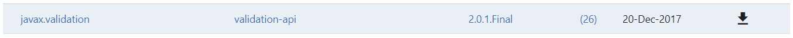
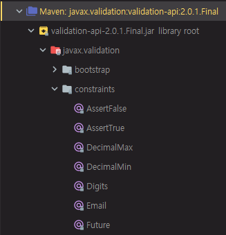
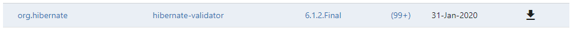

# 19. 스프링 프레임워크 코어 - Validation

https://docs.spring.io/spring/docs/5.2.0.M3/spring-framework-reference/core.html#validation

## Validation

매뉴얼에서는 Validation, Data Binding, Type Conversion에 대해서 다루지만 Validation을 위주로 진행

Data Binding과 Type Conversion에 대해서는 Bean에서 데이터를 Binding할 때의 설정과 String에서 Date 타입으로 타입을 자동으로 변경하는 것들에 대한 설명들이 나온다.

Data Binding과 Type Conversion은 Spring-boot를 사용한다면 이미 만들어진 것들을 거의 관례대로 그대로 사용하기 때문에 이 부분을 직접 다룰 일은 별로 없다.

Validation같은 경우에는 Spring에서 만든 Validation과 JSR-303같은 Java쪽 표준에서 만든 Validation이 있는데, 이것을 이용해서 Spring MVC 에서는 form data가 넘어올 때 Validation을 하거나 DB에 저장하기 전에 Validation을 하는 등 많이 사용된다.


Spring Framework는 Bean Validation 1.0 (JSR-303)과 Bean Validation 1.1 (JSR-349) 를 지원한다.


**JSR-349**

구글에 JSR-349 검색

[Jakarta Bean Validation - Bean Validation 1.1 (JSR 349)](https://beanvalidation.org/1.1/)

Bean Validation 1.1 은 spec이다. Bean Validation 1.1 specification 클릭

https://beanvalidation.org/1.1/spec/

그러므로 Java 진영에서는 spec만 정해놓은 것이고, 인터페이스에 대한 나열들이 있다.

이 spec을 구현한 것들에 대해서는 Hibernate Validator와 Apache BVal 이라고 하는 두 가지 구현체가 Certified 되었다.

Spring에서는 Hibernate Validator를 주로 많이 사용한다.


### Validation by Using Spring’s Validator Interface

Spring의 Validator Interface

앞에서 JSR-303과 JSR-349에 대해서 살펴봤는데 Spring의 Validator Interface도 따로 있다.

Spring 에서도 Validator를 만들었기 때문에 Spring에서 제공하는 Validator를 그대로 사용해도 되고, Java 표준인 JSR-349를 사용해도 된다.


```java
public class Person {
    private String name;
    private int age;
    // the usual getters and setters...
}
```

Person 이라는 객체에 필드들이 있다.

필드들이 data가 제대로 들어갔는지 Validation할 대상이다.


```java
public class PersonValidator implements Validator {
    
    /**
     * This Validator validates *only* Person instances
     */
    public boolean supports(Class clazz) {
        return Person.class.equals(clazz);
    }

    public void validate(Object obj, Errors e) {
        ValidationUtils.rejectIfEmpty(e, "name", "name.empty");
        Person p = (Person) obj;
        if (p.getAge() < 0) {
            e.rejectValue("age", "negativevalue");
        } else if (p.getAge() > 110) {
            e.rejectValue("age", "too.darn.old");
        }
    }
}
```

Validation을 하기 위해서는 Validator라고 하는 클래스를 만들어주고, 해당 클래스가 Person 클래스인지 체크하는 supports, 실제로 validate를 하는 logic이 들어간 validate가 있다.

해당 Object의 값이 null인 경우 reject를 하겠다는 것이고, reject를 할 때 에러 코드를 던지는 형태의 코드이다.

age가 0보다 작거나 110보다 큰 경우 에러를 reject 한다.


```java
public class CustomerValidator implements Validator {

    private final Validator addressValidator;

    public CustomerValidator(Validator addressValidator) {
        if (addressValidator == null) {
            throw new IllegalArgumentException("The supplied [Validator] is " +
                "required and must not be null.");
        }
        if (!addressValidator.supports(Address.class)) {
            throw new IllegalArgumentException("The supplied [Validator] must " +
                "support the validation of [Address] instances.");
        }
        this.addressValidator = addressValidator;
    }

    /**
     * This Validator validates Customer instances, and any subclasses of Customer too
     */
    public boolean supports(Class clazz) {
        return Customer.class.isAssignableFrom(clazz);
    }

    public void validate(Object target, Errors errors) {
        ValidationUtils.rejectIfEmptyOrWhitespace(errors, "firstName", "field.required");
        ValidationUtils.rejectIfEmptyOrWhitespace(errors, "surname", "field.required");
        Customer customer = (Customer) target;
        try {
            errors.pushNestedPath("address");
            ValidationUtils.invokeValidator(this.addressValidator, customer.getAddress(), errors);
        } finally {
            errors.popNestedPath();
        }
    }
}
```

CustomerValidator라고 해서 조금 더 복잡한 business logic에 대해서도 Validator를 만들 수 있다.


### Resolving Codes to Error Messages

위에서 보면 에러 코드를 같이 던져주는데, 에러 코드를 에러 메시지로 변경해주는 것에 대한 설명

이 부분은 국제화 같은 부분에서 사용자의 locale에 따라서 영어로 보여줄지 한국어로 보여줄지 그럴 때에도 사용하는 부분이다.

```java
public class PersonValidator implements Validator {

    /**
     * This Validator validates *only* Person instances
     */
    public boolean supports(Class clazz) {
        return Person.class.equals(clazz);
    }

    public void validate(Object obj, Errors e) {
        ValidationUtils.rejectIfEmpty(e, "name", "name.empty");
        Person p = (Person) obj;
        if (p.getAge() < 0) {
            e.rejectValue("age", "negativevalue");
        } else if (p.getAge() > 110) {
            e.rejectValue("age", "too.darn.old");
        }
    }
}
```

특이한 점은 우리가 특정 에러를 다룰 때에는 보통 return을 boolean을 줘서 validation이 제대로 되었는지에 대해 그냥 true, false로만 던지거나 exception throws로 던지는데, 그게 아니고 argument로 Errors라고 하는 인자를 받고, Errors에 뭔가 값을 변경하는 형태의 코드가 만들어진다.

Errors에 대해서 이런식의 코드 형태가 만들어진 것은 replacing throwing exceptions with notification in validations 라는 문서 참고

구글에 replacing throwing exceptions with notification in validations 검색

martinfowler.com 에서 특정 문서를 볼 수 있다.

[Replacing Throwing Exceptions with Notification in Validations](https://martinfowler.com/articles/replaceThrowWithNotification.html)

다양한 패턴에 대해서 소개해주고 있다.

여기에서 소개해 주는 것은 Exception을 Throwing 하는 것보다 Validation을 Notification 하는 것으로 Replacing 하라는 것이다.

```java
public void check() {
    if (date == null) throw new IllegalArgumentException("date is missing");
    LocalDate parsedDate;
    try {
        parsedDate = LocalDate.parse(date);
    }
    catch (DateTimeParseException e) {
        throw new IllegalArgumentException("Invalid format for date", e);
    }
    if (parsedDate.isBefore(LocalDate.now())) throw new IllegalArgumentException("date cannot be before today");
    if (numberOfSeats == null) throw new IllegalArgumentException("number of seats cannot be null");
    if (numberOfSeats < 1) throw new IllegalArgumentException("number of seats must be positive");
}
```

Validation을 할 때 date가 null이면 안되기 때문에 거기에 대해서 Exception을 날리고있다.

이 코드에서의 문제점은 Business에서 원하는 data에 대해서 Validation 할 때 여러가지가 있다. 5개 이상의 Validation하는 logic들이 있는데 여기서 문제는 첫 번째 Validation에서 문제가 발생하면 더이상 진행을 하지 않고 Exception을 날리기 때문에 밑에있는 것들을 검증하지 못한다.

```java
if (numberOfSeats < 1)
    throw new IllegalArgumentException("number of seats must be positive");

=>

if (numberOfSeats < 1)
    aNotification.addError("number of seats must be positive");
// ...
return aNotification
```

그러므로 한 번에 검증하기 위해서는 이런 식으로 코드가 refactoring된다.

기존의 코드처럼 Exception을 날리는 대신 Notification이라는 객체에 Exception들을 add 해주고 맨 마지막에 Notification을 return 해주는 방법이다.


```java
public void check() {
    if (validation().hasErrors()) 
        throw new IllegalArgumentException(validation().errorMessage());
}
```

validation 에서 return 받은 것은 Notification이다.

Notification에서 Error가 있는지에 대해 hasErrors 메서드로 검색해보고 만약 한 개 이상의 에러라는 메시지가 있으면 validation().errorMessage()를 한 번에 묶어서 Exception을 날려주는 형태로 해준다.

그러면 클라이언트 쪽에서 받을 때에는 여러 개의 에러 메시지가 나오기 때문에 에러 메시지를 한 번에 출력할 수 있어서 한 번 동작을 요청할 때마다 에러 메시지를 하나씩 받는 것에 비해서 더욱 효율적으로 Error Handling을 처리할 수 있다.


### 코드로 살펴보기

기존에 만들었던 res 패키지 삭제

불필요한 것 지우기 => A, B, Dao2 클래스

AppConfig에서 A, B 포함 코드 삭제

cli 디렉터리에 validation 패키지 생성

validation 패키지에 Main 클래스 생성, psvm 입력

validation 패키지에 Person 클래스 생성


Person.java

```java
package kr.co.hello.cli.validation;

import lombok.AllArgsConstructor;
import lombok.Getter;
import lombok.Setter;

@Getter
@Setter
@AllArgsConstructor
public class Person {
    private String name;
    private int age;
}
```

필드 추가, @Getter, @Setter 추가

@AllArgsConstructor 로 생성자 추가


Person이라는 객체를 validate 할 PersonValidator를 만들어야 한다.

validation 패키지에 PersonValidator 클래스 생성

PersonValidator.java

```java
package kr.co.hello.cli.validation;

import org.springframework.validation.Errors;
import org.springframework.validation.ValidationUtils;
import org.springframework.validation.Validator;

public class PersonValidator implements Validator {
    /**
     * This Validator validates *only* Person instances
     */
    public boolean supports(Class clazz) {
        return Person.class.equals(clazz);
    }

    public void validate(Object obj, Errors e) {
        ValidationUtils.rejectIfEmpty(e, "name", "name.empty");
        Person p = (Person) obj;
        if (p.getAge() < 0) {
            e.rejectValue("age", "negativevalue");
        } else if (p.getAge() > 110) {
            e.rejectValue("age", "too.darn.old");
        }
    }
}
```

Validator에 org.springframework.validation과 javax.xml.validation 이 있다.

나중에는 JSR-303 쪽의 Validator도 추가가 될 것인데, 지금은 Spring에 관련된 Validator이기 때문에 org.springframework.validation 선택

Errors, ValidationUtils 도 Spring에서 제공하는 것이다.


validation\Main.java

```java
package kr.co.hello.cli.validation;

import lombok.extern.slf4j.Slf4j;
import org.springframework.validation.BindException;

@Slf4j
public class Main {
    public static void main(String[] args) {
        Person person = new Person("", 200);
        PersonValidator validator = new PersonValidator();
        if(validator.supports(person.getClass())) {
            BindException error = new BindException(person, "person");
            validator.validate(person, error);

            log.error(">> " + error.hasErrors());
            log.error("" + error.getAllErrors());
        } else {
            log.error("invalid class");
        }
    }
}
```

main 메서드에서 Person을 하나 생성

@AllArgsConstructor 때문에 값을 넣어줘야 한다.

PersonValidator 클래스의 validate 메서드에서 에러가 나는 경우는 empty인 상황과 age가 0보다 작거나 110보다 큰 경우이다.

그에 맞게끔 Empty String과 200을 넣는다.

Person 객체를 PersonValidator로 validate 하기

먼저 supports로 person의 class가 support할 수 있는지 체크한다.

@Slf4j 추가

support 할 수 없는 경우 "invalid class" 라고 log를 찍는다.

Validator로 validate 를 해야하고, obj는 person이다.

Errors는 단순하게 new Errors() 라고 하면 너무 많은 메서드들을 구현해줘야 한다. Errors는 실제로는 인터페이스이기 때문이다.

구글에 org.springframework.validation.Errors api 검색

[org.springframework.validation.Errors](https://docs.spring.io/spring/docs/current/javadoc-api/org/springframework/validation/Errors.html)

Spring api에서 Errors 를 구현한 구현체 중 하나를 사용하면 된다.

[BindException](https://docs.spring.io/spring/docs/current/javadoc-api/org/springframework/validation/BindException.html) 사용

BindException은 Exception을 구현한것이기 때문에 throws를 날릴 수도 있고, Errors를 다 구현한 것이고, BindingResult 라는 것도 구현했다.

new BindException을 해주고, 여기서 원하는 것은 target인 object와 object name이 있다.

error를 넣어준다.

이렇게 하면 Spring에서 제공하는 Validator를 사용할 수 있다.

제대로 validate 되었는지 확인

```
ERROR kr.co.hello.cli.validation.Main - >> true
ERROR kr.co.hello.cli.validation.Main - [Field error in object 'person' on field 'name': rejected value []; codes [name.empty.person.name,name.empty.name,name.empty.java.lang.String,name.empty]; arguments []; default message [null], Field error in object 'person' on field 'age': rejected value [200]; codes [too.darn.old.person.age,too.darn.old.age,too.darn.old.int,too.darn.old]; arguments []; default message [null]]
```

person이라고 하는 것의 name이 empty이기 때문에 에러가 나는 것에 대해서 코드들을 제공한다. 여러 코드로 던지고 있다.

person의 age가 200이다. person의 age도 맞지 않기 때문에 에러를 던진다.

PersonValidator 클래스에서 보면 에러 코드가 "too.darn.old" 라고 되어있다.

"too.darn.old" 라고 에러 코드가 같이 명시되어 있는 것을 확인할 수 있다.


이런 식으로 Spring에서 제공하는 validation을 사용해서 validate를 할 수 있다.

Spring Validator의 단점은 business logic을 하나하나 구현해줘야 한다는 것이다.

복잡한 business logic인 경우에는 기존의 JSR-303을 사용하는 것보다 이게 더 편리할 수도 있다.

간단한 business logic, 예를 들어서 문자열이 없는 경우 또는 특정 값보다 큰 경우에 대해서는 어노테이션을 통해 간편하게 사용할 수 있다.


### Spring Validation

Spring은 JSR-303 Bean Validation API 를 전부 support 한다.

#### Overview of the JSR-303 Bean Validation API

validation 패키지에 PersonForm 클래스 생성

PersonForm.java

```java
package kr.co.hello.cli.validation;

import lombok.AllArgsConstructor;
import lombok.Getter;
import lombok.Setter;

@Getter
@Setter
@AllArgsConstructor
public class PersonForm {
    
    @NotNull
    @Size(max=64)
    private String name;

    @Min(0)
    private int age;
}
```

필드 추가, @Getter, @Setter 추가

@AllArgsConstructor 로 생성자 추가

앞에서 Spring의 Validator를 쓸 때(PersonValidator)와는 다르게 여기에서는 JSR-303 어노테이션 기능인데 @NotNull, @Size, @Min을 통해서 Validator 클래스를 만들지 않고 사용이 가능하다.

매뉴얼에 있는 코드를 거의 그대로 작성했지만 빨간불이 나온다. => 컴파일 에러

JSR-303 관련 인터페이스의 dependency를 추가하지 않았기 때문이다.


구글에 java ee api 검색

[Java EE 7 - Overview (Java(TM) EE 7 Specification APIs)](https://docs.oracle.com/javaee/7/api/toc.htm)

[javax.validation](https://docs.oracle.com/javaee/7/api/javax/validation/package-summary.html) 이라는 패키지가 있다.


https://search.maven.org/

javax.validation 검색



2.0.1.Final

```xml
<dependency>
  <groupId>javax.validation</groupId>
  <artifactId>validation-api</artifactId>
  <version>2.0.1.Final</version>
</dependency>
```

pom.xml 에 dependency 추가


External Libraries



여러 어노테이션들이 있다. 어노테이션을 붙이면 validation이 되는 것들이다.

@NotBlank와 @NotEmpty의 차이점은 Empty는 아예 Double Quotation으로, 쌍따옴표로 중간에 아예 아무런 문자가 없는 경우, Double Quotation 두개가 딱 붙어있는 경우를 Empty라고 보통 부른다.

Blank인 경우에는 White Space라고 불리는 것들이 중간에 존재하는 경우이다. Double Quotation 사이에 Space나 Tab 같은 공백 문자들이 포함된 경우, 공백 문자들로만 구성된 문자열인 경우 Blank 라고 말한다.

@NotNull에서 Null은 오브젝트가 Null인 경우이다.


이 어노테이션들을 Spring에서 validation을 내부적으로 제공을 해준다.

그러므로 우리는 이 validation annotation만 붙여서 validation 이 가능해진다.


PersonForm.java

```java
package kr.co.hello.cli.validation;

import lombok.AllArgsConstructor;
import lombok.Getter;
import lombok.Setter;

import javax.validation.constraints.Min;
import javax.validation.constraints.NotNull;
import javax.validation.constraints.Size;

@Getter
@Setter
@AllArgsConstructor
public class PersonForm {

    @NotNull
    @Size(max=64)
    private String name;

    @Min(0)
    private int age;
}
```

다시 PersonForm.java에 가서 import를 해준다. JSR-303 관련 어노테이션 추가


#### Configuring a Bean Validation Provider

Spring에서 제공한 JSR-303에 관련되어 있는 validate 기능을 어떻게 사용할 수 있는가?

Bean Validation Provider를 Spring에 추가해줘야 한다.

Spring Container를 로딩해야한다. Spring Container 추가

LocalValidatorFactoryBean 이라는 것을 추가해줘야 한다.

```xml
<bean id="validator"
    class="org.springframework.validation.beanvalidation.LocalValidatorFactoryBean"/>
```

xml 설정이라고 하더라도 어노테이션으로 항상 바꿀 수 있는 것에 대해 익숙해져야 한다.


AppConfig.java

```java
package kr.co.hello.cli;

import org.springframework.beans.factory.annotation.Value;
import org.springframework.context.annotation.Bean;
import org.springframework.context.annotation.Configuration;
import org.springframework.context.annotation.Profile;
import org.springframework.context.annotation.PropertySource;
import org.springframework.validation.beanvalidation.LocalValidatorFactoryBean;

import java.sql.Connection;

@Configuration
@Profile({"default", "dev"})
@PropertySource("classpath:application-${spring.profiles.active}.properties")
public class AppConfig {
    @Bean
    public Connection connection(ConnectionFactory connectionFactory) {
        return connectionFactory.getConnection();
    }

    @Bean
    public Dao dao(Connection connection) {
        return new Dao(connection);
    }

    @Bean(initMethod = "init", destroyMethod = "destroy")
    public ConnectionFactory connectionFactory(
            @Value("${jdbc.driver-class}") String driverClass,
            @Value("${jdbc.url}") String url,
            @Value("${jdbc.username}") String username,
            @Value("${jdbc.password}") String password
    ) {
        return new ConnectionFactory(driverClass, url, username, password);
    }

    @Bean
    public LocalValidatorFactoryBean localValidatorFactoryBean() {
        return new LocalValidatorFactoryBean();
    }
}
```

LocalValidatorFactoryBean을 Bean으로 추가


##### Injecting a Validator

```java
import javax.validation.Validator;

@Service
public class MyService {

    @Autowired
    private Validator validator;
}
```

특정 Service에서 Validator를 inject 해줘야 한다.


cli 패키지에 service라는 패키지 생성

service 패키지에 MyService 클래스 생성

MyService.java

```java
package kr.co.hello.cli.service;

import kr.co.hello.cli.validation.PersonForm;
import lombok.extern.slf4j.Slf4j;
import org.springframework.beans.factory.annotation.Autowired;
import org.springframework.stereotype.Service;

import javax.validation.ConstraintViolation;
import javax.validation.Validator;
import java.util.Set;

@Service
@Slf4j
public class MyService {

    @Autowired
    private Validator validator;

    public void check() {
        PersonForm personForm = new PersonForm("MyName", 10);
        Set<ConstraintViolation<PersonForm>> results = validator.validate(personForm);
        if(results.isEmpty()) {
            log.info("validate 성공");
        } else {
            log.error("validate 실패");
        }
    }
}
```

매뉴얼을 보면 org.springframework.validation.Validator가 있고 javax.validation.Validator가 있는데, 우리는 JSR-303을 사용하고 있기 때문에 javax.validation.Validator를 import 한다.

MyService 에 check 메서드 정의

먼저 PersonForm을 만든다. 이름은 "MyName", 나이는 10

validate에 personForm을 인자로 넣는다.

`validator.validate(personForm).var` 입력 후 Enter

results 입력 후 Enter

validate 에서 성공하도록 check. 아무것도 없는 경우에는 validate 성공

@Slf4j 추가, log 찍기


AppConfig.java

```java
...
    @Bean
    public MyService myService() {
        return new MyService();
    }
...
```

MyService를 Bean으로 등록해야한다.


cli\Main.java

```java
package kr.co.hello.cli;
import kr.co.hello.cli.service.MyService;
import lombok.extern.slf4j.Slf4j;
import org.springframework.context.ConfigurableApplicationContext;
import org.springframework.context.annotation.AnnotationConfigApplicationContext;
import org.springframework.context.support.ClassPathXmlApplicationContext;

import java.sql.*;

@Slf4j
class Main {
	public static void main(String[] args) throws SQLException {
		log.info("Hello world!!");
		AnnotationConfigApplicationContext context = new AnnotationConfigApplicationContext();
		context.register(AppConfig.class);
		context.refresh();
		MyService service = context.getBean(MyService.class);
		service.check();
		context.close();
	}
}
```

MyService를 실행한다.


main 메서드 실행

```
Exception in thread "main" org.springframework.beans.factory.BeanCreationException: Error creating bean with name 'localValidatorFactoryBean' defined in kr.co.hello.cli.AppConfig: Invocation of init method failed; nested exception is javax.validation.NoProviderFoundException: Unable to create a Configuration, because no Bean Validation provider could be found. Add a provider like Hibernate Validator (RI) to your classpath.
```

에러가 발생한다.

localValidatorFactoryBean을 만들 때 에러가 났다. NoProviderFoundException

당신의 classpath에 Hibernate Validator 같은 provider를 추가해라

Hibernate Validator를 추가해줘야 한다.


https://search.maven.org/

hibernate validator 검색



99+ 클릭 => 6.1.2.Final

```xml
<dependency>
  <groupId>org.hibernate</groupId>
  <artifactId>hibernate-validator</artifactId>
  <version>6.1.2.Final</version>
</dependency>
```

pom.xml에 의존성 추가


만약 의존성이 중복으로 추가된 경우, 같은 의존성을 제거해준다. (omitted for duplicate)


main 메서드를 다시 실행한다. => `validate 성공` 이라고 뜨지만 메시지가 많이 뜬다.

logback.xml

```xml
<configuration>
  <appender name="STDOUT" class="ch.qos.logback.core.ConsoleAppender">
    <encoder>
      <pattern>%-5level %logger{36} - %msg%n</pattern>
    </encoder>
  </appender>

<!--  <logger name="org.springframework" level="ERROR" />-->

  <root level="info">
    <appender-ref ref="STDOUT" />
  </root>
</configuration>
```

level을 info로 변경


main 메서드 다시 실행

```
INFO  kr.co.hello.cli.Main - Hello world!!
INFO  kr.co.hello.cli.ConnectionFactory - init
INFO  o.h.validator.internal.util.Version - HV000001: Hibernate Validator 6.1.2.Final
INFO  kr.co.hello.cli.service.MyService - validate 성공
INFO  kr.co.hello.cli.ConnectionFactory - destroy
```

`validate 성공` 이라는 메시지를 찍는 것을 확인할 수 있다.


PersonFrom.java

```java
package kr.co.hello.cli.validation;

import lombok.AllArgsConstructor;
import lombok.Getter;
import lombok.Setter;

import javax.validation.constraints.Min;
import javax.validation.constraints.NotNull;
import javax.validation.constraints.Size;

@Getter
@Setter
@AllArgsConstructor
public class PersonForm {

    @NotNull
    @Size(max=3)
    private String name;

    @Min(0)
    private int age;
}
```

문자열 길이 값을 3으로 설정

Min 값을 0으로 설정했다.


MyService.java

```java
package kr.co.hello.cli.service;

import kr.co.hello.cli.validation.PersonForm;
import lombok.extern.slf4j.Slf4j;
import org.springframework.beans.factory.annotation.Autowired;
import org.springframework.stereotype.Service;

import javax.validation.ConstraintViolation;
import javax.validation.Validator;
import java.util.Set;

@Service
@Slf4j
public class MyService {

    @Autowired
    private Validator validator;

    public void check() {
        PersonForm personForm = new PersonForm("MyName", -1);
        Set<ConstraintViolation<PersonForm>> results = validator.validate(personForm);
        if(results.isEmpty()) {
            log.info("validate 성공");
        } else {
            log.error("validate 실패");
            results.forEach(x -> {
                log.error(">> error messages: " + x.getMessage());
            });
        }
    }
}
```

age를 -1로, 문자열 길이를 3 이상으로 설정

validate 실패에 대해서 메시지를 상세하게 찍기


main 메서드 실행

```
INFO  kr.co.hello.cli.Main - Hello world!!
INFO  kr.co.hello.cli.ConnectionFactory - init
INFO  o.h.validator.internal.util.Version - HV000001: Hibernate Validator 6.1.2.Final
ERROR kr.co.hello.cli.service.MyService - validate 실패
ERROR kr.co.hello.cli.service.MyService - >> error messages: 0 이상이어야 합니다
ERROR kr.co.hello.cli.service.MyService - >> error messages: 크기가 0에서 3 사이여야 합니다
INFO  kr.co.hello.cli.ConnectionFactory - destroy
```


PersonFrom.java

```java
...
@Getter
@Setter
@AllArgsConstructor
public class PersonForm {
    @NotBlank
    @Size(max=10)
    private String name;

    @Min(0)
    @Max(110)
    private int age;
}
```

name에 대해서 @NotNull 대신 @NotBlank로 변경

@Size 값 변경, @Max 추가


MyService.java

```java
...
        PersonForm personForm = new PersonForm("   ", 120);
...
```


main 메서드 실행

```
INFO  kr.co.hello.cli.Main - Hello world!!
INFO  kr.co.hello.cli.ConnectionFactory - init
INFO  o.h.validator.internal.util.Version - HV000001: Hibernate Validator 6.1.2.Final
ERROR kr.co.hello.cli.service.MyService - validate 실패
ERROR kr.co.hello.cli.service.MyService - >> error messages: 공백일 수 없습니다
ERROR kr.co.hello.cli.service.MyService - >> error messages: 110 이하여야 합니다
INFO  kr.co.hello.cli.ConnectionFactory - destroy
```

이런 식으로 공백 문자에 대해서도 에러 메시지를 주는 것을 확인할 수 있다.


MyService.java

```java
...
    public void check() {
        Locale.setDefault(Locale.ENGLISH);
        PersonForm personForm = new PersonForm("   ", 120);
        Set<ConstraintViolation<PersonForm>> results = validator.validate(personForm);
        if(results.isEmpty()) {
            log.info("validate 성공");
        } else {
            log.error("validate 실패");
            results.forEach(x -> {
                log.error(">> error messages: " + x.getMessage());
            });
        }
    }
...
```

메시지가 한글로 나오는 것은 Locale 설정을 ENGLISH로 바꿔주면 해당 Locale 설정에 맞춰서 메시지가 변경되는 것을 확인할 수 있다.

앞에서는 Default Locale이 한국어로 되어있어서 메시지가 한국어로 나왔다.


```
INFO  kr.co.hello.cli.Main - Hello world!!
INFO  kr.co.hello.cli.ConnectionFactory - init
INFO  o.h.validator.internal.util.Version - HV000001: Hibernate Validator 6.1.2.Final
ERROR kr.co.hello.cli.service.MyService - validate 실패
ERROR kr.co.hello.cli.service.MyService - >> error messages: must not be blank
ERROR kr.co.hello.cli.service.MyService - >> error messages: must be less than or equal to 110
INFO  kr.co.hello.cli.ConnectionFactory - destroy
```

