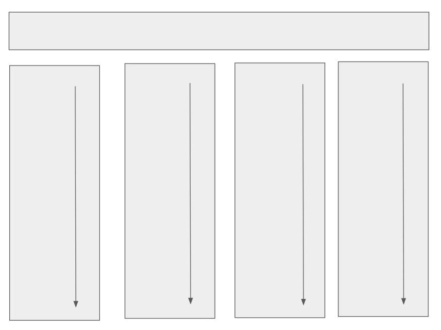
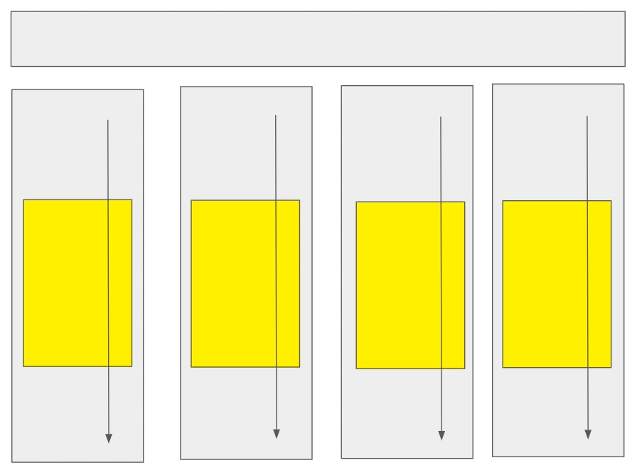
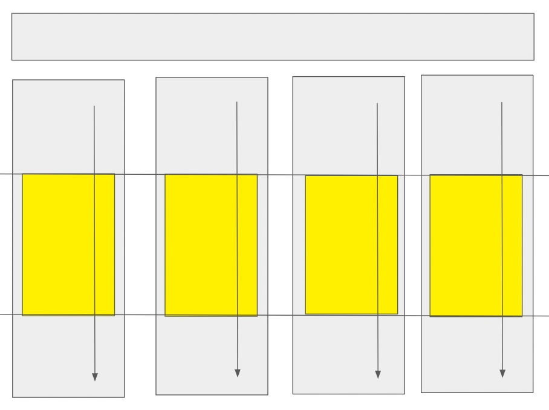
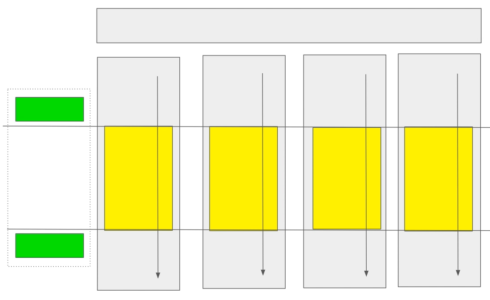
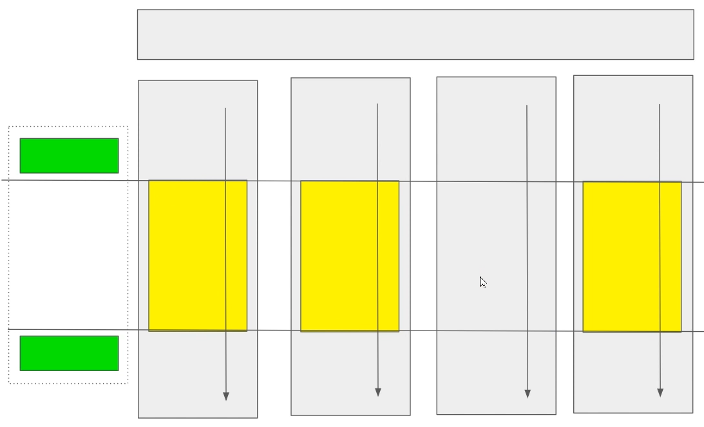
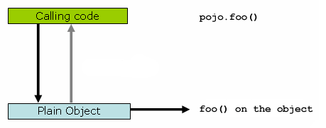
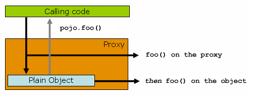
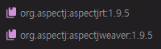
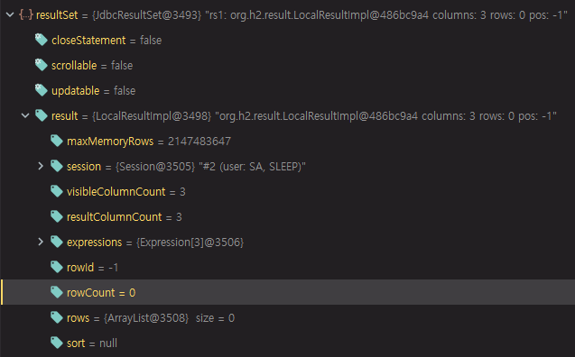

# 20. 스프링 프레임워크 코어 - Aspect Oriented Programming with Spring

https://docs.spring.io/spring/docs/5.2.0.M3/spring-framework-reference/core.html#aop

## Aspect Oriented Programming with Spring

Spring 매뉴얼에서는 AOP를 5장과 6장에 걸쳐 설명하고 있다.

Spring에서는 IoC Container와 더불어 AOP를 상당히 중요하게 다루고있다.


### Aspect Oriented Programming

구글에 wiki aop 검색

[관점 지향 프로그래밍 - 위키백과, 우리 모두의 백과사전](https://ko.wikipedia.org/wiki/관점_지향_프로그래밍)

관점 지향 프로그래밍(aspect-oriented programming, AOP)

OOP(Object-oriented programming), Functional programming 처럼 특정 Language가 만들어지기 전에 이런 패러다임이 먼저 존재했다.

이 패러다임이 특정 Language의 기초가 되면서 Language가 만들어진다.

Java는 OOP 패러다임으로 만들어졌는데 차후에 AOP에 대한 요구사항이 생기면서 AOP 패러다임도 수용한 언어이다.

[횡단 관심사](https://ko.wikipedia.org/wiki/횡단_관심사)(cross-cutting concern)의 분리를 허용함으로써 모듈성을 증가시키는 것이 목적인 프로그래밍 패러다임이다.




그림에서 가장 위에 있는 직사각형은 Java Programming을 할 때 main 메서드라고 생각하면 된다. main 메서드에서 시작과 끝


Main.java

```java
package kr.co.hello.cli;
import ...

@Slf4j
class Main {
	public static void main(String[] args) throws SQLException {
		log.info("Hello world!!");
		AnnotationConfigApplicationContext context = new AnnotationConfigApplicationContext();
		context.register(AppConfig.class);
		context.refresh();
		MyService service = context.getBean(MyService.class);
		service.check();
		context.close();
	}
}
```

main 메서드에는 context와 service라는 두 개의 객체가 있다.

이 객체들은 각각의 메서드들을 실행하고 있다.

위의 그림에서는 아래쪽에 있는 직사각형이 특정 객체가 되는 타입에서 메서드가 실행되면서 일정한 흐름에 맞춰 실행된다는 것을 나타내는 그림이다.


여기에서 A, B, C, D class가 있는데 예를들어 트랜잭션(Transaction) 기능이 동일하게 필요하다고 했을 때 각각의 class마다 transaction start, auto commit false, 마지막에 try/catch 문을 넣고 commit 또는 rollback 이런 코드를 A 클래스의 특정 메서드에 넣어야하고 B, C, D 클래스에도 넣어야한다.



동일한 작업들을 반복적으로 할 때에는 불편함이 따르기 때문에 특정 메서드 단위로 공통적인 것을 찾는다.

이렇게 특정 코드에서 메서드 단위로 공통점들이 찾아진다.



이 공통점에서 cross-cutting(횡단 관심사)를 찾아낸다.

횡단으로 공통적인 것을 찾아낸다.



실제로는 소스 코드에서 try/catch, commit, rollback 이런 코드들을 소스 코드에 넣는 것이 아니고, 반복적인 코드들을 다른 외부에 있는 것에 주고, 횡단 관심사에서 이전(before)에 set auto commit false 를 넣어주고(위쪽 초록색 직사각형), 코드가 동작한 다음에 try/catch, rollback, commit 같은 것들에 대해서 logic을 뒤(after)에 넣어주면(아래쪽 초록색 직사각형) 반복되는 코드들을 줄여나갈 수 있다.


횡단 관심사에 대해서 공통점을 모아서 모듈화를 편하게 하는 것을 AOP라고 한다.

Spring 에서는 AOP를 schema-based 로도 할 수 있고, @AspectJ annotation 을 이용해서 AOP 기능을 사용할 수도 있다.


### AOP Concepts

#### Aspect 

위의 그림에서 점선으로 표시되어있는 부분.

Spring에서는 Aspect라고 선언되어 있는 것이 횡단 관심사에서 공통적으로 실행될 코드들을 관리하고있다.

횡단 관심사에서 실행될 것의 before, after, throws(에러가 날 때), finally 같은 것들을 Aspect에서 관리해준다.

Transaction management가 가장 좋은 예이다. 위의 그림에서 점선으로 표시되어있는 부분에 Transaction 코드가 들어간다. 그리고 실제 business logic에서는 Transaction 코드가 감춰진다.


#### Join point

그림에서 보면 노란색으로 표시되어 있는 부분중에 가로로 긴 선으로 되어있는 부분.

이 영역들을 Join point라고 보면 된다.

예를 들어서 특정 클래스는 Join point가 없을수도 있다.



횡단 관심사로 Aspect가 동작해야 될 Joint point에 대해서 생각을 할 수 있다.

Joint point는 여러개가 될 수도 있다.


#### Advice

Joint point가 언제 동작할지에 대해서 around, before, after 같은 Advice 들이 있다.

동작할 Joint point 전(before), 후(after) 그리고 전후(around) 이렇게 Advice가 존재할 수 있다.


#### Pointcut

Joint point에 대해서 판단할 수 있는 것이다.

모든 클래스들 중에 AOP를 적용해야 될 부분에 대해서 여러 개의 Joint point가 있다.

그것들에 대해서 어떻게 Joint point를 걸지에 대해서 Pointcut을 건다.

그림에서는 하나의 영역을 Pointcut으로 걸었다. (가로로 긴 두 개의 선 사이)

Pointcut이 하나지만 그 하나를 통해서 여러 개의 Joint point가 만들어질 수 있다.


#### Target object

각각의 AOP가 동작해야 될 Target들에 대해서 나타내는 것이다.


#### AOP proxy

AOP는 proxy 방식으로 동작을 한다.

JDK dynamic proxy 또는 CGLIB proxy 를 사용한다.


#### Weaving

AOP에서 노란색 영역의 코드를 동작하다가 Aspect로 넘어가서 원하는 동작을 하고 왔다 갔다 하는 것들을 Weaving이라고 부른다.

Weaving은 compile time에서도 할 수 있고, load time 또는 runtime 에서 할 수도 있다.

Spring AOP에서는 pure Java AOP framework 이므로 weaving 을 runtime에 한다.


#### Types of advice(Spring AOP)

Spring AOP 에서는 총 5개의 advice를 제공한다.

* Before advice : 특정 Joint point 전에 동작하는 것
* After returning advice : Joint point가 다 동작하고 나서 문제가 없을 경우 이 advice가 동작한다.
* After throwing advice : Joint point가 동작하다가 exception을 발생시켰을 때 이 advice가 동작한다.
* After (finally) advice : 정상일 때나 에러일 때 둘 다, finally처럼 동작하는 advice이다.
* Around advice : Before, After returning, After throwing, After들을 하나에 합쳐놓은 것이라고 보면 된다. Joint point를 감싸고 있다(surround). Around를 사용해서 위에 있는 4개의 advice를 사용하는 것과 같은 효과를 줄 수 있다. 위에 있는 것들을 각각 쪼개서 사용하는 것보다 Around를 많이 사용


### Spring AOP Capabilities and Goals

AOP에 대해서 할 수 있는 것. goal

AOP라는 개념은 실제로는 다양한 level에서 할 수 있다. class level에서 할 수도 있고, 또는 특정 필드에서 할 수도 있다. 특정 코드에서 공통되는 logic에 대해서도 할 수 있고 Joint point를 다양하게 걸 수 있다.

Spring AOP currently supports only method execution join point

Spring에서는 method level만 지원한다.

메서드만 되는 것이 AOP라고 생각하지는 말고, Spring에서 제공하는 AOP는 메서드 단위로만 한다는 것만 이해. 메서드 단위로만 AOP를 동작시킨다.


### AOP Proxies

A라는 클래스가 있는데 이 클래스를 감싸는 A Proxy라는 클래스가 있다. A라는 클래스를 A Proxy가 감싸고 외부에서는 A Proxy로 실행을 시키고 이 Proxy에서는 특정 코드를 동작시킨 다음에 다시 A라는 코드를 동작시키고, 이 Proxy가 원하는대로 호출한 것의 코드를 동작시키는 이런 형태로 Proxy를 많이 한다.

Proxy를 만드는 방법에서는 보통 Java 코드로 만들수도 있고, standard JDK dynamic proxies를 사용할 수도 있다.

CGLIB proxies라는 것을 사용할 수 있다.

이 둘의 차이점은 dynamic proxies는 인터페이스만 제공한다. 그러므로 인터페이스가 아닌 구현 클래스인 경우에는 dynamic proxies를 사용할 수 없다.

CGLIB proxies는 byte code를 직접 조작해서 proxy 동작을 하도록 만드는것이다.

내부적으로 byte code를 조작하는 것은 어려운 내용이므로 일단은 간단하게 dynamic proxies를 사용하면 인터페이스를 이용해서 proxy를 사용하고, CGLIB proxies를 사용하면 class를 이용해서 사용할 수 있다고 이해


[Understanding AOP Proxies](https://docs.spring.io/spring/docs/5.2.0.M3/spring-framework-reference/core.html#aop-understanding-aop-proxies)


cli 패키지에 aop 패키지 생성

aop 패키지에 Main 클래스 생성, psvm 입력


aop\Main.java

```java
package kr.co.hello.cli.aop;

public class Main {
    public static void main(String[] args) {
        Pojo pojo = new SimplePojo();
        pojo.foo();
    }
}

interface Pojo {
    void foo();
}

class SimplePojo implements Pojo {
    public void foo() {
        System.out.println("run foo");
    }
}
```

Pojo라는 인터페이스를 구현하는 SimplePojo를 만든다.

main 메서드에서는 SimplePojo를 실행하는 구조



main 메서드 실행

```
run foo
```

"run foo" 라는 메시지가 출력되는 것을 확인할 수 있다.


**Proxy**



SimplePojo라고 되어있는 Plain Object를 부르기 전에 Proxy라는 것으로 감싼다.

실제로는 코드를 호출할 때 Proxy를 통해서 Plain Object를 호출하고, Proxy를 통해서 코드가 동작하는 구조이다.

Proxy를 만들 때에는 Java SDK에서는 dynamic proxy라는 기능을 사용한다.

```java
public class Main {

    public static void main(String[] args) {
        ProxyFactory factory = new ProxyFactory(new SimplePojo());
        factory.addInterface(Pojo.class);
        factory.addAdvice(new RetryAdvice());

        Pojo pojo = (Pojo) factory.getProxy();
        // this is a method call on the proxy!
        pojo.foo();
    }
}
```

ProxyFactory를 만들고 ProxyFactory에 해당 인터페이스를 넣어주고 특정 Advice를 넣어주고 factory를 통해서 Proxy를 만들어주고 만들어진 Proxy를 통해서 foo를 동작시킨다.

Proxy를 통해서 동작하는 것이기 때문에 Proxy에서 원하는대로 조금 더 조작이 가능하다. 이 부분에 대해서 어떤 코드가 들어갈 수 있다.


aop\Main.java

```java
package kr.co.hello.cli.aop;

import org.aopalliance.intercept.MethodInterceptor;
import org.aopalliance.intercept.MethodInvocation;
import org.springframework.aop.framework.ProxyFactory;

public class Main {
    public static void main(String[] args) {
        ProxyFactory factory = new ProxyFactory(new SimplePojo());
        factory.addInterface(Pojo.class);
        factory.addAdvice(new RetryAdvice());
        Pojo pojo = (Pojo) factory.getProxy();
        System.out.println(">>>");
        pojo.foo();
        System.out.println(">>>");
    }
}

class RetryAdvice implements MethodInterceptor {
    @Override
    public Object invoke(MethodInvocation methodInvocation) throws Throwable {
        return null;
    }
}

interface Pojo {
    void foo();
}

class SimplePojo implements Pojo {
    public void foo() {
        System.out.println("run foo");
    }
}
```

SimplePojo를 Proxy로 만들기 위해서 ProxyFactory에 넣는다.

foo라는 메서드를 호출할 때 dynamic proxy가 동작

RetryAdvice 클래스 만들기

RetryAdvice는 MethodInterceptor를 implement 한다.

invoke라는 메서드 구현

methodInvocation이라는 객체는 addInterface를 했던 Pojo라는 인터페이스의 foo가 동작할 때 연결되어 있는 코드라고 보면 된다.

그러므로 methodInvocation에 어떠한 조작을 하지 않고 return null만 하는 경우 run foo가 동작하지 않는다.

```
>>>
>>>
```


위의 그림에서 보면 Proxy까지 갔는데 Proxy에서 Plain Object로 가지 않고 그냥 돌아간 경우이다.

aop\Main.java

```java
...
class RetryAdvice implements MethodInterceptor {
    @Override
    public Object invoke(MethodInvocation methodInvocation) throws Throwable {
        return methodInvocation.proceed();
    }
}
...
```

Proxy 객체를 실행하고 싶을 경우에는 methodInvocation 에서 proceed라는 메서드를 호출해준다.


```
>>>
run foo
>>>
```

Proxy에 감싸져있던 안에 있는 foo라는 메서드가 실행되는 것을 확인할 수 있다.


aop\Main.java

```java
...
class RetryAdvice implements MethodInterceptor {
    @Override
    public Object invoke(MethodInvocation methodInvocation) throws Throwable {
        System.out.println("before");
        Object proceed = methodInvocation.proceed();
        System.out.println("after");
        return proceed;
    }
}
...
```

proceed 앞 뒤로 코드를 넣어줄 수 있다.


```
>>>
before
run foo
after
>>>
```


이것도 aopalliance 이런 식으로 해서 Spring에서 제공하는 일종의 AOP라고 보면 된다.

이런 식으로 코드가 Spring에서 제공하는 AOP도 동일하게 동작한다.


### Schema-based AOP Support

어노테이션으로 AOP를 이해하면 코드가 분산되어서 더 이해하기 어려운 경향이 있다.

과거에는 xml로만 지원했었다. xml 먼저 학습

Schema-based AOP Support 부분을 먼저 살펴보고 @AspectJ 어노테이션을 통해서 AOP 하는 방법 살펴보기


Schema-base이기 때문에 [AOP schema](https://docs.spring.io/spring/docs/5.2.0.M3/spring-framework-reference/core.html#xsd-schemas-aop)를 추가해야 한다.

기존에 resources에 있는 dao.xml을 주석처리 했다.

resources 디렉터리에 application.xml 파일 생성

application.xml

```xml
<?xml version="1.0" encoding="UTF-8"?>
<beans xmlns="http://www.springframework.org/schema/beans"
       xmlns:xsi="http://www.w3.org/2001/XMLSchema-instance"
       xmlns:aop="http://www.springframework.org/schema/aop"
       xmlns:context="http://www.springframework.org/schema/context"
       xsi:schemaLocation="
        http://www.springframework.org/schema/beans https://www.springframework.org/schema/beans/spring-beans.xsd
        http://www.springframework.org/schema/aop https://www.springframework.org/schema/aop/spring-aop.xsd
        http://www.springframework.org/schema/context
        https://www.springframework.org/schema/context/spring-context.xsd">

</beans>
```

beans 설정 추가

dao.xml의 beans 설정 중 같이 쓸 수 있는 beans 설정 옮기기 => context


xml 설정으로 Aspect, Joint point, Advice, Pointcut 등을 만들기


#### Declaring an Aspect

Aspect 선언

```xml
<aop:config>
    <aop:aspect id="myAspect" ref="aBean">
        ...
    </aop:aspect>
</aop:config>

<bean id="aBean" class="...">
    ...
</bean>
```

Aspect는 공통적으로 동작해야 될 특정 코드들이다. bean으로 설정이 가능하다.

특정 bean을 만들고, aop:config element 안에 aspect를 만들어주는데, aspect를 만들었던 특정 bean과 reference를 걸어준다.

그리고 aspect의 id를 만들어주면 된다.


aop 패키지에 AopBean 클래스 생성

AopBean.java

```java
package kr.co.hello.cli.aop;

public class AopBean {
}
```


application.xml

```xml
<?xml version="1.0" encoding="UTF-8"?>
<beans xmlns="http://www.springframework.org/schema/beans"
       xmlns:xsi="http://www.w3.org/2001/XMLSchema-instance"
       xmlns:aop="http://www.springframework.org/schema/aop"
       xmlns:context="http://www.springframework.org/schema/context"
       xsi:schemaLocation="
        http://www.springframework.org/schema/beans https://www.springframework.org/schema/beans/spring-beans.xsd
        http://www.springframework.org/schema/aop https://www.springframework.org/schema/aop/spring-aop.xsd
        http://www.springframework.org/schema/context
        https://www.springframework.org/schema/context/spring-context.xsd">

    <aop:config>
        <aop:aspect id="myAspect" ref="aBean">
        </aop:aspect>
    </aop:config>

    <bean id="aBean" class="kr.co.hello.cli.aop.AopBean">
    </bean>

</beans>
```

AopBean 클래스 마우스 오른쪽 클릭 => Copy Reference => class에 붙여넣기

AopBean이 bean 설정으로 추가되었다. 그리고 aspect에 aBean이라는 id로 등록이 되었다.


#### Declaring a Pointcut

Pointcut 선언

```xml
<aop:config>

    <aop:pointcut id="businessService"
        expression="execution(* com.xyz.myapp.service.*.*(..))"/>

</aop:config>
```

expression이라고 하는 pointcut 문법이 필요하다. pointcut expression이라고 부른다.

execution라는 것으로 runtime이라는 것을 추측할 수 있다.

execution 할 때 특정 패키지에 class 명이 들어가는데 모든 클래스 명이고 모든 메서드, 그리고 ..이 들어가면 모든 argument를 의미한다.


application.xml

```xml
...
    <aop:config>
        <aop:aspect id="myAspect" ref="aBean">
            <aop:pointcut id="businessService" expression="execution(* kr.co.hello.cli.aop.AopBean.log())"/>
        </aop:aspect>
    </aop:config>
...
```

특정 aspect 안에서 동작할 수 있는 pointcut이므로 aspect 안에 pointcut을 넣어준다.

특정 class의 특정 메서드 하나만 동작하도록 execution expression을 정의


AopBean.java

```java
package kr.co.hello.cli.aop;

import lombok.extern.slf4j.Slf4j;

@Slf4j
public class AopBean {
    public void log() {
        log.error(">>> aop log");
    }
}
```


#### Declaring Advice

pointcut을 정의한 후에 advice를 정의해야 한다.

##### Before Advice

```xml
<aop:aspect id="beforeExample" ref="aBean">

    <aop:before
        pointcut-ref="dataAccessOperation"
        method="doAccessCheck"/>

    ...

</aop:aspect>
```


##### After Returning Advice

```xml
<aop:aspect id="afterReturningExample" ref="aBean">

    <aop:after-returning
        pointcut-ref="dataAccessOperation"
        method="doAccessCheck"/>

    ...

</aop:aspect>
```


##### After Throwing Advice

```xml
<aop:aspect id="afterThrowingExample" ref="aBean">

    <aop:after-throwing
        pointcut-ref="dataAccessOperation"
        method="doRecoveryActions"/>

    ...

</aop:aspect>
```


##### After (Finally) Advice

```xml
<aop:aspect id="afterFinallyExample" ref="aBean">

    <aop:after
        pointcut-ref="dataAccessOperation"
        method="doReleaseLock"/>

    ...

</aop:aspect>
```


##### Advice 정의

application.xml

```xml
...
    <aop:config>
        <aop:aspect id="myAspect" ref="aBean">
            <aop:pointcut id="businessService" expression="execution(* kr.co.hello.cli.aop.AopBean.log())"/>
            <aop:before pointcut-ref="businessService" method="beforeLog"/>
            <aop:after pointcut-ref="businessService" method="afterLog"/>
            <aop:after-returning pointcut-ref="businessService" method="afterReturningLog"/>
            <aop:after-throwing pointcut-ref="businessService" method="afterThrowingLog"/>
        </aop:aspect>
    </aop:config>
...
```

pointcut-ref는 businessService로 설정. 이 pointcut이 동작할 때 before에 동작하라는 의미이다. method는 beforeLog


AopBean.java

```java
package kr.co.hello.cli.aop;

import lombok.extern.slf4j.Slf4j;

@Slf4j
public class AopBean {
    public void log() {
        log.error(">>> aop log");
    }

    public void beforeLog() {
        log.error(">>> before aop log");
    }

    public void afterLog() {
        log.error(">>> after aop log");
    }

    public void afterReturningLog() {
        log.error(">>> after-returning aop log");
    }

    public void afterThrowingLog() {
        log.error(">>> after-throwing aop log");
    }
}
```

pointcut으로 log가 동작하도록 했다. aspect로 AopBean으로 만들었다.

aspect 안에 before, after, after-returning, after-throwing이 동작하도록 설정하였다.


aop\Main.java

```java
package kr.co.hello.cli.aop;

import org.springframework.context.support.ClassPathXmlApplicationContext;

public class Main {
    public static void main(String[] args) {
        ClassPathXmlApplicationContext context = new ClassPathXmlApplicationContext("application.xml");
        AopBean bean = context.getBean(AopBean.class);
        bean.log();
        context.close();
    }
}
```

ClassPathXmlApplicationContext 생성, "application.xml" 추가

context에 bean이 만들어 질 것이고, 만들어진 bean 중에 log라는 메서드를 호출해야되기 때문에 AopBean을 불러들인다. log()를 호출한다.

```
...
java.lang.ClassNotFoundException: org.aspectj.lang.JoinPoint
...
```

Spring framework가 bean을 만들 때 에러가 났다.

=> 의존성을 추가해야 한다.


https://search.maven.org/

aspectjrt 검색


1.9.5 => 의존성 복사

```xml
<dependency>
  <groupId>org.aspectj</groupId>
  <artifactId>aspectjrt</artifactId>
  <version>1.9.5</version>
</dependency>
```

pom.xml에 의존성 추가


aspectjweaver 검색


1.9.5 => 의존성 복사

```xml
<dependency>
  <groupId>org.aspectj</groupId>
  <artifactId>aspectjweaver</artifactId>
  <version>1.9.5</version>
</dependency>
```

pom.xml에 의존성 추가





main 메서드 실행

```
ERROR kr.co.hello.cli.aop.AopBean - >>> aop log
```

aop log만 찍힌다. => aop가 제대로 설정이 안 되었다.

보통 이런 경우는 pointcut이 잘못된 경우가 많다.


aop 패키지에 Service 클래스 생성

Service.java

```java
package kr.co.hello.cli.aop;

import lombok.extern.slf4j.Slf4j;

@Slf4j
public class Service {
    public void log() {
        log.error(">>> aop log");
    }
}
```

AopBean의 log 메서드 옮기기


AopBean.java

```java
package kr.co.hello.cli.aop;

import lombok.extern.slf4j.Slf4j;

@Slf4j
public class AopBean {
    public void beforeLog() {
        log.error(">>> before aop log");
    }

    public void afterLog() {
        log.error(">>> after aop log");
    }

    public void afterReturningLog() {
        log.error(">>> after-returning aop log");
    }

    public void afterThrowingLog() {
        log.error(">>> after-throwing aop log");
    }
}
```


application.xml

```xml
<?xml version="1.0" encoding="UTF-8"?>
<beans xmlns="http://www.springframework.org/schema/beans"
       xmlns:xsi="http://www.w3.org/2001/XMLSchema-instance"
       xmlns:aop="http://www.springframework.org/schema/aop"
       xmlns:context="http://www.springframework.org/schema/context"
       xsi:schemaLocation="
        http://www.springframework.org/schema/beans https://www.springframework.org/schema/beans/spring-beans.xsd
        http://www.springframework.org/schema/aop https://www.springframework.org/schema/aop/spring-aop.xsd
        http://www.springframework.org/schema/context
        https://www.springframework.org/schema/context/spring-context.xsd">

    <aop:config>
        <aop:aspect id="myAspect" ref="aBean">
            <aop:pointcut id="businessService" expression="execution(* kr.co.hello.cli.aop.Service.*(..))"/>
            <aop:before pointcut-ref="businessService" method="beforeLog"/>
            <aop:after pointcut-ref="businessService" method="afterLog"/>
            <aop:after-returning pointcut-ref="businessService" method="afterReturningLog"/>
            <aop:after-throwing pointcut-ref="businessService" method="afterThrowingLog"/>
        </aop:aspect>
    </aop:config>

    <bean id="aBean" class="kr.co.hello.cli.aop.AopBean">
    </bean>
    <bean id="service" class="kr.co.hello.cli.aop.Service">
    </bean>

</beans>
```

Service 클래스를 bean으로 등록한다.

pointcut을 Service의 모든 메서드의 모든 argument로 옮긴다. 


aop\Main.java

```java
package kr.co.hello.cli.aop;

import org.springframework.context.support.ClassPathXmlApplicationContext;

public class Main {
    public static void main(String[] args) {
        ClassPathXmlApplicationContext context = new ClassPathXmlApplicationContext("application.xml");
        Service service = context.getBean(Service.class);
        service.log();
        context.close();
    }
}
```

실제로 동작할 코드를 service로 바꾼다.


main 메서드 실행

```
ERROR kr.co.hello.cli.aop.AopBean - >>> before aop log
ERROR kr.co.hello.cli.aop.Service - >>> aop log
ERROR kr.co.hello.cli.aop.AopBean - >>> after aop log
ERROR kr.co.hello.cli.aop.AopBean - >>> after-returning aop log
```

aop log라는 것을 하나만 동작시키기 위해서 했지만 실제로는 proxy 처럼 동작해서 시작하기 전, 메서드를 실행한 후에, after-returning에서 log가 찍힌다.

에러가 발생하지 않아서 after-throwing은 동작을 안하고 있다.


##### Around Advice

```xml
<aop:aspect id="aroundExample" ref="aBean">

    <aop:around
        pointcut-ref="businessService"
        method="doBasicProfiling"/>

    ...

</aop:aspect>
```


```java
public Object doBasicProfiling(ProceedingJoinPoint pjp) throws Throwable {
    // start stopwatch
    Object retVal = pjp.proceed();
    // stop stopwatch
    return retVal;
}
```

method를 설정해줘야 하는데 argument를 받는다. argument를 잘 보면 기존에 proxy sample 예제를 봤던것과 동일한 코드이다.

proceed를 해서 return을 받고 그 앞뒤로 작업을 할 수 있도록 처리되어 있다.


application.xml

```xml
...
    <aop:config>
        <aop:aspect id="myAspect" ref="aBean">
            <aop:pointcut id="businessService" expression="execution(* kr.co.hello.cli.aop.Service.*(..))"/>
            <aop:around pointcut-ref="businessService" method="aroundLog"/>
        </aop:aspect>
    </aop:config>
...
```

기존에 있는 것들이 다 필요없게 된다.

around로 설정

AopBean에 있는 것들을 한 번에 처리


AopBean.java

```java
package kr.co.hello.cli.aop;

import lombok.extern.slf4j.Slf4j;
import org.aspectj.lang.ProceedingJoinPoint;

@Slf4j
public class AopBean {
    public void aroundLog(ProceedingJoinPoint pjp) {
        log.error(">>> before aop log");
        try {
            Object proceed = pjp.proceed();
            log.error(">>> returning aop log");
        } catch (Throwable throwable) {
            log.error(">>> throwing aop log");
        }
        log.error(">>> after aop log");
    }
}
```

aroundLog

argument가 필요하다.

먼저 before, after를 찍어주고, 그 가운데에 pjp.proceed()를 하고 return 하는 것을 받아준다.

try/catch로 막아주고 만약 try/catch문에서 에러가 났다고 하면 throwing 이라고 에러를 찍어준다.

문제가 없이 잘 되면 returning을 찍어준다.

기존에 여러 메서드로 분리했던 것들(before, after-returning, after-throwing, after)을 하나의 around로 처리가 가능하다.


main 메서드 실행

```
ERROR kr.co.hello.cli.aop.AopBean - >>> before aop log
ERROR kr.co.hello.cli.aop.Service - >>> aop log
ERROR kr.co.hello.cli.aop.AopBean - >>> returning aop log
ERROR kr.co.hello.cli.aop.AopBean - >>> after aop log
```


### AOP 적용(Transaction)

AOP의 좋은 예제가 Transaction이다.

Transaction이 적용된 것이 Dao 클래스의 run 메서드이다.

setAutoCommit(false), commit, rollback

이것들을 AOP를 적용해서 코드 수정


먼저 application.xml에 기존 dao.xml의 bean 설정을 복사해와야 한다.

application.xml

```xml
...
    <bean id="connectionFactory" class="kr.co.hello.cli.ConnectionFactory">
        <constructor-arg name="driverClass" value="org.h2.Driver" />
        <constructor-arg name="url" value="jdbc:h2:mem:test;MODE=MySQL;"/>
        <constructor-arg name="user" value="sa" />
        <constructor-arg name="password" value="" />
    </bean>

    <bean id="connection" class="java.sql.Connection"
          factory-bean="connectionFactory"
          factory-method="createConnection" />

    <bean id="dao" class="kr.co.hello.cli.Dao">
        <constructor-arg ref="connection" />
    </bean>
...
```

ConnectionFactory bean을 만들고, ConnectionFactory에서 Connection을 만들고, Connection을 Dao에 주입하는 형태의 코드

connection이 있기 때문에 dao에서 DB 작업을 할 수 있었다.


aop\Main.java

```java
package kr.co.hello.cli.aop;

import kr.co.hello.cli.Dao;
import org.springframework.context.support.ClassPathXmlApplicationContext;

import java.sql.SQLException;

public class Main {
    public static void main(String[] args) throws SQLException {
        ClassPathXmlApplicationContext context = new ClassPathXmlApplicationContext("application.xml");
        Dao dao = context.getBean(Dao.class);
        dao.run();
        context.close();
    }
}
```

main에서 dao가 잘 동작하는지 확인

```
INFO  kr.co.hello.cli.Dao - Member(id=1, username=MyName, password=1234)
```

member 하나를 insert 하고, insert한 값을 select 하는 코드였다.


run으로 하면 insert와 select가 분리되어있지 않기 때문에 분리하는 작업

cli\Dao.java

```java
package kr.co.hello.cli;

import lombok.extern.slf4j.Slf4j;

import java.sql.*;

@Slf4j
public class Dao {
    private Connection connection;

    public Dao(Connection connection) {
        this.connection = connection;
    }

    public void insert() throws SQLException {
        Statement statement = connection.createStatement();
        connection.setAutoCommit(false);
        try {
            statement.executeUpdate("insert into member(username, password) values('MyName', '1234')");
            connection.commit();
        } catch (SQLException e) {
            connection.rollback();
        }
    }

    public void print() throws SQLException {
        Statement statement = connection.createStatement();
        ResultSet resultSet = statement.executeQuery("select id, username, password from member");
        while(resultSet.next()){
            Member member = new Member(resultSet);
            log.info(member.toString());
        }
    }
}
```

Lifecycle 관련 코드 지우기(init, destroy)

insert 메서드 생성 => insert 영역 복사, 붙여넣기, throws SQLException

run 대신 print로 메서드 이름 변경

statement에서 create table 이라는 부분이 있는데 이 부분은 main 메서드로 옮긴다.

=> insert하는 부분에서 불필요한 부분이기 때문이다.


aop\Main.java

```java
package kr.co.hello.cli.aop;

import kr.co.hello.cli.Dao;
import org.springframework.context.support.ClassPathXmlApplicationContext;

import java.sql.Connection;
import java.sql.SQLException;

public class Main {
    public static void main(String[] args) throws SQLException {
        ClassPathXmlApplicationContext context = new ClassPathXmlApplicationContext("application.xml");
        
        createTable(context.getBean(Connection.class));
        
        Dao dao = context.getBean(Dao.class);
        dao.insert();
        dao.print();
        
        context.close();
    }

    public static void createTable(Connection connection) throws SQLException {
        connection.createStatement()
                .execute("create table member(id int auto_increment, username varchar(255) not null, password varchar(255) not null, primary key(id));");
    }
}
```

createTable

context가 로딩될 때 dao 호출하기 전에 createTable 하는 코드 추가

createTable이 되고, table에서 insert하고 print를 한다.


main 메서드 실행

```
INFO  kr.co.hello.cli.Dao - Member(id=1, username=MyName, password=1234)
```

그대로 동작하는 것을 확인


cli\Dao 클래스의 insert 구문에서 Transaction 코드 변경

connection에서 setAutoCommit(false), commit, rollback 부분이 반복적으로 하는 부분이다.

이 부분을 AopBean에 변경을 한다.


AopBean 클래스의 이름을 TransactionBean으로 변경(Shift + F6)

TransactionBean.java

```java
package kr.co.hello.cli.aop;

import lombok.extern.slf4j.Slf4j;
import org.aspectj.lang.ProceedingJoinPoint;

import java.sql.Connection;
import java.sql.SQLException;

@Slf4j
public class TransactionBean {
    private Connection connection;

    public TransactionBean(Connection connection) {
        this.connection = connection;
    }

    public Object aroundTransaction(ProceedingJoinPoint pjp) throws SQLException {
        log.error(">>> before aop transaction");
        connection.setAutoCommit(false);
        try {
            Object proceed = pjp.proceed();
            log.error(">>> commit");
            connection.commit();

            return proceed;
        } catch (Throwable throwable) {
            log.error(">>> rollback");
            connection.rollback();
        }
        log.error(">>> after aop transaction");
        return null;
    }
}
```

connection 추가, 생성자 추가

setAutoCommit(false)를 해준다.

void => Object

return을 명시적으로 해주는 것이 좋다.

aroundLog 메서드 이름을 aroundTransaction으로 변경


Dao.java

```java
package kr.co.hello.cli;

import lombok.extern.slf4j.Slf4j;

import java.sql.*;

@Slf4j
public class Dao {
    private Connection connection;

    public Dao(Connection connection) {
        this.connection = connection;
    }

    public void insert() throws SQLException {
        Statement statement = connection.createStatement();
        statement.executeUpdate("insert into member(username, password) values('MyName', '1234')");
    }

    public void print() throws SQLException {
        Statement statement = connection.createStatement();
        ResultSet resultSet = statement.executeQuery("select id, username, password from member");
        while(resultSet.next()){
            Member member = new Member(resultSet);
            log.info(member.toString());
        }
    }
}
```

Transaction 코드 지우기

AOP를 사용하면 Business logic에 집중할 수 있는 장점을 가질 수 있다.


application.xml

```xml
...
    <aop:config>
        <aop:aspect id="myAspect" ref="aBean">
            <aop:pointcut id="businessService" expression="execution(* kr.co.hello.cli.Dao.insert(..))"/>
            <aop:around pointcut-ref="businessService" method="aroundLog"/>
        </aop:aspect>
    </aop:config>

    <bean id="aBean" class="kr.co.hello.cli.aop.TransactionBean">
        <constructor-arg ref="connection" />
    </bean>
    <bean id="service" class="kr.co.hello.cli.aop.Service">
    </bean>
...
```

TransactionBean은 connection 필요하다. constructor-arg에 Connection id를 ref 해준다.

pointcut의 expression 변경. pointcut에서 동작해야할 것은 kr.co.hello.cli.Dao.insert 이다. insert라는 메서드에 pointcut을 건다.

around 에서 method를 aroundTransaction로 변경


main 메서드 실행

```
ERROR kr.co.hello.cli.aop.TransactionBean - >>> before aop transaction
ERROR kr.co.hello.cli.aop.TransactionBean - >>> commit
INFO  kr.co.hello.cli.Dao - Member(id=1, username=MyName, password=1234)
```

before aop transaction 메시지를 찍고, 잘 동작을 해서 commit까지 하고 select문이 나오는 것을 확인할 수 있다.


### @AspectJ support

xml 기반의 AOP 설정이 아닌 AspectJ에서 제공하는 어노테이션 기반의 설정

Spring에서는 AspectJ라고 만들어진 라이브러리를 지원한다.


#### Enabling @AspectJ Support

```java
@Configuration
@EnableAspectJAutoProxy
public class AppConfig {

}
```

외부 라이브러리이므로 enable 하게끔 처리를 해줘야 한다.


AppConfig.java

```java
...
@Configuration
@Profile({"default", "dev"})
@PropertySource("classpath:application-${spring.profiles.active}.properties")
@EnableAspectJAutoProxy
...
```

@EnableAspectJAutoProxy 어노테이션을 추가해준다.


#### Declaring an Aspect

기존의 xml 설정처럼 Aspect를 선언해줘야 한다.

```java
package org.xyz;
import org.aspectj.lang.annotation.Aspect;

@Aspect
public class NotVeryUsefulAspect {

}
```

@Aspect 어노테이션만 추가해주면 된다.


xml 설정으로 만들었던 AOP를 어노테이션만 붙여서 수정

TransactionBean이 Aspect이다.

TransactionBean.java

```java
...
import org.aspectj.lang.annotation.Aspect;
...
@Slf4j
@Aspect
...
```

@Aspect 추가

import 한 곳이 aspectj라는 것을 확인할 수 있다.


#### Declaring a Pointcut

Pointcut을 선언해줘야 한다.

```java
@Pointcut("execution(* transfer(..))")// the pointcut expression
private void anyOldTransfer() {}// the pointcut signature
```


TransactionBean.java

```java
package kr.co.hello.cli.aop;

import lombok.extern.slf4j.Slf4j;
import org.aspectj.lang.ProceedingJoinPoint;
import org.aspectj.lang.annotation.Aspect;
import org.aspectj.lang.annotation.Pointcut;

import java.sql.Connection;
import java.sql.SQLException;

@Slf4j
@Aspect
public class TransactionBean {
    private Connection connection;

    public TransactionBean(Connection connection) {
        this.connection = connection;
    }

    @Pointcut("execution(* kr.co.hello.cli.Dao.insert(..))")
    public void transactionPointcut() {}

    public Object aroundTransaction(ProceedingJoinPoint pjp) throws SQLException {
        log.error(">>> before aop transaction");
        connection.setAutoCommit(false);
        try {
            Object proceed = pjp.proceed();
            log.error(">>> commit");
            connection.commit();

            return proceed;
        } catch (Throwable throwable) {
            log.error(">>> rollback");
            connection.rollback();
        }
        log.error(">>> after aop transaction");
        return null;
    }
}
```

application.xml을 보면 aspect 안에 pointcut이 있다.

마찬가지로 @Aspect 라는 bean 안에 @Pointcut을 추가해준다.

transactionPointcut을 만들었다. execution은 xml 설정에서 그대로 복사해온다.


##### Supported Pointcut Designators

Pointcut에 대한 설정

* `execution`
* `within`
* `this`
* `target`
* `args`
* `@target`
* `@args`
* `@within`
* `@annotation`


#### Declaring Advice

Advice 선언

특징으로는 Advice 안에 pointcut을 바로 넣어줄 수도 있다.

Advice는 Before, AfterReturning, AfterThrowing 과 같이 기존에 사용했던 이름 그대로 Advice를 제공해주고 있다.


TransactionBean.java

```java
...
    @Pointcut("execution(* kr.co.hello.cli.Dao.insert(..))")
    public void transactionPointcut() {}

    @Around("transactionPointcut()")
    public Object aroundTransaction(ProceedingJoinPoint pjp) throws SQLException {
        log.error(">>> before aop transaction");
        connection.setAutoCommit(false);
        try {
            Object proceed = pjp.proceed();
            log.error(">>> commit");
            connection.commit();

            return proceed;
        } catch (Throwable throwable) {
            log.error(">>> rollback");
            connection.rollback();
        }
        log.error(">>> after aop transaction");
        return null;
    }
}
```

aroundTransaction 앞에 @Around를 붙이고, 그 안에는 Pointcut의 메서드 명을 넣어준다.

그러면 Around가 Pointcut을 찾고, Spring 설정에 추가된다.


cli\Main.java

```java
package kr.co.hello.cli;
import kr.co.hello.cli.aop.TransactionBean;
import lombok.extern.slf4j.Slf4j;
import org.springframework.context.ConfigurableApplicationContext;
import org.springframework.context.annotation.AnnotationConfigApplicationContext;
import org.springframework.context.support.ClassPathXmlApplicationContext;

import java.sql.*;

@Slf4j
class Main {
	public static void main(String[] args) throws SQLException {
		log.info("Hello world!!");
		AnnotationConfigApplicationContext context = new AnnotationConfigApplicationContext();
		context.register(AppConfig.class);
		context.register(TransactionBean.class);
		context.refresh();

		createTable(context.getBean(Connection.class));

		Dao dao = context.getBean(Dao.class);
		dao.insert();
		dao.print();

		context.close();
	}

	public static void createTable(Connection connection) throws SQLException {
		connection.createStatement()
				.execute("create table member(id int auto_increment, username varchar(255) not null, password varchar(255) not null, primary key(id));");
	}
}
```

AnnotationConfigApplicationContext를 추가한다.

context.register로 AOP로 선언했던 TransactionBean을 추가한다.

=> AOP 설정이 추가됨

기존에 createTable 했던 부분을 복사해온다. (aop\Main.java)

table을 만들고 table 안에 insert를 하고, insert 된 데이터를 조회

AOP로 Transaction이 되는지 확인


main 메서드 실행

```
INFO  kr.co.hello.cli.Main - Hello world!!
INFO  kr.co.hello.cli.ConnectionFactory - init
INFO  o.h.validator.internal.util.Version - HV000001: Hibernate Validator 6.1.2.Final
ERROR kr.co.hello.cli.aop.TransactionBean - >>> before aop transaction
ERROR kr.co.hello.cli.aop.TransactionBean - >>> commit
INFO  kr.co.hello.cli.Dao - Member(id=1, username=MyName, password=1234)
INFO  kr.co.hello.cli.ConnectionFactory - destroy
```

before aop transaction이 동작을 하고 commit을 하고 select 해 온 것을 볼 수 있다.


Dao.java

```java
package kr.co.hello.cli;

import lombok.extern.slf4j.Slf4j;

import java.sql.*;

@Slf4j
public class Dao {
    private Connection connection;

    public Dao(Connection connection) {
        this.connection = connection;
    }

    public void insert() throws SQLException {
        Statement statement = connection.createStatement();
        statement.executeUpdate("insert into member(username, password) values('MyName', '1234')");
        throw new RuntimeException("db error");
    }

    public void print() throws SQLException {
        Statement statement = connection.createStatement();
        ResultSet resultSet = statement.executeQuery("select id, username, password from member");
        while(resultSet.next()){
            Member member = new Member(resultSet);
            log.info(member.toString());
        }
    }
}
```

insert를 할 때 에러 발생시키기. RuntimeException


main 메서드 실행

```
INFO  kr.co.hello.cli.Main - Hello world!!
INFO  kr.co.hello.cli.ConnectionFactory - init
INFO  o.h.validator.internal.util.Version - HV000001: Hibernate Validator 6.1.2.Final
ERROR kr.co.hello.cli.aop.TransactionBean - >>> before aop transaction
ERROR kr.co.hello.cli.aop.TransactionBean - >>> rollback
ERROR kr.co.hello.cli.aop.TransactionBean - >>> after aop transaction
INFO  kr.co.hello.cli.ConnectionFactory - destroy
```

print()에서 아무것도 나오지 않고 rollback이라고 해서 TransactionBean의 Around에서 동작시켰던 rollback 부분이 동작


아무것도 나오지 않았다는 것을 명시적으로 확인하기 위해서 Dao 클래스 print 메서드의 resultSet.next() 부분에 breakpoint

디버깅



rowCount가 0이다.

rollback을 해서 insert가 제대로 되지 않았다는 것을 확인할 수 있다.

