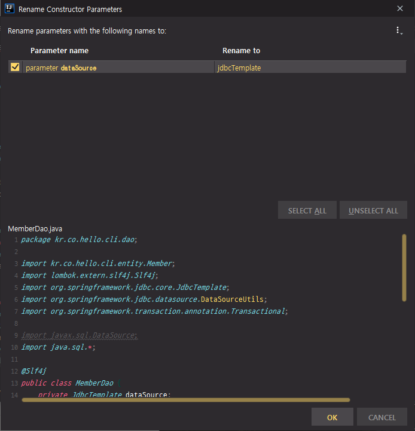
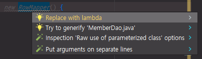

# 21. 스프링 프로젝트 - CLI 프로그램

## 프로젝트 진행 방향


기존에 만들었던 cli를 리팩토링

리팩토링한 코드를 web 프로젝트로 개발


* cli 리팩토링 대상
  * 기존에 xml과 어노테이션 동시에 실습 => xml 관련 부분 삭제
  * 불필요한 class 삭제
  * jdbc를 직접 사용했었다. Connection 객체를 직접 호출하는 식의 코드를 작성했다. 실제로 그렇게 만들면 web 프로젝트에서 thread 관련해서 처리하기 힘들다. DataSource를 보통 많이 사용한다. Connection 대신 DataSource를 이용해서 동시 접속에 대해서 처리하기 편하도록 변경한다.
  * Layer에 대한 개념 없이 cli 프로그램을 작성했는데 Controller, Service, Dao 같은 식으로 layer를 구성해서 프로그램을 작성할 것이다.
  * Spring에서는 PlatformTransactionManager라는 것을 제공한다. DataSource를 이용해서 Transaction을 간단하게 사용할 수 있다.


이후 Spring MVC를 붙여서 기존에 DB 관련해서 작업했던 프로젝트를 web 프로젝트로 변경을 하고, Spring security를 붙여서 인증까지 붙인다.


## 불필요한 파일 삭제

cli 패키지 하위에 있는 validation과 service 패키지를 삭제한다.

aop 패키지에 있는 Main과 Service 클래스 삭제

aop 패키지에 있는 TransactionBean을 cli 패키지로 옮기기

aop 패키지 삭제


어노테이션 기반으로만 Spring 설정을 할 것이기 때문에 불필요한 xml 설정 삭제

=> dao.xml, application.xml 삭제


편리성을 위해서 기존에 application.properties를 default와 dev로 나눴다.

AppConfig.java

```java
package kr.co.hello.cli;

import org.springframework.beans.factory.annotation.Value;
import org.springframework.context.annotation.*;
import org.springframework.validation.beanvalidation.LocalValidatorFactoryBean;

import java.sql.Connection;

@Configuration
@PropertySource("classpath:application-default.properties")
@EnableAspectJAutoProxy
public class AppConfig {
    @Bean
    public Connection connection(ConnectionFactory connectionFactory) {
        return connectionFactory.getConnection();
    }

    @Bean
    public Dao dao(Connection connection) {
        return new Dao(connection);
    }

    @Bean(initMethod = "init", destroyMethod = "destroy")
    public ConnectionFactory connectionFactory(
            @Value("${jdbc.driver-class}") String driverClass,
            @Value("${jdbc.url}") String url,
            @Value("${jdbc.username}") String username,
            @Value("${jdbc.password}") String password
    ) {
        return new ConnectionFactory(driverClass, url, username, password);
    }

    @Bean
    public LocalValidatorFactoryBean localValidatorFactoryBean() {
        return new LocalValidatorFactoryBean();
    }
}
```

@PropertySource를 default로 해주고 @Profile 제거

프로필 정보를 주지 않아도 프로그램을 동작할 수 있도록 수정

MyService 부분 삭제


## ConnectionFactory로 만들었던 부분을 DataSource로 변경

동시에 DB를 접속하고자 할 경우에는 DataSource라는 것을 사용해야 한다.

구글에 java se api 검색

[Java API - Overview (Java Platform SE 7 )](https://docs.oracle.com/javase/7/docs/api/)

[javax.sql](https://docs.oracle.com/javase/7/docs/api/javax/sql/package-summary.html) 패키지 하위를 보면 [DataSource](https://docs.oracle.com/javase/7/docs/api/javax/sql/DataSource.html)라는 인터페이스가 있다.

DataSource는 인터페이스이므로 여러 구현체가 있다.

주로 많이 사용하는 것은 hikaricp라는 DataSource이다.

구글에 hikaricp 검색

[brettwooldridge/HikariCP: 光 HikariCP・A solid, high ... - GitHub](https://github.com/brettwooldridge/HikariCP)

이 DataSource는 Spring Boot 2.0 부터는 기본 DataSource로 변경되었기 때문에 Spring에서도 hikaricp를 많이 사용하는 편이다.

Java 8 thru 11 maven artifact:

```xml
    <dependency>
        <groupId>com.zaxxer</groupId>
        <artifactId>HikariCP</artifactId>
        <version>3.4.2</version>
    </dependency>
```

사이트에 나와있는 의존성 복사 => pom.xml에 의존성 추가


**JMH Benchmarks**


DataSource는 많은 구현체가 있다.

c3p0, dbcp2, tomcat등 여러가지가 있는데 hikaricp가 훨씬 더 성능이 월등하게 Benchmarking이 되었기 때문에 지금은 거의 성능때문에 hikaricp를 많이 사용하는 편이다.


hikaricp를 사용하기 위해서는 [Initialization](https://github.com/brettwooldridge/HikariCP#initialization)에 있는 코드를 그대로 복사하면 된다.

Initialization하는 부분에 대해서 HikariConfig 부분 그대로 복사

```java
HikariConfig config = new HikariConfig();
config.setJdbcUrl("jdbc:mysql://localhost:3306/simpsons");
config.setUsername("bart");
config.setPassword("51mp50n");
config.addDataSourceProperty("cachePrepStmts", "true");
config.addDataSourceProperty("prepStmtCacheSize", "250");
config.addDataSourceProperty("prepStmtCacheSqlLimit", "2048");

HikariDataSource ds = new HikariDataSource(config);
```


AppConfig.java

```java
package kr.co.hello.cli;

import com.zaxxer.hikari.HikariConfig;
import com.zaxxer.hikari.HikariDataSource;
import org.springframework.beans.factory.annotation.Value;
import org.springframework.context.annotation.*;
import org.springframework.validation.beanvalidation.LocalValidatorFactoryBean;

import javax.sql.DataSource;

@Configuration
@PropertySource("classpath:application-default.properties")
@EnableAspectJAutoProxy
public class AppConfig {
    @Bean
    public DataSource dataSource(
            @Value("${jdbc.driver-class}") String driverClass,
            @Value("${jdbc.url}") String url,
            @Value("${jdbc.username}") String username,
            @Value("${jdbc.password}") String password
    ) {
        HikariConfig config = new HikariConfig();
        config.setDriverClassName(driverClass);
        config.setJdbcUrl(url);
        config.setUsername(username);
        config.setPassword(password);
        return new HikariDataSource(config);
    }

    @Bean
    public Dao dao(DataSource dataSource) {
        return new Dao(dataSource);
    }

    @Bean
    public LocalValidatorFactoryBean localValidatorFactoryBean() {
        return new LocalValidatorFactoryBean();
    }
}
```

bean을 하나 추가한다.

HikariDataSource(config)를 return 해준다.

ConnectionFactory에서 넣었던 설정을 그대로 복사해서 붙여넣는다.

jdbc.driver-class 부분은 application-default.properties에서 key와 value 쌍으로 입력을 해두었다.

이 정보를 매칭되는 setter에 넣어준다.

옵션에 관련되어 있는 정보는 필요 없으므로 삭제

이렇게 하면 DataSource가 하나 만들어졌다.

Connection, ConnectionFactory은 불필요하므로 삭제

dao 선언 부분 DataSource 아래로 내리기

위에 DataSource를 선언하고, 이 DataSource를 사용하는 dao 선언

dao에 Connection이 아닌 DataSource로 변경


Dao.java

```java
package kr.co.hello.cli;

import lombok.extern.slf4j.Slf4j;

import javax.sql.DataSource;
import java.sql.*;

@Slf4j
public class Dao {
    private DataSource dataSource;

    public Dao(DataSource dataSource) {
        this.dataSource = dataSource;
    }

    public void insert() throws SQLException {
        Statement statement = dataSource.getConnection().createStatement();
        statement.executeUpdate("insert into member(username, password) values('MyName', '1234')");
    }

    public void print() throws SQLException {
        Statement statement = dataSource.getConnection().createStatement();
        ResultSet resultSet = statement.executeQuery("select id, username, password from member");
        while(resultSet.next()){
            Member member = new Member(resultSet);
            log.info(member.toString());
        }
    }
}
```

Dao 생성자 타입 변경

Dao 생성자의 Connection 마우스 오른쪽 클릭 => Refactor => Type Migration => javax.sql.DataSource 입력 => Refactor => View Usages => Migrate

type이 변경된다.

기존에 사용했던 코드들이 에러가 난다.

connection 필드에 커서를 두고 Shift + F6 => dataSource 입력 후 Enter


dataSource에 getConnection이라는 메서드가 있으므로 getConnection() 추가

(util을 통해서 getConnection 하는 것이 더 안전하다.)

insert 메서드에서 RuntimeException 던지는 부분 제거


이렇게 해서 DataSource를 통해서 Connection을 가져오는 것으로 Refactoring을 했다.


main 메서드 실행

```
Exception in thread "main" org.springframework.beans.factory.UnsatisfiedDependencyException: Error creating bean with name 'transactionBean': Unsatisfied dependency expressed through constructor parameter 0; nested exception is org.springframework.beans.factory.NoSuchBeanDefinitionException: No qualifying bean of type 'java.sql.Connection' available: expected at least 1 bean which qualifies as autowire candidate. Dependency annotations: {}
```

에러가 발생한다.

transactionBean 에서 Connection을 못 사용해서 그렇다.


TransactionBean에서 Transaction을 할 때 문제점이 발생된다.

DataSource에서 제공하는 getConnection과 TransactionBean에서 사용할 수 있는 Connection은 같은 Connection이라고 볼 수 없다.

TransactionBean을 그대로 사용할 수 없는 상황이 발생

=> 기존 코드 동작하지 않도록 주석 처리 (@Aspect와 TransactionBean 클래스 내부)


Main.java

```java
package kr.co.hello.cli;
import lombok.extern.slf4j.Slf4j;
import org.springframework.context.annotation.AnnotationConfigApplicationContext;

import javax.sql.DataSource;
import java.sql.*;

@Slf4j
class Main {
	public static void main(String[] args) throws SQLException {
		AnnotationConfigApplicationContext context = new AnnotationConfigApplicationContext();
		context.register(AppConfig.class);
		context.register(TransactionBean.class);
		context.refresh();

		createTable(context.getBean(DataSource.class).getConnection());

		Dao dao = context.getBean(Dao.class);
		dao.insert();
		dao.print();

		context.close();
	}

	public static void createTable(Connection connection) throws SQLException {
		connection.createStatement()
				.execute("create table member(id int auto_increment, username varchar(255) not null, password varchar(255) not null, primary key(id));");
	}
}
```

"Hello world!!" 로그 삭제

Connection을 직접 호출할 수 없으므로 DataSource를 호출하게 하고 getConnection으로 Connection을 전달한다.


main 메서드 실행

```
INFO  com.zaxxer.hikari.HikariDataSource - HikariPool-1 - Starting...
INFO  com.zaxxer.hikari.HikariDataSource - HikariPool-1 - Start completed.
INFO  o.h.validator.internal.util.Version - HV000001: Hibernate Validator 6.1.2.Final
INFO  kr.co.hello.cli.Dao - Member(id=1, username=MyName, password=1234)
INFO  com.zaxxer.hikari.HikariDataSource - HikariPool-1 - Shutdown initiated...
INFO  com.zaxxer.hikari.HikariDataSource - HikariPool-1 - Shutdown completed.
```

기존과 동일하게 코드가 동작되는 것을 확인


## Transaction을 Spring에서 제공하는 Transaction으로 변경

DataSource 인터페이스를 사용한 것이기 때문에 이 인터페이스를 이용해서 Spring은 DataSource PlatformTransactionManager라는 것을 제공한다.

pom.xml

```xml
...
        <dependency>
            <groupId>org.springframework</groupId>
            <artifactId>spring-tx</artifactId>
            <version>5.2.4.RELEASE</version>
        </dependency>
        <dependency>
            <groupId>org.springframework</groupId>
            <artifactId>spring-jdbc</artifactId>
            <version>5.2.4.RELEASE</version>
        </dependency>
...
```

spring-tx 라는 Transaction과 관련되어있는 의존성 추가

spring-jdbc라는 의존성 추가


AppConfig.java

```java
package kr.co.hello.cli;

import com.zaxxer.hikari.HikariConfig;
import com.zaxxer.hikari.HikariDataSource;
import org.springframework.beans.factory.annotation.Value;
import org.springframework.context.annotation.*;
import org.springframework.jdbc.datasource.DataSourceTransactionManager;
import org.springframework.transaction.PlatformTransactionManager;
import org.springframework.transaction.annotation.EnableTransactionManagement;
import org.springframework.validation.beanvalidation.LocalValidatorFactoryBean;

import javax.sql.DataSource;

@Configuration
@PropertySource("classpath:application-default.properties")
@EnableAspectJAutoProxy
@EnableTransactionManagement
public class AppConfig {
    @Bean
    public DataSource dataSource(
            @Value("${jdbc.driver-class}") String driverClass,
            @Value("${jdbc.url}") String url,
            @Value("${jdbc.username}") String username,
            @Value("${jdbc.password}") String password
    ) {
        HikariConfig config = new HikariConfig();
        config.setDriverClassName(driverClass);
        config.setJdbcUrl(url);
        config.setUsername(username);
        config.setPassword(password);
        return new HikariDataSource(config);
    }

    @Bean
    public Dao dao(DataSource dataSource) {
        return new Dao(dataSource);
    }

    @Bean
    public PlatformTransactionManager platformTransactionManager(DataSource dataSource) {
        return new DataSourceTransactionManager(dataSource);
    }

    @Bean
    public LocalValidatorFactoryBean localValidatorFactoryBean() {
        return new LocalValidatorFactoryBean();
    }
}
```

@EnableTransactionManagement 어노테이션 추가

PlatformTransactionManager를 추가해줘야 한다.

DataSourceTransactionManager를 return 해준다. DataSource를 기반으로 TransactionManager를 해준다. DataSource를 받아서 넣어준다.


Dao.java

```java
package kr.co.hello.cli;

import lombok.extern.slf4j.Slf4j;
import org.springframework.transaction.annotation.Transactional;

import javax.sql.DataSource;
import java.sql.*;

@Slf4j
public class Dao {
    private DataSource dataSource;

    public Dao(DataSource dataSource) {
        this.dataSource = dataSource;
    }

    @Transactional
    public void insert() throws SQLException {
        Statement statement = dataSource.getConnection().createStatement();
        statement.executeUpdate("insert into member(username, password) values('MyName', '1234')");
    }

    public void print() throws SQLException {
        Statement statement = dataSource.getConnection().createStatement();
        ResultSet resultSet = statement.executeQuery("select id, username, password from member");
        while(resultSet.next()){
            Member member = new Member(resultSet);
            log.info(member.toString());
        }
    }
}
```

Dao 클래스의 insert에서는 Transaction이 필요하다. => @Transactional이라고 어노테이션만 붙여주면 Transaction 기능을 사용할 수 있다.

print는 select문만 있으므로 Transaction할 필요가 없다.


main 메서드 실행

```
INFO  com.zaxxer.hikari.HikariDataSource - HikariPool-1 - Starting...
INFO  com.zaxxer.hikari.HikariDataSource - HikariPool-1 - Start completed.
INFO  o.h.validator.internal.util.Version - HV000001: Hibernate Validator 6.1.2.Final
INFO  kr.co.hello.cli.Dao - Member(id=1, username=MyName, password=1234)
INFO  com.zaxxer.hikari.HikariDataSource - HikariPool-1 - Shutdown initiated...
INFO  com.zaxxer.hikari.HikariDataSource - HikariPool-1 - Shutdown completed.
```

기존 코드와 별 차이 없이 동작된다.


Transaction이 제대로 동작되는지 확인이 불가능하므로 log를 변경한다.

logback.xml

```xml
<configuration>
  <appender name="STDOUT" class="ch.qos.logback.core.ConsoleAppender">
    <encoder>
      <pattern>%-5level %logger{36} - %msg%n</pattern>
    </encoder>
  </appender>

  <logger name="org.springframework.jdbc" level="debug" />

  <root level="info">
    <appender-ref ref="STDOUT" />
  </root>
</configuration>
```

springframework.jdbc 관련 로그를 debug로 변경


main 메서드 실행

```
INFO  com.zaxxer.hikari.HikariDataSource - HikariPool-1 - Starting...
INFO  com.zaxxer.hikari.HikariDataSource - HikariPool-1 - Start completed.
INFO  o.h.validator.internal.util.Version - HV000001: Hibernate Validator 6.1.2.Final
DEBUG o.s.j.d.DataSourceTransactionManager - Creating new transaction with name [kr.co.hello.cli.Dao.insert]: PROPAGATION_REQUIRED,ISOLATION_DEFAULT
DEBUG o.s.j.d.DataSourceTransactionManager - Acquired Connection [HikariProxyConnection@223975178 wrapping conn1: url=jdbc:h2:mem:test user=SA] for JDBC transaction
DEBUG o.s.j.d.DataSourceTransactionManager - Switching JDBC Connection [HikariProxyConnection@223975178 wrapping conn1: url=jdbc:h2:mem:test user=SA] to manual commit
DEBUG o.s.j.d.DataSourceTransactionManager - Initiating transaction commit
DEBUG o.s.j.d.DataSourceTransactionManager - Committing JDBC transaction on Connection [HikariProxyConnection@223975178 wrapping conn1: url=jdbc:h2:mem:test user=SA]
DEBUG o.s.j.d.DataSourceTransactionManager - Releasing JDBC Connection [HikariProxyConnection@223975178 wrapping conn1: url=jdbc:h2:mem:test user=SA] after transaction
INFO  kr.co.hello.cli.Dao - Member(id=1, username=MyName, password=1234)
INFO  com.zaxxer.hikari.HikariDataSource - HikariPool-1 - Shutdown initiated...
INFO  com.zaxxer.hikari.HikariDataSource - HikariPool-1 - Shutdown completed.
```

DataSourceTransactionManager - Creating new transaction => Transaction이 시작된 것을 확인할 수 있다.

manual commit

select를 한 다음에 Member를 찍는 것을 확인할 수 있다.


## 코드 리팩토링

dao라는 패키지를 만들고 DB access에 관련된 오브젝트들을 옮기기

cli 패키지에 dao 패키지 생성 => Dao 클래스를 dao 패키지로 옮기기


dao를 사용하는 service layer를 만든다.

cli 패키지에 service 패키지 생성


controller layer 추가

cli 패키지에 controller 패키지 생성


설정과 관련이 있는 config 패키지 추가

cli 패키지에 config 패키지 생성 => AppConfig 클래스를 config 패키지로 옮기기


DataSource를 통해서 사용하기 때문에 ConnectionFactory는 사용하지 않는다.

ConnectionFactory 클래스 삭제


cli 패키지에 entity 패키지 생성

DB에 관련되어 있는 객체와 mapping되는 entity들을 옮긴다.

Member 클래스를 entity 패키지로 옮긴다.


TransactionBean은 사용하지 않으므로 삭제한다.

Main 클래스에 있는 `context.register(TransactionBean.class)` 코드 삭제


Main 클래스를 제외한 나머지는 모두 패키지 하위로 들어가게 되었다.


web MVC를 사용해서 하는 형태로 패키지 구조를 개선했다.


---


Dao 클래스

실제로는 Connection을 통해서 사용하는 것이 아니고 JdbcTemplate을 사용해서 query를 날린다.

현재 코드는 DB Rollback이 제대로 되지 않는 현상이 발생한다.


rollback이 되는지 확인

Dao.java

```java
...
    @Transactional
    public void insert() throws SQLException {
        Statement statement = dataSource.getConnection().createStatement();
        statement.executeUpdate("insert into member(username, password) values('MyName', '1234')");
        throw new RuntimeException("db error");
    }
...
```

insert 메서드에서 RuntimeException 던지기


Main.java

```java
package kr.co.hello.cli;
import lombok.extern.slf4j.Slf4j;
import org.springframework.context.annotation.AnnotationConfigApplicationContext;

import javax.sql.DataSource;
import java.sql.*;

@Slf4j
class Main {
	public static void main(String[] args) throws SQLException {
		AnnotationConfigApplicationContext context = new AnnotationConfigApplicationContext();
		context.register(AppConfig.class);
		context.register(TransactionBean.class);
		context.refresh();

		createTable(context.getBean(DataSource.class).getConnection());

		Dao dao = context.getBean(Dao.class);
		try {
			dao.insert();
		} catch (Exception e) {}
		dao.print();

		context.close();
	}

	public static void createTable(Connection connection) throws SQLException {
		connection.createStatement()
				.execute("create table member(id int auto_increment, username varchar(255) not null, password varchar(255) not null, primary key(id));");
	}
}
```

dao.insert() 부분에서 에러가 나면 더 이상 프로그램이 진행하지 않기 때문에 간단하게 Exception Handling만 한다.


main 메서드 동작시키기

```
INFO  com.zaxxer.hikari.HikariDataSource - HikariPool-1 - Starting...
INFO  com.zaxxer.hikari.HikariDataSource - HikariPool-1 - Start completed.
INFO  o.h.validator.internal.util.Version - HV000001: Hibernate Validator 6.1.2.Final
DEBUG o.s.j.d.DataSourceTransactionManager - Creating new transaction with name [kr.co.hello.cli.Dao.insert]: PROPAGATION_REQUIRED,ISOLATION_DEFAULT
DEBUG o.s.j.d.DataSourceTransactionManager - Acquired Connection [HikariProxyConnection@223975178 wrapping conn1: url=jdbc:h2:mem:test user=SA] for JDBC transaction
DEBUG o.s.j.d.DataSourceTransactionManager - Switching JDBC Connection [HikariProxyConnection@223975178 wrapping conn1: url=jdbc:h2:mem:test user=SA] to manual commit
DEBUG o.s.j.d.DataSourceTransactionManager - Initiating transaction rollback
DEBUG o.s.j.d.DataSourceTransactionManager - Rolling back JDBC transaction on Connection [HikariProxyConnection@223975178 wrapping conn1: url=jdbc:h2:mem:test user=SA]
DEBUG o.s.j.d.DataSourceTransactionManager - Releasing JDBC Connection [HikariProxyConnection@223975178 wrapping conn1: url=jdbc:h2:mem:test user=SA] after transaction
INFO  kr.co.hello.cli.Dao - Member(id=1, username=MyName, password=1234)
INFO  com.zaxxer.hikari.HikariDataSource - HikariPool-1 - Shutdown initiated...
INFO  com.zaxxer.hikari.HikariDataSource - HikariPool-1 - Shutdown completed.
```

이 코드에서는 rollback 하는 코드가 없다. 그러나 AOP를 통해서 Proxy 객체가 만들어지고 Proxy 객체가 commit이나 rollback을 시켜준다.

transaction rollback을 했다는 것을 log를 통해서 확인할 수 있다.

rollback을 했는데도 불구하고 INFO에 기존에 insert한 것들이 그대로 찍힌다. => 프로그래밍을 잘못해서 그렇다.


Dao.java

```java
...
    @Transactional
    public void insert() throws SQLException {
        Statement statement = dataSource.getConnection().createStatement();
        statement.executeUpdate("insert into member(username, password) values('MyName', '1234')");
        throw new RuntimeException("db error");
    }
...
```

getConnection을 여기서 불러들였다.

DataSource에서 내부적으로 사용하는 Connection을 사용해야 하는데 명시적으로 getConnection으로 만들어서 다른 Transaction으로 동작하게 될 수밖에 없는 구조이다.

DataSource를 제대로 사용하기 위해서는 dataSource에서 getConnection을 통해서 새로운 Connection을 만드는 것이 아닌 DataSourceUtils라는 것을 통해서 현재 thread에서 사용되는 Connection을 직접 가져와야 한다. Spring이 자동으로 편리하게 사용할 수 있도록 Util 클래스를 만들어줬다. 우리는 그냥 사용하기만 하면 된다.


Dao.java

```java
package kr.co.hello.cli.dao;

import kr.co.hello.cli.entity.Member;
import lombok.extern.slf4j.Slf4j;
import org.springframework.jdbc.datasource.DataSourceUtils;
import org.springframework.transaction.annotation.Transactional;

import javax.sql.DataSource;
import java.sql.*;

@Slf4j
public class Dao {
    private DataSource dataSource;

    public Dao(DataSource dataSource) {
        this.dataSource = dataSource;
    }

    @Transactional
    public void insert() throws SQLException {
        Statement statement = DataSourceUtils.getConnection(dataSource).createStatement();
        statement.executeUpdate("insert into member(username, password) values('MyName', '1234')");
        throw new RuntimeException("db error");
    }

    public void print() throws SQLException {
        Statement statement = DataSourceUtils.getConnection(dataSource).createStatement();
        ResultSet resultSet = statement.executeQuery("select id, username, password from member");
        while(resultSet.next()){
            Member member = new Member(resultSet);
            log.info(member.toString());
        }
    }
}
```

DataSourceUtils라고 하는 클래스 안에 getConnection 메서드를 호출

getConnection 안에 dataSource만 넣어주면, 이 thread에서는 같은 Connection을 사용한다.

기존에 getConnection을 썼던 것들을 수정


main 메서드 실행

```
INFO  com.zaxxer.hikari.HikariDataSource - HikariPool-1 - Starting...
INFO  com.zaxxer.hikari.HikariDataSource - HikariPool-1 - Start completed.
INFO  o.h.validator.internal.util.Version - HV000001: Hibernate Validator 6.1.2.Final
DEBUG o.s.j.d.DataSourceTransactionManager - Creating new transaction with name [kr.co.hello.cli.dao.Dao.insert]: PROPAGATION_REQUIRED,ISOLATION_DEFAULT
DEBUG o.s.j.d.DataSourceTransactionManager - Acquired Connection [HikariProxyConnection@1991094835 wrapping conn1: url=jdbc:h2:mem:test user=SA] for JDBC transaction
DEBUG o.s.j.d.DataSourceTransactionManager - Switching JDBC Connection [HikariProxyConnection@1991094835 wrapping conn1: url=jdbc:h2:mem:test user=SA] to manual commit
DEBUG o.s.j.d.DataSourceTransactionManager - Initiating transaction rollback
DEBUG o.s.j.d.DataSourceTransactionManager - Rolling back JDBC transaction on Connection [HikariProxyConnection@1991094835 wrapping conn1: url=jdbc:h2:mem:test user=SA]
DEBUG o.s.j.d.DataSourceTransactionManager - Releasing JDBC Connection [HikariProxyConnection@1991094835 wrapping conn1: url=jdbc:h2:mem:test user=SA] after transaction
DEBUG o.s.jdbc.datasource.DataSourceUtils - Fetching JDBC Connection from DataSource
INFO  com.zaxxer.hikari.HikariDataSource - HikariPool-1 - Shutdown initiated...
INFO  com.zaxxer.hikari.HikariDataSource - HikariPool-1 - Shutdown completed.
```

rollback이 되고, 그 다음에 아까전에 보였던 print문이 나오지 않는다.

rollback이 제대로 된 것을 확인할 수 있다.


Dao 클래스가 Member에 관련되어 있는 Dao이므로 MemberDao로 이름을 변경한다. (Shift + F6 이용)


Dao.java의 insert 메서드 RuntimeException 던지는 부분 제거


---


추가적으로 DataSource에 직접 Statement를 넣는것도 방법이기는 하지만, JdbcTemplate이라는 것을 이용해서 한 단계 추상화된 level로 jdbc 프로그래밍을 할 수 있다.


AppConfig.java

```java
package kr.co.hello.cli.config;

import com.zaxxer.hikari.HikariConfig;
import com.zaxxer.hikari.HikariDataSource;
import kr.co.hello.cli.dao.MemberDao;
import org.springframework.beans.factory.annotation.Value;
import org.springframework.context.annotation.*;
import org.springframework.jdbc.core.JdbcTemplate;
import org.springframework.jdbc.datasource.DataSourceTransactionManager;
import org.springframework.transaction.PlatformTransactionManager;
import org.springframework.transaction.annotation.EnableTransactionManagement;
import org.springframework.validation.beanvalidation.LocalValidatorFactoryBean;

import javax.sql.DataSource;

@Configuration
@PropertySource("classpath:application-default.properties")
@EnableAspectJAutoProxy
@EnableTransactionManagement
public class AppConfig {
    @Bean
    public DataSource dataSource(
            @Value("${jdbc.driver-class}") String driverClass,
            @Value("${jdbc.url}") String url,
            @Value("${jdbc.username}") String username,
            @Value("${jdbc.password}") String password
    ) {
        HikariConfig config = new HikariConfig();
        config.setDriverClassName(driverClass);
        config.setJdbcUrl(url);
        config.setUsername(username);
        config.setPassword(password);
        return new HikariDataSource(config);
    }

    @Bean
    public JdbcTemplate jdbcTemplate(DataSource dataSource) {
        return new JdbcTemplate(dataSource);
    }

    @Bean
    public MemberDao dao(JdbcTemplate jdbcTemplate) {
        return new MemberDao(jdbcTemplate);
    }

    @Bean
    public PlatformTransactionManager platformTransactionManager(DataSource dataSource) {
        return new DataSourceTransactionManager(dataSource);
    }

    @Bean
    public LocalValidatorFactoryBean localValidatorFactoryBean() {
        return new LocalValidatorFactoryBean();
    }
}
```

JdbcTemplate을 bean으로 추가, DataSource를 넣어준다. 이렇게 하면 JdbcTemplate을 사용할 준비가 된 것이다.

MemberDao에는 DataSource를 직접 넣어주는 것이 아닌 JdbcTemplate으로 변경을 한다.


MemberDao.java

```java
package kr.co.hello.cli.dao;

import kr.co.hello.cli.entity.Member;
import lombok.extern.slf4j.Slf4j;
import org.springframework.jdbc.core.JdbcTemplate;
import org.springframework.jdbc.core.RowMapper;
import org.springframework.jdbc.datasource.DataSourceUtils;
import org.springframework.transaction.annotation.Transactional;

import java.sql.*;
import java.util.List;

@Slf4j
public class MemberDao {
    private JdbcTemplate jdbcTemplate;

    public MemberDao(JdbcTemplate jdbcTemplate) {
        this.jdbcTemplate = jdbcTemplate;
    }

    @Transactional
    public void insert() throws SQLException {
        jdbcTemplate.update("insert into member(username, password) values('MyName', '1234')");
    }

    public void print() throws SQLException {
        List list = jdbcTemplate.query("select id, username, password from member", new RowMapper() {
            @Override
            public Object mapRow(ResultSet resultSet, int i) throws SQLException {
                return null;
            }
        });
    }
}
```

MemberDao 클래스 필드의 DataSource를 Type Migration 한다.(Ctrl + Shift + F6)

=> JdbcTemplate으로 변경 => Refactor => View Usages => Migrate


dataSource는 Shift + F6을 이용해 이름 변경 => jdbcTemplate




기존에 DataSourceUtils.getConnection 이라고 해서 하나의 Transaction으로 관리했던 것들을 JdbcTemplate은 간단하게 추상화를 해준다.

jdbcTemplate.update를 해서 query를 넣어준다.

DataSource가 없기 때문에 마찬가지로 print문도 JdbcTemplate으로 변경한다.

JdbcTemplate을 사용하면 resultSet에서 data를 가져오는 형태보다 훨씬 더 간편하게 제공을 해준다.

jdbcTemplate.query라고 한 다음 기존 query를 그대로 복사해온다. RowMapper를 인자로 넣어준다.

RowMapper는 mapRow라고 하는 하나의 메서드만 가지고 있는 인터페이스이다.


이를 통해서 List를 반환한다.


MemberDao.java

```java
package kr.co.hello.cli.dao;

import kr.co.hello.cli.entity.Member;
import lombok.extern.slf4j.Slf4j;
import org.springframework.jdbc.core.JdbcTemplate;
import org.springframework.transaction.annotation.Transactional;

import java.sql.*;
import java.util.List;

@Slf4j
public class MemberDao {
    private JdbcTemplate jdbcTemplate;

    public MemberDao(JdbcTemplate jdbcTemplate) {
        this.jdbcTemplate = jdbcTemplate;
    }

    @Transactional
    public void insert() throws SQLException {
        jdbcTemplate.update("insert into member(username, password) values('MyName', '1234')");
    }

    public void print() throws SQLException {
        List<Member> list = jdbcTemplate.query("select id, username, password from member",
                (resultSet, i) -> new Member(resultSet));
        list.forEach(x -> log.info(">> Member: " + x.getUsername() + "/" + x.getPassword()));
    }
}
```

mapRow의 정의로 이동

하나의 메서드만 가지고 있기 때문에 @FunctionalInterface이다. FunctionalInterface는 lambda로 사용할 수 있다. 그러므로 IntelliJ에서 Replace with lambda를 선택해 자동으로 변경



첫 번째 부분은 resultSet이고, 두 번째 부분은 Row의 order 번호이다.

Member 클래스에서 resultSet을 받아와 알아서 객체에 주입하도록 하였다.

=> Member에 resultSet을 넣어준다.

List는 Member를 받는다. RowMapper도 type을 Member로 지정한다.

=> type 추론이 가능하므로 `RowMapper<Member>` 지우기

List에 값을 가져오고 forEach를 통해서 Member 값을 찍는다.


JdbcTemplate을 통해서 조금 더 간단하게 코드를 구현할 수 있다.


logback.xml

```xml
<configuration>
  <appender name="STDOUT" class="ch.qos.logback.core.ConsoleAppender">
    <encoder>
      <pattern>%-5level %logger{36} - %msg%n</pattern>
    </encoder>
  </appender>

<!--  <logger name="org.springframework.jdbc" level="debug" />-->

  <root level="info">
    <appender-ref ref="STDOUT" />
  </root>
</configuration>
```

info level만 찍도록 한다.


main 메서드 실행

```
INFO  com.zaxxer.hikari.HikariDataSource - HikariPool-1 - Starting...
INFO  com.zaxxer.hikari.HikariDataSource - HikariPool-1 - Start completed.
INFO  o.h.validator.internal.util.Version - HV000001: Hibernate Validator 6.1.2.Final
INFO  kr.co.hello.cli.dao.MemberDao - >> Member: MyName/1234
INFO  com.zaxxer.hikari.HikariDataSource - HikariPool-1 - Shutdown initiated...
INFO  com.zaxxer.hikari.HikariDataSource - HikariPool-1 - Shutdown completed.
```

Member가 찍히는 것을 확인할 수 있다.


MemberDao.java

```java
...
    @Transactional
    public void insert() throws SQLException {
        jdbcTemplate.update("insert into member(username, password) values('MyName', '1234')");
        throw new RuntimeException("");
    }
...
```

Exception을 날린다.


main 메서드 실행

```
INFO  com.zaxxer.hikari.HikariDataSource - HikariPool-1 - Starting...
INFO  com.zaxxer.hikari.HikariDataSource - HikariPool-1 - Start completed.
INFO  o.h.validator.internal.util.Version - HV000001: Hibernate Validator 6.1.2.Final
INFO  com.zaxxer.hikari.HikariDataSource - HikariPool-1 - Shutdown initiated...
INFO  com.zaxxer.hikari.HikariDataSource - HikariPool-1 - Shutdown completed.
```

rollback이 되고, Member라는 log를 찍지 않을 것을 확인할 수 있다.


MemberDao 클래스의 insert 메서드에서 Exception을 날리는 부분 제거

---


Dao 객체가 여러 개인 경우 Dao마다 @Transactional을 하면 기존의 connection을 쓸지 어떻게 할지 이런것들이 꼬이는 경우가 있다.

보통 service layer로 하나에 묶어서 Transaction을 관리한다.

=> service layer를 하나 만든다.

service 패키지에 MemberService 클래스 생성


MemberService.java

```java
package kr.co.hello.cli.service;

import kr.co.hello.cli.dao.MemberDao;
import lombok.AllArgsConstructor;
import org.springframework.transaction.annotation.Transactional;

import java.sql.SQLException;

@AllArgsConstructor
public class MemberService {
    private MemberDao memberDao;

    @Transactional
    public void insert() throws SQLException {
        memberDao.insert();
    }

    public void print() throws SQLException {
        memberDao.print();
    }
}
```

MemberDao 필드 추가, 생성자 추가(@AllArgsConstructor)

insert 메서드 추가, memberDao의 insert 호출, throws로 날리기

마찬가지로 print라는 Dao level에서 했던 것과 동일한 메서드 생성

그리고 @Transactional을 insert 메서드 위에 추가한다.

insert 메서드 내에서 비즈니스 로직이 상당히 돌게 될 것이다.

그리고 여러 DB 관련되어 있는 코드들이 동작할 것이다.

그 중에 중간에 알 수 없는 에러가 나와서 그 밑에 있는 코드가 실행되지 않고 rollback을 해야하는 상황에서는 service layer에서 @Transactional을 넣는 것이 훨씬 더 편하다.

각각의 Dao level에서 @Transactional 어노테이션을 붙이는 것보다.

그러므로 @Transactional을 service layer에 붙인다.


MemberDao.java

```java
...
    public void insert() throws SQLException {
        jdbcTemplate.update("insert into member(username, password) values('MyName', '1234')");
    }
...
```

=> MemberDao 클래스 insert 메서드 위쪽에 있는 @Transactional 어노테이션 제거


---


MemberService 클래스를 호출하는 Controller를 만든다.

controller 패키지에 MemberController 클래스 생성


MemberController.java

```java
package kr.co.hello.cli.controller;

import kr.co.hello.cli.service.MemberService;
import lombok.AllArgsConstructor;
import lombok.extern.slf4j.Slf4j;

@AllArgsConstructor
@Slf4j
public class MemberController {
    private MemberService memberService;

    public void insert() {
        try {
            memberService.insert();
        } catch (Exception e) {
            log.error(e.getMessage());
        }
    }

    public void print() {
        try {
            memberService.print();
        } catch (Exception e) {
            log.error(e.getMessage());
        }
    }
}
```

MemberService를 필드로 갖는다. @AllArgsConstructor 어노테이션 추가

기존에 service layer에서 사용했던 것을 그대로 메서드로 만든다.

Error Handling은 이쪽에서 한 번 처리해보도록 한다. try/catch문 추가

@Slf4j 어노테이션 추가

에러 메시지를 찍는다.

insert와 마찬가지로 print도 추가


---


새로 만들었던 service와 controller를 bean으로 등록한다.

AppConfig.java

```java
...
    @Bean
    public MemberService service(MemberDao dao) {
        return new MemberService(dao);
    }

    @Bean
    public MemberController controller(MemberService service) {
        return new MemberController(service);
    }
...
```


---


사용자의 input을 받는 형태로 변경

Main.java

```java
package kr.co.hello.cli;
import kr.co.hello.cli.config.AppConfig;
import kr.co.hello.cli.controller.MemberController;
import lombok.extern.slf4j.Slf4j;
import org.springframework.context.annotation.AnnotationConfigApplicationContext;

import javax.sql.DataSource;
import java.sql.*;
import java.util.Scanner;

@Slf4j
class Main {
	public static void main(String[] args) throws SQLException {
		AnnotationConfigApplicationContext context = new AnnotationConfigApplicationContext();
		context.register(AppConfig.class);
		context.refresh();
		createTable(context.getBean(DataSource.class).getConnection());

		System.out.println("================ 사용자의 username, password를 입력해주세요. ================");

		Scanner scanner = new Scanner(System.in);
		System.out.println("username: ");
		String username = scanner.nextLine();
		System.out.println("password: ");
		String password = scanner.nextLine();

		MemberController controller = context.getBean(MemberController.class);
		controller.insert(username, password);
		controller.print();
		context.close();
	}

	public static void createTable(Connection connection) throws SQLException {
		connection.createStatement()
				.execute("create table member(id int auto_increment, username varchar(255) not null, password varchar(255) not null, primary key(id));");
	}
}
```

dao.insert(), dao.print(), getBean 부분 지우기

Scanner를 통해서 입력을 받는다.

Scanner를 통해 입력받은 값을 Controller에 넣는다.

먼저 getBean으로 controller를 가져온다.

controller에서 insert를 하는데 username, password를 전달한다. => Change signature

print를 해준다.


MemberController.java

```java
...
    public void insert(String username, String password) {
        try {
            memberService.insert(username, password);
        } catch (Exception e) {
            log.error(e.getMessage());
        }
    }
...
```

insert 메서드가 Change signature에 의해 username, password를 받아오도록 변경된 것을 확인할 수 있다.

마찬가지로 memberService.insert()에 username, password을 추가하고 Change signature


MemberService.java

```java
...
    @Transactional
    public void insert(String username, String password) throws SQLException {
        memberDao.insert(username, password);
    }
...
```

username, password 추가 후 Change signature


MemberDao.java

```java
...
    public void insert(String username, String password) throws SQLException {
        jdbcTemplate.update("insert into member(username, password) values(?, ?)", username, password);
    }
...
```

values에서 ? (물음표)를 넣고, 물음표에 순서대로 변수가 할당되므로 username, password를 순서대로 넣어준다.


AppConfig.java

```java
...
        @Bean
    public JdbcTemplate jdbcTemplate(DataSource dataSource) {
        return new JdbcTemplate(dataSource);
    }

    @Bean
    public MemberDao memberDao(JdbcTemplate jdbcTemplate) {
        return new MemberDao(jdbcTemplate);
    }

    @Bean
    public MemberService memberService(MemberDao memberDao) {
        return new MemberService(memberDao);
    }

    @Bean
    public MemberController memberController(MemberService memberService) {
        return new MemberController(memberService);
    }

    @Bean
    public PlatformTransactionManager platformTransactionManager(DataSource dataSource) {
        return new DataSourceTransactionManager(dataSource);
    }

    @Bean
    public LocalValidatorFactoryBean localValidatorFactoryBean() {
        return new LocalValidatorFactoryBean();
    }
...
```


main 메서드 실행

```
INFO  com.zaxxer.hikari.HikariDataSource - HikariPool-1 - Starting...
INFO  com.zaxxer.hikari.HikariDataSource - HikariPool-1 - Start completed.
INFO  o.h.validator.internal.util.Version - HV000001: Hibernate Validator 6.1.2.Final
================ 사용자의 username, password를 입력해주세요. ================
username: 
MyName
password: 
1234
INFO  kr.co.hello.cli.dao.MemberDao - >> Member: MyName/1234
INFO  com.zaxxer.hikari.HikariDataSource - HikariPool-1 - Shutdown initiated...
INFO  com.zaxxer.hikari.HikariDataSource - HikariPool-1 - Shutdown completed.
```

username과 password를 입력해서 원하는대로 동작하는 것을 확인할 수 있다.


Spring Transaction과 jdbc를 이용해서 cil 프로그램을 리팩토링했다.

