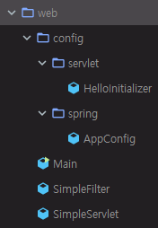
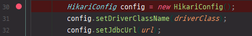

# 22. 스프링 프로젝트 - WEB 프로그램

기존 CLI 프로그램을 WEB 프로그램으로 변경


## 기존 CLI 프로그램

Main 클래스를 기준으로 Spring을 load하고, Spring을 load 하기 위해서 config 패키지에 있는 @Configuration 어노테이션이 있는 AppConfig에서 Transaction에 관련되어 있는 DataSource와 JdbcTemplate, 그리고 service logic에 관련되어 있는 것들을 Bean으로 만들어서 Spring Container에 사용할 수 있도록 하였다.

그리고 CLI 인터페이스에서 Control 역할을 하는 Controller를 만들었다.

Data Access Object도 만들었다.

그리고 DB에 데이터를 담기 위해서 저장하는 entity 객체를 만들었다.

Business Logic이 있는 service layer를 만들었다.


이런 패키지 구조를 웹 프로그램으로 변경


## 기존 WEB 프로그램

기존에 WEB 프로그램을 돌릴 수 있도록 web 패키지 하위에 간단하게 작업을 해두었다.

Main 클래스에서 tomcat을 띄우고, 기존에 tomcat에 war 파일을 넣어주는 것과는 다르게 이번 애플리케이션에서는 내부적으로 embedded tomcat을 만들어서 tomcat을 띄우고 띄운 tomcat에 Spring을 붙이는 작업을 할 것이다.

tomcat을 띄우는 작업을 먼저 했었다.

tomcat.addWebapp 을 하고, tomcat을 start 하고, tomcat이 끝날 때까지 기다린다.

Filter도 했었고, Servlet도 만들었다.

webapp 패키지에는 index.jsp라는 파일이 있었다.


web\Main 클래스의 main 메서드 실행

```
...
INFO: Starting ProtocolHandler ["http-nio-8080"]
```


http://localhost:8080/


index.jsp 에서 Welcome!!이 동작


index.jsp

```jsp
<html>
<body>
<h2> Welcome!! hello world </h2>
</body>
</html>
```


tomcat 인스턴스를 띄운 것에 Spring을 붙여서 Spring을 이용한 web 프로젝트로 변경


## servlet 관련 설정

web 패키지에 config 패키지를 만든다.

config 패키지에 아무 파일 하나 생성

config 패키지에 servlet 패키지와 spring 패키지 생성

config 패키지에 생성했던 파일 제거


Spring은 servlet에 관련되어 있는 모듈을 제공한다.

https://search.maven.org/

spring-webmvc 검색


5.2.4.RELEASE => dependency 복사

```xml
<dependency>
  <groupId>org.springframework</groupId>
  <artifactId>spring-webmvc</artifactId>
  <version>5.2.4.RELEASE</version>
</dependency>
```

pom.xml에 추가

Maven 탭에서 해당 dependency가 추가되었는지 확인


config\servlet 패키지 하위에 HelloInitializer 클래스 생성

HelloInitializer.java

```java
package kr.co.hello.web.config.servlet;

import org.springframework.web.WebApplicationInitializer;
import org.springframework.web.context.ContextLoaderListener;
import org.springframework.web.context.support.AnnotationConfigWebApplicationContext;
import org.springframework.web.servlet.DispatcherServlet;

import javax.servlet.ServletContext;
import javax.servlet.ServletException;
import javax.servlet.ServletRegistration;

public class HelloInitializer implements WebApplicationInitializer {
    @Override
    public void onStartup(ServletContext container) throws ServletException {
        // Create the 'root' Spring application context
        AnnotationConfigWebApplicationContext rootContext = new AnnotationConfigWebApplicationContext();
//        rootContext.register(AppConfig.class);

        // Manage the lifecycle of the root application context
        container.addListener(new ContextLoaderListener(rootContext));

        // Create the dispatcher servlet's Spring application context
        AnnotationConfigWebApplicationContext dispatcherContext = new AnnotationConfigWebApplicationContext();
//        dispatcherContext.register(DispatcherConfig.class);

        // Register and map the dispatcher servlet
        ServletRegistration.Dynamic dispatcher = container.addServlet("dispatcher", new DispatcherServlet(dispatcherContext));
        dispatcher.setLoadOnStartup(1);
        dispatcher.addMapping("/");
    }
}
```

WebApplicationInitializer라는 인터페이스는 onStartup이라는 하나의 메서드를 가지고 있는 인터페이스이다. onStartup을 override 한다.

구글에 WebApplicationInitializer 검색

[WebApplicationInitializer (Spring Framework 5.2.4.RELEASE ...](https://docs.spring.io/spring/docs/current/javadoc-api/org/springframework/web/WebApplicationInitializer.html)

WebApplicationInitializer는 Servlet 3.0+ 환경에서 구현되어 있는 인터페이스로, 기존에 web.xml로 Servlet 설정을 하던 것과는 다르게 프로그램으로 설정할 수 있는 Servlet Context이다.

```xml
<servlet>
    <servlet-name>dispatcher</servlet-name>
    <servlet-class>
        org.springframework.web.servlet.DispatcherServlet
    </servlet-class>
    <init-param>
        <param-name>contextConfigLocation</param-name>
        <param-value>/WEB-INF/spring/dispatcher-config.xml</param-value>
    </init-param>
    <load-on-startup>1</load-on-startup>
</servlet>

<servlet-mapping>
    <servlet-name>dispatcher</servlet-name>
    <url-pattern>/</url-pattern>
</servlet-mapping>
```

기존에는 web.xml에 servlet과 servlet-mapping을 설정해주었다.

```java
public class MyWebAppInitializer implements WebApplicationInitializer {
    @Override
    public void onStartup(ServletContext container) {
        XmlWebApplicationContext appContext = new XmlWebApplicationContext();
        appContext.setConfigLocation("/WEB-INF/spring/dispatcher-config.xml");

        ServletRegistration.Dynamic dispatcher =
            container.addServlet("dispatcher", new DispatcherServlet(appContext));
        dispatcher.setLoadOnStartup(1);
        dispatcher.addMapping("/");
    }
}
```

WebApplicationInitializer를 이용한 방식은 onStartup 메서드를 Override를 해주고 Spring에 관련된 설정들을 해주는 방식이다.

```java
public class MyWebAppInitializer implements WebApplicationInitializer {
    @Override
    public void onStartup(ServletContext container) {
        // Create the 'root' Spring application context
        AnnotationConfigWebApplicationContext rootContext =
            new AnnotationConfigWebApplicationContext();
        rootContext.register(AppConfig.class);

        // Manage the lifecycle of the root application context
        container.addListener(new ContextLoaderListener(rootContext));

        // Create the dispatcher servlet's Spring application context
        AnnotationConfigWebApplicationContext dispatcherContext =
            new AnnotationConfigWebApplicationContext();
        dispatcherContext.register(DispatcherConfig.class);

        // Register and map the dispatcher servlet
        ServletRegistration.Dynamic dispatcher =
            container.addServlet("dispatcher", new DispatcherServlet(dispatcherContext));
        dispatcher.setLoadOnStartup(1);
        dispatcher.addMapping("/");
    }
}
```

xml 설정이 아닌 어노테이션 방식을 사용. AnnotationConfigWebApplicationContext에 관련해서 설정

이 예제에 있는 내용 복사 => HelloInitializer의 onStartup 메서드 안에 붙여넣기

register 부분은 주석처리. 필요한 것들에 대해서 import 한다.

여기에서 container는 ServletContext를 의미한다. => onStartup 메서드 매개변수 수정

WebApplicationInitializer를 추가해주면 이 자체가 Spring Container가 동작을 하는 것이다.


AnnotationConfigWebApplicationContext 클래스를 타고 들어가면 ApplicationContext 를 볼 수 있다.

먼저 rootContext를 하나 만들고 Container에 Listener를 추가한다.

마찬가지로 ApplicationContext 인터페이스를 구현한 AnnotationConfigWebApplicationContext 클래스인 dispatcherContext를 만든다. rootContext 하위에서 동작하는 Spring이다.

dispatcherContext 라는 Container에도 servlet을 추가해주고, 그 servlet 에서는 mapping을 root url 이하로는 이 dispatcher가 동작하도록 만든다.


dispatcher를 여러개 만들어서 `addMapping("/a")`, `addMapping("/b")` 같은 식으로 하면 분기를 태울 수 있다. a로 시작하는 URL 패턴인 경우와 b로 시작하는 URL 패턴인 경우 각각 서로 다른 servlet을 태울 수 있다.

보통은 root 하나만 잡아서 하나의 dispatcher만 사용한다.


---

HelloInitializer.java

```java
package kr.co.hello.web.config.servlet;

import kr.co.hello.web.config.spring.AppConfig;
import org.springframework.web.WebApplicationInitializer;
import org.springframework.web.context.ContextLoaderListener;
import org.springframework.web.context.support.AnnotationConfigWebApplicationContext;
import org.springframework.web.servlet.DispatcherServlet;

import javax.servlet.ServletContext;
import javax.servlet.ServletException;
import javax.servlet.ServletRegistration;

public class HelloInitializer implements WebApplicationInitializer {
    @Override
    public void onStartup(ServletContext container) throws ServletException {
        // Create the 'root' Spring application context
        AnnotationConfigWebApplicationContext rootContext = new AnnotationConfigWebApplicationContext();
        rootContext.register(AppConfig.class);

        // Manage the lifecycle of the root application context
        container.addListener(new ContextLoaderListener(rootContext));

        // Create the dispatcher servlet's Spring application context
        AnnotationConfigWebApplicationContext dispatcherContext = new AnnotationConfigWebApplicationContext();
//        dispatcherContext.register(DispatcherConfig.class);

        // Register and map the dispatcher servlet
        ServletRegistration.Dynamic dispatcher = container.addServlet("dispatcher", new DispatcherServlet(dispatcherContext));
        dispatcher.setLoadOnStartup(1);
        dispatcher.addMapping("/");
    }
}
```

rootContext에 AppConfig

기존에 AppConfig를 만들어둔 것이 있다. import를 받을 수 있는데, 이것과 동일하게 cli\config 패키지에 있는 AppConfig.java 파일을 web\config\spring 패키지로 옮긴다.

cil 패키지에 있는 config 패키지 삭제



HelloInitializer 에서 AppConfig를 register 하는 부분 주석 해제, AppConfig를 import

AppConfig에 있는 것을 잘 가지고 오는지 확인 => DataSource Bean을 읽어들이는지 확인

AppConfig.java



HelloInitializer.java


Main 클래스를 디버깅으로 실행


먼저 WebApplicationInitializer라는 것을 구현한 onStartup 쪽에 breakpoint가 걸린 것을 확인할 수 있다.


F9를 눌러 계속 진행


AppConfig 에 있는 bean 설정에서도 bean으로 등록되는 것을 확인할 수 있다.


WebApplicationInitializer를 tomcat에 설정해주지 않았는데 이 클래스를 읽어서 onStartup이 된 이유는 매뉴얼쪽에 detected automatically 라고 해서 자동으로 찾기 때문에 설정을 하지 않아도 된다. Spring에서 관례적으로 지원하는 기능이다.


Spring Container가 떴다는 것을 확인했다.


## WEB 프로젝트 띄우기

URL을 이용해서 특정 html을 화면에 보여주기


web 패키지에 controller 라는 패키지 생성

controller 패키지에 MemberController 클래스 생성

MemberController.java

```java
package kr.co.hello.web.controller;

import org.springframework.http.ResponseEntity;
import org.springframework.stereotype.Controller;
import org.springframework.web.bind.annotation.RequestMapping;

@Controller
public class MemberController {
    @RequestMapping("/hello")
    public ResponseEntity<String> hello() {
        return ResponseEntity.ok("hello world");
    }
}
```

@Controller 어노테이션 붙이기

@RequestMapping 이라는 이름으로 어떤 URL에 들어올 때 처리를 해 줄 것인지 설정. "/hello"

ResponseEntity로 간단하게 글자만 찍는 응답 객체를 만든다.


---


Controller를 Spring Container에 등록하기 위해서 MVC에 관련된 설정을 진행한다.

config\spring 패키지에 MvcConfig 클래스 생성

MvcConfig.java

```java
package kr.co.hello.web.config.spring;

import org.springframework.context.annotation.ComponentScan;
import org.springframework.context.annotation.Configuration;
import org.springframework.web.servlet.config.annotation.EnableWebMvc;

@Configuration
@EnableWebMvc
@ComponentScan("kr.co.hello.web.controller")
public class MvcConfig {
}
```

@Configuration와 @EnableWebMvc 어노테이션을 붙여주면 프로젝트에서 Web MVC를 사용할 수 있게 된다.

controller에 관련되어 있는 @ComponentScan을 해줘야한다.

controller 패키지 마우스 오른쪽 클릭 => Copy Reference 하면 패키지 이름으로 복사할 수 있다.

controller 패키지 하위의 MemberController를 scan할 것이다. MemberController에 붙어있는 @Controller도 @Component라고 하는 Bean이기 때문에다.


---


HelloInitializer.java

```java
...
        // Create the 'root' Spring application context
        AnnotationConfigWebApplicationContext rootContext = new AnnotationConfigWebApplicationContext();
        rootContext.register(AppConfig.class);
        rootContext.register(MvcConfig.class);
...
```

HelloInitializer라는 servlet 설정에 config 설정을 등록해야 한다.

MvcConfig.class를 register 한다.

AppConfig와 MvcConfig가 Spring Container에 등록된다.


main 메서드 실행

tomcat이 뜨고 Spring Container가 올라간다.

/hello 라는 URL 패턴으로 controller를 만들었었다.

http://localhost:8080/hello


controller가 동작하는 것을 확인할 수 있다.


---


기존에 CLI 프로그램에서 만들었던 member insert, member print 등을 Controller에 연동

cil 패키지 하위에 있는 dao 패키지를 그대로 web 패키지 하위로 이동


OK => REFACTOR


마찬가지로 dao를 호출하는 service 패키지에 있는 모든 것을 web 패키지로 이동 (service 패키지 통째로 web 패키지로 이동)

entity 패키지도 web 패키지로 이동


controller에 관련되어 있는 것은 Spring MVC의 Controller로 대체가 될 것이므로 필요한 메서드만 확인

cli\controller\MemberController.java

```java
package kr.co.hello.cli.controller;

import kr.co.hello.web.service.MemberService;
import lombok.AllArgsConstructor;
import lombok.extern.slf4j.Slf4j;

@AllArgsConstructor
@Slf4j
public class MemberController {
    private MemberService memberService;

    public void insert(String username, String password) {
        try {
            memberService.insert(username, password);
        } catch (Exception e) {
            log.error(e.getMessage());
        }
    }

    public void print() {
        try {
            memberService.print();
        } catch (Exception e) {
            log.error(e.getMessage());
        }
    }
}
```

insert와 print 메서드가 있다. `memberService.insert(username, password);` 와 `memberService.print();` 부분을 web\controller\MemberController.java 로 옮긴다.


web\controller\MemberController.java

```java
package kr.co.hello.web.controller;

import org.springframework.http.ResponseEntity;
import org.springframework.stereotype.Controller;
import org.springframework.web.bind.annotation.RequestMapping;

@Controller
public class MemberController {
    @RequestMapping("/hello")
    public ResponseEntity<String> hello() {
        return ResponseEntity.ok("hello world");
    }

//    memberService.insert(username, password);
//    memberService.print();
}
```


cli 패키지 삭제

cli는 다 삭제되었고 web 프로젝트만 남았다.


---


Controller를 통해서 DB에 있는 것을 콘솔에 출력하는 print 서비스 동작시키기

MemberController.java

```java
package kr.co.hello.web.controller;

import kr.co.hello.web.service.MemberService;
import org.springframework.beans.factory.annotation.Autowired;
import org.springframework.stereotype.Controller;
import org.springframework.web.bind.annotation.RequestMapping;

@Controller
public class MemberController {
    @Autowired
    MemberService memberService;

    @RequestMapping("/index")
    public void index() {
        memberService.print();
    }

    @RequestMapping("/create")
    public void create() {
        memberService.insert("username", "password");
    }
}
```

기존에 만들었던 hello 메서드 지우기

index라는 이름으로 @RequestMapping 을 만든다.

memberService.print() 로 DB에 있는 것을 출력한다.

MemberService를 @Autowired 해준다.

create라는 이름으로 @RequestMapping 을 만든다.

insert에서 username과 password에 값을 넣는다.


MemberService.java

```java
package kr.co.hello.web.service;

import kr.co.hello.web.dao.MemberDao;
import lombok.AllArgsConstructor;
import org.springframework.transaction.annotation.Transactional;

@AllArgsConstructor
public class MemberService {
    private MemberDao memberDao;

    @Transactional
    public void insert(String username, String password) {
        memberDao.insert(username, password);
    }

    public void print() {
        memberDao.print();
    }
}
```

print와 insert의 throws SQLException 부분을 지운다.


MemberDao.java

```java
package kr.co.hello.web.dao;

import kr.co.hello.web.entity.Member;
import lombok.extern.slf4j.Slf4j;
import org.springframework.jdbc.core.JdbcTemplate;

import java.util.List;

@Slf4j
public class MemberDao {
    private JdbcTemplate jdbcTemplate;

    public MemberDao(JdbcTemplate jdbcTemplate) {
        this.jdbcTemplate = jdbcTemplate;
    }

    public void insert(String username, String password) {
        jdbcTemplate.update("insert into member(username, password) values(?, ?)", username, password);
    }

    public void print() {
        List<Member> list = jdbcTemplate.query("select id, username, password from member",
                (resultSet, i) -> new Member(resultSet));
        list.forEach(x -> log.info(">> Member: " + x.getUsername() + "/" + x.getPassword()));
    }
}
```

print와 insert의 throws SQLException 부분을 지운다.


기존에 jdbc 프로그램을 이용했기 때문에 throw를 날렸는데, JdbcTemplate은 Exception을 날리지 않기 때문에 특별하게 throw를 하지 않아도 된다.


AppConfig.java

```java
package kr.co.hello.web.config.spring;

import com.zaxxer.hikari.HikariConfig;
import com.zaxxer.hikari.HikariDataSource;
import kr.co.hello.web.dao.MemberDao;
import kr.co.hello.web.service.MemberService;
import org.springframework.beans.factory.annotation.Value;
import org.springframework.context.annotation.*;
import org.springframework.jdbc.core.JdbcTemplate;
import org.springframework.jdbc.datasource.DataSourceTransactionManager;
import org.springframework.transaction.PlatformTransactionManager;
import org.springframework.transaction.annotation.EnableTransactionManagement;
import org.springframework.validation.beanvalidation.LocalValidatorFactoryBean;

import javax.sql.DataSource;

@Configuration
@PropertySource("classpath:application-default.properties")
@EnableAspectJAutoProxy
@EnableTransactionManagement
public class AppConfig {
    @Bean
    public DataSource dataSource(
            @Value("${jdbc.driver-class}") String driverClass,
            @Value("${jdbc.url}") String url,
            @Value("${jdbc.username}") String username,
            @Value("${jdbc.password}") String password
    ) {
        HikariConfig config = new HikariConfig();
        config.setDriverClassName(driverClass);
        config.setJdbcUrl(url);
        config.setUsername(username);
        config.setPassword(password);
        return new HikariDataSource(config);
    }

    @Bean
    public JdbcTemplate jdbcTemplate(DataSource dataSource) {
        return new JdbcTemplate(dataSource);
    }

    @Bean
    public MemberDao memberDao(JdbcTemplate jdbcTemplate) {
        return new MemberDao(jdbcTemplate);
    }

    @Bean
    public MemberService memberService(MemberDao memberDao) {
        return new MemberService(memberDao);
    }

    @Bean
    public PlatformTransactionManager platformTransactionManager(DataSource dataSource) {
        return new DataSourceTransactionManager(dataSource);
    }

    @Bean
    public LocalValidatorFactoryBean localValidatorFactoryBean() {
        return new LocalValidatorFactoryBean();
    }
}
```

MemberController bean은 불필요하므로 삭제한다.


Build는 Ctrl + F9이다.


MemberController에서 web 페이지로 응답을 넣지 않았다. void 이기 때문

=> breakpoint로 확인

MemberController 클래스 index 메서드의 memberService.print() 부분에 breakpoint

디버그

http://localhost:8080/index 접속


F9를 눌러 계속 진행

```
org.h2.jdbc.JdbcSQLSyntaxErrorException: Table "MEMBER" not found; SQL statement:
```

에러 메시지가 뜬다. Table "MEMBER" not found


기존 cli 프로그램에서는 MEMBER Table을 만들어주는 것을 해줬었는데 지금은 그런 작업이 없기 때문이다.

다양한 방법으로 Table을 만들 수 있는데, DataSource가 사용하는 설정에서 h2 database를 사용하고 있고, 메모리 DB이기 때문에 JVM 인스턴스가 올라갈 때마다 초기화된다. (AppConfig.java 파일과 application-default.properties 파일 확인)


MemberDao.java

```java
package kr.co.hello.web.dao;

import kr.co.hello.web.entity.Member;
import lombok.extern.slf4j.Slf4j;
import org.springframework.jdbc.core.JdbcTemplate;

import javax.annotation.PostConstruct;
import java.util.List;

@Slf4j
public class MemberDao {
    private JdbcTemplate jdbcTemplate;

    @PostConstruct
    void init() {
        jdbcTemplate.update("create table member(id int auto_increment, username varchar(255) not null, password varchar(255) not null, primary key(id));");
        jdbcTemplate.update("insert into member(username, password) values('MyName', '1234')");
    }

    public MemberDao(JdbcTemplate jdbcTemplate) {
        this.jdbcTemplate = jdbcTemplate;
    }

    public void insert(String username, String password) {
        jdbcTemplate.update("insert into member(username, password) values(?, ?)", username, password);
    }

    public void print() {
        List<Member> list = jdbcTemplate.query("select id, username, password from member",
                (resultSet, i) -> new Member(resultSet));
        list.forEach(x -> log.info(">> Member: " + x.getUsername() + "/" + x.getPassword()));
    }
}
```

간단하게 할 수 있는 방법은 @PostConstruct 어노테이션을 이용한다.

init 메서드를 추가하고 초기화 코드를 넣는다. jdbcTemplate.update를 이용해 member table 생성, 데이터 추가


디버그

```
...
INFO  kr.co.hello.web.dao.MemberDao - >> Member: MyName/1234
...
javax.servlet.ServletException: Circular view path [index]: would dispatch back to the current handler URL [/index] again. Check your ViewResolver setup! (Hint: This may be the result of an unspecified view, due to default view name generation.)
```

ViewResolver를 setup을 하라고 나와있다. 단순하게 void로 하다보니 ViewResolver 관련해서 에러가 났다.

그 전에 cli 프로그램이 동작했다. Member 테이블에 값이 있으면 List로 값을 출력하는 프로그램을 넣어뒀었다. MemberDao의 print 부분. 콘솔에 찍히는 것을 확인할 수 있다.


---


ViewResolver에 대해서 setup을 해줘야 한다.

ViewResolver가 하는 역할은 Spring Controller가 모든 business logic을 태우고 DB 작업을 한 다음에 html로 응답을 할 때 html을 view로 보면 되는데, 거기에 대해서 처리를 해주는 것이다.

tomcat에서는 기본적으로 jsp를 사용한다. jsp를 원래는 기본적으로 설정해주지 않는다. 

File => Settings => Editor => File Types


Community Edition으로는 jsp를 지원하지 않는다.

그러므로 jsp 문법을 Community Edition에서는 편하게 사용할 수 없다.


html 확장자를 사용한 Thymeleaf를 사용하면 Community Edition으로도 충분히 View를 구현할 수 있다.

구글에 Thymeleaf 검색

[Thymeleaf](https://www.thymeleaf.org/)

Docs를 보면 Spring에 관련해서 Thymeleaf 매뉴얼이 있다.

Thymeleaf + Spring => Thymeleaf 3.0: [Read online](https://www.thymeleaf.org/doc/tutorials/3.0/thymeleafspring.html)

[4.3 Spring MVC configuration](https://www.thymeleaf.org/doc/tutorials/3.0/thymeleafspring.html#spring-mvc-configuration)

WebMvcConfigurerAdapter 라는 것을 확장하고 그 아래에 View 설정을 하는 것들에 대한 설명이 나와있다.


Thymeleaf 에 대한 dependency 추가

https://search.maven.org/

thymeleaf-spring 검색


3.0.11.RELEASE => dependency 복사

```xml
<dependency>
  <groupId>org.thymeleaf</groupId>
  <artifactId>thymeleaf-spring5</artifactId>
  <version>3.0.11.RELEASE</version>
</dependency>
```

pom.xml에 dependency 추가


MvcConfig.java

```java
package kr.co.hello.web.config.spring;

import org.springframework.beans.factory.annotation.Autowired;
import org.springframework.context.ApplicationContext;
import org.springframework.context.annotation.Bean;
import org.springframework.context.annotation.ComponentScan;
import org.springframework.context.annotation.Configuration;
import org.springframework.web.servlet.config.annotation.EnableWebMvc;
import org.springframework.web.servlet.config.annotation.WebMvcConfigurer;
import org.thymeleaf.spring5.SpringTemplateEngine;
import org.thymeleaf.spring5.templateresolver.SpringResourceTemplateResolver;
import org.thymeleaf.spring5.view.ThymeleafViewResolver;
import org.thymeleaf.templatemode.TemplateMode;

@Configuration
@EnableWebMvc
@ComponentScan("kr.co.hello.web.controller")
public class MvcConfig implements WebMvcConfigurer {
    @Autowired
    ApplicationContext applicationContext;
    @Bean
    public SpringResourceTemplateResolver templateResolver(){
        SpringResourceTemplateResolver templateResolver = new SpringResourceTemplateResolver();
        templateResolver.setApplicationContext(this.applicationContext);
        templateResolver.setPrefix("/WEB-INF/templates/");
        templateResolver.setSuffix(".html");
        templateResolver.setTemplateMode(TemplateMode.HTML);
        templateResolver.setCacheable(false);
        return templateResolver;
    }

    @Bean
    public SpringTemplateEngine templateEngine(){
        SpringTemplateEngine templateEngine = new SpringTemplateEngine();
        templateEngine.setTemplateResolver(templateResolver());
        templateEngine.setEnableSpringELCompiler(true);
        return templateEngine;
    }

    @Bean
    public ThymeleafViewResolver viewResolver(){
        ThymeleafViewResolver viewResolver = new ThymeleafViewResolver();
        viewResolver.setTemplateEngine(templateEngine());
        return viewResolver;
    }
}
```

WebMvcConfigurerAdapter를 extends

templateResolver, templateEngine, viewResolver를 Bean으로 추가 (매뉴얼 복사)

import를 해준다.

this.applicationContext는 ApplicationContext를 추가해 줘야 하기 때문에 @Autowired로 ApplicationContext를 추가한다.

WebMvcConfigurerAdapter 정의로 이동. WebMvcConfigurerAdapter는 @deprecated 되었다. 

extends WebMvcConfigurerAdapter를 implements WebMvcConfigurer로 바꾼다.

먼저 templateResolver를 설정해준다.

templateResolver는 /WEB-INF/templates/ 폴더 밑에 html이 확장자 이름으로 되어 있는 것들을 자동으로 prefix, suffix 하겠다는 것이다.

templateResolver의 setCacheable은 false로 변경. true인 경우 Cache로 인해 새로고침 해도 바로바로 적용이 안 된다.

templateEngine 부분 그대로 사용.

viewResolver에 대해서 설정해준다.

실제로 설정할 부분은 Prefix, Suffix 부분


---


이 설정에 맞춰 폴더를 만들어야 한다.

webapp 폴더 마우스 오른쪽 클릭 => New Directory => WEB-INF/templates

templates 폴더에 index.html 파일 생성


index.html

```html
hello member list
```


MemberController.java

```java
package kr.co.hello.web.controller;

import kr.co.hello.web.service.MemberService;
import org.springframework.beans.factory.annotation.Autowired;
import org.springframework.stereotype.Controller;
import org.springframework.web.bind.annotation.RequestMapping;

@Controller
public class MemberController {
    @Autowired
    MemberService memberService;

    @RequestMapping("/index")
    public String index() {
        memberService.print();
        return "index";
    }

    @RequestMapping("/create")
    public void create() {
        memberService.insert("username", "password");
    }
}
```

MvcConfig 클래스에서 /WEB-INF/templates/ 폴더 하위에 .html 확장자 => index라는 글자는 MemberController에 추가 => 자동으로 앞뒤에 글자가 붙어 /WEB-INF/templates/index.html 처리가 된다.


http://localhost:8080/index


index.html 파일이 View로써 동작하는 것을 확인할 수 있다.


---


cli로 출력만하고 실제로 web으로는 보여주지 않는다.

기존에 있던 프로그램 리팩토링

void 처럼 print가 아닌 return 값을 주도록 해야한다.


MemberDao.java

```java
...
    public List<Member> print() {
        return jdbcTemplate.query("select id, username, password from member",
                (resultSet, i) -> new Member(resultSet));
    }
...
```

print 메서드가 void가 아닌 `List<Member>`를 return 하도록 처리해야한다.

=> forEach 구문 제거 => `List<Member> list =`을 return으로 바꾸기 => Alt + Enter => Make 'print' return ...


MemberService.java

```java
...
    public List<Member> list() {
        return memberDao.list();
    }
...
```

return 타입 변경

rename 기능을 이용해 list로 이름 변경 (Shift + F6)


MemberController.java

```java
package kr.co.hello.web.controller;

import kr.co.hello.web.entity.Member;
import kr.co.hello.web.service.MemberService;
import org.springframework.beans.factory.annotation.Autowired;
import org.springframework.stereotype.Controller;
import org.springframework.web.bind.annotation.RequestMapping;
import org.springframework.web.servlet.ModelAndView;

import java.util.List;

@Controller
public class MemberController {
    @Autowired
    MemberService memberService;

    @RequestMapping("/index")
    public ModelAndView index() {
        ModelAndView mv = new ModelAndView("index");
        List<Member> list = memberService.list();
        mv.addObject("members", list);
        return mv;
    }

    @RequestMapping("/create")
    public void create() {
        memberService.insert("username", "password");
    }
}
```

list라는 이름으로 member 값을 가져온다.

list에 담긴 member들의 값을 view에 전달해야 한다.

View에 전달하는 방법은 ModelAndView 라는 클래스가 있다.

ModelAndView 에 View의 이름을 넣어준다.

mv에 addObject로 members라는 이름으로 list를 담는다.

String이 아닌 mv 객체를 return 한다. return 타입을 ModelAndView 로 변경


index.html

```html
<html xmlns:th="http://www.w3.org/1999/xhtml">
<head></head>
<body>
    <ul th:each="member, iState : ${members}">
        <li th:text="${member.username}"></li>
        <li th:text="${member.password}"></li>
    </ul>
</body>
</html>
```

member를 화면에 출력하기

기존 내용 지우기

`html>head+body` 입력 후 Tab

th라는 prefix를 붙이면 Thymeleaf 를 사용할 수 있다.

th:each

MemberController에 attributeName을 members라고 붙여두었다.

members라는 이름으로 list를 불러온다.

th:text

실제 들어가 있는 member의 필드값(username, password)과 동일하게 설정

이렇게 해주면 View에서 for문을 돌아서 `<li>`를 여러개 찍는 것을 확인할 수 있다.


main 메서드 실행

http://localhost:8080/index


http://localhost:8080/create 2 번 방문

http://localhost:8080/index


여러 개가 만들어 지는 것을 확인할 수 있다.


## Bootstrap

bootstrap 붙이기

구글에 bootstrap 검색

[Bootstrap · The most popular HTML, CSS, and JS library in the ...](https://getbootstrap.com/)

Documentation

[Starter template](https://getbootstrap.com/docs/4.4/getting-started/introduction/#starter-template)

전체적인 bootstrap html 양식 복사


index.html

```html
<!--<html xmlns:th="http://www.w3.org/1999/xhtml">-->
<!--<head></head>-->
<!--<body>-->
<!--    <ul th:each="member, iState : ${members}">-->
<!--        <li th:text="${member.username}"></li>-->
<!--        <li th:text="${member.password}"></li>-->
<!--    </ul>-->
<!--</body>-->
<!--</html>-->
<!doctype html>
<html lang="en">
<head>
    <!-- Required meta tags -->
    <meta charset="utf-8">
    <meta name="viewport" content="width=device-width, initial-scale=1, shrink-to-fit=no">

    <!-- Bootstrap CSS -->
    <link rel="stylesheet" href="https://stackpath.bootstrapcdn.com/bootstrap/4.4.1/css/bootstrap.min.css" integrity="sha384-Vkoo8x4CGsO3+Hhxv8T/Q5PaXtkKtu6ug5TOeNV6gBiFeWPGFN9MuhOf23Q9Ifjh" crossorigin="anonymous">

    <title>Hello, world!</title>
</head>
<body>
    <h1>Hello, world!</h1>

    <!-- Optional JavaScript -->
    <!-- jQuery first, then Popper.js, then Bootstrap JS -->
    <script src="https://code.jquery.com/jquery-3.4.1.slim.min.js" integrity="sha384-J6qa4849blE2+poT4WnyKhv5vZF5SrPo0iEjwBvKU7imGFAV0wwj1yYfoRSJoZ+n" crossorigin="anonymous"></script>
    <script src="https://cdn.jsdelivr.net/npm/popper.js@1.16.0/dist/umd/popper.min.js" integrity="sha384-Q6E9RHvbIyZFJoft+2mJbHaEWldlvI9IOYy5n3zV9zzTtmI3UksdQRVvoxMfooAo" crossorigin="anonymous"></script>
    <script src="https://stackpath.bootstrapcdn.com/bootstrap/4.4.1/js/bootstrap.min.js" integrity="sha384-wfSDF2E50Y2D1uUdj0O3uMBJnjuUD4Ih7YwaYd1iqfktj0Uod8GCExl3Og8ifwB6" crossorigin="anonymous"></script>
</body>
</html>
```

기존에 있던 내용 주석처리

앞에서 복사한 내용 붙어넣기


main 메서드 실행

http://localhost:8080/index


bootstrap이 적용된 Hello, world! 가 나오는 것을 볼 수 있다.


---


화면을 bootstrap을 이용해서 변경

index.html

```html
...
<body>
    <div class="container">
        <div class="row justify-content-md-center">
            <div class="col-8">
                <form action="create">
                    <div class="form-group">
                        <label for="">Username</label>
                        <input type="text" class="form-control" placeholder="insert Username">
                    </div>
                    <div class="form-group">
                        <label for="">Password</label>
                        <input type="text" class="form-control" placeholder="insert Password">
                    </div>
                    <button type="submit" class="btn btn-primary">Submit</button>
                </form>
            </div>
        </div>
    </div>

    <script src="https://code.jquery.com/jquery-3.4.1.slim.min.js" integrity="sha384-J6qa4849blE2+poT4WnyKhv5vZF5SrPo0iEjwBvKU7imGFAV0wwj1yYfoRSJoZ+n" crossorigin="anonymous"></script>
    <script src="https://cdn.jsdelivr.net/npm/popper.js@1.16.0/dist/umd/popper.min.js" integrity="sha384-Q6E9RHvbIyZFJoft+2mJbHaEWldlvI9IOYy5n3zV9zzTtmI3UksdQRVvoxMfooAo" crossorigin="anonymous"></script>
    <script src="https://stackpath.bootstrapcdn.com/bootstrap/4.4.1/js/bootstrap.min.js" integrity="sha384-wfSDF2E50Y2D1uUdj0O3uMBJnjuUD4Ih7YwaYd1iqfktj0Uod8GCExl3Og8ifwB6" crossorigin="anonymous"></script>
</body>
...
```

html 태그의 lang 부분에 지우기

bootstrap은 container라는 class가 필요하고, row가 필요하다.

`div.container>div.row` 입력 후 Tab

8칸 짜리의 column을 만든다. `div.col-8` + Tab

그 안에 form 태그를 하나 만든다. `form[action=create]` + Tab

`div.form-group` + Tab

`laber` + Tab, `input` + Tab, placeholder 추가

`button[type=submit].btn.btn-primary` + Tab

div class="row" 에 justify-content-md-center 추가 => 중앙 정렬

input 태그에 class="form-control" 추가

http://localhost:8080/index


username과 password를 insert 할 때 상용할것이다.


---


index.html

```html
...
        <br/>
        <div class="row justify-content-md-center">
            <div class="col-8">
                <table class="table table-striped">
                    <thead>
                    <tr>
                        <th>#</th>
                        <th>Username</th>
                        <th>Password</th>
                    </tr>
                    </thead>
                    <tbody>
                    <tr>
                        <th>#</th>
                        <th>Username</th>
                        <th>Password</th>
                    </tr>
                    </tbody>
                </table>
            </div>
        </div>
...
```

table을 만든다. `table.table.table-striped` + Tab


http://localhost:8080/index


---


index.html

```html
<!doctype html>
<html xmlns:th="http://www.w3.org/1999/xhtml">
<head>
    <!-- Required meta tags -->
    <meta charset="utf-8">
    <meta name="viewport" content="width=device-width, initial-scale=1, shrink-to-fit=no">

    <!-- Bootstrap CSS -->
    <link rel="stylesheet" href="https://stackpath.bootstrapcdn.com/bootstrap/4.4.1/css/bootstrap.min.css" integrity="sha384-Vkoo8x4CGsO3+Hhxv8T/Q5PaXtkKtu6ug5TOeNV6gBiFeWPGFN9MuhOf23Q9Ifjh" crossorigin="anonymous">

    <title>Hello, world!</title>
</head>
<body>
    <div class="container">
        <div class="row justify-content-md-center">
            <div class="col-8">
                <form action="create">
                    <div class="form-group">
                        <label for="">Username</label>
                        <input type="text" class="form-control" placeholder="insert Username">
                    </div>
                    <div class="form-group">
                        <label for="">Password</label>
                        <input type="text" class="form-control" placeholder="insert Password">
                    </div>
                    <button type="submit" class="btn btn-primary">Submit</button>
                </form>
            </div>
        </div>
        <br/>
        <div class="row justify-content-md-center">
            <div class="col-8">
                <table class="table table-striped">
                    <thead>
                    <tr>
                        <th>#</th>
                        <th>Username</th>
                        <th>Password</th>
                    </tr>
                    </thead>
                    <tbody>
                    <tr th:each="member, iState : ${members}">
                        <th th:text="${iState.index + 1}"></th>
                        <th th:text="${member.username}"></th>
                        <th th:text="${member.password}"></th>
                    </tr>
                    </tbody>
                </table>
            </div>
        </div>
    </div>

    <script src="https://code.jquery.com/jquery-3.4.1.slim.min.js" integrity="sha384-J6qa4849blE2+poT4WnyKhv5vZF5SrPo0iEjwBvKU7imGFAV0wwj1yYfoRSJoZ+n" crossorigin="anonymous"></script>
    <script src="https://cdn.jsdelivr.net/npm/popper.js@1.16.0/dist/umd/popper.min.js" integrity="sha384-Q6E9RHvbIyZFJoft+2mJbHaEWldlvI9IOYy5n3zV9zzTtmI3UksdQRVvoxMfooAo" crossorigin="anonymous"></script>
    <script src="https://stackpath.bootstrapcdn.com/bootstrap/4.4.1/js/bootstrap.min.js" integrity="sha384-wfSDF2E50Y2D1uUdj0O3uMBJnjuUD4Ih7YwaYd1iqfktj0Uod8GCExl3Og8ifwB6" crossorigin="anonymous"></script>
</body>
</html>
```

만들어진 table에 기존에 주석처리 했던 부분 이용. ul 태그~

순서가 들어가는 부분에서는 `th:text="${iState.index + 1}"` 을 추가해준다.


http://localhost:8080/index


http://localhost:8080/create 여러 번 접속

http://localhost:8080/index


---


create라는 것을 submit 이라는 버튼을 붙여서 create를 하고 index 화면으로 넘어와서 입력한 데이터가 출력되도록 한다.


MemberController.java

```java
...
    @RequestMapping("/create")
    public ModelAndView create() {
        ModelAndView mv = new ModelAndView("index");
        memberService.insert("username", "password");
        return mv;
    }
...
```

create 메서드가 void가 아닌 ModelAndView를 반환하도록 한다.


http://localhost:8080/index 에서 Submit 버튼 클릭


list에 출력은 되지 않지만 index 페이지가 뜬 것을 확인할 수 있다.


http://localhost:8080/index로 다시 돌아오면 데이터가 입력된 것을 확인할 수 있다.


create에서는 ModelAndView에 members라는 model을 담지 않아서 그렇다.

방법은 두 가지이다.

첫 번째 방법 : MemberController index에 있는 부분을 그대로 복사해서 insert 후에 model에 담는 방법

MemberController.java

```java
...
    @RequestMapping("/create")
    public ModelAndView create() {
        ModelAndView mv = new ModelAndView("index");
        memberService.insert("username", "password");
        List<Member> list = memberService.list();
        mv.addObject("members", list);
        return mv;
    }
...
```


두 번째 방법 : ModelAndView가 아닌 redirect를 사용하면 된다.

MemberController.java

```java
...
    @RequestMapping("/create")
    public String create() {
        memberService.insert("username", "password");
        return "redirect:index";
    }
...
```

String을 반환

index를 redirect 하라고 하면 create를 하고 RequestMapping이 index를 동작해줘서 원하는대로 화면이 이동한다.


http://localhost:8080/index 에서 Submit을 누르면 데이터가 추가된다.


---


username, password 값이 고정적인데, form에 있는 값을 받아오기


web 패키지에 model 패키지 생성

model 패키지에 MemberDto 클래스 생성


MemberDto.java

```java
package kr.co.hello.web.model;

import lombok.Getter;
import lombok.Setter;

@Getter
@Setter
public class MemberDto {
    private String username;
    private String password;
}
```

@Getter, @Setter를 붙인다.

username, password 필드 생성

index.html에서 form에서 전달할 것과 동일한 이름으로 필드명을 만들어주면 된다.


index.html

```html
...
                <form action="create">
                    <div class="form-group">
                        <label for="">Username</label>
                        <input type="text" name="username" class="form-control" placeholder="insert Username">
                    </div>
                    <div class="form-group">
                        <label for="">Password</label>
                        <input type="text" name="password" class="form-control" placeholder="insert Password">
                    </div>
                    <button type="submit" class="btn btn-primary">Submit</button>
                </form>
...
```

input 태그에 name attribute 추가


MemberController.java

```java
...
    @RequestMapping("/create")
    public String create(MemberDto dto) {
        memberService.insert(dto.getUsername(), dto.getPassword());
        return "redirect:index";
    }
...
```

MemberDto를 MemberController 클래스 create 메서드의 argument로 넣어주면 된다.

"username" 대신 dto.getUsername(), "password" 대신 dto.getPassword()


http://localhost:8080/index

hello, world 입력 후 Submit


입력한 값이 들어가는 것을 확인할 수 있다.


