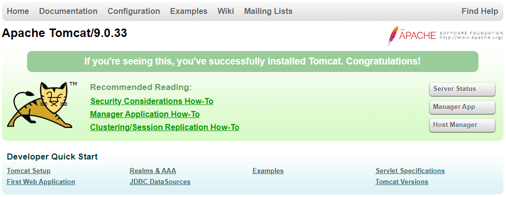

# 0. Web Application을 개발하기 위한 개발 환경 준비

## 다루는 내용

### Java

https://www.oracle.com/technetwork/java/javase/downloads/index.html

JDK 8 이상


### Maven

http://maven.apache.org/download.cgi

작성되어 있는 웹 애플리케이션 빌드, 배포


### IntelliJ IDEA

https://www.jetbrains.com/idea/


### Tomcat Server

http://tomcat.apache.org/download-80.cgi

개발한 웹 애플리케이션은 Apache Tomcat 웹 서버에서 기동이 된다. 개발자 모드와 운영 모드에서 실행


## JDK와 프로젝트 관리를 위한 Maven 도구

### JDK 8 이상

https://www.oracle.com/technetwork/java/javase/downloads/index.html

사이트 중간에 JDK Download 클릭 => Windows x64 Installer 버전 다운로드

JDK 설치 과정 진행


### 프로젝트 관리를 위한 Maven 도구

* Apache software foundation에서 개발한 Java 기반 프로젝트 관리
* 프로젝트의 컴파일, 빌드, 수행 및 테스트
* 서버 측 Deploy 자원과 라이브러리 관리

http://maven.apache.org/download.cgi

Binary zip archive 파일 다운로드

maven 압축 해제, 사용하기 편한 폴더로 이동


### 환경 변수 지정

시작 => '환경 변수' 검색 => 시스템 환경 변수 편집 => 환경 변수

사용자 변수 => 새로 만들기


변수 이름 : M2_HOME

변수 값 : maven 설치 경로. apache-maven-3.6.3


변수 이름 : JAVA_HOME

변수 값 : jdk 설치 경로. jdk-14


사용자 변수 => Path 환경 변수 편집 => 새로 만들기

%JAVA_HOME%\bin

%M2_HOME%\bin


우리가 실행하고자 하는 명령어는 jdk 폴더에 바로 저장되어 있는 것이 아니라 bin 디렉터리 안에 포함되어 있기 때문에 이 경로를 지정해 준 것이다.


터미널에서 확인

```bash
> java -version
> javac -version
> mvn -version
```


## 웹 애플리케이션 실행을 위한 Tomcat Server

### IntelliJ IDEA 개발 도구

* IDE, Integrated Development Environment
  * Net Beans
  * Eclipse
  * IntelliJ IDEA

IDE를 사용하면 프로그램 코딩 뿐만 아니라 빌드, 패키징, 컴파일, 테스트, 배포 등 모든 작업들을 하나의 개발 도구에서 할 수 있다.

https://www.jetbrains.com/idea/

DOWNLOAD 버튼 클릭 => Ultimate 버전이 상용 버전, Community 버전이 무료 버전

Ultimate 버전 다운로드


### 웹 애플리케이션 실행을 위한 Tomcat Server

* Web Application Server
  * 웹 애플리케이션과 서버 환경을 만들어 동작시키는 SW
  * Apache Tomcat
  * JBoss
  * Jetty
  * Netty

http://tomcat.apache.org/download-80.cgi

Tomcat 9 버전 클릭 => zip 파일 다운로드

Tomcat Server는 Linux 버전, MacOS 버전, Windows 버전을 공통적인 하나의 zip 파일로 압축해서 배포하고 있기 때문에 운영체제에 상관 없이 같은 파일을 다운로드 받아서 설치하면 된다.

압축 해제 후 maven과 같은 디렉터리로 옮기기

경로 복사 => 환경 변수에 추가


사용자 변수 => 새로 만들기

변수 이름 : CATALINA_HOME

변수 값 : Tomcat Server 설치 경로. apache-tomcat-9.0.33


사용자 변수 => Path 환경 변수 편집 => 새로 만들기

%CATALINA_HOME%\bin


Tomcat Server는 프로젝트 이름이 CATALINA로 되어있기 때문에 log 파일이나 설정 파일을 보게 되면 CATALINA라고 되어있는 것을 볼 수 있다.


터미널에서 Tomcat Server가 정상적으로 작동되는지 확인

```bash
C:\Users\TTak\tools\apache-tomcat-9.0.33\bin>dir/w
 C 드라이브의 볼륨: Local Disk
 볼륨 일련 번호: DA3B-749D

 C:\Users\TTak\tools\apache-tomcat-9.0.33\bin 디렉터리

[.]                            [..]                           bootstrap.jar
catalina-tasks.xml             catalina.bat                   catalina.sh
ciphers.bat                    ciphers.sh                     commons-daemon-native.tar.gz
commons-daemon.jar             configtest.bat                 configtest.sh
daemon.sh                      digest.bat                     digest.sh
makebase.bat                   makebase.sh                    setclasspath.bat
setclasspath.sh                shutdown.bat                   shutdown.sh
startup.bat                    startup.sh                     tomcat-juli.jar
tomcat-native.tar.gz           tool-wrapper.bat               tool-wrapper.sh
version.bat                    version.sh
```

실행하고자 하는 명령어는 bin 폴더에 포함되어 있다.

apache-tomcat-9.0.33\bin 폴더에 저장되어 있는 명령어 중 startup 과 shutdown 파일 실행해 볼 것이다. Windows 버전과 Linux 버전이 같이 존재하고 있기 때문에 sh 파일과 bat 파일 둘 다 확인할 수 있다.


startup.bat 실행

```bash
C:\Users\TTak\tools\apache-tomcat-9.0.33\bin>startup.bat
```

새로운 창이 열리면서 Tomcat Server가 실행되는 것을 확인할 수 있다.

방화벽 해제 요청 시 방화벽 해제 또는 Access 추가를 클릭해 진행


Tomcat 한글 깨짐 현상

https://steven-life-1991.tistory.com/91


```
03-Apr-2020 15:35:18.072 정보 [main] org.apache.coyote.AbstractProtocol.start 프로토콜 핸들러 ["http-nio-8080"]을(를) 시작합니다.
```

Tomcat Server가 시스템의 몇 번 포트에 바인딩 되어 있는지 표시가 되어있다.


http://localhost:8080/



Tomcat 메인 페이지


## IntelliJ IDEA 개발 도구

다운로드 받은 IntelliJ IDEA 설치 파일 실행

64-bit launcher 체크


IntelliJ IDEA 실행

처음 IntelliJ를 실행하게 되면 환경 설정을 처음 만들 것인지 외부에서 가져올 것인지 지정할 수 있다.

