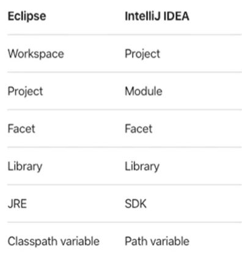
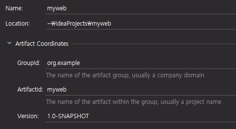
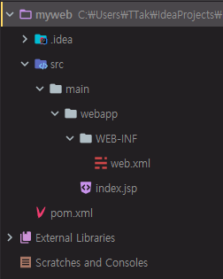

# 1. IntelliJ IDEA의 시작

## IntelliJ IDEA 살펴보기

* IntelliJ IDEA vs Eclipse terminology



Eclipse에서는 각각의 프로젝트들을 모아놓는 작업 공간의 역할로 Workspace를 사용할 수 있다. Eclipse를 실행한 다음 Workspace를 지정하게 되면 작업했던 프로젝트가 한 곳에 모여서 관리 할 수 있다.

IntelliJ에서는 하나의 IntelliJ 윈도우 안에 여러 개의 Project를 실행할 수 없고, 각각의 Project 당 하나의 IntelliJ 윈도우를 실행하는 것이 가장 일반적인 사용 방법이다.

하나의 IntelliJ 윈도우 안에 여러 개의 프로젝트를 같이 혼합해서 사용하고 싶다면 Module 이라는 개념으로 등록해서 사용할 수 있다.


https://www.jetbrains.com/ko-kr/idea/features/

IntelliJ 하나만 사용하면 별도의 다른 프로그램들을 사용하지 않는 상태에서 애플리케이션을 개발할 수 있다.


Polyglot 환경

Polyglot은 하나의 애플리케이션을 개발하는데 있어서 하나의 언어, 하나의 데이터베이스, 하나의 환경만을 가지고 개발하는 것이 아니라 다양한 언어와 다양한 데이터베이스, 그리고 그 환경들을 지원할 수 있는 다양한 프레임워크들을 조합해서 사용할 수 있는 새로운 패러다임이다. IntelliJ에서는 Java만 지원하는 것이 아니라 비 JVM 프레임워크와 언어도 같이 지원해줄 수 있다. 즉, 하나의 IDE 안에서 여러가지 프로그래밍 언어를 조합해서 사용할 수 있는 Polyglot 환경을 제공하고 있다.


---

UI theme 선택

Darcula


기본적으로 초기에 설치시켜줘야 할 플러그인을 표시하고 있다.

나중에 플러그인은 얼마든지 추가하고 제거할 수 있다.


Create New Project

어떤 프로젝트로 진행할 것인지 언어, 프레임워크에 맞춰서 선택하도록 되어있다.

Java 프로젝트 선택 => Next


Create project를 할 때 template을 가지고 시작할 것인지 물어보고 있다.

sample 프로젝트이기 때문에 체크 => Command Line App => Next


firstproject로 프로젝트 이름 지정

C:\Users\TTak\IdeaProjects\firstproject


```java
package com.company;

public class Main {

    public static void main(String[] args) {
        System.out.println("Hello, there!");
    }
}
```

Run 'Main' : Ctrl + Shift + F10


````
Hello, there!
````


## IntelliJ IDEA 환경 설정

IntelliJ는 환경 설정을 크게 두 가지에 의해서 해야한다.

첫 번째는 IntelliJ 전반적인 환경 설정

두 번째는 프로젝트마다 가지고 있는 고유한 환경 설정


### IntelliJ 전반적인 환경 설정

File => Settings

단축키는 Ctrl + Alt + S


단축키, 플러그인 지정, Version Control, 컴파일러 지정, 화면에 보여지는 폰트 크기 등 지정 가능


기본적으로 IntelliJ 안에서 maven을 사용할 수 있도록 플러그인이 연결되어 있는데 그 부분을 변경

Build, Execution, Deployment => Build Tools => Maven

Maven home directory

설치했던 maven 디렉터리 설정. 없는 경우 디렉터리 직접 지정 가능

그 아래에 User 설정 파일이 어느 위치에 들어가있는지, maven이라는 프로젝트 관리 툴을 이용해서 라이브러리, 리소스 등을 다운로드 받아서 어느 위치에 저장시켜주고 있는지 폴더 확인 가능


### 프로젝트마다 가지고 있는 고유한 환경 설정

File => Project Structure

단축키는 Ctrl + Alt + Shift + S


프로젝트의 이름, 프로젝트에서 사용하고자 하는 자바 버전 설정 가능

추가적으로 Module을 사용한다고 하면 Eclipse에서 사용하고 있는 프로젝트와 같은 개념으로, 현재 우리가 만들었던 firstproject라는 곳에서 새로운 프로젝트를 추가시키려 한다면 Modules 부분을 추가시켜서 사용할 수 있다.

외부의 Database, Spring 같은 라이브러리를 사용하고 있다고 하면 Libraries에 등록해서 관리할 수 있다.


## 첫번째 웹 프로젝트 생성

Create New Project


프로젝트의 종류 중 Maven 선택

프로젝트를 초기에 시작할 때 사용할 수 있는 template을 지정할 수 있다.

Create from archetype을 선택하게 되면 하단에 있는 template을 선택할 수 있다.

org.apache.maven으로 시작하는 프로젝트들 중에서 maven-archetype-webapp 선택

Next


프로젝트 이름 : myweb

GroupId와 ArtifactId를 지정하도록 되어있다.

GroupId는 보통 애플리케이션을 개발하고 있는 회사의 domain 이름을 사용하는 것이 일반적이다.

ArtifactId는 해당하는 회사에서 프로젝트를 진행할 때 그 프로젝트 이름별로 ArtifactId를 지정하는 것이 일반적이다.




maven 디렉터리를 apache-maven-3.6.3로 변경


maven 프로젝트이기 때문에 maven 프로젝트의 기본적인 환경 설정 파일인 pom.xml 파일이 가장 먼저 보이게 된다.

오른쪽에 Maven 메뉴가 생겼다. Maven 메뉴를 통해 maven 프로젝트를 빌드하고 컴파일하고 외부에 배포하기 위해서 패키징 작업을 하는 명령어들을 사용할 수 있다.

Lifecycle에 보이는 clean, compile, package, install 명령어를 자주 사용한다.


pom.xml 파일의 내용은 임의로 수정 가능하다. 이런 내용을 수정하게 되면 우측 하단에 Maven 프로젝트의 내용이 변경되었기 때문에 새로운 내용을 import 해야한다는 dialog를 볼 수 있다.

Import Changes. 변경 될 때마다 매번 불러오기


```
[INFO] BUILD SUCCESS
```

template을 가지고 시작했던 프로젝트의 초기화 작업이 완료되었다.

maven 프로젝트가 준비되어 있음을 알 수 있는 BUILD SUCCESS 문구를 확인해 볼 수 있다.


pom.xml 파일 내용을 보면 Wizard를 통해서 지정했던 groupId, artifactId, version, packaging 종류 등을 확인할 수 있다.


dependency

프로젝트를 개발할 때 필요한 외부 라이브러리나 모듈 같은 것들에 대한 내용을 등록해서 사용할 수 있다.

maven 프로젝트에서 그러한 모듈과 라이브러리 같은 것들을 직접 다운로드 받지 않고 관리해주기 때문에 조금 더 편하게 개발에만 집중할 수 있다.

기본적으로는 테스트를 위한 junit 라이브러리가 추가되어 있다.

servlet과 jsp를 생성할 것이기 때문에 servlet과 jsp를 위한 라이브러리를 추가해줘야 한다.

dependency를 추가하기 위해서는 dependencies 항목 밑에 dependency 항목을 추가해주면 된다.

```xml
...
    <dependency>
      <groupId>javax.servlet</groupId>
      <artifactId>javax.servlet-api</artifactId>
      <version>4.0.1</version>
    </dependency>
...
```


IntelliJ는 기본 옵션중에서 작성했던 모든 파일이 자동으로 저장되고 있기 때문에 Ctrl + S나 save 명령어를 별도로 입력해서 파일을 저장하지 않아도 된다.




myweb 밑에 IntelliJ라는 개발 툴에서 사용할 수 있는 .idea 폴더

src 밑에 main, pom.xml 파일

main 밑에 webapp 폴더 확인 가능.

webapp 폴더 밑으로 servlet 프로젝트가 가지고 있어야 할 WEB-INF 폴더와 web.xml 파일, 초기 파일로써 index.jsp 파일을 볼 수 있다.

