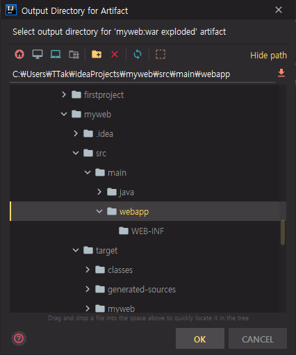

# 2. 첫번째 JSP와 Servlet 예제

## Servlet 파일 생성

maven 프로젝트에서는 기본적으로 모든 코드를 main이라는 폴더 밑에 관리하도록 되어있다.

우리가 만들고자 하는 프로젝트가 web 프로젝트 이기 때문에 webapp 폴더가 자동으로 생성되어 있다.

모든 servlet 프로젝트는 WEB-INF 폴더를 가지고 있다. 그 안에 포함되어 있는 web.xml 이라는 servlet 프로젝트의 환경 설정 파일을 읽어들여서 필요한 설정과 준비 작업을 하게 된다.

최근에는 servlet이 version up이 되면서 xml 파일이 아닌 어노테이션 방식으로 모든 환경 설정을 할 수 있게 되었다.


java servlet class와 같은 것들은 main 폴더 밑에 java 폴더를 등록해서 관리를 해 줄 것이다.

main 폴더 마우스 오른쪽 클릭 => New => Directory

maven에서 소스를 관리할 수 있는 디렉터리는 보통 java 밑에 java에 관련된 클래스를 보관하도록 되어있기 때문에 디렉터리를 생성할 때 만들 수 있는 이름을 가이드로 보여준다.

java 디렉터리 생성


java 디렉터리 마우스 오른쪽 클릭 => New => Package

org.example 패키지 생성


org.example 패키지 마우스 오른쪽 클릭 => New => Java Class

HelloServlet


HelloServlet.java

```java
package org.example;

import javax.servlet.ServletException;
import javax.servlet.http.HttpServlet;
import javax.servlet.http.HttpServletRequest;
import javax.servlet.http.HttpServletResponse;
import java.io.IOException;
import java.io.PrintWriter;

public class HelloServlet extends HttpServlet {
    @Override
    protected void doGet(HttpServletRequest req, HttpServletResponse resp) throws ServletException, IOException {
        resp.setContentType("text/html;charset=UTF-8");
        PrintWriter out = resp.getWriter();
        out.println("Hello, there!!");
        out.close();
    }
}
```

이 파일을 통해서 servlet 클래스를 추가시킨다.

servlet 클래스를 개발하기 위해서 필요한 라이브러리는 pom.xml 파일에 등록시켜 놓았기 때문에 추가 작업 없이 바로 작업할 수 있다.

모든 servlet 클래스는 HttpServlet 클래스를 상속받아서 작성하도록 되어있다.

servlet 클래스가 가지고 있어야 할 함수 중에서 service 함수가 필요하다. 

마우스 오른쪽 버튼 클릭 => Generate => Override Methods...

doGet 메서드. 매개 변수로 HttpServletRequest와 HttpServletResponse 두 가지를 가지고 있다.

resp 객체의 setContentType 에 해당하는 servlet 코드를 어떤 형식으로 클라이언트한테 응답해 줄 것인지를 지정한다.

문자 출력을 위해 PrintWriter 객체 선언

모든 servlet 클래스가 완성되었으면 이 servlet 클래스를 앞으로 본 프로젝트에서 사용하겠다는 등록을 web.xml 파일에 해줘야 한다.

servlet 클래스를 web.xml 파일에 등록하는 방법과 어노테이션으로 처리하는 두 가지 방법이 있다.

---

web.xml

```xml
<!DOCTYPE web-app PUBLIC
 "-//Sun Microsystems, Inc.//DTD Web Application 2.3//EN"
 "http://java.sun.com/dtd/web-app_2_3.dtd" >

<web-app>
  <display-name>Archetype Created Web Application</display-name>
  <servlet>
    <servlet-name>hello-servlet</servlet-name>
    <servlet-class>org.example.HelloServlet</servlet-class>
  </servlet>
  <servlet-mapping>
    <servlet-name>hello-servlet</servlet-name>
    <url-pattern>/HelloServlet</url-pattern>
  </servlet-mapping>
</web-app>
```

기본적으로 display-name 하나만 등록되어 있다.

여기에 필요한 servlet 클래스에 대한 정보를 등록한다.

servlet 클래스 정보를 등록하기 위해서 servlet element 등록, servlet-name 지정

servlet 클래스가 어디에 있는 파일인지 servlet-class에 명시

servlet 클래스를 웹 브라우저에서 사용자가 호출할 때 어떤 URL로 호출할 것인지 url mapping을 등록한다. 등록했던 servlet-name 값 그대로 사용. 이 값을 외부에서 호출할 때 어떤 이름으로 호출할 것인지 url-pattern에 등록한다.

모든 servlet 클래스마다 servlet element와 servlet-mapping element가 한 세트가 되어서 등록되어 있어야 한다.

이러한 작업을 조금 더 간편하게 하기 위해서 어노테이션 방법을 많이 사용한다.

---

HelloServlet.java 복사 => 붙여넣기 => HelloServlet2


HelloServlet2.java

```java
package org.example;

import javax.servlet.ServletException;
import javax.servlet.annotation.WebServlet;
import javax.servlet.http.HttpServlet;
import javax.servlet.http.HttpServletRequest;
import javax.servlet.http.HttpServletResponse;
import java.io.IOException;
import java.io.PrintWriter;

@WebServlet("/HelloServlet2")
public class HelloServlet2 extends HttpServlet {
    @Override
    protected void doGet(HttpServletRequest req, HttpServletResponse resp) throws ServletException, IOException {
        resp.setContentType("text/html;charset=UTF-8");
        PrintWriter out = resp.getWriter();
        out.println("Hi, there!!");
        out.close();
    }
}
```

Hi, there!!로 변경

HelloServlet2 클래스 선언부 위쪽에 web.xml 파일에 등록했던 mapping 작업을 어노테이션 방식으로 처리

@WebServlet("/HelloServlet2")

/HelloServlet2 라는 이름으로 등록


## Tomcat Server 등록

지금까지 만들었던 servlet 클래스를 Tomcat Server에 배포해서 사용

우리가 지금 만들었던 웹 애플리케이션은 웹 애플리케이션의 구조를 가지고 개발할 수 있도록 되어있지만 아직까지는 애플리케이션 서버, 즉 Tomcat Server에 배포가 돼서 사용할 수 있는 방법으로 연동되어있지는 않다.

IntelliJ에서 Tomcat Server를 등록한 다음 바로 실행시켜보기


우측 상단에 `ADD CONFIGURATION...` 버튼 클릭

Run 명령을 실행하고자 할 때 어떤 프로그램을 구동할 것인지 지정할 수 있다.

servlet으로 작동되는 클래스가 바로 실행되는 것이 아니라 Tomcat Server에 등록되어 실행시켜줘야 하기 때문에 이 항목에 Tomcat Server를 등록

`+` 버튼을 클릭하면 등록할 수 있는 옵션이 표시된다.

Tomcat Server => Local


Local 서버에 Tomcat Server를 등록해두었기 때문에 Local 항목 클릭


Name : myweb

사용하고자 하는 Tomcat Server는 Tomcat 9.0.33

만약 이 부분이 설정되어있지 않다면 Configure 버튼을 클릭해서 설치했던 Tomcat Home 디렉터리를 지정해주면 된다.

Tomcat Server를 기동한 후에 자동으로 웹 브라우저가 실행되는데 이 옵션을 해제하고 싶다면 After launch 버튼을 해제

Tomcat Server는 기본적으로 8080 포트 번호를 사용하고 있다.

VM options는 Tomcat Server를 기동함에 있어서 필요한 부가적인 Java option을 지정할 수 있다.

기본적으로 8080 포트가 설정되어 있다. => 변경하고 싶은 경우 Tomcat Server Settings 부분 바꾸기

아래쪽에 경고 메시지가 보인다.

현재 설정한 부분은 Tomcat Server를 기동한 것이지 우리가 만들었던 myweb과 연결되어 있지는 않다. 다시 말해 myweb과 Tomcat Server가 별도로 설정되어 있다.

myweb을 Tomcat Server에 배포하기 위해서 필요한 작업이 아직 남아있다는 오류 메시지이다.

우리가 개발하고자 하는 결과물을 artifact 라고 보면 된다. 여기서는 myweb


Deployment 탭 클릭 => 우측 `+` 버튼 클릭

어떤 항목을 등록할지 선택할 수 있는데 Artifact 선택

Artifact 중에서 현재 우리가 가지고 있는 myweb을 등록하겠다는 옵션이 보인다.

myweb:war 과 myweb:war exploded 가 있다.

myweb:war exploded 를 선택하게 되면 war 파일을 압축 해제 한 다음 해당하는 부분을 사용하겠다는 뜻이기 때문에 선택


아래쪽에 Application context 항목이 있다. 이 부분은 웹 브라우저에서 8080 포트 번호 뒤에 지금 실행하고자 하는 myweb이라는 애플리케이션을 어떤 경로에 의해서 실행할 것인지 경로 위치를 지정하도록 되어있다.

모든 웹 애플리케이션 당 하나의 독립적인 context를 가지고 있기 때문에 이 부분을 분리해서 지정하면 된다.

하나의 Tomcat Server에 여러 개의 context를 가질 수 있다.

/myweb 으로 설정. 8080 포트 번호 뒤에 /myweb 이라는 context 이름을 지정해야지만 만들었던 프로젝트에 접근할 수 있다.

만약 이 부분을 myweb을 지우고 / 만 남긴다면 웹 브라우저에서 8080 포트 번호만 가지고 접속할 수 있다.


우측 상단에 `ADD CONFIGURATION...` 버튼 대신에 우리가 추가시켰던 `MYWEB`을 확인할 수 있다.

추가로 변경 사항이 필요하다고 하면 Edit Configurations 를 클릭한 다음 옵션을 변경시킬 수 있다.

play 버튼을 클릭해 myweb 실행

```
[2020-04-04 12:46:04,726] Artifact myweb:war exploded: Artifact is deployed successfully
```

build 하는 과정은 우리가 필요했던 내용을 컴파일하고 패키징하는 과정이라고 생각하면 된다.

8: Services 탭이 새롭게 시작되면서 Tomcat Server가 기동되는 화면을 볼 수 있다.

우리가 추가시켰던 myweb이라는 애플리케이션이 현재 등록되었다는 메시지를 확인할 수 있다.


http://localhost:8080/myweb/


index.jsp 파일이 가지고 있는 내용이 보인다.


우리가 등록시켰던 servlet 파일의 이름을 호출

http://localhost:8080/myweb/HelloServlet

HelloServlet 이라는 이름은 web.xml 파일에 등록시켰던 url mapping에 썼던 이름을 그대로 사용하면 된다.

/HelloServlet 을 호출시켰을 때 org.example.HelloServlet 라는 클래스의 내용이 보여지게 된다.


http://localhost:8080/myweb/HelloServlet2


만약 Servlet 클래스의 내용을 변경하게 된다면 servlet 내용을 서버에 반영해주기 위해서 서버를 재부팅 해 줘야 한다.


HelloServlet2 의 `Hi, there!!` 을 `Good morning.` 으로 변경

서버 종료


Server Output 창에 글자가 깨져있다. 우리가 쓰고있는 Windows 환경과 Tomcat Server에서 문자간에 인코딩이 맞지않아 깨진 부분이다. 이 부분을 영어로 표시할 수 있도록 옵션 변경


옵션을 변경하기 위해서 우측 상단에 `MYWEB` 버튼 화살표 클릭 => Edit Configurations

VM options 부분에 옵션 지정

-Duser.language=en -Duser.region-us

log에 출력되는 글자를 영어로 표시할 수 있다. 깨지는 현상 없이 출력 가능

서버를 기동시킨다.

log 메시지가 영어로 나오는 것을 확인할 수 있다.


http://localhost:8080/myweb/HelloServlet2


## JSP 파일 생성

Java 웹 프로젝트에서 많이 사용되는 JSP 파일 등록하기

maven 프로젝트에 webapp 이라는 template을 가지고 프로젝트를 생성하게 되면 기본적으로 index.jsp 파일이 생긴다. 이 파일을 사용해도 좋고, 새롭게 JSP 파일을 등록해서 사용해도 괜찮다.


webapp 마우스 오른쪽 클릭 => New => JSP/JSPX

hello.jsp 입력 후 Enter


hello.jsp

```jsp
<%@ page contentType="text/html;charset=UTF-8" language="java" %>
<html>
<head>
    <title>Title</title>
</head>
<body>
    Hello, JSP
</body>
</html>
```

기본적인 template 내용을 가지고 있는 jsp 파일이 만들어진다.


Tomcat 서버 기동

http://localhost:8080/myweb/index.jsp


http://localhost:8080/myweb/hello.jsp


hello.jsp

```jsp
<%@ page contentType="text/html;charset=UTF-8" language="java" %>
<html>
<head>
    <title>Title</title>
</head>
<body>
    Hello, jsp
</body>
</html>
```

서버 정지하지 않고 내용 변경


http://localhost:8080/myweb/hello.jsp

새로 고침을 눌러도 hello.jsp 파일의 내용이 변경되지 않고 기존 코드가 그대로 남아있다.

우리가 등록시켰던 Tomcat 서버에 가지고 있었던 myweb이라는 애플리케이션이 어떤 형태로 연결되어 있는가에 따라서 변경했던 내용이 바로 보이기도 하고 서버를 재부팅 해야 보이기도 한다.

log 중간에 보면 myweb 애플리케이션은 war 파일 형태 즉, 자바에서 패키징 되어있는 파일 형태로 Tomcat Server에 등록되었기 때문에 우리가 jsp 파일을 변경하거나 추가한다고 하더라도 패키징 되어있는 파일에 바로 반영이 안 되는 현상이 있기 때문에 웹 브라우저에서 확인할 수 없었다.

이러한 부분을 해결하기 위해서는 Tomcat Server에 우리가 만들었던 애플리케이션을 등록하는 방법에서 경로를 약간 변경해줘야 한다.


서버 종료

Edit Configurations 클릭 => Deployment 탭 클릭

등록되어 있는 war 파일을 볼 수 있다. myweb:war exploded

war 파일에 대한 부분을 수정하기 위해서 오른쪽에 Edit 버튼(연필 모양) 클릭


Project Structure의 Artifacts 부분에 우리가 등록시켰던 myweb:war 파일과 myweb:war exploded라는 두 가지 항목을 볼 수 있다.


우리가 수정할 부분은 myweb:war exploded 부분에서 경로를 바꿔주면 된다.

Tomcat Server에서 jsp 파일과 servlet 파일을 실행할 때 어디에 있는 코드를 참조해서 실행을 하냐면 Output directory 에서 볼 수 있는 것처럼 IdeaProjects\myweb\target\myweb 이라는 폴더에 있는 내용을 가지고 실행하게 된다.

target과 myweb 이라는 폴더는 우리가 코드에서 반영했던 내용이 바로 쓰이는 것이 아니라 패키징 되어있는 결과물이 들어가 있는 폴더이기 때문에, 다시 말해 Output directory 이기 때문에 우리가 가지고 있는 변경했던 파일들이 바로바로 반영이 안될 수 있다.

따라서 이 부분을 직접 우리가 개발하고 있는 폴더로 지정해줘야 한다.

우측에 폴더 모양 클릭 => src 밑에 webapp 폴더로 지정한다.

IdeaProjects\myweb\src\main\webapp




그러면 우리가 변경했던 코드가 패키징 되어있는 Output 폴더로 적용되고 있는 것이 아니라 작업하고 있는 폴더로 직접 연결되고 있기 때문에 JSP 파일이 변경하는 순간 바로 업데이트 되어서 웹 브라우저에서 확인해 볼 수 있다.


APPLY => OK


play 버튼을 클릭해서 서버 실행

http://localhost:8080/myweb/hello.jsp


hello.jsp

```jsp
<%@ page contentType="text/html;charset=UTF-8" language="java" %>
<html>
<head>
    <title>Title</title>
</head>
<body>
    <h1>Hello, jsp</h1>
</body>
</html>
```

글자 크기 변경


http://localhost:8080/myweb/hello.jsp 새로 고침


수정한 내용이 바로 변경되는 것을 확인할 수 있다.


Tomcat Server에 애플리케이션을 배포할 때 war 파일 형태로, 압축 형태 파일로 배포하기 때문에 변경시켰던 내용이 바로바로 반영이 안 되었었다.

IntelliJ에서 실행하고자 할 때는 Tomcat Server에서 우리가 등록시켰던 애플리케이션의 위치를 war 파일 형태의 출력 파일의 위치가 아니라 작업하고 있는 폴더로 바로 지정했기 때문에 변경된 내용을 바로 확인할 수 있다.

