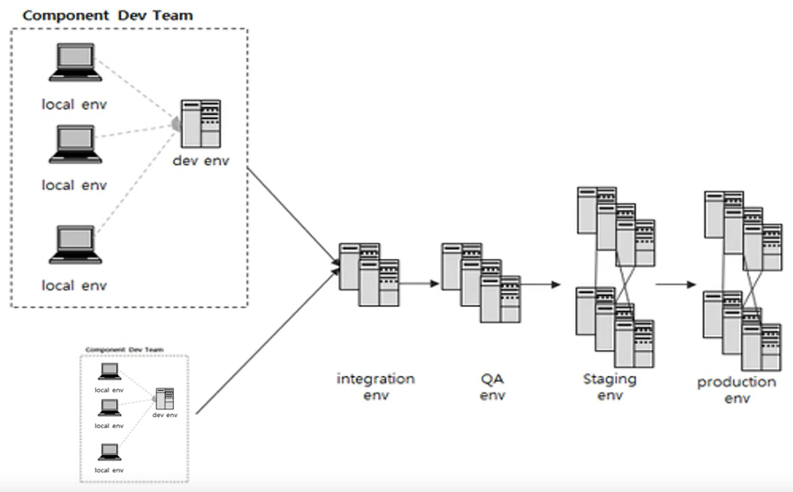
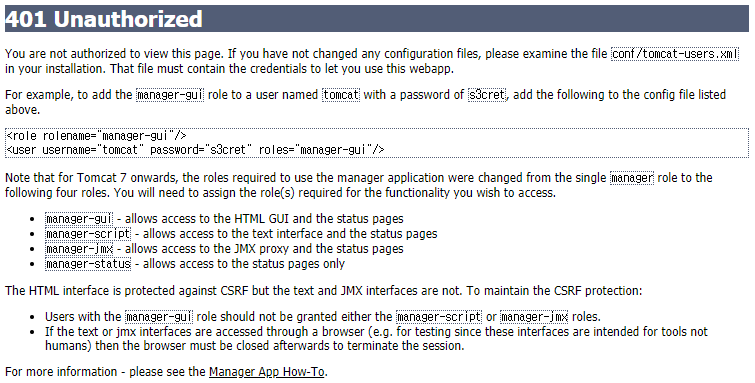
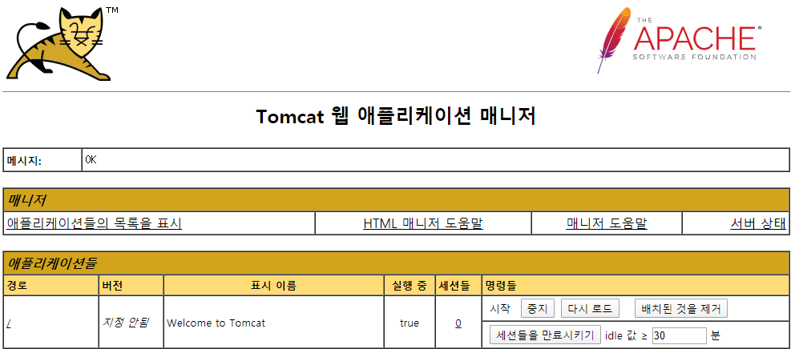
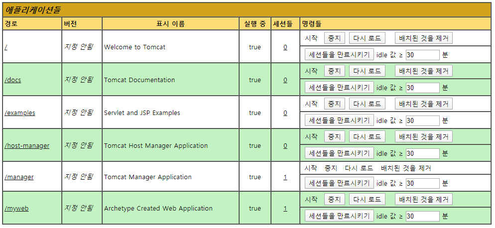
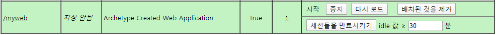
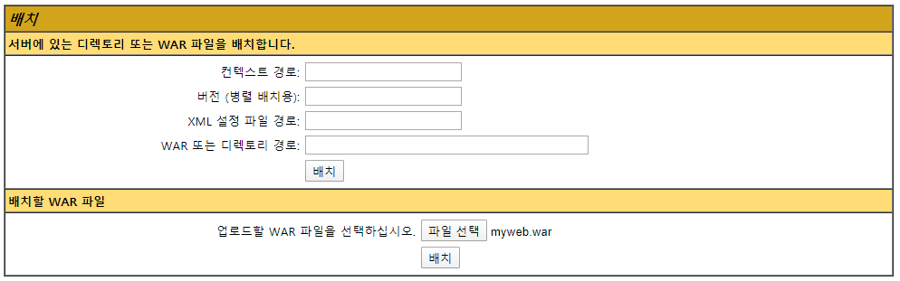

# 3. 운영 환경 구축

## 서버 개발 환경

* 서버 개발 환경
  * Local
  * Dev
  * Integration
  * QA
  * Staging
  * Production

모든 이해 관계자들이 본인만의 필요한 개발 환경을 가질 수 있다. 예를 들어 개발자가 사용하는 환경이나 테스터들이 사용하는 환경, 실제 운영 서비스를 위한 환경과 같이 여러가지 환경을 나눌 수 있다.

효율적인 서버 개발을 하기 위해서는 개발 환경과 운영 환경을 구분해서 나누는 것이 맞다.

개발 환경은 실제 프로그램을 개발하기 위한 환경. 구현과 배포와 테스트, 형상 관리 같은 것들을 지원해 주면 된다.

운영 환경이라는 것은 개발과 테스트가 완료된 프로그램을 서비스 하기 위한 환경으로 운영하기 위한 도구와 모니터링 하기 위한 도구가 같이 포함되어 있는 환경이다.

모든 환경을 다 가지고 있어야 하는 것은 아니지만 본인들이 가지고 있는 환경에 맞춰서 몇 가지를 등록해서 쓰면 된다.



Local 환경이라는 것은 개발자 개인이 가지고 있는 환경이라고 생각하면 된다. 개발자 PC에 개발 및 테스트 환경을 구축하고 프로그램을 개발한 다음 모든 개발자들이 각각 동일한 개발 환경을 가지고 있어야지만 하나의 코드가 다른쪽에 있는 코드와 실행될 때 요류 없이 실행할 수 있다.

각자 컴퓨터에서 개발하는 환경을 개발 환경이라고 보면 된다.

IntelliJ에서 Tomcat Server를 연동하고 Servlet과 JSP 파일을 등록해서 만들었던 것을 개발환경이라 보면 된다.

프로젝트라는 것은 혼자 개발하는 것이 아니라 여러명의 팀원들이 같이 일정한 역할을 나눠서 코드를 나눠서 개발하는 것이 일반적이기 때문에 Local 환경에서 만들어진 코드를 한 곳에 모아서 통합적으로 관리를 해야할 필요가 있을 수 있다.

개발자 코드들을 하나로 합쳐서 서버 환경을 구축하는 것을 Dev 환경이라고 한다. Dev 환경에서는 각각 개발자들이 나눠서 만들었던 모듈에 대해서 하나로 합하고 테스트하는 환경이라고 생각하면 된다.

여러가지 컴포넌트가 동시에 개발되고자 할 때 이러한 Dev 환경의 서버가 여러개 있을 수 있다. 그런 환경을 하나로 합해주는 것을 Integration 환경이라고 보면 된다. Integration 환경은 존재하지 않을수도 있지만 Local 환경 다음 Dev 환경에서 여러가지 나눠져 있을 경우에는 통합하는 환경이다.

QA 단계는 QA 엔지니어들에 의해서 사용되는 테스트 환경. 개발 환경에서 완료되어 있던 코드를 테스트 환경으로 배포한 다음에 그 기능, 비기능에 관련된 테스트를 QA 엔지니어가 진행하게 된다.

테스트를 다 진행한 다음에 Staging 환경으로 넘어간다. Staging 환경에서는 운영 환경과 거의 동일한 환경을 구축한 다음에 운영 환경으로 이전하기 전에 여러가지 비기능적 테스트를 검증하는 단계이다. 비기능적 테스트는 보안, 성능, 장애 같은 이슈를 해결하기 위한 단계이다.

마지막으로 실제 서비스를 운영하는 단계로써 Production 환경이 준비되어있으면 된다.

간단하게는 Local 환경 또는 Dev 환경, 그리고 QA 환경, Production 환경 이렇게 세 단계만 구축해서 유지하는 경우도 있다. 조금 더 큰 프로젝트라고 하면 모든 단계를 다 가지고 진행하는 경우도 있다.


우리가 만들었던 개발 환경을 다음 단계로 계속 이동하기 위해서, 넘겨주기 위해서 우리가 만들었던 애플리케이션을 패키지 형태로 만들어서 전달하게 되는데 이러한 작업이 서버가 1~2대라고 하면 수작업으로 가능할지 모르지만, 서버가 여러 곳에 분산되어있고 여러 가지 이중화되어있는 서버일 경우에는 수작업하는 것이 무리가 있을 수 있다. 그래서 이러한 작업을 자동화하기 위해서 CI/CD 라는 툴을 사용하게 된다.

CI(Continuous Integration)는 지속적인 통합, CD(Continuous Deployment)는 지속적인 배포를 얘기한다.

우리가 개발했던 코드를 지속적으로 통합하고 지속적으로 배포하는 이 모든 과정을 자동화시켜주는 도구를 얘기한다. 이러한 CI/CD 작업이 없으면 여러 가지 서버에 우리가 자유롭게 배포한다는 것이 현실적으로 어려운 일이기 때문에 최근에는 모든 프로젝트에서는 CI/CD 작업이 다 포함되어서 쓰고 있다.

각 단계별로 패키징되어있는 코드가 넘겨지고자 할 때 CI/CD 단계에서 설정되어 있는 자동화 툴을 통해서 넘어간다.

이전 시간까지 개발했던 Local에서 만들었던 애플리케이션을 maven 프로젝트의 Package라는 커맨드를 통해서 패키징시킨 다음에 해당 압축 파일을 직접 Tomcat Server에 배포하는 방법을 가지고 운영 환경을 간단하게 확인해 볼 것이다.

우리가 만들었던 애플리케이션을 maven 프로젝트에 의해서 배포


## Maven 빌드와 Tomcat Server 실행

작성했던 웹 애플리케이션을 Maven 빌드를 통해서 export를 하고 Tomcat Server에 직접 배포

IntelliJ 우측 Maven 메뉴

Lifecycle의 clean부터 시작해서 몇 가지 옵션을 확인할 수 있다.

maven을 사용하기 위해서 필요한 명령어들이다. 자주 사용되는 것은 clean, complie, package, install


현재 우리가 쓰고 있는 웹 프로젝트의 폴더를 탐색기를 통해 확인

작업 폴더는 홈 디렉터리에 IdeaProjects 폴더 밑에 존재

myweb 폴더에 들어가면 src라는 폴더와 pom.xml 파일을 볼 수 있다. 그리고 정상적으로 실행되었다면 target 폴더가 보이게 된다. target 폴더 삭제

maven 빌드가 어떻게 target 폴더를 만드는지 확인해볼 것이다.

---

IntelliJ 우측 Maven 메뉴 Lifecycle의 complie

compile은 우리가 만들었던 프로젝트가 컴파일 오류가 발생하는지 안하는지 확인하는 작업이다. 클릭하면 하단에서 컴파일된 결과를 확인할 수 있다.

```
[INFO] Compiling 2 source files to C:\Users\TTak\IdeaProjects\myweb\target\classes
[INFO] ------------------------------------------------------------------------
[INFO] BUILD SUCCESS
```

complie 되어 있는 결과값은 myweb에 target 폴더 밑에 classes라는 폴더가 만들어져 있을 것이고, 빌드가 성공했음을 확인할 수 있다.

target 폴더가 다시 생성된 것을 확인할 수 있다. 그 폴더를 보면 classes라는 폴더 밑에 우리가 만들었던 패키지가 보이고 Servlet 클래스가 컴파일되어 있는 모습까지 확인할 수 있다.

---

clean 옵션

생성되었던 target 폴더를 수작업으로 지웠었는데 maven에서 clean이라는 옵션을 부여하게 되면 target 폴더를 삭제시켜주는 역할을 하게된다.

clean 작업은 존재하고 있는 target 폴더를 삭제하는 것이다.

myweb 폴더를 확인해보면 target 폴더가 사라진 것을 확인할 수 있다.

---

package

우리가 만들었던 프로젝트를 export 시키기

package 더블 클릭

패키징 작업에 컴파일과 패키징, 압축 작업과 테스트 하는 작업 그리고 우리가 지정했던 폴더로 이동시켜주는 작업이 다 포함되어 있다.

```
[INFO] Building war: C:\Users\TTak\IdeaProjects\myweb\target\myweb.war
```

어느 위치에 압축되어있는 결과물이 생기는지 확인할 수 있다. war 파일 생성 위치

compile 옵션과 다른점은 complie 옵션에서는 myweb.war 파일이 생성되지는 않지만 package 옵션에서는 myweb.war 파일이 생성된다.

war 파일이 압축이 풀렸을 때 어떤 모양을 가지고 있는지도 같이 보이게 된다.

target에 myweb 폴더를 보면 hello.jsp 파일도 같이 포함된 것을 확인할 수 있다.


이렇게 패키징 되어있는 war 파일을 Tomcat Server에 직접 복사를 해서 실행시켜 볼 것이다.

myweb.war 파일을 복사

Tomcat Server가 설치되어 있는 위치로 이동

webapps라는 폴더에 war 파일을 붙여넣기 한다.

apache-tomcat-9.0.33\webapps


Tomcat Server를 기동하기 위해 bin 디렉터리 밑에 있는 startup.bat 파일을 실행하면 된다. 더블 클릭을 해서 실행할 수도 있지만 터미널에서 직접 실행해보기

```bash
C:\Users\TTak\tools\apache-tomcat-9.0.33\bin>startup.bat
```


웹 브라우저에서 실행 결과 확인

Tomcat Server가 외부에서 실행되고 있다.

http://localhost:8080/myweb/hello.jsp


http://localhost:8080/myweb/index.jsp


http://localhost:8080/myweb/HelloServlet


http://localhost:8080/myweb/HelloServlet2


우리가 만들었던 war 파일을 외부에 있는 Tomcat Server에 직접 복사해서 실행시켜봤다.

조금전에 복사시켰던 webapps 폴더로 이동

myweb.war 파일을 복사시켰는데 Tomcat Server가 기동됨과 동시에 해당하는 war 파일을 압축을 해제해서 myweb이라는 폴더가 만들어졌고 여기에 우리가 만들었던 파일들을 압축 해제시켜둔 모양을 볼 수 있다.


## Tomcat manager 이용

Apache Tomcat Server가 설치된 후에 웹 애플리케이션을 관리하기 위한 Tomcat manager 알아보기

이전 시간까지는 직접 export 되어있던 war 파일을 Tomcat Server의 webapps라는 폴더에 수작업으로 복사를 시켰지만 실제 그러한 작업을 통해서 서버에 배포하는 것 보다는 관리 툴을 통해서 우리가 만들었던 웹 애플리케이션을 배포하고 삭제하는 작업들을 하는것이 더 일반적이다.

Tomcat에서 제공하고 있는 manager를 사용

Tomcat manager를 사용하기 위해서는 Tomcat Server가 기동된 상태에서 http://localhost:8080/manager 에 접속한다.

로그인 할 수 있는 dialog가 실행된다. 사용자 이름과 비밀번호를 입력하도록 되어있다.

취소를 누른다.



웹 브라우저에서 manager를 이용하게 되면 Tomcat Server가 관리하고 있는 manager라는 프로그램을 통해서 웹 애플리케이션을 배포하고 삭제하는 작업이 가능해진다.

이 작업들을 하기 위해서는 Tomcat Server가 설치되어있는 경로의 tomcat-users.xml 파일에 필요한 설정 작업을 해줘야 한다.

manager-gui, manager-script, manager-jmx, manager-status 를 등록해두고 사용자 계정을 등록해야지 사용할 수 있다.

작업을 진행하기 위해서 실행되고 있는 Tomcat Server를 중지시킨다.

Tomcat Server를 중지할때에는 startup.bat 파일을 실행시켰던 것과 마찬가지로 같은 경로에서 shutdown.bat 파일을 실행시키면 된다.


conf 폴더로 이동, 디렉터리 내용 확인

```bash
C:\Users\TTak\tools\apache-tomcat-9.0.33\conf>dir
 C 드라이브의 볼륨: Local Disk
 볼륨 일련 번호: DA3B-749D

 C:\Users\TTak\tools\apache-tomcat-9.0.33\conf 디렉터리

2020-04-03  오후 03:18    <DIR>          .
2020-04-03  오후 03:18    <DIR>          ..
2020-04-03  오후 03:18    <DIR>          Catalina
2020-03-11  오전 09:33            13,132 catalina.policy
2020-03-11  오전 09:33             7,468 catalina.properties
2020-03-11  오전 09:33             1,431 context.xml
2020-03-11  오전 09:33             1,172 jaspic-providers.xml
2020-03-11  오전 09:33             2,365 jaspic-providers.xsd
2020-03-11  오전 09:33             4,223 logging.properties
2020-03-11  오전 09:33             7,759 server.xml
2020-03-11  오전 09:33             2,208 tomcat-users.xml
2020-03-11  오전 09:33             2,691 tomcat-users.xsd
2020-03-11  오전 09:33           176,969 web.xml
              10개 파일             219,418 바이트
               3개 디렉터리  88,967,069,696 바이트 남음
```

여러 가지 설정 파일을 볼 수 있다.

그 중에서 tomcat-users.xml 파일을 볼 수 있다. 이 파일에 우리가 필요한 manager 프로그램에 대한 설정 작업을 넣어두면 된다.

```bash
C:\Users\TTak\tools\apache-tomcat-9.0.33\conf>code tomcat-users.xml
```

visual studio code 사용 tomcat-users.xml 편집


tomcat-users.xml

```xml
...
  <role rolename="manager"/>
  <role rolename="manager-gui"/>
  <role rolename="manager-script"/>
  <role rolename="manager-jmx"/>
  <role rolename="manager-status"/>
  <role rolename="admin"/>

  <user username="admin" password="tomcat" roles="manager, manager-gui, manager-script, manager-jmx, manager-status, admin"/>

</tomcat-users>
```

하단에 보이는 role과 user 부분을 등록해서 사용. 주석 부분 복사 => 붙여넣기 => 주석 해제

몇 가지 role을 추가해 놓을 것인데 우리가 필요한 role은 조금전에 웹 페이지에서 봤던 것처럼 manager에 관련된 작업을 추가해야 한다.

6개의 role 등록

admin 계정 등록, password 설정

사용할 수 있는 role을 등록해야 하는데 앞에서 등록했던 6개의 role 추가

manager를 통해서 사용할 수 있는 기능을 등록하고 사용자를 등록한 다음 그 사용자가 어떤 기능을 쓸 수 있는지 role에 추가하였다.

---

Tomcat Server 실행

http://localhost:8080/manager

등록시켰던 admin, tomcat 입력



Tomcat manager 화면으로 접속되었다.



현재 등록되어 있는 애플리케이션 context를 확인할 수 있다.

/myweb이라고 해서 수작업으로 복사시켰던 war 파일까지 확인된다.


새로운 애플리케이션 파일을 배포할 수 있다. 우리가 가지고 있는 myweb.war 파일을 여기에 배포해 볼 것이다.

---

기존에 등록되어 있는 myweb 파일 삭제



중지 => 배치된 것을 제거

apache-tomcat-9.0.33\webapps 폴더 확인

myweb 파일이 삭제되었다.


배치 메뉴

war 파일을 지정해서 업로드

파일 선택 => export 되어있는 위치를 찾아 myweb.war 파일 열기

C:\Users\TTak\IdeaProjects\myweb\target



배치 클릭


조금전에 삭제시켰던 /myweb이 다시 보인다. 우측에 보면 서버가 시작된 것을 확인할 수 있다.

apache-tomcat-9.0.33\webapps 폴더 확인

myweb.war 파일이 등록되어 있고 압축 해제되어 있는 myweb 폴더도 확인할 수 있다.

http://localhost:8080/myweb/HelloServlet2


우리가 실행시켰던 파일이 정상적으로 보인다.


Tomcat 애플리케이션 서버가 제공하고 있는 매니저 기능을 통해서 export 되어있는 war 파일을 직접 배치해보았다.

이러한 manager 파일을 사용하는 것이 중요한 이유 중 하나가 CI/CD 작업 즉, 자동으로 배포하는 작업에서는 이러한 Tomcat Server에서 제공하는 manager를 통해서 우리가 패키징시켰던 war 파일을 업로드시켜서 배포하고 있기 때문에 사용법도 알아두면 좋다.


## Bonus Section

* 스프링 부트를 이용한 마이크로서비스 구축
* Reactive programming with Spring Framework 5
* CI/CD for DevOps

