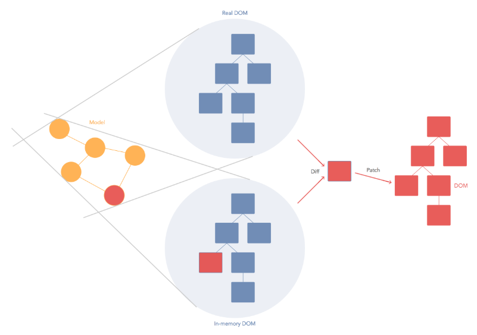

# #0 리액트는 무엇인가


리액트를 제대로, 쉽고, 재밌게!


튜토리얼 문서

https://velopert.com/3613


## 프론트엔드 라이브러리란 무엇인가?

웹사이트를 만들기 위해서는 사실 프론트엔드 라이브러리 도움 없이도 만들 수 있다.

단순히 정적 페이지를 만드는 것이라면 javascript 없이도 html과 css를 사용해 만들 수 있다.

거기에 javascript를 더하면 유저의 행동 흐름에 따라 동적으로 화면을 보여줄 수 있다.


그런데 요즘의 웹은 웹애플리케이션이다. 브라우저 상에서도 매우 자연스러운 흐름으로 많은 것을 할 수 있다.


유저인터페이스를 동적으로 나타내기 위해서는 수많은 상태를 관리해야한다.


```html
<div>
    <h1>Counter</h1>
    <h2 id="number">0</h2>
    <button id="increase">+</button>
</div>
```

버튼을 눌러서 숫자0 값을 바꿔주려면 각 DOM Element에 대한 Reference를 찾고, 해당 DOM에 접근하여 원하는 작업을 해야한다.


```javascript
var number = 0;
var elNumber = document.getElementById('number');
var btnIncrease = document.getElementById('increase');

btnIncrease.onClick = function() {
    number++;
    elNumber.innerText = number;
}
```


우리의 프로젝트가 사용자와의 인터렉션이 별로 없다면 사실상 프론트엔드의 라이브러리는 필요하지 않다. 직접 구현하는 것도 나쁘지 않다.


하지만 프로젝트의 규모가 커지고 다양한 유저인터페이스와 인터렉션을 제공하게 된다면, 많은 DOM 요소들을 직접 관리하고 코드를 정리하는 것은 갈수록 힘든 일이다.


제대로 된 컨벤션을 가지고 여러 규칙들을 세워서 진행한다면 불가능한 일은 아니겠지만 여전히 번거롭다.


웹 개발을 하게될 때 귀찮은 DOM 관리와 상태값 Update 관리를 최소한으로 하고, 오직 기능 개발, 사용자 인터페이스를 구현하는 것에 대해서 집중할 수 있도록 많은 라이브러리들, 혹은 프레임워크들이 만들어졌다.


프론트엔드 라이브러리나 프레임워크를 사용하는 것은 개발할 때 생산성과 깊이 관여가 되어있다.


높은 유지 보수성과도 관계가 있다.


Angular, Ember, Backbone, Vue, React ...

여러가지 라이브러라와 프레임워크가 존재한다.


React, Angular, Vue


장인은 도구를 탓하지 않는다.


Angular

다양한 기능들이 이미 내장되어있어서 이것 하나만으로도 엄청나게 많은 것을 만들 수 있다.

http client, router, 다국어 지원 등이 내장되어있다.

Angular는 프레임워크 차원에서는 매우 성숙하지만, 인지도 측면에서는 아직 성장하는 단계이다.

Angular는 훌륭한 프레임워크인 것은 확실하다.

typescript 사용이 기본이다.


React

Component라는 개념에 집중된 라이브러리이다. 프레임워크가 아니다.

Component는 데이터를 넣으면 우리가 지정한 인터페이스를 조립해서 보여준다.

페이스북 개발자들이 라이브러리의 성능과 개발자 경험을 개선하기 위해서 수많은 연구를 한다.

Angular와 달리 사용자에게 전달되는 View만 신경쓰고, 나머지 기능들은 third party 라이브러리를 사용한다.

공식라이브러리라는 개념이 딱히 없다. 한 가지 문제를 해결하기 위해서 여러가지 방식의 솔루션들이 있다.

생태계가 넓고 뜨겁다.

React를 사용하는 유명한 기업들이 많다.


Vue

입문자가 사용하기에 쉽고, 웹팩같은 모듈 번들러가 없어도 CDN으로 불러와서 사용되는 형태로도 자주 이용된다.

CDN으로 불러온다는 것은 html에서 script 태그로 불러온다는 것을 의미한다.

html을 템플릿처럼 그대로 사용할 수도 있어서 markup을 만들어주는 디자이너나 퍼블리셔가 있는 경우 작업 흐름이 매우 매끄럽다.

공식 라우터와 공식 상태 관리 라이브러리가 존재한다.


리액트는 라우터나 상태 관리 라이브러리가 third party여서 여러 종류가 있다.

Vue에서는 Angular처럼 디렉티브라는 기능도 있고, React처럼 Virtual DOM 기반 컴포넌트도 있다.

React에서 사용하는 JSX를 Vue에서도 사용할 수 있다.

Vue는 React와 Angular에서 좋은 것들을 가져와 합쳐놓은 느낌이다.


각 라이브러리 및 프레임워크를 기초 수준이라고 하더라도 한 번 쯤은 사용해보기

각 도구들의 철학과 추구하고자 하는 방향이 서로 다르다.


## 리액트의 Virtual DOM

We built React to solve one problem:

building large applications with data that changes over time.


번역 : 우리는 지속해서 데이터가 변화하는 대규모 애플리케이션을 구축하기 위해 만들었습니다.


MVC, MVVM, MVW 등을 사용하던 기존 웹 프레임워크 / 라이브러리

Facebook이 React를 만들기 전에도 Angular, backbone, ember 등의 수많은 프레임워크들이 존재했다.

해당 프레임워크들은 데이터 단을 담당하는 Model, 화면에 보여지게 되는 View, 사용자가 발생시키게 되는 Event를 관리하는 Controller로 이루어진 MVC 패턴, 그리고 거기서부터 파생된 MVVM, MVW 등의 패턴들로 이루어져 있다.


공통점은 Model이다. Model은 대부분 양방향 바인딩을 통해서 작동한다. Model에 있는 값이 변하면 View에서도 이 값을 변화시켜주고, View에서 어떤 값을 변화시키려고 하면 Model에 있는 값을 변화시켜주는 것을 양방향 바인딩이라고 한다.

키워드는 변화(Mutation)

변화는 상당히 복잡한 작업이다.

특정 이벤트가 발생했을 때 Model의 변화를 일으키고, 그 변화를 일으킴에 따라 어떤 DOM을 가져와서 어떤 방식으로 View를 업데이트 해줄지 Logic을 정해줘야 한다. 프레임워크나 라이브러리에서 그런 로직을 정해줘야 한다.


만약 변화가 일어날 필요가 있다면

그냥 Mutation을 하지 말자. 그 대신에, 데이터가 바뀌면 그냥 뷰를 날려버리고 새로 만들어버리면 어떨까?


브라우저는 DOM 기반으로 작동하기 때문에 페이지가 그때 그때 새로운 View를 만드려고 하면 성능적으로 엄청난 문제가 있을 것이다.


그래서 존재하는 것이 Virtual DOM(가상의 DOM)이다.

변화가 일어나면 실제로 브라우저의 DOM에 새로운 것을 넣는것이 아니라 자바스크립트로 이루어진 가상의 DOM에 한번 렌더링을 하고, 기존의 DOM과 비교를 한 뒤, 정말 변화가 필요한 곳에만 업데이트를 해준다.


https://auth0.com/blog/face-off-virtual-dom-vs-incremental-dom-vs-glimmer/



Virtual DOM을 사용함으로써 Data가 바꼈을 때 더 이상 어떻게 업데이트를 할지 고려하는 것이 아니라, 일단 바뀐 Data로 그려놓고 비교를 한 다음에 바뀐 부분만 찾아서 바꿔주는 것이다.


Model을 가지고 실제 DOM에 그린다.

어떤 변화가 발생하면 그것을 가상의 DOM에 그린다.

가상의 DOM과 실제 DOM을 비교한다.

비교를 해서 어떤 것이 바꼈는지 알아내면 그것을 특정 부분에 Patch를 한다.


React and Virtual DOM

https://www.youtube.com/watch?v=muc2ZF0QIO4


## 리액트를 특별하게 만드는 점

#### 리액트에서만 Virtual DOM 쓰나?

Vue, Marko, Maquette, Mithril ...


Virtual DOM을 사용하는 라이브러리는 상당히 많다.


#### 리액트를 특별하게 만드는 점은?

어마어마한 생태계

React 라이브러리들이 많이 만들어진다. jQuery 혹은 일반 Javascript로 만들어진 라이브러리들도 React로 포팅되어서 많이 작성되고 있다.

단순히 특정 기능을 구현하기 위한 라이브러리, 예를 들어서 form, carousel, animation, ui 등 말고도 프로젝트의 구조와 강하게 묶여있는 라이브러리들, 예를 들어서 라우터, 상태 관리 라이브러리등도 다양하다.

다양한 생태계를 가지고 있다보니 여기저기서 좋은 것들이 쏟아져나온다.


사용하는 곳이 많다.

Airbnb, BBC, Cloudflare, Codecademy, Coursera, Dailymotion, eBay, Twitch, Walmart, Yahoo, Facebook


한번 사용하면 좋아하게 된다.

https://stateofjs.com/2017/front-end/results/


Most Loved...

https://insights.stackoverflow.com/survey/2017#overview

https://insights.stackoverflow.com/survey/2018/


