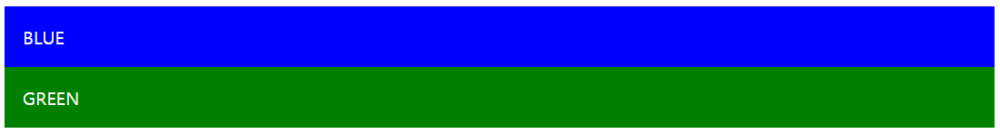

# #2 JSX


## JSX 기본 문법 알아보기 (i)

JSX는 html 같이 생겼지만, 자바스크립트로 변환된다.

React Component를 작성할 때 사용하는 문법이다.

HTML이랑 비슷하지만, 지켜야 할 규칙이 몇가지 있다.


JSX 참고문서

https://react-anyone.vlpt.us/03.html


let

https://developer.mozilla.org/ko/docs/Web/JavaScript/Reference/Statements/let


const

https://developer.mozilla.org/ko/docs/Web/JavaScript/Reference/Statements/const


화살표 함수

https://developer.mozilla.org/ko/docs/Web/JavaScript/Reference/Functions/%EC%95%A0%EB%A1%9C%EC%9A%B0_%ED%8E%91%EC%85%98


꼭 닫혀야 하는 태그

HTML 에서는 input 태그를 닫지 않을 경우가 있는데, JSX에서는 그렇게 하면 오류가 난다.

self closing tag 이용


감싸져 있는 엘리먼트

두 개 이상의 엘리먼트는 무조건 하나의 엘리먼트로 감싸져있어야 한다.

Fragment 기능을 사용 => 불필요한 div가 사라진다.

```react
import React, { Component, Fragment } from 'react';

class App extends Component {
  render() {
    return (
      <Fragment>
        <div>Hello</div>
        <div>Bye</div>
      </Fragment>
    );
  }
}

export default App;
```


```
Hello
Bye
```


JSX 안에 자바스크립트 값 사용하기

```react
import React, { Component } from 'react';

class App extends Component {
  render() {
    const name = 'react';
    return (
      <div>
        hello {name}!
      </div>
    );
  }
}

export default App;
```

중괄호를 사용


```
hello react!
```


```javascript
function foo() {
    var a = 'hello';
    if (true) {
        var a = 'bye';
        console.log(a);  // bye
    }
    console.log(a);  // bye
}
```

블록이 끝나고 난 다음에도 bye라고 나타난다.

블록 내부에서 a를 선언해서 bye라고 설정했는데, 블록 바깥에 있는 a값도 bye로 바꼈다. => scope가 함수 단위라서 그렇다.


```javascript
function foo() {
    let a = 'hello';
    if (true) {
        let a = 'bye';
        console.log(a);  // bye
    }
    console.log(a);  // hello
}
```

let과 const의 경우에는 scope가 블록 단위로 되어있다.


**var** vs **const** vs **let**


var : 더 이상 사용하지 않는다.

const : 한번 선언 후 고정적인 값

let : 유동적인 값


조건부 렌더링

if문 사용 불가

가장 흔한 방법으로는 삼항연산자를 사용

```react
import React, { Component } from 'react';

class App extends Component {
  render() {
    return (
      <div>
        {
          1 + 1 === 2
          ? '맞다'
          : '틀리다!'
        }
      </div>
    );
  }
}

export default App;
```


```
맞다
```


```react
import React, { Component } from 'react';

class App extends Component {
  render() {
    return (
      <div>
        {
          1 + 1 === 3
          ? '맞다'
          : '틀리다!'
        }
      </div>
    );
  }
}

export default App;
```


```
틀리다!
```


특정 값이 true일 경우에만 보여지게 하고, false일 경우에는 안보여지게 하고싶은 경우

```react
import React, { Component } from 'react';

class App extends Component {
  render() {
    const name = 'react!';
    return (
      <div>
        {
          name === 'react!' && <div>리액트다!</div>
        }
      </div>
    );
  }
}

export default App;
```


```
리액트다!
```


```react
import React, { Component } from 'react';

class App extends Component {
  render() {
    const name = 'react';
    return (
      <div>
        {
          name === 'react!' && <div>리액트다!</div>
        }
      </div>
    );
  }
}

export default App;
```


```
 
```


&& 연산자를 사용해서 렌더링할 수도 있다.


조건이 여러개라면 보통 JSX 밖에서 하는 것이 일반적이지만, JSX 내부에서 여러가지 조건을 가지고 렌더링을 하고싶다면 IIFE라고 해서 함수를 선언하고 바로 실행하는 방식으로도 구현을 할 수도 있다.


```react
import React, { Component } from 'react';

class App extends Component {
  render() {
    const value = 1;
    return (
      <div>
        {
          (function() {
            if (value === 1) return <div>1이다!</div>
            if (value === 2) return <div>2다!</div>
            if (value === 3) return <div>3이다!</div>
            return <div>없다</div>
          })()
        }
      </div>
    );
  }
}

export default App;
```


```
1이다!
```


```react
import React, { Component } from 'react';

class App extends Component {
  render() {
    const value = 3;
    return (
      <div>
        {
          (() => {
            if (value === 1) return <div>1이다!</div>
            if (value === 2) return <div>2다!</div>
            if (value === 3) return <div>3이다!</div>
            return <div>없다</div>
          })()
        }
      </div>
    );
  }
}

export default App;
```


```
3이다!
```

화살표 함수 이용


## JSX 기본 문법 알아보기 (ii)


CSS style, class 사용 방법

기존에는 style을 사용할 때 문자열로 넣어줬다.


test.html

```html
<!DOCTYPE html>
<html>
    <head>
        <meta charset="utf-8">
        <meta name="viewport" content="width=device-width">
        <title>JS Bin</title>
        <link rel="stylesheet" href="style.css">
    </head>
    <body>
        <div style="background: blue; color: white; padding: 1rem;">BLUE</div>
        <div class="green">GREEN</div>
    </body>
</html>
```


style.css

```css
.green {
    background: green;
    padding: 1rem;
    color: white;
}
```





React 에서 사용할 때는 조금 다르다.


기존에는 문자열로 넣어줬지만, React 상에서는 style을 객체 형태로 넣어준다.

일부 스타일 이름들은 중간에 `-`가 들어가는데, 이런 경우에는 Camel Case를 적용

새로운 단어가 시작할 때마다 대문자로 시작해준다.


style 객체 생성

색상이나 숫자 등을 입력 시 꼭 문자열로 입력해야한다. 단위까지 명시

style을 적용할 때에는 중괄호를 사용


```react
import React, { Component } from 'react';

class App extends Component {
  render() {
    const style = {
      backgroundColor: 'black',
      padding: '16px',
      color: 'white',
      fontSize: '36px'
    };
    return (
      <div style={style}>
        안녕하세요!
      </div>
    );
  }
}

export default App;
```


자바스크립트 상으로 스타일을 입력하는 것이기 때문에 자바스크립트를 사용해도 된다.


```react
import React, { Component } from 'react';

class App extends Component {
  render() {
    const style = {
      backgroundColor: 'black',
      padding: '16px',
      color: 'white',
      fontSize: 5 + 10 + 'px'
    };
    return (
      <div style={style}>
        안녕하세요!
      </div>
    );
  }
}

export default App;
```


JSX에서 class를 사용하는 방법

기존의 HTML 상에서 `class="클래스이름"` 이런 식으로 넣어줬다.

React에서는 살짝 다르다.

class 대신 className이라는 값을 사용한다.


App.css 파일을 만든다.

```css
.App {
  background: black;
  color: aqua;
  font-size: 36px;
  padding: 1rem;
  font-weight: 600;
}
```


App.js

```react
import React, { Component } from 'react';
import './App.css';

class App extends Component {
  render() {
    return <div className="App">안녕하세요!</div>;
  }
}

export default App;
```


JSX에서 주석을 작성하는 방법

```react
import React, { Component } from 'react';

class App extends Component {
  render() {
    return (
      <div>
        {/* 멀티라인도 예외가 아니다 */}
        <h1
        // 내가 여기에 주석을 쓸꺼야!
        >리액트</h1>
      </div>
    );
  }
}

export default App;
```

주석을 작성할 때에는 멀티라인으로 작성해야 하는데, 중괄호로 감싸줘야 한다.

JSX 태그 사이에도 주석을 남길 수 있다.


