# #4 LifeCycle API


React에서 컴포넌트를 만들게 될 때 정말 중요한 개념 중 하나


## LifeCycle API 소개 및 사용법 (i)

LifeCycle API

생명 주기


1) 나타날 때

2) 업데이트 될 때

3) 사라질 때


컴포넌트가 브라우저 상에서 나타날 때, 업데이트 될 때, 사라질 때 중간중간 과정에서 어떤 작업을 하고싶다면 LifeCycle API를 사용하면 된다.


https://twitter.com/dan_abramov/status/981712092611989509


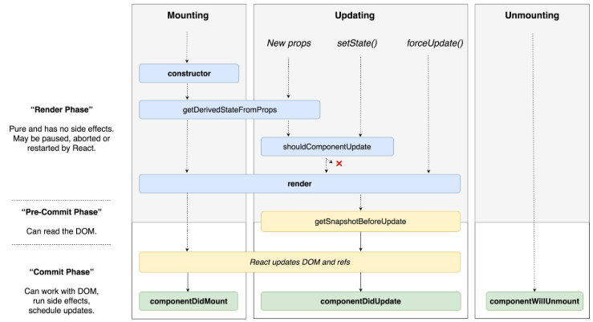


LifeCycle API 의 종류는 굉장히 많은 편이다.

나중에 필요한 시점에 잘 유용하게 사용해야 하는 것

이런게 있구나, 나중에 사용해야될 상황이 오면 그 때 써야겠구나 정도만 숙지

메뉴얼, 자료 참고해서 사용

하나하나가 다 함수이다.


Mounting

컴포넌트가 브라우저 상에 나타난다는 것을 의미

constructor : 생성자 함수이다. 우리가 만든 컴포넌트가 처음 브라우저 상에 나타나게 될 때, 만들어지는 과정에서 가장 먼저 실행되는 함수이다. 여기에서는 주로 컴포넌트가 가지고 있을 state 등을 초기 설정을 하거나 컴포넌트가 만들어지는 과정에서 미리 해야하는 작업이 있다면 constructor 에서 처리를 한다.

getDerivedStateFromProps : 만약 props로 받은 값을 state에 그대로 동기화시키고 싶을 경우 사용. Mounting 과정에서도 사용되고, Updating 과정에서도 props가 바뀌게 되면 이 함수가 실행된다.

render : 어떤 DOM을 만들게 될지, 내부에 있는 태그들에는 어떤 값을 전달해주게 될지 정의해준다.

componentDidMount : 실제로 브라우저 상에 나타나게 되면 호출된다. 주로 외부 라이브러리, 예를 들어 d3나 chartist 같은 차트 라이브러리 같은 것을 사용할 때 componentDidMount 에서 특정 DOM에 차트를 그려달라는 식의 코드를 작성할 수도 있다. 네트워크 요청, api, ajax 요청을 해야하는 경우에도 주로 여기서 처리를 하게 된다. 예를들어 컴포넌트가 나타나고 몇 초 뒤에 어떤 작업을 하고싶다거나 컴포넌트가 나타난 다음에 해당 DOM에서 스크롤 이벤트를 읽는 작업을 하고싶을 경우 componentDidMount를 사용한다. 우리가 만든 컴포넌트가 브라우저에 나타나고 난 시점에 어떤 작업을 하겠다는 것을 명시해준다. 주로 Event Listening, API 요청 등을 여기서 한다.


Updating

컴포넌트의 props가 바뀌거나 state가 바뀔 때

getDerivedStateFromProps : props의 값을 state에 동기화시키고 싶을 때 사용

shouldComponentUpdate : 컴포넌트가 업데이트되는 성능을 최적화시킬 때 사용한다. 컴포넌트는 기본적으로 만약 부모 컴포넌트가 rerendering 되면 그 부모 컴포넌트의 자식 컴포넌트들도 다 render 함수가 실행된다. 그런데 가끔씩 이 작업이 불필요해질 경우가 있다. Virtual DOM을 이용해 컴포넌트가 실제로 Update 된 것만 바뀌기 때문에 렌더링 과정이 빠르다는 것을 배웠다. render 함수가 호출되기는 하는데, 실제 브라우저의 DOM 상에는 반영이 되지 않는다. 실제 브라우저 DOM 상에서는 바뀌는 것만 Update 되고 있기는 한데, 일단 render 함수가 Virtual DOM 상에 그리기는 한다. 만약 부모 컴포넌트가 rerendering 되면 자식 컴포넌트들도 다시 rendering을 Virtual DOM에 해서 거기서 차이점을 가져와 그걸 브라우저에 반영한다. Virtual DOM에 그리는것 조차도 성능을 아끼고 싶다면 이 함수를 사용한다. 만약 컴포넌트가 몇 백, 몇 천개가 된다면 Virtual DOM에 그리는 것도 아껴야 성능을 지킬 수 있다. 성능 최적화. shouldComponentUpdate 에서 true 값이나 false 값을 반환할 수 있다. 만약 true 값을 반환한다면 rendering process를 거치는 것이고, false를 반환한다면 거기서 멈춰버린다. 만약 props나 state가 바꼈을 때 어떤 Logic에 따라 false를 반환하면 실제로 rendering이 되지 않기 때문에 화면에도 반영이 되지 않게 된다. Virtual DOM에도 rendering을 할지 말지 결정하는 함수이다.

getSnapshotBeforeUpdate : render 함수가 호출되고 난 다음 호출된다. 렌더링을 한 다음 렌더링 한 결과물이 브라우저 상에 반영되기 바로 직전에 호출되는 함수이다. 여기에서는 주로 렌더링을 하고 나서 Update를 하기 바로 전에 스크롤의 위치, 해당 DOM의 크기를 사전에 가져오고 싶다면, 그런 작업을 할 때 이 함수를 사용한다.

componentDidUpdate : Updating 작업을 마치고 컴포넌트가 업데이트 되었을 때 호출되는 함수이다. state가 바꼈을 때, 이전의 상태와 지금의 상태가 다를 때, 예를 들어 페이지가 바꼈을 경우(this.state.page가 prevState.page와 다른 경우) 어떤 작업을 하겠다는 코드를 작성할 수 있다.


Unmounting

컴포넌트가 브라우저 상에서 사라질 때

componentWillUnmount : 컴포넌트가 사라지는 과정에서 호출되는 함수이다. componentDidMount 에서 특정 이벤트를 Listening 할 수도 있다고 했었다. 우리가 만든 DOM에서 스크롤 이벤트나 클릭 이벤트를 Listen 하게 해두었다면, componentWillUnmount 에서는 설정한 Listener를 없애주는 작업을 하면 된다.


## LifeCycle API 소개 및 사용법 (ii)

LifeCycle API 참고 문서

https://react-anyone.vlpt.us/05.html


코드

https://codesandbox.io/s/xl313zyrkw


리액트 프로젝트 시작하기

https://bit.ly/beginreact


Fork 버튼 클릭 후 코드 입력


### 컴포넌트 초기 생성


App.js

```react
import React, { Component } from 'react';

class App extends Component {
  constructor(props) {
    super(props);
    console.log('constructor');
  }
  render() {
    return (
      <div>
        <h1>안녕하세요 리액트</h1>
      </div>
    );
  }
}

export default App;
```

constructor : 컴포넌트가 처음 만들어질 때 호출되는 함수

super(props) : 컴포넌트를 만들 때 react에서 불러온 Component 를 extends 하고 그것을 상속한다. Component가 원래 가지고 있던 생성자 함수를 먼저 호출해주고 우리가 하고싶은 작업을 해야한다.


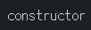


React 16.3 이전 버전에서는 componentWillMount 라는 LifeCycle API가 있었다. 하지만 지금은 사라졌으니 무시


App.js

```react
import React, { Component } from 'react';

class App extends Component {
  constructor(props) {
    super(props);
    console.log('constructor');
  }
  componentDidMount() {
    console.log('componentDidMount');
  }
  render() {
    return (
      <div>
        <h1>안녕하세요 리액트</h1>
      </div>
    );
  }
}

export default App;
```

componentDidMount : 외부 라이브러리 연동(D3, masonry, ...), 컴포넌트에서 필요한 테이터 요청(Ajax, GraphQL, ...), DOM에 관련된 작업(스크롤 설정, 크기 읽어오기, ...) 등을 할 때 사용. 특정 DOM에 이벤트를 등록할 때에도 사용할 수 있다.


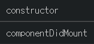


App.js

```react
import React, { Component } from 'react';

class App extends Component {
  constructor(props) {
    super(props);
    console.log('constructor');
  }
  componentDidMount() {
    console.log('componentDidMount');
    console.log(this.myDiv.getBoundingClientRect());
  }
  render() {
    return (
      <div ref={ref => this.myDiv = ref}>
        <h1>안녕하세요 리액트</h1>
      </div>
    );
  }
}

export default App;
```

특정 DOM에 어떤 작업을 하고 싶을 경우, 주로 그런 작업을 할 때에는 Ref를 사용한다. Ref는 DOM에 id를 붙여주는 것과 비슷하다. DOM에 대한 reference를 바로 가져올 수 있다.


개발자 도구 Console 확인 => 실제 값들을 볼 수 있다.

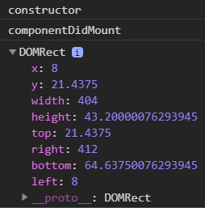


```react
import React, { Component } from 'react';

class App extends Component {
  constructor(props) {
    super(props);
    console.log('constructor');
  }
  componentDidMount() {
    console.log('componentDidMount');
    console.log(this.myDiv.getBoundingClientRect().height);
  }
  render() {
    return (
      <div ref={ref => this.myDiv = ref}>
        <h1>안녕하세요 리액트</h1>
      </div>
    );
  }
}

export default App;
```


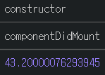


특정 DOM의 크기가 실제로 몇인지 확인하는 작업이 가능하다.


---

### 컴포넌트 업데이트


componentWillReceiveProps : 16.3 이후부터 더 이상 사용되지 않는다. props를 새로 불러올 때 어떤 작업을 하겠다. this.setState 같은 것을 할 수 있었다.


getDerivedStateFromProps : 특정 props가 바뀔 때 설정하고 싶은 state 값을 return 하는 형태로 사용. this.setState를 하는 것이 아니라 바로 어떤 객체를 return 해주면 된다. 객체를 return 해주면 그 객체 값이 state로 들어가게 된다. getDerivedStateFromProps는 Update 되는 과정에서도 사용되지만, 컴포넌트가 만들어지는 과정에서도 사용된다.


MyComponent.js

```react
import React, { Component } from 'react';

class MyComponent extends Component {
  state = {
    value: 0
  };
  render() {
    return (
      <div>
        <p>prpos: {this.props.value}</p>
        <p>state: {this.state.value}</p>
      </div>
    );
  }
}

export default MyComponent;
```


App.js

```react
import React, { Component } from 'react';
import MyComponent from './MyComponent';

class App extends Component {
  constructor(props) {
    super(props);
    console.log('constructor');
  }
  componentDidMount() {
    console.log('componentDidMount');
    console.log(this.myDiv.getBoundingClientRect().height);
  }
  render() {
    return (
      <div ref={ref => this.myDiv = ref}>
        <h1>안녕하세요 리액트</h1>
        <MyComponent value={5}/>
      </div>
    );
  }
}

export default App;
```


getDerivedStateFromProps 는 static box로 넣어줘야 한다.


MyComponent.js

```react
import React, { Component } from 'react';

class MyComponent extends Component {
  state = {
    value: 0
  };

  static getDerivedStateFromProps(nextProps, prevState) {
    if (prevState.value !== nextProps.value) {
      return {
        value: nextProps.value
      }
    }
    return null;
  }

  render() {
    return (
      <div>
        <p>prpos: {this.props.value}</p>
        <p>state: {this.state.value}</p>
      </div>
    );
  }
}

export default MyComponent;
```

nextProps : 다음으로 받아올 props 값을 가져온다.

prevState : 현재 업데이트 되기 전의 상태를 가져온다.


state 값과 props 값이 같아진 것을 확인할 수 있다.

만약 변경할 사항이 없다면 아무것도 하지 않거나 return null; 처리를 하면 된다.


props 값에 변화를 줬을 때 state가 어떻게 되는지 확인


App.js

```react
import React, { Component } from 'react';
import MyComponent from './MyComponent';

class App extends Component {
  state = {
    counter: 1
  };
  constructor(props) {
    super(props);
    console.log('constructor');
  }
  componentDidMount() {
    console.log('componentDidMount');
  }
  handleClick = () => {
    this.setState({
      counter: this.state.counter + 1
    })
  }
  render() {
    return (
      <div>
        <MyComponent value={this.state.counter} />
        <button onClick={this.handleClick}>Click Me</button>
      </div>
    );
  }
}

export default App;
```

버튼이 눌리면 props도 바뀌고, props 값이 바뀜에 따라 state도 바뀐다.


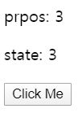


shouldComponentUpdate : 컴포넌트의 업데이트 성능을 최적화 할 수 있게 해주는 함수. shouldComponentUpdate 의 경우에는 다음 받아올 props와 다음 받아올 state 값을 파라미터로 가져온다. 만약 return false를 하게되면 Update를 안하게 되고, return true를 하게 되면 Update를 하게된다. 이 함수를 따로 구현하지 않는다면 기본적으로 return true를 하는 함수가 설정된다. 만약 특정 Logic에 따라 false를 반환하도록 하면 특정 상황에 최적화를 해줄 수 있다. 업데이트를 막아줄 수 있는 함수.


MyComponent.js

```react
import React, { Component } from 'react';

class MyComponent extends Component {
  state = {
    value: 0
  };

  static getDerivedStateFromProps(nextProps, prevState) {
    if (prevState.value !== nextProps.value) {
      return {
        value: nextProps.value
      };
    }
    return null;
  }

  shouldComponentUpdate(nextProps, nextState) {
    if (nextProps.value === 10) return false;
    return true;
  }

  render() {
    return (
      <div>
        <p>prpos: {this.props.value}</p>
        <p>state: {this.state.value}</p>
      </div>
    );
  }
}

export default MyComponent;
```


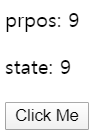


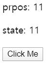

10이 skip 되었다.

조건을 만족하니까 값만 바뀌고 렌더링은 아예 하지 않았다.

버튼을 다시 누르면 value가 11이 되면서 조건을 만족하지 않으니 다시 렌더링된다.

특정 조건에 따라 렌더링을 막아줄 수 있는 함수


componentWillUpdate : 더 이상 사용하지 않는다.


getSnapshotBeforeUpdate : 컴포넌트가 업데이트 돼서 브라우저의 DOM에 반영되기 바로 직전에 호출되는 함수이다. 업데이트 되기 바로 전 DOM 상태를 return 시켜서 return 된 값을 나중에 componentDidUpdate 에서 받아올 수 있다.


https://codesandbox.io/s/484zvr87ow


index.js

```react
import React from "react";
import { render } from "react-dom";
import ScrollBox from "./ScrollBox";

const styles = {
  fontFamily: "sans-serif",
  textAlign: "center"
};

const App = () => <ScrollBox />;

render(<App />, document.getElementById("root"));
```


ScrollBox.js

```react
import React, { Component } from "react";
import "./ScrollBox.css";

class ScrollBox extends Component {
  id = 2;

  state = {
    array: [1]
  };

  handleInsert = () => {
    this.setState({
      array: [this.id++, ...this.state.array]
    });
  };

  getSnapshotBeforeUpdate(prevProps, prevState) {
    // DOM 업데이트가 일어나기 직전의 시점입니다.
    // 새 데이터가 상단에 추가되어도 스크롤바를 유지해보겠습니다.
    // scrollHeight 는 전 후를 비교해서 스크롤 위치를 설정하기 위함이고,
    // scrollTop 은, 이 기능이 크롬에 이미 구현이 되어있는데,
    // 이미 구현이 되어있다면 처리하지 않도록 하기 위함입니다.
    if (prevState.array !== this.state.array) {
      const { scrollTop, scrollHeight } = this.list;

      // 여기서 반환 하는 값은 componentDidMount 에서 snapshot 값으로 받아올 수 있습니다.
      return {
        scrollTop,
        scrollHeight
      };
    }
  }

  componentDidUpdate(prevProps, prevState, snapshot) {
    if (snapshot) {
      const { scrollTop } = this.list;
      if (scrollTop !== snapshot.scrollTop) return; // 기능이 이미 구현되어있다면 처리하지 않습니다.
      const diff = this.list.scrollHeight - snapshot.scrollHeight;
      this.list.scrollTop += diff;
    }
  }

  render() {
    const rows = this.state.array.map(number => (
      <div className="row" key={number}>
        {number}
      </div>
    ));

    return (
      <div>
        <div
          ref={ref => {
            this.list = ref;
          }}
          className="list"
        >
          {rows}
        </div>
        <button onClick={this.handleInsert}>Click Me</button>
      </div>
    );
  }
}

export default ScrollBox;
```


ScrollBox.css

```css
.list {
  height: 10rem;
  overflow: auto;
  padding: 1rem;
  border: 1px solid black;
}

.row {
  padding: 1rem;
  margin: 0.5rem;
  border: 1px solid black;
}
```


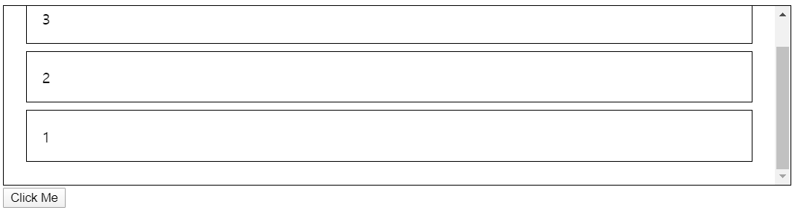


클릭하면 아이템이 맨 위에 나타나고있다.

Chrome 같은 경우에는 보고있는 곳에서 스크롤이 유지가 되는 기능이 자체적으로 구현이 되어있어 사실상 우리가 따로 작업을 하지 않아도 작동하는데, 만약 16을 보고있는 상태에서 Click Me를 누르면 위에 아이템이 추가되더라도 위치는 계속 똑같은 곳에 있다. 사파리나 파이어폭스에서는 코드에 이미 구현된 기능이 있는데, 그것을 주석처리를 하고 나서 눌러보면 아이템이 새로 추가됨에 따라서 우리가 보고 있는 것이 아래로 밀려나게 된다. 그런데 만약 getSnapshotBeforeUpdate 를 사용하면 업데이트 되기 직전의 스크롤 위치와 스크롤 크기를 가져와서 그 값을 return 하고 나면 componentDidUpdate 에서 세번째 파라미터로 받아와 그 값에 따라 List의 스크롤 위치를 설정함으로써 우리가 보고 있는 것을 계속 유지할 수 있게끔 해줄 수 있다.


```react
  getSnapshotBeforeUpdate(prevProps, prevState) {
    // DOM 업데이트가 일어나기 직전의 시점입니다.
    // 새 데이터가 상단에 추가되어도 스크롤바를 유지해보겠습니다.
    // scrollHeight 는 전 후를 비교해서 스크롤 위치를 설정하기 위함이고,
    // scrollTop 은, 이 기능이 크롬에 이미 구현이 되어있는데, 
    // 이미 구현이 되어있다면 처리하지 않도록 하기 위함입니다.
    if (prevState.array !== this.state.array) {
      const {
        scrollTop, scrollHeight
      } = this.list;

      // 여기서 반환 하는 값은 componentDidMount 에서 snapshot 값으로 받아올 수 있습니다.
      return {
        scrollTop, scrollHeight
      };
    }
  }

  componentDidUpdate(prevProps, prevState, snapshot) {
    if (snapshot) {
      const { scrollTop } = this.list;
      if (scrollTop !== snapshot.scrollTop) return; // 기능이 이미 구현되어있다면 처리하지 않습니다.
      const diff = this.list.scrollHeight - snapshot.scrollHeight;
      this.list.scrollTop += diff;
    }
  }
```


getSnapshotBeforeUpdate 에서는 이전 props와 이전 상태에 대한 값을 확인할 수 있다. 

만약 현재의 상태와 이전의 상태가 다를 때 현재 List의 scrollTop, scrollHeight 값을 읽어와서 그것을 return 하게되면 나중에 그 값을 componentDidUpdate 의 세번째 파라미터로 받아올 수 있다. 그 값을 가지고 필요한 작업을 해주면 된다.


componentDidUpdate : 컴포넌트가 실제로 업데이트 되고 난 다음에 호출되는 부분이다. 여기서는  prevProps와 prevState, 즉 업데이트 되기 전의 값들을 확인할 수 있는데, prevProps.~ 와 this.props.~ 를 비교해서 만약 특정 props가 바뀌면 어떠한 작업을 하도록 할 수 있다.


MyComponent.js

```react
import React, { Component } from 'react';

class MyComponent extends Component {
  state = {
    value: 0
  };

  static getDerivedStateFromProps(nextProps, prevState) {
    if (prevState.value !== nextProps.value) {
      return {
        value: nextProps.value
      };
    }
    return null;
  }

  shouldComponentUpdate(nextProps, nextState) {
    if (nextProps.value === 10) return false;
    return true;
  }

  componentDidUpdate(prevProps, prevState) {
    if (this.props.value !== prevProps.value) {
      console.log('value 값이 바뀌었다!', this.props.value);
    }
  }

  render() {
    return (
      <div>
        <p>prpos: {this.props.value}</p>
        <p>state: {this.state.value}</p>
      </div>
    );
  }
}

export default MyComponent;
```


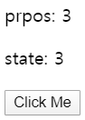


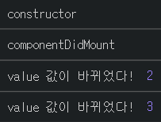


### 컴포넌트 제거


componentWillUnmount : 컴포넌트가 더 이상 필요하지 않게 되면 컴포넌트가 사라지는데, 그 때 호출되는 함수이다.


MyComponent.js

```react
import React, { Component } from 'react';

class MyComponent extends Component {
  state = {
    value: 0
  };

  static getDerivedStateFromProps(nextProps, prevState) {
    if (prevState.value !== nextProps.value) {
      return {
        value: nextProps.value
      };
    }
    return null;
  }

  shouldComponentUpdate(nextProps, nextState) {
    if (nextProps.value === 10) return false;
    return true;
  }

  componentDidUpdate(prevProps, prevState) {
    if (this.props.value !== prevProps.value) {
      console.log('value 값이 바뀌었다!', this.props.value);
    }
  }

  componentWillUnmount() {
    console.log('Good Bye');
  }

  render() {
    return (
      <div>
        <p>prpos: {this.props.value}</p>
        <p>state: {this.state.value}</p>
      </div>
    );
  }
}

export default MyComponent;
```


App.js

```react
import React, { Component } from 'react';
import MyComponent from './MyComponent';

class App extends Component {
  state = {
    counter: 1
  };
  constructor(props) {
    super(props);
    console.log('constructor');
  }
  componentDidMount() {
    console.log('componentDidMount');
  }
  handleClick = () => {
    this.setState({
      counter: this.state.counter + 1
    });
  };
  render() {
    return (
      <div>
        {this.state.counter < 10 && <MyComponent value={this.state.counter} />}
        <button onClick={this.handleClick}>Click Me</button>
      </div>
    );
  }
}

export default App;
```


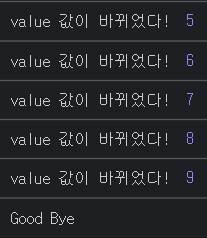


value 값이 10이 되면 컴포넌트가 사라지는데, 그 때 Good Bye가 나타난다.

value 값이 10이 넘어서 더 이상 나타나지 않게 될 때 componentWillUnmount 함수가 호출된다.


### 컴포넌트에 에러 발생


componentDidCatch : 컴포넌트에 에러가 발생했을 때 처리할 수 있다. 만약 react 컴포넌트의 render 함수에서 오류가 발생하면 App 자체가 크래쉬가 나버린다. 만약 MyComponent에서 존재하지 않는 값을 보여주려고 하면 에러가 나타난다.


MyComponent.js

```react
import React, { Component } from 'react';

class MyComponent extends Component {
  state = {
    value: 0
  };

  static getDerivedStateFromProps(nextProps, prevState) {
    if (prevState.value !== nextProps.value) {
      return {
        value: nextProps.value
      };
    }
    return null;
  }

  shouldComponentUpdate(nextProps, nextState) {
    if (nextProps.value === 10) return false;
    return true;
  }

  componentDidUpdate(prevProps, prevState) {
    if (this.props.value !== prevProps.value) {
      console.log('value 값이 바뀌었다!', this.props.value);
    }
  }

  componentWillUnmount() {
    console.log('Good Bye');
  }

  render() {
    return (
      <div>
        {this.props.missing.something}
        <p>prpos: {this.props.value}</p>
        <p>state: {this.state.value}</p>
      </div>
    );
  }
}

export default MyComponent;
```

있지도 않은 값을 보여주려 한다고 오류가 난다. 


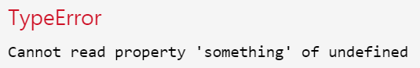

이런 에러를 처리해 줄 수 있는 것이 componentDidCatch 함수이다.


지금 에러가 MyComponent에서 발생하고 있다. 에러를 잡아줄 때에는 에러가 발생할 수 있는 컴포넌트의 부모 컴포넌트에서 사용해야 한다.


App.js

```react
import React, { Component } from 'react';
import MyComponent from './MyComponent';

class App extends Component {
  state = {
    counter: 1
  };

  componentDidCatch(error, info) {
    console.log(error);
    console.log(info);
  }

  constructor(props) {
    super(props);
    console.log('constructor');
  }
  componentDidMount() {
    console.log('componentDidMount');
  }
  handleClick = () => {
    this.setState({
      counter: this.state.counter + 1
    });
  };
  render() {
    return (
      <div>
        {this.state.counter < 10 && <MyComponent value={this.state.counter} />}
        <button onClick={this.handleClick}>Click Me</button>
      </div>
    );
  }
}

export default App;
```

파라미터로 error 와 info 값을 받아올 수 있다.


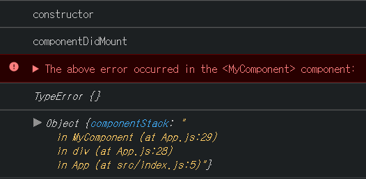


error 쪽에는 어떤 에러가 발생했는지 알려주는 것이고, info 쪽에는 이 에러가 어디서 발생했을지 알려주는 것이다. 이 정보를 네트워크를 통해서 특정 서버에 전달하거나 단순히 에러가 발생했다고 보여줄 수 있다. 

componentDidCatch 는 우리가 실수로 잡지 못했던 버그들을 잡을 때 사용한다. 사용자한테는 App이 튕겼습니다. 오류를 해결하기 위해서 최선을 다하겠습니다. 라는 식의 메시지를 보여주고, 에러 정보를 실제 개발자들이 볼 수 있도록 전달해주는 작업을 한다.


에러가 나면 아무것도 안 보였다. 그것을 방지하기 위한 작업을 해준다.


App.js

```react
import React, { Component } from 'react';
import MyComponent from './MyComponent';

class App extends Component {
  state = {
    counter: 1,
    error: false
  };

  componentDidCatch(error, info) {
    this.setState({
      error: true,
    });
    // API를 통해서 서버로 오류 내용 날리기
  }

  constructor(props) {
    super(props);
    console.log('constructor');
  }
  componentDidMount() {
    console.log('componentDidMount');
  }
  handleClick = () => {
    this.setState({
      counter: this.state.counter + 1
    });
  };
  render() {
    if (this.state.error) {
      return (
        <div>에러가 났어요!</div>
      );
    }
    return (
      <div>
        {this.state.counter < 10 && <MyComponent value={this.state.counter} />}
        <button onClick={this.handleClick}>Click Me</button>
      </div>
    );
  }
}

export default App;
```


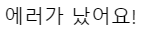


실제 사용자가 봤을 때 에러가 났어요! 라고 명시를 해줄 수 있다.

componentDidCatch 를 사용할 때 에러가 발생할 수 있는 컴포넌트의 부모 컴포넌트에서 구현을 해줘야 한다.


---

constructor : 컴포넌트가 새로 만들어질 때 호출되는 것

getDerivedStateFromProps : props 값을 state와 동기화 시키고 싶을 때 사용

shouldComponentUpdate : 컴포넌트를 업데이트 할지 말지를 정하는 것. 만약 여기서 false가 되면 아래에 있는 함수들이 호출되지 않고, true가 되면 아래에 있는 것들이 쭉 호출된다.

getSnapshotBeforeUpdate : render 하고나서 실제로 브라우저에 반영되기 바로 직전의 값을 확인할 수 있다.

componentDidMount : mount가 끝난 경우 호출

componentDidUpdate : update가 끝난 경우 호출

componentWillUnmount : unmount가 될 때 호출

componentDidCatch : 만약 에러가 발생하면 잡아줄 수 있다.


