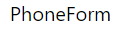
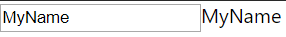
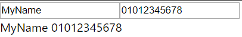

# #6 인풋 상태 관리


## Input 상태 관리하기


객체 안에서 사용되는 [e.target.name]: 문법은 속성 계산명 이라는 문법입니다.


참고링크:

https://developer.mozilla.org/ko/docs/Web/JavaScript/Reference/Operators/Object_initializer


코드:

https://codesandbox.io/s/84j07kxq98


http://localhost:3000/ 에 켜져있는 서버는 개발 서버이기 때문에 개발을 할 때에만 사용된다. 실제로 배포하게 될 때에는 yarn build라는 명령어를 사용한다.


개발 서버이기 때문에 만약 코드를 수정하게 된다면 바로 새로고침이 되어서 반영되게 된다.


컴포넌트 만들기

src 디렉터리에 component 디렉터리 생성

component 디렉터리 안에 PhoneForm.js 생성

PhoneForm : 전화번호를 입력하는 Form


우리가 만들 컴포넌트와 App, index와 따로 분리시키기 위해서 한 작업이다. 꼭 이렇게 할 필요는 없다.


확장 프로그램 => reactjs code snippet


이 확장 프로그램을 설치하고 자바스크립트 파일에서 rcc 를 입력하면 클래스 형태로 만들어진 컴포넌트를 바로 만들 수 있다. 만약 rsc 라고 입력하면 함수형 컴포넌트를 만들 수 있다.


PhoneForm.js 에서 rcc 입력


PhoneForm.js

```react
import React, { Component } from 'react';

class PhoneForm extends Component {
    render() {
        return (
            <div>
                PhoneForm
            </div>
        );
    }
}

export default PhoneForm;
```


App.js

```react
import React from 'react';
import './App.css';
import PhoneForm from './component/PhoneForm';

function App() {
  return (
    <div className="App">
      <PhoneForm />
    </div>
  );
}

export default App;
```




App.js

```react
import React from 'react';
import PhoneForm from './component/PhoneForm';

function App() {
  return (
    <div>
      <PhoneForm />
    </div>
  );
}

export default App;
```


PhoneForm.js

```react
import React, { Component } from 'react';

class PhoneForm extends Component {

    state = {
        name: '',
    }

    handleChange = (e) => {
        this.setState({
            name: e.target.value
        });
    }

    render() {
        return (
            <form>
                <input onChange={this.handleChange} value={this.state.name}/>
                {this.state.name}
            </form>
        );
    }
}

export default PhoneForm;
```


state 에 name 이라는 값을 넣어준다.

input 에서 변경 이벤트가 발생될 때 처리할 함수 생성

handleChange 함수를 만들어서 e 라는 객체를 파라미터로 받아온다. e 는 이벤트 객체이다. 이벤트 객체에서 앞으로 어떻게 수정할 것인지를 알 수 있다. 앞으로 어떻게 바뀔 것인지 그 값이 e.target.valule 안에 들어가있다. e.target 은 input에서 이벤트가 발생했는데, input이 event target이고, 그것이 가지고 있는 value 값을 setState를 통해서 name 값을 설정해준다.


*onchange*={*this*.handleChange}

input 에서 값이 변경될 때마다 name 값이 바뀔 것이다.


*value*={*this*.state.value}

value 값도 설정해줘야 한다.


우리가 입력한 name 값이 하단에 나타나도록 한다.





만약 input이 여러개라면?

placeholder : 아무것도 입력되지 않았을 때 기본적으로 보여줄 값


PhoneForm.js

```react
import React, { Component } from 'react';

class PhoneForm extends Component {

    state = {
        name: '',
        phone: '',
    }

    handleChange = (e) => {
        this.setState({
            [e.target.name]: e.target.value
        });
    }

    render() {
        return (
            <form>
                <input
                    name="name"
                    placeholder="이름"
                    onChange={this.handleChange}
                    value={this.state.name}
                />
                <input
                    name="phone"
                    placeholder="전화번호"
                    onChange={this.handleChange}
                    value={this.state.phone}
                />
                <div>
                    {this.state.name}
                    {this.state.phone}
                </div>
            </form>
        );
    }
}

export default PhoneForm;
```


지금은 handleChange가 발생했을 때 name 값을 수정하도록 했는데, 여기서 phone이라는 값을 추가해줄 것이다.

프리티어(Prettier) 라는 도구를 사용하면 자동으로 코드를 정리해준다.

여러가지 input을 관리하기 위해서는 input에 name 값을 설정해줘야 한다.

handleChange 함수에서 name 대신에 [e.target.name] 를 쓴다. name 이라는 키워드 대신에 input의 name 값이 [e.target.name] 자리에 들어가게 된다.

만약 "name" 쪽에서 input이 변경되면 name 값이 [e.target.name]에 들어가서 name state가 수정되는 것이고, 만약 "phone" 값이 수정되면 [e.target.name]에 phone이 들어가서 phone state가 수정되는 것이다.

name 과 phone 값이 잘 나오는지 확인





state 를 통해서 input의 값을 변경하는 방법

