# #8 최적화, 활용, Ref


## shouldComponentUpdate 를 통한 최적화. 불변성을 왜 유지하는가?

[Immutable.js](https://facebook.github.io/immutable-js/)

[Immer.js](https://github.com/mweststrate/immer)


코드:

https://codesandbox.io/s/1xpzj13yl


state 값을 업데이트 할 때 불변성을 왜 유지해야 하는지, 컴포넌트 업데이트를 하게 될 때 성능 최적화는 어떻게 하게 되는지


App.js

```react
import React, { Component } from 'react';
import PhoneForm from './component/PhoneForm';
import PhoneInfoList from './component/PhoneInfoList';

class App extends Component {

  id = 3;

  state = {
    information: [
      {
        id: 0,
        name: 'MyName',
        phone: '010-0000-0001'
      },
      {
        id: 1,
        name: 'YourName',
        phone: '010-0000-0002'
      },
      {
        id: 2,
        name: 'HisName',
        phone: '010-0000-0003'
      }
    ],
  }

  handleCreate = (data) => {
    const { information } = this.state;
    this.setState({
      information: information.concat(Object.assign({}, data, {
        id: this.id++
      }))
    });
  }

  handleRemove = (id) => {
    const { information } = this.state;
    this.setState({
      information: information.filter(info => info.id !== id)
    })
  }
  
  handleUpdate = (id, data) => {
    const { information } = this.state;
    this.setState({
      information: information.map(
        info => {
          if (info.id === id) {
            return {
              id,
              ...data,
            };
          }
          return info;
        }
      )
    });
  }

  render() {
    return (
      <div>
        <PhoneForm onCreate={this.handleCreate}/>
        <PhoneInfoList
          data={this.state.information}
          onRemove={this.handleRemove}
          onUpdate={this.handleUpdate}
        />
      </div>
    );
  }
}

export default App;
```

information 값에 기본값을 넣어주기. 컴포넌트 업데이트 최적화 작업을 할건데, 할 때마다 정보를 등록하는 것 보다는 사전에 있는게 작업할 때 조금 더 편하기 때문이다.

기본값을 넣어주고, 다음 들어갈 값은 id가 3이므로 id 값은 3을 넣어준다.


PhoneInfo.js

```react
import React, { Component, Fragment } from 'react';

class PhoneInfo extends Component {

    state = {
        editing: false,
        name: '',
        phone: ''
    }

    handleRemove = () => {
        const { info, onRemove } = this.props;
        onRemove(info.id);
    }
    
    handleToggleEdit = () => {
        // true -> false
            // onUpdate
        // false -> true
            // state 에 info 값을 넣어주기
        const { info, onUpdate } = this.props;
        if (this.state.editing) {
            onUpdate(info.id, {
                name: this.state.name,
                phone: this.state.phone
            });
        } else {
            this.setState({
                name: info.name,
                phone: info.phone
            });
        }
        this.setState({
            editing: !this.state.editing,
        });
    }

    handleChange = (e) => {
        this.setState({
            [e.target.name]: e.target.value
        });
    }

    render() {
        const { name, phone } = this.props.info;
        const { editing } = this.state;

        const style = {
            border: '1px solid black',
            padding: '8px',
            margin: '8px',
        };

        console.log(name);

        return (
            <div style={style}>
                {
                    editing ? (
                        <Fragment>
                            <div>
                                <input
                                    name="name"
                                    onChange={this.handleChange}
                                    value={this.state.name}
                                />
                            </div>
                            <div>
                                <input
                                    name="phone"
                                    onChange={this.handleChange}
                                    value={this.state.phone}
                                />
                            </div>
                        </Fragment>
                    ) : (
                        <Fragment>
                            <div><b>{name}</b></div>
                            <div>{phone}</div>
                        </Fragment>
                    )
                }
                <button onClick={this.handleRemove}>삭제</button>
                <button onClick={this.handleToggleEdit}>
                    { editing ? '적용' : '수정' }
                </button>
            </div>
        );
    }
}

export default PhoneInfo;
```

`console.log(name)` 추가


PhoneInfoList.js

```react
import React, { Component } from 'react';
import PhoneInfo from './PhoneInfo';

class PhoneInfoList extends Component {
    static defaultProps = {
        data: []
    }
    
    render() {
        const { data, onRemove, onUpdate } = this.props;

        console.log('rendering list');

        const list = data.map(
            info => (
                <PhoneInfo
                    onRemove={onRemove}
                    onUpdate={onUpdate}
                    info={info}
                    key={info.id}
                />
            )
        );
        return (
            <div>
                {list}
            </div>
        );
    }
}

export default PhoneInfoList;
```

`console.log('rendering list') ` 추가


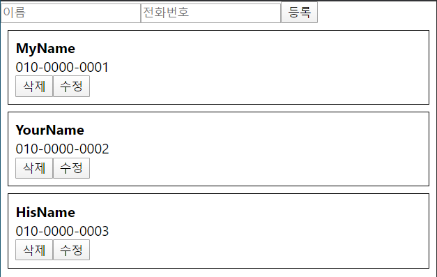


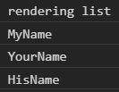


새로운 정보 추가


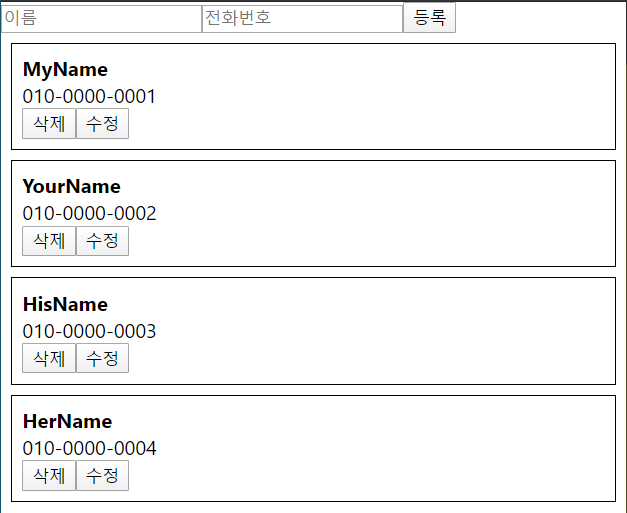


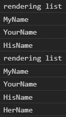


rendering list 가 한번 더 발생하면서 컴포넌트들의 render 함수가 한번 더 호출된 것이다. 그런데 사실 새로운 데이터를 추가하게 될 때 MyName, YourName, HisName 은 영향을 받을 필요가 없다. 하지만 업데이트를 하게 될 때 App 컴포넌트에서 render 가 발생하고, PhoneInfoList 에서 render 가 발생하면 결국 내부에 있는 컴포넌트들도 한번 더 render가 되도록 기본적으로 설계되어있다.

그렇기 때문에 shouldComponentUpdate 를 통해서 업데이트가 불필요 할 때에는 업데이트를 하지 않도록 해줘야한다. 성능 최적화


PhoneInfo.js

```react
import React, { Component, Fragment } from 'react';

class PhoneInfo extends Component {

    state = {
        editing: false,
        name: '',
        phone: ''
    }
    
    shouldComponentUpdate(nextProps, nextState) {
         if (this.state !== nextState) {
             return true;
         }
         return this.props.info !== nextProps.info;
    }

    handleRemove = () => {
        const { info, onRemove } = this.props;
        onRemove(info.id);
    }
    
    handleToggleEdit = () => {
        // true -> false
            // onUpdate
        // false -> true
            // state 에 info 값을 넣어주기
        const { info, onUpdate } = this.props;
        if (this.state.editing) {
            onUpdate(info.id, {
                name: this.state.name,
                phone: this.state.phone
            });
        } else {
            this.setState({
                name: info.name,
                phone: info.phone
            });
        }
        this.setState({
            editing: !this.state.editing,
        });
    }

    handleChange = (e) => {
        this.setState({
            [e.target.name]: e.target.value
        });
    }

    render() {
        const { name, phone } = this.props.info;
        const { editing } = this.state;

        const style = {
            border: '1px solid black',
            padding: '8px',
            margin: '8px',
        };

        console.log(name);

        return (
            <div style={style}>
                {
                    editing ? (
                        <Fragment>
                            <div>
                                <input
                                    name="name"
                                    onChange={this.handleChange}
                                    value={this.state.name}
                                />
                            </div>
                            <div>
                                <input
                                    name="phone"
                                    onChange={this.handleChange}
                                    value={this.state.phone}
                                />
                            </div>
                        </Fragment>
                    ) : (
                        <Fragment>
                            <div><b>{name}</b></div>
                            <div>{phone}</div>
                        </Fragment>
                    )
                }
                <button onClick={this.handleRemove}>삭제</button>
                <button onClick={this.handleToggleEdit}>
                    { editing ? '적용' : '수정' }
                </button>
            </div>
        );
    }
}

export default PhoneInfo;
```

성능 최적화를 위해 shouldComponentUpdate 를 구현한다. 만약 Reactjs code snippets 를 설치했다면 scu 를 입력하면 된다.

shouldComponentUpdate 를 구현하지 않았다면 기본적으로는 언제나 true 값을 반환하게 된다.

언제나 return true 를 하기 때문에 부모 컴포넌트가 업데이트되든 props 가 업데이트되든 state 가 업데이트되든 언제나 render 함수가 호출된다.

state 가 바뀔 때에는 언제나 업데이트를 해준다. 만약 this.state 와 nextState 가 다르면 true 를 반환한다.

그 외의 조건, 만약 props 로 받아온 info 값이 달라졌다면, this.props.info 와 nextProps.info 값이 다를 경우에만 true 를 return 한다.

만약 state 값도 똑같고, props 값도 똑같다면 render 함수를 다시 호출하지 않는다.


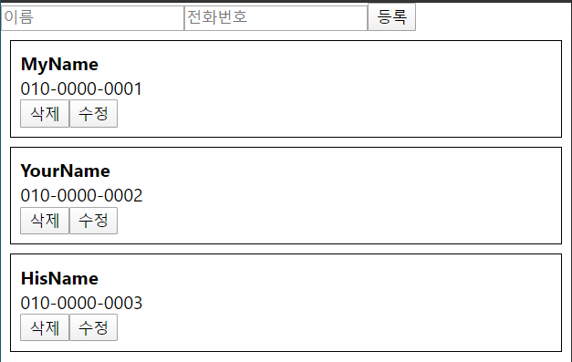


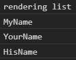


MyName 삭제 버튼 클릭


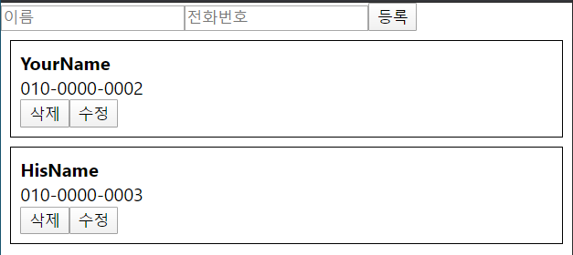


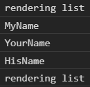


YourName 과 HisName 은 다시 render 되지 않았고, list 자체만 rendering list 를 통해서 rendering 되었다.


새로운 정보 추가


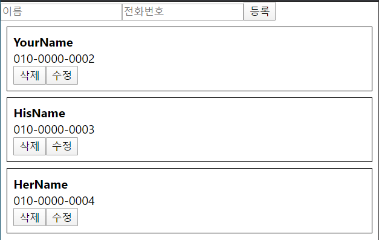


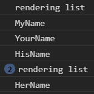


이번에도 YourName 과 HisName 은 다시 render 되지 않았고, list 만 전체적으로 한 번 rendering 되고, HerName 컴포넌트만 한 번 render 가 발생하게 된다.


만약 App 컴포넌트에서 update를 하게 될 때 불변성을 유지하지 않았다면 어떻게 되는가?


handleCreate 함수에서 setState 한 다음에 concat 을 사용한 것이 아니라 `this.state.information.push({ ...data, id: this.id++ });` 를 사용했다면 일단 작동도 안한다. 왜냐하면 React 에서는 setState 를 하고 React 컴포넌트가 rerendering 되도록 설정이 되어있는데, 만약 setState 를 하지 않고 바로 수정하게 되면 rerendering 조차 안 된다.


그리고 만약 this.state.information.push 한 다음에 setState 에서 information: this.state.information 이런 식으로 또 한번 setState 를 강제로 하게하면 rerendering 은 되는데, 그렇게 했을 때 문제점이 있다.


어떤 문제점이 있는지 Chrome Console 에서 확인

shouldComponentUpdate 에서 업데이트를 해야할지 말아야할지 logic 을 구현할 때, 현재의 props 와 그 다음 받아올 props 값을 비교해서 다를 경우 업데이트를 하도록 작업을 했었다. 그런데 그런 것을 못하게 된다.

```javascript
const array = [0,1,2];
const anotherArray = array;
array.push(3);
anotherArray
array
array === anotherArray;
```

예를들어 array 라는 이름의 배열 [0,1,2] 를 만든다. anotherArray 값을 array 라고 하고, array.push(3) 을 한다.

anotherArray 값을 확인해보면 [0,1,2,3] 이다. array 와 anotherArray 는 reference 이름은 다르더라도 서로 가리키고 있는 배열은 같기 때문에 결국 서로 같은 배열이다.

array === anotherArray 했을 때 true 가 된다.


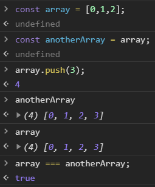


```javascript
const object = { a: 1, b: 2 };
const anotherObject = object;
object.c = 3;
anotherObject
object === anotherObject;
```

object 안에 a, b 값이 들어가있다. anotherObject 값을 object 라고 하고, object.c = 3 을 해준다. 그러면 anotherObject 를 읽어올 때에도 내부에 c 값이 들어가있다. 결국 object 는 anotherObject 와 똑같다.


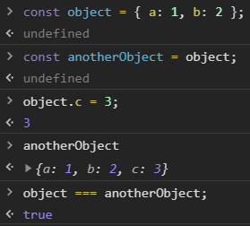


shouldComponentUpdate 같은 곳에서 logic 을 구현할 때 굉장히 머리가 아파진다. 단순히 객체가 다른지 확인하기 위해서 내부에 있는 것까지 하나하나 확인해야하는 상황에 처하게 될 수가 있다.


불변성을 유지하는 경우

```javascript
const array = [0,1,2];
const anotherArray = [...array, 3];
const anotherArray2 = array.concat(4);
array
anotherArray
anotherArray2
array !== anotherArray
array === anotherArray2
```

array 와 anotherArray 와 anotherArray2 는 다 다르다. 그렇기때문에 비교를 하게 된다면 array 와 anotherArray 가 다르다는 것을 알 수 있다. array 와 anotherArray2 가 같은지 물어보면 false 라고 한다.


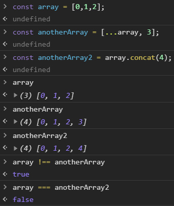


객체일 경우에도 마찬가지이다.

```javascript
const object = { a: 1, b: 2 };
const anotherObject = { ...object, c: 3 };
object !== anotherObject;
anotherObject
object
```

object 와 anotherObject 는 다르다.


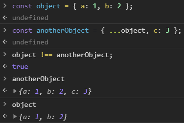


shouldComponentUpdate 를 할 때 불변성을 유지하지 않는다면 굉장히 복잡해진다. 그래서 React 에서 객체나 배열 값을 수정하게 될 때에는 언제나 불변성을 유지해야된다.


만약 객체 내부적으로 엄청나게 깊은 객체같은 경우, 예를들어 

```javascript
const nestedObject = {
    a: {
        b: {
            c: {
                d: {
                    
                }
            }
        }
    }
};
```

이런 객체가 있다고 가정하면, 이것을 불변성을 유지하면서 내부에 있는 값을 바꾸려면 굉장히 귀찮다.


```javascript
const nestedObject = {
    a: {
        b: []
    }
};
```

어떤 객체가 있는데 그 안에 또 다른 객체가 들어있고, 그 안에 배열이 있는 상황도 있을 수 있다.

이런 작업을 할 때마다 spread 연산자를 사용하면 복잡할수도 있다. 그럴 때 사용하면 편할수도 있는 라이브러리들이 있다.

[Immutable.js](https://facebook.github.io/immutable-js/)

[Immer.js](https://github.com/mweststrate/immer)


## 이름으로 전화번호 찾기

코드:

https://codesandbox.io/s/1xpzj13yl


이름을 입력해서 특정 전화번호를 찾는 기능 구현


App.js

```react
import React, { Component } from 'react';
import PhoneForm from './component/PhoneForm';
import PhoneInfoList from './component/PhoneInfoList';

class App extends Component {

  id = 3;

  state = {
    information: [
      {
        id: 0,
        name: 'MyName',
        phone: '010-0000-0001'
      },
      {
        id: 1,
        name: 'YourName',
        phone: '010-0000-0002'
      },
      {
        id: 2,
        name: 'HisName',
        phone: '010-0000-0003'
      }
    ],
    keyword: '',
  }

  handleChange = (e) => {
    this.setState({
      keyword: e.target.value,
    });
  }

  handleCreate = (data) => {
    const { information } = this.state;
    this.setState({
      information: information.concat(Object.assign({}, data, {
        id: this.id++
      }))
    });
  }

  handleRemove = (id) => {
    const { information } = this.state;
    this.setState({
      information: information.filter(info => info.id !== id)
    })
  }
  
  handleUpdate = (id, data) => {
    const { information } = this.state;
    this.setState({
      information: information.map(
        info => {
          if (info.id === id) {
            return {
              id,
              ...data,
            };
          }
          return info;
        }
      )
    });
  }

  render() {
    return (
      <div>
        <PhoneForm onCreate={this.handleCreate}/>
        <input
          value={this.state.keyword}
          onChange={this.handleChange}
          placeholder="검색..."
        />
        <PhoneInfoList
          data={this.state.information.filter(
            info => info.name.indexOf(this.state.keyword) > -1
          )}
          onRemove={this.handleRemove}
          onUpdate={this.handleUpdate}
        />
      </div>
    );
  }
}

export default App;
```

App 에 input 을 하나 넣어줄것이다. App 이 가지고 있는 state 쪽에 keyword 라는 문자열을 넣어준다.

문자열을 바꿔줄 handleChange 함수를 작성한다.

input 을 아래에 만들어서 value 값은 this.state.keyword, onChange 값은 this.handleChange, placeholder 값은 "검색..." 을 넣어준다.

데이터를 필터링 해 줄 것이다. information 을 바로 filter 해준다.


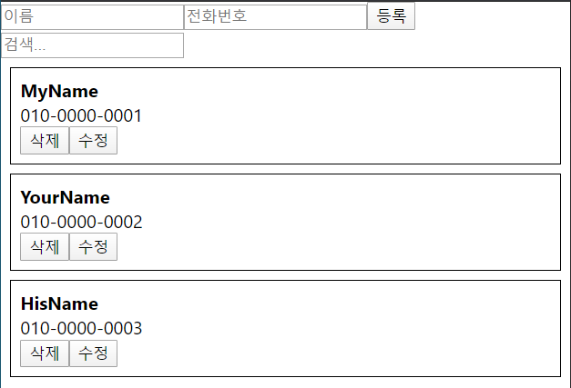


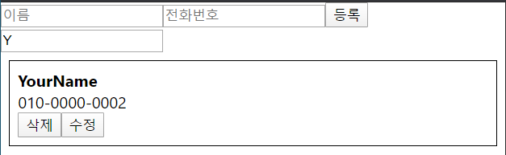


정보를 추가하게 되었을 때 '등록' 버튼을 누르면 focus 가 전화번호 입력 창에 남아있다. '등록' 버튼을 눌렀을 때  focus 를 전화번호 입력 창이 아니라 이름 입력 창에 남아있도록 하는 작업을 할 것이다.


## Ref 를 통하여 DOM 에 직접 접근하기

코드:

https://codesandbox.io/s/k01oo7v1zr


DOM 에 직접적으로 접근을 하게 될 때 사용하는 React 의 Ref


이름을 입력하고 전화번호를 입력한 다음 Enter 를 누르면 focus 가 전화번호 쪽에 남아있다.

만약 focus 를 이름쪽에 남아있도록 하고 싶으면 input element 에, DOM 에 직접적으로 접근을 해야한다. 이 때 사용하는 것이 Ref 이다.

Ref 는 보통 두가지 방식으로 사용할 수 있다.


PhoneForm.js

```react
import React, { Component } from 'react';

class PhoneForm extends Component {
    input = null

    state = {
        name: '',
        phone: '',
    }

    handleChange = (e) => {
        this.setState({
            [e.target.name]: e.target.value
        });
    }

    handleSubmit = (e) => {
        e.preventDefault();
        this.props.onCreate(this.state);
        this.setState({
            name: '',
            phone: '',
        });
        this.input.focus();
    }

    render() {
        return (
            <form onSubmit={this.handleSubmit}>
                <input
                    name="name"
                    placeholder="이름"
                    onChange={this.handleChange}
                    value={this.state.name}
                    ref={ref => this.input = ref}
                />
                <input
                    name="phone"
                    placeholder="전화번호"
                    onChange={this.handleChange}
                    value={this.state.phone}
                />
                <button type="submit">등록</button>
            </form>
        );
    }
}

export default PhoneForm;
```

첫번째 방식은 함수를 사용하는 것이다. ref 라는 값에 함수를 작성해주는데, 그 함수는 ref 를 파라미터로 받아서 컴포넌트의 멤버변수로 ref 값을 넣어주는 작업을 한다.

우선적으로는 input 이라는 값을 null 로 설정해준다.

ref 를 파라미터로 받아와서 this.input = ref

컴포넌트가 한 번 렌더링 되고나면 상단에 있는 input 값이 파라미터로 받아왔던 ref 가 된다. this.input 이 null 로 설정해준 input 인데, ref 가 된다.

handleSubmit 에서 this.input.focus() 해준다. 그러면 handleSubmit 이 발생했을 때 input 에, DOM 에 직접적으로 접근해서 focus 해주는것이다.


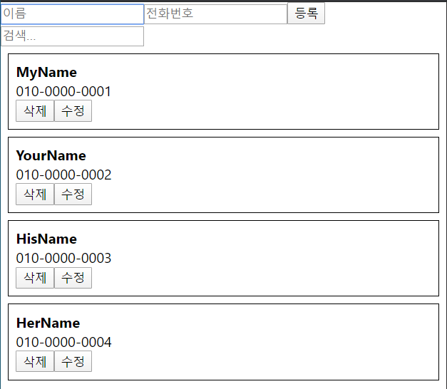


정보를 새로 등록하더라도 focus 가 이름 쪽으로 맞춰진다.


PhoneForm.js

```react
import React, { Component } from 'react';

class PhoneForm extends Component {
    input = React.createRef();

    state = {
        name: '',
        phone: '',
    }

    handleChange = (e) => {
        this.setState({
            [e.target.name]: e.target.value
        });
    }

    handleSubmit = (e) => {
        e.preventDefault();
        this.props.onCreate(this.state);
        this.setState({
            name: '',
            phone: '',
        });
        this.input.current.focus();
    }

    render() {
        return (
            <form onSubmit={this.handleSubmit}>
                <input
                    name="name"
                    placeholder="이름"
                    onChange={this.handleChange}
                    value={this.state.name}
                    ref={this.input}
                />
                <input
                    name="phone"
                    placeholder="전화번호"
                    onChange={this.handleChange}
                    value={this.state.phone}
                />
                <button type="submit">등록</button>
            </form>
        );
    }
}

export default PhoneForm;
```

Ref 를 사용하는 또 다른 방법. React 16.3 이상 버전에서만 가능하다.

input 값을 null 로 설정하는 대신에 React.createRef() 라고 해준다.

ref 를 설정하게 될 때 함수를 설정하는 것이 아니라 그냥 바로 this.input 을 해준다.

handleSubmit 에서 this.input.current 라는 값에다가 focus() 를 해줘야 한다. createRef 를 사용해서 ref 를 설정해주고 나면 current 라는 값을 통해서 해당 DOM 에 대한 접근을 할 수 있게 된다.


이름과 전화번호를 입력하고 Enter 를 누르면 focus 가 다시 이름 쪽으로 오게된다.


Ref 라는 기능은 보통 focus 를 준다든지, 특정 DOM 의 크기를 가져와야 한다든지, 혹은 특정 DOM 의 스크롤 위치를 설정해야 되거나 스크롤 크기를 가져와야 된다거나 하는 식으로 DOM 에 직접적으로 접근이 필요할 때 사용을 한다.

추가적으로 외부 라이브러리와 연동을 할 때에도 Ref 를 사용하게 되는데, 예를들어 D3 나 Chartist 같은 차트 관련 라이브러리를 사용하게 될 때 특정 DOM 에 그리도록 설정을 해야한다. 그런 경우에 Ref 를 사용한다.

Canvas 를 사용한다든지 HTML 5 video 관련 라이브러리를 사용한다든지 하게 될 때에도 Ref 를 사용한다.


